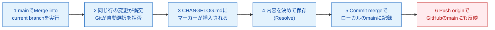

# 3-5：⚠ Conflictを起こして解決する（AI先生用 内部台本）

## メタ情報

| 項目 | 内容 |
|---|---|
| レッスンID | MISSION-03-5 |
| Mission名 | ⚠ Conflictを起こして解決する |
| 対象LEVEL | LEVEL 3「変更履歴を操る」（コードネーム TIME MACHINE） |
| 形式 | フル形式 |
| 想定所要時間 | 30分 |
| XP | 120 |
| 付与スキル | GH |
| 前提 | Mission 3-4完了（Branch→Commit→Mergeの一周ができ、Squash Mergeがリポジトリ設定済み）。Day2でAIと一緒にConflictを1回解決した経験がある |
| このMissionの成果物 | 解決済みConflictのMerge Commit（main上）／`errors/conflict-YYYY-MM-DD.md`（エラー学習フォーマットでの記録） |
| 対になるopening | `content/level03/opening-03-5.md` |

**このレッスンで扱う新出用語（最大3語）**：Conflict（衝突） / コンフリクトマーカー / Resolve（解決）

## 参照ディレクティブ（進行AIが台本より先に読むもの）

- `docs/CONTEXT.md` §2（学習者プロフィールと環境）… 学習者名・OS・UI言語をここから取る
- `docs/CONTEXT.md` §4（観測されたつまずき）… 本レッスンで再発しうるのは **#2**（Changesが空＝ファイル消失の誤解）、**#3**（Publish branch と Push origin の名称差）
- `docs/CONTEXT.md` §5（教授方針）… 毎回必ず守る
- `content/metaphors.md` … 本レッスンで使う比喩：Conflict＝同じ契約書の同じ条項を、2人が別々に書き換えて送ってきた（レジストリ登録済み）
- `content/level03/glossary-03.md` … 用語の4欄定義（用語ID `03-5-conflict` / `03-5-conflict-marker` / `03-5-resolve` を登録済み。**本Missionはフル形式なので STEP 1 に4欄カードを書き下ろしている**。glossaryと本文は同内容であり、片方だけを直さないこと）
- `content/level03/quizbank-03.md` … STEP6の問題バンク（`Q03-5-1〜3` を登録済み。本文の3問と同一）
- `content/level03/notional-machine-03.md` … STEP3の図（Mission 3-5 の節。**フル形式なので本文にも同じ図を置いている**。片方だけを直さないこと）

## 使い方メモ（進行AI向け・毎回読む）

- 答えを先に全部出さない。各STEPで「あなたはどう思いますか？」と予想を書かせてから解説する。
- 間違えていても、まず「どこまで合っていたか」を認めてから訂正する。**部分点で褒める。**
- ボタン名の表記ルール：**GitHub Desktop（英語UI）は英語表記のまま**（初出時のみ括弧で日本語訳を添える）。**github.com（日本語UI）は日本語表記＋括弧で英語原名**。例：`Commit to main`（メインに記録する）／`プルリクエストをマージする`（Merge pull request）。
- 初回だけ表示が変わる箇所・これから失敗する箇所は、**押す前に必ず 📢 予告する**。
- コードはAIが書き、学習者は「読む・予想する・直す・Gitで管理する」役割に徹する。大量の手入力はさせない。
- 学習者の環境は Mac / GitHub Desktop（英語UI）/ VS Code / github.com（日本語UI）。**`Cmd + S` の保存確認を省略しない。**
- 疲れの兆候（返信が短くなる・「とりあえず」が増える）が出たら、STEP4の途中でも区切ってSTEP7に飛んでよい。
- Conflictの記号（`<<<<<<< HEAD` 等）を見た瞬間に「リポジトリを作り直したい／cloneし直したい」と言い出す可能性が最も高い回。**作り直し・再clone・削除は絶対に提案しない**（必ず「今の状態のままで解決できます」と言い切る）。Day2で一度、AIと一緒にConflictを解決済みなので、今日「もう分かります」という反応が出たらSTEP2を簡略化してSTEP4に早めに進んでよいが、STEP6・STEP7（特に`errors/`への記録＝今日の実質的な目的）は必ず実施する。

---

## STEP 0：前回の想起（3分）

opening（`opening-03-5.md`）で既に出題済み。回答が届いたら、ここで答え合わせをする。**先に模範解答を送らない。**

**質問と模範解答（学習者には見せていない前提）**

1. Q. Mission 3-4で `main` にマージしたあと、GitHub Desktopで最後にやった操作は何でしたか？なぜそれが必要でしたか？
   A. `Current Branch` を `main` に切り替えて `Pull origin`（または `Fetch origin`）を押し、GitHub上の最新状態をローカルの `main` にも反映させた。郵送の比喩でいうと、Mergeで正本が更新されただけでは自分の手元にはまだ届いておらず、「発送されたものを受け取る」作業をしないとローカルが古いままになる。
2. Q. Mission 3-4でMerge方法を Squash Merge に統一したのはなぜでしたか？
   A. 履歴を読みやすく保つため。特にLEVEL 15でAI Agentが出すPull Requestを後から読むときに、1つの作業＝1つのCommitになっていた方が追いやすい。

**採点方針**：郵送の比喩（発送・受け取り）か、Squash Mergeの「読みやすさのため」という趣旨のどちらかに触れられていればOK。曖昧でも**部分点で褒める**。「あの、最後にもう1回ボタン押すやつだ」レベルの再現でも十分とする。誤答の場合は、正解を出す前に**合っていた部分を先に名指しする**。

---

## STEP 1：今日覚えること（4分）

今日の新しい言葉は **3つだけ** です。

### ① Conflict（コンフリクト）

| 観点 | 説明 |
|---|---|
| 正式な意味 | 同じファイルの同じ箇所が、`main` とブランチ（あるいは複数のブランチ）で異なる内容に変更されており、Gitがどちらを採用すべきか自動判断できない状態 |
| 初学者向け説明 | 正本側でも「ここをA案に書き換えた」、コピー側でも「ここをB案に書き換えた」となっていて、清書係（Git）が「どっちを正式版にすればいいですか？」と聞いてきている状態 |
| 現実世界での例え | 同じ契約書の同じ条項を、2人が別々に書き換えて送ってきた |
| 実際の開発で何に使うか | チーム開発では日常的に起きる。事故ではなく、Gitが「判断できないので人間に返します」と正直に言っているだけ。今日はこれを自分ひとりの手で最後まで解決できるようになる |

### ② コンフリクトマーカー

| 観点 | 説明 |
|---|---|
| 正式な意味 | Gitが衝突箇所をファイルの中に直接書き込む記号。`<<<<<<< HEAD` から `=======` までが今いるブランチ側（今回は `main`）の内容、`=======` から `>>>>>>> ブランチ名` までが取り込もうとしたブランチ側の内容を示す |
| 初学者向け説明 | 「ここが揉めています」という印を、Gitがファイルの中に直接書き込んだもの |
| 現実世界での例え | 同じ契約書に、2人分の赤字修正が両方とも消されずに残っている状態。どこからどこまでが誰の修正かを線で区切って示してある |
| 実際の開発で何に使うか | この記号を見た瞬間に「どこで・何と何がぶつかっているか」を読み取れれば、あとは選ぶか組み合わせるかを決めるだけで解決できる |

### ③ Resolve（リゾルブ／解決）

| 観点 | 説明 |
|---|---|
| 正式な意味 | コンフリクトマーカーで示された両方の内容を人間が確認し、最終的にファイルに残す内容を決めて、マーカーの記号をすべて削除する作業 |
| 初学者向け説明 | 揉めている2つの案を見比べて「今回はこっちを採用する」（または両方を組み合わせた新しい文にする）と決めて、印を消すこと |
| 現実世界での例え | 契約書の2つの赤字修正を見比べて、どちらを正式な文言として清書し直すか決め、赤字の印を消して正本を完成させる |
| 実際の開発で何に使うか | Resolveが終わって初めて、Gitはそのファイルを「衝突が解決した」とみなし、Mergeを完了できるようになる |

> 💡 **今は覚えなくてよいこと**：3-way merge の内部アルゴリズム、`git merge` のCLIコマンド（Mission 3-7で扱います）、`rebase` による衝突解決（本教材では扱いません）。これらを知らなくても、今日の手順どおりに進めれば解決できます。

---

## STEP 2：実際にやる（8分）

> 📢 **予告**：これから、あなたの手でわざとConflictを起こします。見慣れない記号や警告が画面に出ますが、**これは失敗ではなく予定された演習です**。Day2で一度、私と一緒に体験しましたね。今日はそのときと同じ手順を、あなたが主導で進めます。

1. GitHub Desktopで `Current Branch`（現在のブランチ）→ `New Branch`（新しいブランチを作る）の順にクリックしてください。
   - なぜ？：衝突を起こす前にも、いつも通り安全な作業スペース（ブランチ）を用意する。
2. ブランチ名を `docs/changelog-conflict` と入力し、`Create Branch`（ブランチを作成する）ボタンを押してください。
3. VS Codeで `CHANGELOG.md` を開き、`## v0.4` の行の末尾に文字を追記して（例：`## v0.4 - Branch運用を開始 (from branch)`）、**`Cmd + S` で保存してください**（過去に保存を忘れて詰まった経験があるため、必ず声に出して確認する）。
4. GitHub Desktopに戻り、コミットメッセージを書いて `Commit to docs/changelog-conflict`（docs/changelog-conflictに記録する）ボタンを押してください。
5. 画面右上のボタンを押してください。
   > 📢 **予告**：このブランチも今日GitHubに初めて送るので、ボタンの表示は `Push origin`（発送する）ではなく `Publish branch`（公開する）になります。Day2でも見た表示ですね。押して大丈夫です。
6. `Current Branch` を `main` に切り替えてください。

> ⚠ **つまずきポイント**：ブランチを切り替えると、VS Codeから見えるファイルの中身も自動的にそのブランチの状態に切り替わります。`CHANGELOG.md` を開きっぱなしにしていると古い内容のまま表示されて見えることがあるので、一度タブを閉じて開き直すとよい。

7. `main` に切り替わった状態で、VS Codeで同じ `CHANGELOG.md` の同じ行を**今度は違う内容**に書き換えて（例：`## v0.4 - Branch運用を開始 (from main)`）、`Cmd + S` で保存してください。
8. GitHub Desktopに戻り、コミットメッセージを書いて `Commit to main` ボタンを押してください（今回はPushしなくてよい。ローカルに置いておく）。

> ⚠ **つまずきポイント**：Commitを押すと `Changes`（変更）タブが空になります。「ファイルが消えた」わけではなく、`Changes` は「まだCommitしていない変更」だけを表示する一覧なので、Commit済みの内容はGitの履歴の中にきちんと残っています。

これで「同じ行が `main` 側とブランチ側で別の内容になっている」状態が確実にできました。

9. `Current Branch` が `main` になっていることを確認し、上部メニューバーの `Branch` メニュー → `Merge into current branch...`（現在のブランチにマージする）を選んでください。
10. マージしたいブランチとして `docs/changelog-conflict` を選び、`Merge docs/changelog-conflict into main` ボタンを押してください。

> ⚠ **これは予定された演習です。必ず解決できます。** 「1 conflicted file」という警告画面が出ますが、慌てなくて大丈夫です。むしろ今日の目的はここからです。

11. `CHANGELOG.md` をクリックする（または `Open in Visual Studio Code`（VS Codeで開く）アイコンをクリック）とVS Codeが開き、次のような記号で囲まれた部分が現れます。

    ```
    <<<<<<< HEAD
    ## v0.4 - Branch運用を開始 (from main)
    =======
    ## v0.4 - Branch運用を開始 (from branch)
    >>>>>>> docs/changelog-conflict
    ```
    `<<<<<<< HEAD` から `=======` までが `main` 側、`=======` から `>>>>>>> docs/changelog-conflict` までがブランチ側の内容です。
12. どちらを採用するか（あるいは両方を組み合わせた新しい一文にするか）を自分で決めて書き換え、`Cmd + S` で保存してください。**`<<<<<<<`、`=======`、`>>>>>>>` の記号は必ず全部消してください。消し忘れると、ファイルが壊れた状態のままになります。**
13. GitHub Desktopに戻ると、その変更が反映されているのを確認できます。`Commit merge`（マージを確定する。または類似の確定ボタン）を押してマージを完了させてください。
14. 右上のボタンを押してGitHubに送ってください。

> ⚠ **つまずきポイント**：`main` はすでにPublish済みなので、今回はボタンの表示が `Publish branch` ではなく、通常の `Push origin` に戻っています。これがまさにDay2で詰まったポイント（ボタン名の違い）の再確認になります。

---

## STEP 3：何が起きたか確認（4分）

**今、あなたのリポジトリの中で何が起きたのか。**



**重要なポイントが3つあります。**

1. Conflictは「Gitが壊れた」のではなく、「Gitが正直に『判断できません』と言っている」状態です。
2. コンフリクトマーカーはファイルの中に一時的に挿入される目印であり、消さずに残すとファイルが壊れたままmainに記録されてしまいます。
3. Mergeが完了するのはResolve後に `Commit merge` を押した瞬間で、それより前は `main` には一切反映されていません。

**確認してみましょう：** GitHub Desktopの `History`（履歴）タブを開き、今作られたばかりのMerge Commit（他のCommitと違い、2本の線が合流するアイコンで表示されるはずです）を見つけて、そのコミットメッセージを確認してみてください。

---

> ### 🔍 なぜ？：なぜGitは自動でどちらかを選ばないのか
>
> **ひとことで**：Gitは「同じ場所への変更が矛盾している」ことは検知できても、「どちらが正しいか」は判断できないから、人間に決めさせます。
>
> **もう少し詳しく**：違う行への変更なら、Gitは自動的に両方を取り込んでMergeを完了できます（3-way mergeという仕組みが自動的に統合してくれます）。ですが同じ行への変更は、「どちらの内容が正しいのか」という意味の判断が必要で、これはコードやテキストの外側にある**人間の意図の話**なので、機械的には解けません。
>
> **設計思想まで**：これは偶然の制約ではなく、意図的な設計判断です。もしGitが「新しい方を優先する」のような機械的なルールで自動的にどちらかを選んでしまったら、片方の変更が**サイレントに消える**ことになります。しかもその変更をした本人は、消えたことにすら気づけません。Gitの設計者たちは、この種のサイレントな上書きを許すくらいなら、多少手間がかかっても**必ず人間の目に触れさせて、明示的に選ばせる**方を選びました。本教材が `reset` を教えず `revert` だけを使わせている判断（Mission 3-6で扱います）と根っこは同じ思想で、可逆性と判断の所在を人間に残すことを便利さより優先しています。この考え方はLEVEL 14の「承認ゲート」（AIの変更を人間が最終承認するまで実行しない仕組み）にも形を変えて登場する、「機械が判断できないことは人間に返す」という同じ原則です。
>
> **では、いつ「どちらかを自動で選ぶ」に任せてよいのか？** 内容の意味を理解した上で選ぶ必要がある場面（今回のように、文章の意図や仕様の正しさが関わる場面）では、AIにも自動化ツールにも丸投げしてはいけません。一方、改行コードの違いや空白の差のような、意味を伴わない機械的な整形の衝突であれば、ツールに任せてよい場合もあります。**「意味の選択が必要かどうか」が、人間が最後まで見るべきかどうかの境界線です。**

---

## STEP 4：ミッション（7分）

**あなた自身でやってください。ヒントは最初に見ないでください。**

> 🎯 **今回のミッション**
>
> STEP 2ではガイド付きで1回Conflictを解決しました。今度は、**衝突の仕込みから解決まで、すべて自分ひとりで**やってください。そして、解決した内容を `errors/conflict-YYYY-MM-DD.md`（日付は今日の日付）に記録してください。**これは予定された演習です。必ず解決できます。**
>
> 条件：
> - ブランチ名は Mission 3-3 で決めた命名規則（`feature/` `fix/` `docs/`）に従うこと
> - `CHANGELOG.md` の同じ行を、ブランチ側と `main` 側で別の内容に書き換えて衝突を起こすこと
> - `<<<<<<<`、`=======`、`>>>>>>>` の記号を必ず全部消してから保存すること
> - `errors/conflict-YYYY-MM-DD.md` に「症状／原因／解決手順／次に同じことが起きたら」の4項目を書くこと

<details><summary>💡 ヒント1：方向（どこを見るか）</summary>

STEP 2でやったのと同じ画面・同じメニューを、もう一度自分の手で開いてみてください。`Branch` メニューの中に、衝突を起こす操作がありました。`CHANGELOG.md` を編集するのはVS Codeです。
</details>

<details><summary>💡 ヒント2：手順（何をするか）</summary>

1. 新しいブランチを命名規則に沿って作る
2. `CHANGELOG.md` の同じ行をブランチ側で書き換えてCommit
3. `main` に戻り、同じ行を別内容に書き換えてCommit
4. `Branch` メニュー → `Merge into current branch...` で先ほどのブランチをMerge
5. マーカーを見てResolveし、記号を全部消して保存
6. `Commit merge` を押し、GitHubにPushする

結果がどうなるかはここでは言いません。自分の目で確認してください。
</details>

<details><summary>💡 ヒント3：答え（完全な手順）</summary>

1. `Current Branch` → `New Branch` → 例：`docs/changelog-note` → `Create Branch`
2. VS Codeで `CHANGELOG.md` の `## v0.4` の行を書き換え（例：`(branch)` を末尾に追記）、`Cmd + S`
3. GitHub Desktopで `Commit to docs/changelog-note` → `Publish branch`
4. `Current Branch` を `main` に戻し、同じ行を別内容に書き換え（例：`(main)` を末尾に追記）、`Cmd + S`
5. `Commit to main`（Pushしなくてよい）
6. `Branch` メニュー → `Merge into current branch...` → `docs/changelog-note` を選択 → Merge
7. `<<<<<<<` `=======` `>>>>>>>` を全部消して、どちらか（または組み合わせた文）を残す → `Cmd + S`
8. GitHub Desktopで `Commit merge` → `Push origin`
9. `errors/conflict-2026-08-XX.md` を作成し、「症状」「原因」「解決手順」「次に同じことが起きたら」の4見出しで、②〜⑦でやったことをそれぞれ1〜2文にまとめて書く（STEP3で説明した内容がそのまま「原因」欄に使える）
</details>

**採点方針**：`CHANGELOG.md` の記号が全部消えていて、Mergeが完了し、`errors/conflict-YYYY-MM-DD.md` に4項目が書けていればクリア。**ヒントを開いてもクリア扱い（減点なし）。** 部分的にできていれば、できた部分（例：衝突を正しく起こせた、マーカーを正しく読めた）を先に名指しして認めてから、残りを一緒に片付ける。

---

## STEP 5：AIサポート（4分）

**まず、あなた自身の考えを書いてください。**（この欄が埋まるまで先に進みません）

> **★Q. コンフリクトマーカーを見た瞬間、なぜGitやAIが自動でどちらかを選んでくれないのだと思いますか？あなたの言葉で予想してください。**
>
> [　　　　　　　　　　　　　　　　　　　　　　　　　　]

**仮説が書けないときに提示する選択肢（進行AI用）**
- (a) Gitのバグで、本当は自動選択できるはずだができていない
- (b) どちらの内容が正しいかは人間の意図次第で、機械には判断する材料がないから
- (c) 衝突は本来起きてはいけないミスなので、Gitがわざと止めて警告している
- (d) AIに聞けば一発で正解がわかるはずだが、まだこの教材ではAI機能が有効になっていないから

書けたら、AIに聞いてみましょう。

#### ❌ 悪い質問

> 「Conflict直りません」

状況（どのファイルの・どんな記号が・どんな状態か）がまったく伝わっていないため、AIは一般的な用語解説しか返せません。

#### ✅ 良い質問（8項目テンプレート適用）

```
【目的】docs/changelog-conflict ブランチを main にマージしたい
【現在の状態】"1 conflicted file" と表示され、CHANGELOG.md に <<<<<<< HEAD のマーカーが出ている
【環境】Mac / GitHub Desktop（英語UI）/ VS Code / github.com（日本語UI）
【再現手順】①branchとmainでCHANGELOG.mdの同じ行を別々に編集してCommit ②Merge into current branch... を実行
【エラー全文】エラーメッセージなし。「1 conflicted file」の表示とファイル内のマーカーのみ
【自分の仮説】★必須　（上で書いた仮説をここに転記する）
【制約】内容は自分で決めてよいが、記号は必ず全部消す必要があると思う
【完了条件】「conflicted file」の表示が消え、Commit mergeボタンが押せる状態になること
```

**このMissionで詰まったときに投げるプロンプト例**（進行AIが提示する）
- 「GitHub Desktopで `Merge into current branch...` を実行したら "1 conflicted file" と出ました。これはどういう状態ですか？慌てるべきですか？」
- 「VS Codeで開いた `CHANGELOG.md` に `<<<<<<<`、`=======`、`>>>>>>>` という記号があります。何をどう消せばいいですか？」
- 「Conflictを解決して `Cmd + S` で保存したのに、GitHub Desktop側でまだ解決済みと表示されません。何を確認すればいいですか？」

> ⚠ **つまずきポイント**：Conflictの途中で「もう嫌だ、なかったことにしたい」とAIに聞くと、`git merge --abort` や `git reset --hard` を提案してくることがあります。本教材では `reset` は使いません。①実行しない ②「Mergeをもう一度やり直すだけでは解決できませんか」と聞き返す（`Merge into current branch...` をもう一度実行すればやり直せます） ③それでも困ったら人間に相談、の3手順を思い出してください。この3手順はMission 3-6や、LEVEL 9「AIが提示するコマンドを読む」でも繰り返し登場します。

> 💡 **なぜ仮説を書かせるのか？**
> 仮説を立ててから答え合わせをすると、「合っていた／違っていた」という差分が記憶に残ります。仮説なしに正解だけ読むと分かった気になりますが、翌日には残りません。この手順は本カリキュラム全体を通じて必須です。なお、この8項目テンプレートは、LEVEL 4で学ぶ「Issueの5要素」やLEVEL 15でAI Agentに渡す指示と同じ骨格をしています。

---

## STEP 6：理解チェック（3分）

暗記ではなく「なぜそうするのか」を確認します。

**Q1.** なぜConflictは「事故」ではなく「日常」だと言えるのでしょうか？

<details><summary>解答</summary>
複数人（あるいは同じ人が別のブランチで）同じ箇所を変更するのは、開発をしていれば自然に起きることだから。Gitがそれを検知して止めてくれるおかげで、気づかないまま一方が上書きされて消えてしまう事故を防げている。むしろGitが止めてくれることが安全装置になっている。
</details>

**Q2.** コンフリクトマーカーの記号を消し忘れたまま保存してCommitすると、何が起きますか？

<details><summary>解答</summary>
`<<<<<<<`、`=======`、`>>>>>>>` の記号がそのままファイルの内容として残り、壊れた状態のファイルがmainの履歴に記録されてしまう。次にそのファイルを開いた人（未来の自分やAI）が混乱する。
</details>

**Q3.** 今日、あなたはAIに頼らず自分でConflictを解決しました。次に控えているBOSS 1では、どんな課題が待っていると思いますか？

<details><summary>解答</summary>
（伏線）BOSS 1「RECOVERY BOSS」では、複数のCommitの中から問題を起こしている原因のCommitを自分で特定し、正しい変更は残したまま、問題のものだけを取り消すという判断が求められる。今日「どちらの内容を残すか自分で決める」練習をしたことが、その土台になる。
</details>

**採点方針**：3問中2問の趣旨が言えていれば通過。**言葉が正確でなくても、現象の因果が説明できていれば正解扱いにする。** 誤答は復習対象として STEP7 の成長ログ項目3に書かせる。

---

## STEP 7：GitHubへ記録（3分）

**1. Commit message の型**

```
LEVEL 3: {何をしたか}（{対象ファイル or 機能}）
```

例：`LEVEL 3: CHANGELOG.mdのConflictを解決（docs/changelog-conflict → main）` / `LEVEL 3: Conflict解決の記録をerrors/に追加`

**2. 成長ログを追記する**：`notes/log/{{YYYY-MM-DD}}.md`

```markdown
## {{YYYY-MM-DD}}  LEVEL 3 / Mission 3-5

### 1. やったこと（事実）
{{}}

### 2. 理解したこと（自分の言葉で）
{{教材の丸写し禁止}}

### 3. まだ分かっていないこと ★空欄保存不可
{{}}

### 4. 詰まった箇所と、詰まっていた時間
{{}}

### 5. 発生したエラー
{{なければ「なし」}}

### 6. AIに何と質問したか（開いたヒントの段階も書く）
{{}}

### 7. AIの回答は正しかったか
{{}}

### 8. 明日の自分への申し送り
{{}}
```

> ⚠ **つまずきポイント**：このリポジトリは **public** です。成長ログに実名・所属・住所・APIキー・トークンを書かないでください。一度Pushした記録は取り消しても痕跡が残ります。

**3. 記録すべき成果物**

- `CHANGELOG.md` のConflict解決を含むMerge Commit（`main` 上）
- `errors/conflict-YYYY-MM-DD.md`（症状／原因／解決手順／次に同じことが起きたら）

**4. CONTEXT.md の更新**（学習者に確認してから追記する）
- §3「現在の到達点」に `Mission 3-5 完了` を追記
- 新しく詰まった点があれば §4 の表に1行追加（**消さずに残す**）

---

### 🎉 Mission 完了

> **あなたは今、Conflictを自分ひとりの手で最後まで解決できるようになりました。**
> これはDay2（前回）はできなかったことです。前回は一緒に解決しましたが、今日は最初の仕込みから解決まで、すべて自分の判断で進めました。
>
> この技能は、LEVEL 15でAI Agentが出す変更提案をレビューし、矛盾した内容を自分で判断するときの土台になります。
>
> 成果物：`CHANGELOG.md` のMerge Commit（`main`） / `errors/conflict-YYYY-MM-DD.md`
> 次：**Mission 3-6「⚠ AIに壊させてrevertで戻す」** — まず `content/level03/opening-03-6.md` を開いてください。
>
> GH +120 XP

---

## 制作メモ（進行AIは学習者に見せない。受講テスト後に埋める）

| 項目 | 内容 |
|---|---|
| 想定所要時間 vs 実測 | {{分 / 分}} |
| 実際に詰まった箇所 | {{}} |
| 予告が足りなかった箇所 | {{}} |
| 新たに観測したつまずき（CONTEXT.md §4 へ転記したか） | {{}} |
| 比喩レジストリに追加した比喩 | {{}} |
| 次回改訂の候補 | {{}} |
