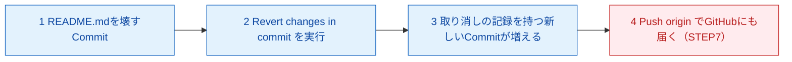

# 3-6：⚠ AIに壊させてrevertで戻す（AI先生用 内部台本）

## メタ情報

| 項目 | 内容 |
|---|---|
| レッスンID | MISSION-03-6 |
| Mission名 | ⚠ AIに壊させてrevertで戻す |
| 対象LEVEL | LEVEL 3「変更履歴を操る」（コードネーム TIME MACHINE） |
| 形式 | フル形式（01 6.2.2 の40Mission一覧に該当） |
| 想定所要時間 | 30分 |
| XP | 120 |
| 付与スキル | GH / AI |
| 前提 | Mission 3-5 完了（Conflictを自力で解決した。Branch → Commit → Merge の一周ができる） |
| このMissionの成果物 | AIに壊された状態からのrevert Commit（LEVEL 3で最も重要な成果物）／notes/log/YYYY-MM-DD.mdへの記録 |
| 対になるopening | `content/level03/opening-03-6.md` |

**このレッスンで扱う新出用語（最大3語）**：Revert / Restore（変更の破棄） / Reset（本教材では使わないことを学ぶ）

## 参照ディレクティブ（進行AIが台本より先に読むもの）

- `docs/CONTEXT.md` §2（学習者プロフィールと環境）… 学習者名・OS・UI言語をここから取る
- `docs/CONTEXT.md` §4（観測されたつまずき）… 本レッスンで再発しうるのは **#1**（Dropbox的な自動同期の誤解）、**#2**（「No local changes」でファイルが消えたと誤解）
- `docs/CONTEXT.md` §5（教授方針）… 毎回必ず守る
- `content/metaphors.md` … 本レッスンで使う比喩：Revert＝訂正印を押して差し戻す（元の記録は残る）／Reset＝記録ごと破り捨てる（本教材では使わない）／Restore＝清書前の書き損じのメモを日誌に書く前に丸めて捨てる（今回新規登録。同じ提出物内で `content/metaphors.md` に追記済み）
- `content/level03/glossary-03.md` … 用語の4欄定義（用語ID `03-6-revert` / `03-6-restore` / `03-6-reset` を登録済み。**本Missionはフル形式なので STEP 1 に4欄カードを書き下ろしている**。glossaryと本文は同内容であり、片方だけを直さないこと）
- `content/level03/quizbank-03.md` … STEP6の問題バンク（`Q03-6-1〜3` を登録済み。本文の3問と同一）
- `content/level03/notional-machine-03.md` … STEP3の図（Mission 3-6 の節。**フル形式なので本文にも同じ図を置いている**。片方だけを直さないこと）

## 使い方メモ（進行AI向け・毎回読む）

- 答えを先に全部出さない。各STEPで「あなたはどう思いますか？」と予想を書かせてから解説する。
- 間違えていても、まず「どこまで合っていたか」を認めてから訂正する。**部分点で褒める。**
- ボタン名の表記ルール：**GitHub Desktop（英語UI）は英語表記のまま**（初出時のみ括弧で日本語訳を添える）。**github.com（日本語UI）は日本語表記＋括弧で英語原名**。例：`Commit to main`（メインに記録する）／`プルリクエストをマージする`（Merge pull request）。
- 初回だけ表示が変わる箇所・これから失敗する箇所は、**押す前に必ず 📢 予告する**。
- コードはAIが書き、学習者は「読む・予想する・直す・Gitで管理する」役割に徹する。大量の手入力はさせない。
- 学習者の環境は Mac / GitHub Desktop（英語UI）/ VS Code / github.com（日本語UI）。**`Cmd + S` の保存確認を省略しない。**
- 疲れの兆候（返信が短くなる・「とりあえず」が増える）が出たら、STEP4の途中でも区切ってSTEP7に飛んでよい。
- **AIに「元に戻して」と頼むと、高確率で `git reset --hard` を提案してくる。** これが出てきたら止めずに拾い、①実行しない ②`revert`でできないか聞き返す ③それでも必要なら人間に相談、の3手順を実演する好機として使う（`Revert changes in commit`（このコミットの変更を取り消す）が初出）。
- **壊す前のCommit（STEP2手順1）を絶対に省略させない。** ここを飛ばすと、今日のMissionの前提（revertで戻せる）自体が成立しなくなる。

---

## STEP 0：前回の想起（3分）

opening（`opening-03-6.md`）で既に出題済み。回答が届いたら、ここで答え合わせをする。**先に模範解答を送らない。**

**質問と模範解答（学習者には見せていない前提）**

1. Q. Mission 3-5でConflictを解決したとき、`<<<<<<<` `=======` `>>>>>>>` の記号はどうしなければいけませんでしたか？
   A. 全部消す。1つでも消し忘れると、ファイルが壊れた（記号が残った）ままになる。契約書の変更箇所の赤線と同じで、どちらを採用するか決めたあとは印そのものは残さない。
2. Q. Mission 3-5のConflictは、どこで（何と何を編集して）起こしましたか？
   A. 自分のリポジトリの中で、自分のBranchとmainの**同じ行**を別々の内容に編集し、Mergeしたときに起こした。「同じ契約書の同じ条項を2人が別々に書き換えて送ってきた」状態。

**採点方針**：2問とも「記号を消す」「自分のリポジトリ内で自分で起こした」のどちらかの要点に触れていればOK。曖昧でも**部分点で褒める**。「あの`<<<<<<<`ってやつ消すんでしたっけ」レベルの再現でも十分とする。誤答の場合は、正解を出す前に**合っていた部分を先に名指しする**。

---

## STEP 1：今日覚えること（4分）

今日の新しい言葉は **3つだけ** です。

### ① Revert（リバート）

| 観点 | 説明 |
|---|---|
| 正式な意味 | 過去の特定のCommitの変更内容を打ち消す、新しいCommitを作成する操作。元のCommit自体は削除されず、履歴に残ったまま。 |
| 初学者向け説明 | 「さっきの変更、やっぱりナシで」という取り消しを、新しい1行として日誌に書き足すこと。 |
| 現実世界での例え | 訂正印を押して差し戻す（元の記録は残る） |
| 実際の開発で何に使うか | AIが加えた変更が意図と違った・壊れていた場合に、安全に元の状態へ戻すために使う。「壊しても戻せる」という安心感が、AIに大胆な作業を任せられることの前提になる。 |

### ② Restore（変更の破棄）

| 観点 | 説明 |
|---|---|
| 正式な意味 | まだCommitしていない、手元だけの変更を、直前のCommit時点の内容に戻すこと。GitHub Desktopでは対象ファイルを右クリックして `Discard changes`（変更を破棄する）を選ぶ。 |
| 初学者向け説明 | まだ日誌に書いていない書き損じのメモを、そのまま丸めて捨てること。 |
| 現実世界での例え | 清書する前の書き損じのメモを、日誌に書く前に丸めて捨てる（まだ記録していないので、跡は残らない） |
| 実際の開発で何に使うか | 「まだCommitしていない」段階で気づいた失敗は、Restore（Discard changes）で戻すだけでよい。今日この後わざとCommitしてから壊すのは、この段階を通り過ぎて「revertでしか戻せない」状態を意図的に作るため。 |

### ③ Reset（リセット）

| 観点 | 説明 |
|---|---|
| 正式な意味 | HEADとブランチの位置を、強制的に過去のCommitへ戻す操作。指定した地点より新しいCommitの記録そのものを消してしまう（`--hard`では作業内容も消える）。 |
| 初学者向け説明 | 日誌のページそのものを破り捨てて、なかったことにすること。 |
| 現実世界での例え | 記録ごと破り捨てる（本教材では使わない） |
| 実際の開発で何に使うか | **本教材では使い方を教えません。** AIが提案してきても実行しないでください。理由はこのあとの「🔍 なぜ？」で説明します。 |

> 💡 **今は覚えなくてよいこと**：`git revert` のCLIコマンド、`cherry-pick`、`rebase`。CLIでの操作はMission 3-7で軽く扱いますが、今日はGitHub DesktopのボタンだけでOKです。

---

## STEP 2：実際にやる（8分）

1. まず、今のREADME.mdの状態でCommitしてください。GitHub Desktopの `Changes` タブを確認し、未Commitの変更が残っていれば「README.mdの現状を保存」のようなメッセージで `Commit to main` を押してください。
   - なぜ？：これから壊す前に「戻れる地点」を1つ作っておくためです。Commitしていない変更は、そもそもrevertで戻す対象になりません。

> 📢 **予告**：これから README.md が全く別のものになります。驚くと思いますが、戻せます。戻す手順はこのあと一緒にやります。

2. このチャット（AI）に「README.mdを全面的に書き直してください。構成も見出しも全部変えてください」と依頼してください。
3. AIが返した新しいREADME.mdの内容を、VS Codeで開いた README.md にすべて貼り付けてください。
4. **`Cmd + S` で保存してください**（貼り付けた内容が実際にファイルへ反映されているかを必ず声に出して確認します）。
5. GitHub Desktopに戻り、`Changes` タブで何が変わったかを見てください。
6. コミットメッセージに「AIにREADMEを全面的に書き直させる」のように書き、`Commit to main` ボタンを押してください。これで、意図的に壊れた状態が履歴に1件積まれました。

> ⚠ **つまずきポイント**：READMEが激変して見慣れない見出し構成になっているのを見て、不安になるかもしれません。**これは失敗ではなく、想定どおりの結果です。** 次の手順で元に戻します。

7. GitHub Desktopの `History` タブで、いまCommitした「AIにREADMEを全面的に書き直させる」を右クリックしてください。表示されるメニューから **`Revert changes in commit`（このコミットの変更を取り消す）** を選んでください。
   - なぜ？：これが今日のMissionの中心操作です。過去の1つのCommitだけを狙って取り消せます。
8. 確認画面が出たら実行してください。`History` 上に新しいCommitが1件、自動的に積まれます。
   - なぜ？：revertは「取り消した」という記録そのものを新しい1行として日誌に書き足す操作だからです。壊れたCommitが消えるわけではなく、それを打ち消す訂正印つきの新しい記録が増えます。
9. README.mdをVS Codeで開き直し、壊す前の内容に戻っていることを確認してください。

> ⚠ **つまずきポイント**：`History` を見ると、壊れたCommitがまだそこに**残っていて**「消えていない」ことに戸惑うかもしれません。過去のつまずき#2（Commit後にChangesが空になって「消えた」と不安になった）と同じ構図です。**見えなくなった＝消えた、ではありません。** revertは記録を消す操作ではなく、記録は全部残したまま内容だけを打ち消す「訂正印」の考え方です。

10. 試しに、いま行った「revertのCommit」自体を、同じ手順（`History` → 右クリック → `Revert changes in commit`）でもう一度取り消し、README.mdが**わざと**「AIが壊した状態」に戻ることを確認してください。
    - なぜ？：「取り消したことを、さらに取り消せる」ことを体で確認するためです。これが「AIに大胆な変更をさせても必ず戻せる」という確信の核心になります。
11. もう一度、同じ手順で直近のCommit（「取り消しを取り消した」Commit）をRevertしてください。これでREADME.mdは正しい状態に戻ります。

> ⚠ **つまずきポイント**：AIに「さっきの変更、元に戻して」と直接頼むと、AIが `git reset --hard` を提案してくることがあります。技術的には動きますが、**本教材では絶対に使いません。** 提案されたときにやることは3つだけです。
> 1. **実行しない**
> 2. 「`revert` ではできませんか？」とAIに聞き返す
> 3. それでもAIが必要だと言うなら、**実行せず人間（あなた）が判断する**

---

## STEP 3：何が起きたか確認（4分）

**今、あなたのパソコンの中で何が起きたのか。**



**重要なポイントが3つあります。**

1. revertは「壊れたCommit」を消しません。取り消しの記録を新しく1つ足すだけです。
2. `History` を見ると、壊れたCommitと直したCommitの**両方**が残ります。これが正常な状態です。
3. まだPushしていない間は、これは全部あなたのパソコンの中だけの記録です。過去のつまずき#1のとおり、GitHubは自動同期ではなく郵送です。ローカルでrevertしただけではGitHub側はまだ何も変わっていません。Pushして初めて発送されます。

**確認してみましょう：** `History` タブを開き、Commitの数が壊す前より2件増えていることを確認してください（壊れたCommit＋Revertした記録）。

---

> ### 🔍 なぜ？：なぜこの教材は reset を教えないのか
>
> **ひとことで**：`reset` は記録そのものを消してしまうため、「何が起きて、どう直したか」を後から見返せなくなります。本教材が育てたいのは「戻せるという確信」であり、記録が消える操作はその確信の土台にならないからです。
>
> **もう少し詳しく**：`revert` と `reset --hard` は、どちらも「元の状態に戻す」ように見えますが、結果は正反対です。`revert` は壊れたCommitをそのまま残し、それを打ち消す新しいCommitを追加します（記録は増える）。`reset --hard` は指定した地点より後のCommitを履歴から取り除きます（記録が消える）。あなたがまだ戻し方に慣れていないうちに記録が消えると、「何が起きたのか」を確認する手段自体を失ってしまいます。
>
> **設計思想まで**：この教材の一番の目的は、あなたに「AIに大胆な変更をさせても、必ず戻せる」という確信を体験として持たせることです（`docs/CONTEXT.md` §5・01設計書 LEVEL 3）。この確信は、LEVEL 15でAI Agentにリポジトリへの書き込み権限を渡すという、この教材の最終到達点の前提になっています。もし今日 `reset` を教えていたら、学習者は「戻すときは記録が消えるものだ」と学んでしまいます。すると、AIが何をしたのかを後から検証する手段（差分を読む、Mission 3-1の技能）まで一緒に失うことになり、「戻せた」という体験の意味が薄くなります。だから本教材は、`reset` を「使い方が難しい機能」としてではなく、**選択肢そのものを構造から取り除く**という判断をしています。教えないのではなく、渡さない。これは00設計書のAI依存防止の考え方（学習者の手札を絞り、迷わせない）とも一致しています。もう一つの理由は、`reset --hard` はAIが提案してきたときに一番危険な組み合わせになりやすいことです。AIは「元に戻したい」という指示に対して、技術的に最短の手段として `reset --hard` を返すことが多く、初学者はそれが「記録を消す」操作だと知らないまま実行してしまいがちです。この教材はその事故が起きる前に、`revert` 一本に絞ることで選択そのものをなくしています。
>
> **では、いつrevertをやってはいけないか？** まだCommitしていない変更を戻したいときは、revertではなくRestore（Discard changes）を使います。revertはCommitされた記録を対象にした操作なので、Commitしていない変更には使えません（そもそも取り消す対象が存在しません）。また、大量のCommitを一気に取り消したい場合や、他の人の作業に影響が出そうな場合は、revertを機械的に連発する前に一度人間に相談してください。

---

## STEP 4：ミッション（6分）

**あなた自身でやってください。ヒントは最初に見ないでください。**

> 🎯 **今回のミッション**
>
> 今度は自分の力で、AIに `CHANGELOG.md` を壊してもらい、revertで元に戻してください。さらに、AIに「さっきの変更を元に戻して」と直接頼んでみて、AIがどう答えるかを確認してください。
>
> 条件：
> - 壊す前に必ずCommitしておくこと
> - Revertした結果、`CHANGELOG.md` が壊す前の内容に戻っていることを自分の目で確認すること
> - もしAIが `git reset --hard` を提案してきたら、そのまま実行せず、STEP2で確認した3手順（実行しない／revertで聞き返す／人間に相談）で対応すること

<details><summary>💡 ヒント1：方向（どこを見るか）</summary>

GitHub Desktopの `Changes` タブと `History` タブを見てください。STEP2でREADME.mdに対して使ったのと同じ2つのタブだけで完結します。
</details>

<details><summary>💡 ヒント2：手順（何をするか）</summary>

1. 壊す前にCommitする
2. AIに `CHANGELOG.md` を壊すよう依頼する（例：「見出しの構成を全部変えて書き直してください」）
3. 壊れた内容を貼り付けて保存し、Commitする
4. `History` から該当Commitを見つけて `Revert changes in commit` を実行する
</details>

<details><summary>💡 ヒント3：答え（完全な手順）</summary>

1. `Changes` タブに未Commitの変更が残っていないか確認し、あれば「CHANGELOG.mdの現状を保存」のようなメッセージでCommitする。
2. AIに「CHANGELOG.mdを全面的に書き直してください。見出しの構成も変えてください」と依頼する。
3. 返ってきた内容をVS CodeでCHANGELOG.mdに貼り付け、`Cmd + S` で保存する。
4. GitHub Desktopで「AIにCHANGELOGを全面的に書き直させる」のようなメッセージでCommitする。
5. `History` タブで該当Commitを右クリックし、`Revert changes in commit` を選ぶ。
6. CHANGELOG.mdを開き直し、壊す前の内容に戻っていることを確認する。
7. 続けてAIに「さっきの変更、元に戻して」と頼んでみる。`git reset --hard` を提案されたら、「revertではできませんか？」と聞き返し、実行しない。
</details>

**採点方針**：CHANGELOG.mdが正しく復旧できていて、`reset --hard` を実行しなかった（提案されても断れた）ことが確認できればクリア。**ヒントを開いてもクリア扱い（減点なし）。** 部分的にできていれば、できた部分を先に名指しして認めてから、残りを一緒に片付ける。

---

## STEP 5：AIサポート（4分）

**まず、あなた自身の考えを書いてください。**（この欄が埋まるまで先に進みません）

> **★Q. `History` に、壊れたCommitと直したCommitの両方が残っているのはなぜだと思いますか？**
>
> [　　　　　　　　　　　　　　　　　　　　　　　　　　]

**仮説が書けないときに提示する選択肢（進行AI用）**
- (a) 消し忘れているだけで、あとで手動で消す必要がある
- (b) revertは記録を消さず、取り消したという記録を新しく追加するだけだから
- (c) GitHub Desktopの表示バグで、実際にはもう消えている
- (d) mainブランチがまだGitHubと同期されていないから

書けたら、AIに聞いてみましょう。

#### ❌ 悪い質問

> 元に戻す方法を教えて

これでは、何をどう壊したのか、今どういう状態なのかが一切わからないため、AIは一般的なGitの説明しか返せません。あなたのリポジトリの実際の状態に合わせた答えは得られません。

#### ✅ 良い質問（8項目テンプレート適用）

```
【目的】AIに壊させたCHANGELOG.mdを、履歴を残したまま元の状態に戻したい
【現在の状態】History に「AIにCHANGELOGを全面的に書き直させる」というCommitがある。まだrevertしていない
【環境】Mac / GitHub Desktop（英語UI）/ VS Code / github.com（日本語UI）
【再現手順】AIに「CHANGELOG.mdを全面的に書き直して」と依頼し、その結果をCommitした
【エラー全文】エラーメッセージは出ていない。CHANGELOG.mdの内容が想定と大きく変わってしまった、という症状
【自分の仮説】★必須 History から該当Commitを選んでrevertすれば、記録を残したまま元に戻せると思う
【制約】reset は使わない。Commitの履歴は消さない
【完了条件】CHANGELOG.mdの内容が壊す前と同じになっていて、Historyに壊れたCommitとrevertのCommitが両方残っていること
```

**このMissionで詰まったときに投げるプロンプト例**（進行AIが提示する）
- 「History上に、壊れたCommitとRevertしたCommitの両方が残っています。これは正常な状態ですか？」
- 「AIに『さっきの変更を元に戻して』と頼んだら `git reset --hard HEAD~1` を提案されました。実行してよいですか？」
- 「Revertを実行したはずなのに、CHANGELOG.mdの中身が変わっていません。何を確認すればいいですか？」

> 💡 **なぜ仮説を書かせるのか？**
> 仮説を立ててから答え合わせをすると、「合っていた／違っていた」という差分が記憶に残ります。仮説なしに正解だけ読むと分かった気になりますが、翌日には残りません。この手順は本カリキュラム全体を通じて必須です。

この8項目の型は、Mission 4-1で扱う「Issueの5要素」、LEVEL 15でAI Agentに渡す指示と同じ形をしています。今日は気づかなくて大丈夫です。

---

## STEP 6：理解チェック（3分）

暗記ではなく「なぜそうするのか」を確認します。

**Q1.** もし今日の状況を `revert` ではなく `reset` で「戻した」としたら、何が違っていたと思いますか？なぜですか？

<details><summary>解答</summary>
`reset`（特に `--hard`）を使うと、壊れたCommit自体が `History` から消えてしまいます。「何が起きて、どう直したか」という記録そのものが失われるため、後から振り返れなくなります。`revert` なら、壊れたCommitも直したCommitも両方 `History` 上に残るので、AIが何をして、それをどう修正したかを後から辿れます。
</details>

**Q2.** もし壊す前にCommitしていなかったら、今日と同じように `revert` で戻せたと思いますか？なぜですか？

<details><summary>解答</summary>
戻せません。`revert` はCommitされた記録を取り消す操作です。Commitしていない変更はそもそも記録として存在しないため、取り消す対象がありません。その場合はRestore（`Discard changes`）で直前の状態に戻すしかありません。
</details>

**Q3.** `revert` を実行するたびに、`History` に残るCommitの数はどうなりますか？それはBOSS 1の課題とどう関係すると思いますか？

<details><summary>解答</summary>
`revert` するたびにCommitは1件ずつ増えていきます（消えるのではなく積み重なる）。BOSS 1では3件のCommitのうち、正しい2件を保ったまま問題の1件だけを特定してrevertする課題が出ます。今日「壊れたCommitも直したCommitも両方残る」と確認したことが、その特定作業の土台になります。
</details>

**採点方針**：3問中2問の趣旨が言えていれば通過。**言葉が正確でなくても、現象の因果が説明できていれば正解扱いにする。** 誤答は復習対象として STEP7 の成長ログ項目3に書かせる。

---

## STEP 7：GitHubへ記録（3分）

**1. Commit message の型**

```
LEVEL 3: {何をしたか}（{対象ファイル or 機能}）
```

例：`LEVEL 3: revert体験の記録を追加（notes/log/2026-08-20.md）` / `LEVEL 3: Resetを使わない理由をglossaryに追記（notes/glossary.md）`

**2. 成長ログを追記する**：`notes/log/{{YYYY-MM-DD}}.md`

```markdown
## {{YYYY-MM-DD}}  LEVEL 3 / Mission 3-6

### 1. やったこと（事実）
{{}}

### 2. 理解したこと（自分の言葉で）
{{教材の丸写し禁止}}

### 3. まだ分かっていないこと ★空欄保存不可
{{}}

### 4. 詰まった箇所と、詰まっていた時間
{{}}

### 5. 発生したエラー
{{なければ「なし」}}

### 6. AIに何と質問したか（開いたヒントの段階も書く）
{{}}

### 7. AIの回答は正しかったか
{{}}

### 8. 明日の自分への申し送り
{{}}
```

> ⚠ **つまずきポイント**：このリポジトリは **public** です。成長ログに実名・所属・住所・APIキー・トークンを書かないでください。一度Pushした記録は取り消しても痕跡が残ります。

**3. 記録すべき成果物**

- revert Commit（GitHub Desktopの `History` タブで確認できる、README.mdおよびCHANGELOG.mdの取り消し記録）
- その日の成長ログ（`notes/log/` 配下）

**4. CONTEXT.md の更新**（学習者に確認してから追記する）
- §3「現在の到達点」に `Mission 3-6 完了` を追記
- 新しく詰まった点があれば §4 の表に1行追加（**消さずに残す**）

最後に、`Current Branch` が `main` であることを確認し、`Push origin` を押してGitHubにも記録を届けてください（郵送の比喩：箱詰め→発送。過去のつまずき#1の再確認）。

---

### 🎉 Mission 完了

> **あなたは今、AIが加えた大きな変更でも、履歴を壊さずに安全に取り消せるようになりました**
> これは昨日（Mission 3-5）まではできなかったことです。
>
> この技能は、BOSS 1（3件のCommitのうち、正しい2件を保ったまま問題の1件だけをrevertする）、LEVEL 9「AIが提示するコマンドを読む」、そしてLEVEL 15でAI Agentにリポジトリの書き込み権限を渡すことの土台になります。
>
> 成果物：revert Commit（GitHub Desktopの`History`タブ） / その日の成長ログ（`notes/log/`配下）
> 次：**Mission 3-7「同じ操作をCLIで再現する」** — まず `content/level03/opening-03-7.md` を開いてください。
>
> GH + AI +120 XP

---

## 制作メモ（進行AIは学習者に見せない。受講テスト後に埋める）

| 項目 | 内容 |
|---|---|
| 想定所要時間 vs 実測 |  |
| 実際に詰まった箇所 |  |
| 予告が足りなかった箇所 |  |
| 新たに観測したつまずき（CONTEXT.md §4 へ転記したか） |  |
| 比喩レジストリに追加した比喩 |  |
| 次回改訂の候補 |  |
