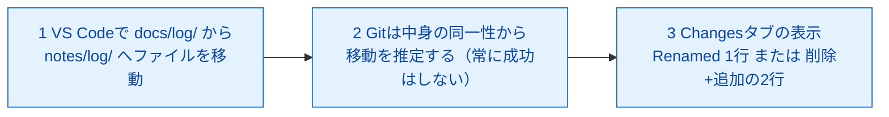
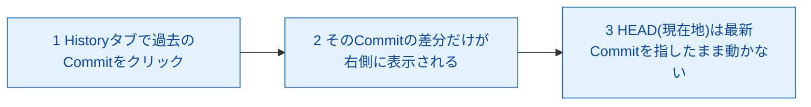
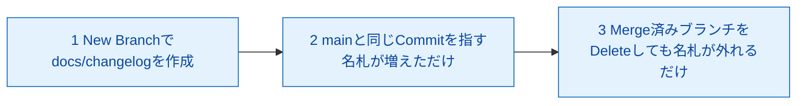
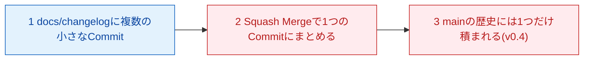
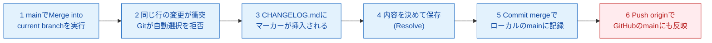
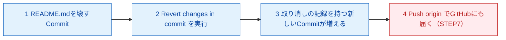
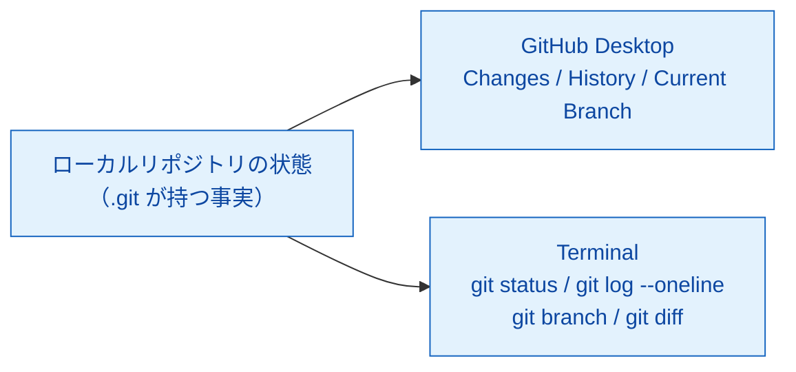

# notional-machine-03.md ― LEVEL 3 Mermaid図（圧縮形式で再掲用）

> 圧縮形式のレッスンが参照する正典。各レッスンの図をここに集約していく。
> **収録範囲：Mission 3-1〜3-7。** フル形式のレッスン（3-5・3-6）は台本本文にも同じ図を持つが、**本ファイルが正典**であり、両者は一致していなければならない（片方だけを直さない）。
> 配色規約：ローカル＝青系（`local`）、リモート＝赤系（`remote`）。
>
> **更新履歴**：2026-08-16 レビューで、Mission 3-1・3-5・3-6・3-7 の図が未収録のまま各台本から参照されていた（参照切れ）ため一括追記。

## Mission 3-1：ファイルの移動は「削除＋追加」として記録されることがある

重要なポイント：
1. どちらの見え方でも**ファイルの中身は失われていない**。「見えなくなった＝消えた」ではない（CONTEXT.md §4 #2）。
2. 1行だけ書き換えた場合も同じ理屈で「削除1行＋追加1行」として表示される。
3. `Changes` タブは「まだCommitしていない差分」、`History` タブは「すでにCommitされた差分」を見る場所。

## Mission 3-2：History閲覧とHEADの位置関係

重要なポイント：
1. `History` タブでの閲覧は「差分を表示するだけ」で、作業中のファイルの中身もHEADの位置も変えない。
2. HEADは通常「最新Commit」を指し続けている。過去のCommitを何度クリックしても、HEADは動かない。

## Mission 3-3：Branchは「Commitを指す名札」

重要なポイント：
1. `New Branch` はファイルを複製せず、「今のmainの状態を指す、もう1本の名札」を作るだけ。
2. `Delete Branch` は名札を外すだけ。Merge済みなら中身はmainの歴史に転記済みなので失われない。

## Mission 3-4：Squash Mergeは複数Commitを1つにまとめてから積む

重要なポイント：
1. Squash Mergeは、ブランチ内の複数Commitを1つにまとめてからmainへ統合する。
2. mainの歴史は常に「意味のある1つの変更＝1つのCommit」の連続になり、後から読みやすい。

## Mission 3-5：Conflictの発生からResolve、Pushまで

（フル形式。`mission-03-5.md` STEP 3 の図と同一）

重要なポイント：
1. Conflictは「Gitが壊れた」のではなく、「Gitが正直に『判断できません』と言っている」状態。
2. コンフリクトマーカーは一時的な目印であり、消さずに残すと壊れたままmainに記録される。
3. Mergeが完了するのはResolve後に `Commit merge` を押した瞬間で、それより前はmainに一切反映されていない。

## Mission 3-6：revertは記録を消さず、打ち消す記録を1つ積む

（フル形式。`mission-03-6.md` STEP 3 の図と同一）

重要なポイント：
1. revertは「壊れたCommit」を消さない。取り消しの記録を新しく1つ足すだけ。
2. `History` には壊れたCommitと直したCommitの**両方**が残る。これが正常な状態。
3. ローカルでrevertしただけではGitHub側は何も変わらない。Pushして初めて発送される（同期ではなく郵送）。

## Mission 3-7：CLIはGUIと同じ状態を「別の窓」から見ているだけ

重要なポイント：
1. 今日の4コマンドはどれも**「見るだけ」**で、実行してもリポジトリの中身は一切変わらない。
2. GitHub Desktopの各タブは、これらのコマンドが返す情報を人間が読みやすく描き直しているだけ。裏側は同じGit。
3. Local/Remoteの関係は今日変わっていない。ローカルの状態を別の窓からのぞき見しただけ。
