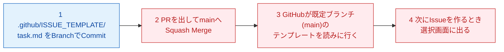

# 4-2：Issue Template と Labels（AI先生用 内部台本）

## メタ情報

| 項目 | 内容 |
|---|---|
| レッスンID | MISSION-04-2 |
| Mission名 | Issue Template と Labels |
| 対象LEVEL | LEVEL 4「GitHubでチーム開発」（コードネーム THE OFFICE） |
| 形式 | 圧縮形式 |
| 想定所要時間 | 20分 |
| XP | 80 |
| 付与スキル | GH |
| 前提 | Mission 4-1 完了（5要素のIssueを3件書いた） |
| このMissionの成果物 | `.github/ISSUE_TEMPLATE/task.md`（5要素の型。**mainにMerge済み**）／Labels 3〜5個（bug / enhancement / docs / learning） |
| 対になるopening | `content/level04/opening-04-2.md` |

**このレッスンで扱う新出用語（最大3語）**：Issue Template / Labels / `.github/` ディレクトリ

## 参照ディレクティブ（進行AIが台本より先に読むもの）

- `docs/CONTEXT.md` §2（学習者プロフィールと環境）… 学習者名・OS・UI言語をここから取る
- `docs/CONTEXT.md` §4（観測されたつまずき）… 本レッスンで再発しうるのは **#4**（`.DS_Store` のような、ドット始まりの名前・隠しファイルへの不慣れ）
- `docs/CONTEXT.md` §5（教授方針）… 毎回必ず守る
- `content/metaphors.md` … 本レッスンで使う比喩：Issue＝業務依頼票、Labels＝付箋の色分け（いずれもレジストリ登録済み）。Issue Templateと`.github/`ディレクトリは、登録済みの「業務依頼票」「案件ごとのファイルキャビネット（Repository）」の比喩をそのまま拡張して説明する（新規の比喩は立てない）
- `content/level04/glossary-04.md` … 用語の4欄定義（用語IDは `04-2-` 接頭辞。**本レッスンは圧縮形式だが、学習者の理解定着のため STEP 1 に4欄カードも書き下ろしている**。glossaryと本文は同内容であり、片方だけを直さないこと）
- `content/level04/quizbank-04.md` … STEP6の問題バンク（`Q04-2-1〜3` を登録済み。本文の3問と同一）
- `content/level04/notional-machine-04.md` … STEP3の図（Mission 4-2 の節。本文にも同じ図を置いている。片方だけを直さないこと）

## 使い方メモ（進行AI向け・毎回読む）

- 答えを先に全部出さない。各STEPで「あなたはどう思いますか？」と予想を書かせてから解説する。
- 間違えていても、まず「どこまで合っていたか」を認めてから訂正する。**部分点で褒める。**
- ボタン名の表記ルール：**GitHub Desktop（英語UI）は英語表記のまま**（初出時のみ括弧で日本語訳を添える）。**github.com（日本語UI）は日本語表記＋括弧で英語原名**。例：`Commit to main`（メインに記録する）／`新しい Issue`（New issue）。
- 初回だけ表示が変わる箇所・これから失敗する箇所は、**押す前に必ず 📢 予告する**。
- コードはAIが書き、学習者は「読む・予想する・直す・Gitで管理する」役割に徹する。大量の手入力はさせない。
- 学習者の環境は Mac / GitHub Desktop（英語UI）/ VS Code / github.com（日本語UI）。**`Cmd + S` の保存確認を省略しない。**
- 疲れの兆候（返信が短くなる・「とりあえず」が増える）が出たら、STEP4の途中でも区切ってSTEP7に飛んでよい。
- `.github/ISSUE_TEMPLATE/` フォルダは**必ずVS Codeで作らせる**。Finderで作ろうとする素振りが見えたら止める。ドット始まりの名前は1文字でも違うとテンプレートとして機能しない。
- **テンプレートの動作確認（STEP 3・STEP 4）の前に、必ずmainへのMergeと `Pull origin` を終わらせる。** GitHubはmain（既定のブランチ）のテンプレートしか読まないため、Publishしただけの状態で `新しい Issue` を押させると「作ったのに出てこない」という不要な失敗を踏ませることになる。STEP 2 の手順9〜12を飛ばさないこと。
- Labelsは今日の作業で3〜5個に決め切る。「あとで種類を増やそうか迷っている」という反応が出たら、「今日は増やさない。本当に足りなくなってから足す」と明言してよい。

---

## STEP 0：前回の想起（2分）

opening（`opening-04-2.md`）で既に出題済み。回答が届いたら、ここで答え合わせをする。**先に模範解答を送らない。**

**質問と模範解答（学習者には見せていない前提）**

1. Q. Mission 4-1で、Issueを書くときの5要素は何でしたか？
   A. 目的／現状／期待する結果／制約／完了条件。5つ全部言えなくてよい。「完了条件が一番書きにくかった」のような感想が出てくれば、内容自体は理解できている証拠。
2. Q. 1人で開発しているのに、なぜIssueを書くのでしたか？
   A. 未来の自分と、AIに見せる記録として使うため。忘れた頃に見返しても状況がわかるようにする。

**採点方針**：2問とも「5要素」「未来の自分とAIのための記録」という骨格が言えていればOK。曖昧でも**部分点で褒める**。「完了条件ってやつが大事なんだっけ」レベルの再現でも十分とする。誤答の場合は、正解を出す前に**合っていた部分を先に名指しする**。

---

## STEP 1：今日覚えること（3分）

今日の新しい言葉は **3つだけ** です。

### ① Issue Template（イシューテンプレート）

| 観点 | 説明 |
|---|---|
| 正式な意味 | Issueを新規作成するときに、あらかじめ用意した定型フォーマット（見出しや記入欄）を自動で差し込む仕組み。`.github/ISSUE_TEMPLATE/` にMarkdownファイルとして置く |
| 初学者向け説明 | 毎回ゼロから書式を考えなくても、決まった項目が最初から入った状態でIssueを作れる仕組み |
| 現実世界での例え | 業務依頼票（Issueの比喩）を、白紙の用紙ではなく「あらかじめ項目が印刷された複写伝票」にしておくこと |
| 実際の開発で何に使うか | Mission 4-1で毎回自分の頭で考えていた5要素を、以降は最初から入っている状態にできる。書き忘れを防げる |

### ② Labels（ラベル）

| 観点 | 説明 |
|---|---|
| 正式な意味 | Issueに貼る色付きのタグ。種類ごとに分類するための仕組み |
| 初学者向け説明 | Issueに貼る付箋の色。何の種類の依頼かひと目でわかるようにする |
| 現実世界での例え | 付箋の色分け（レジストリ登録済み） |
| 実際の開発で何に使うか | `bug`（不具合）`enhancement`（改善）`docs`（文書）`learning`（学習用）のように分類し、あとから種類ごとに絞り込める |

### ③ `.github/` ディレクトリ

| 観点 | 説明 |
|---|---|
| 正式な意味 | GitHubがリポジトリの設定・自動化に使う、特別な名前のフォルダ。決まった場所（`ISSUE_TEMPLATE/` など）にファイルを置くと、GitHub側が自動で認識する |
| 初学者向け説明 | リポジトリの中にある「GitHub専用の設定コーナー」 |
| 現実世界での例え | 案件ごとのファイルキャビネット（Repositoryの比喩）の中にある、会社共通のルール・書式だけを収めておく専用の引き出し |
| 実際の開発で何に使うか | 今日はここにIssue Templateを置く。将来はここにレビューの雛形なども置かれるようになる（今日はIssue Templateだけ扱う） |

> 💡 **今は覚えなくてよいこと**：Issue Forms（YAML形式の高度なテンプレート）、Milestone、Projectsとの連携設定。これらはLEVEL 4の後半以降、必要になったときに扱います。

---

## STEP 2：実際にやる（7分）

> 📢 **予告**：今日も新しいBranchを作ります。GitHubに送るボタンは初回だけ、いつもの `Push origin` ではなく **`Publish branch`（公開する）** という表示になります。前に見た表示と同じ現象なので、驚かなくて大丈夫です。

1. GitHub Desktopで `Current Branch`（現在のブランチ）をクリック → `New Branch`（新しいブランチ）をクリック。名前は `feature/issue-template` とし `Create Branch`（ブランチを作成）を押してください。
   - なぜ？：Issue Templateの追加は「新しい仕組みを足す」作業なので、Mission 3-3の命名規則の `feature/` にあたる。
2. VS Codeでリポジトリ直下に新規フォルダを作成し、名前を `.github` にしてください（**ドットを忘れずに**入力）。
   - なぜ？：GitHubは `.github` という名前のフォルダだけを特別に認識する仕組みになっている。
3. `.github` フォルダの中に、さらに新規フォルダ `ISSUE_TEMPLATE` を作ってください（大文字・小文字を正確に）。

> ⚠ **つまずきポイント**：フォルダ名を1文字でも間違える（`issue_template` と小文字にする、アンダースコアを忘れる等）と、GitHubはテンプレートとして認識しません。Finderでは `.github` が隠しフォルダとして見えないことがありますが、VS Code上に存在していれば問題ありません。心配なら、VS Codeの左側のファイル一覧で `.github/ISSUE_TEMPLATE/` の階層をそのまま見せてもらってください。

4. `ISSUE_TEMPLATE` フォルダの中に `task.md` という名前で新規ファイルを作成してください。
5. AIに「Mission 4-1の5要素（目的／現状／期待する結果／制約／完了条件）を見出しにしたIssueテンプレートのMarkdownを書いてください」と依頼し、出てきた内容を貼り付けてください。
6. **`Cmd + S` で保存してください**（保存を忘れると、次のCommitに何も表示されません）。
7. GitHub Desktopで `Changes` タブを確認し、コミットメッセージを書いて `Commit to feature/issue-template` を押してください。
8. 画面右上のボタン（**予告どおり** `Publish branch`）を押してください。

> 📢 **予告**：ここからは、Mission 3-4 でやったMergeの一周をもう一度通ります。新しい操作はありません。**なぜここでMergeするのかというと、GitHubがIssue Templateを読みに行く場所は「main（既定のブランチ）」だけだからです。** ブランチに置いたままでは、このあとテンプレートの選択画面は出てきません。

9. Publish後、同じ場所に出る `Create Pull Request` を押し、github.com（日本語UI）で `プルリクエストを作成する`（Create pull request）を押してPRを作成してください。
   - なぜ？：Mission 3-4 で決めたとおり、mainへの変更は必ずPR経由で行う。
10. PRページで `スカッシュしてマージする`（Squash and merge）→ `マージを確定する`（Confirm squash merge）の順に押してください。
    - なぜ？：Mission 3-4 でSquash Mergeのみ有効にしたので、方式を選ぶ画面は出ない。設定は触らない。
11. マージ後に出てくる `ブランチを削除`（Delete branch）を押してください。
12. GitHub Desktopに戻り、`Current Branch` を `main` に切り替え、`Pull origin` を押してください。
    - なぜ？：Mergeで変わったのはGitHub上のmainだけ。**同期ではなく郵送**なので、受け取り（Pull）をしないと手元のmainは古いままになる。

---

## STEP 3：何が起きたか確認（2分）

**今、GitHub上で何が起きたのか。**

図は `content/level04/notional-machine-04.md`（Mission 4-2 の節）と同一。



**重要なポイントが3つあります。**

1. `.github/ISSUE_TEMPLATE/` にファイルを置いただけでは、まだ何も起きていない。GitHub側が「次にIssueを作るとき」に初めてこのファイルを読みに行く。
2. **読みに行く先は main（既定のブランチ）だけ。** さっきMergeしたのはそのため。ブランチに置いたままでは選択画面に出てこない。
3. テンプレートは強制ではない。`空の issue を開く`（Open a blank issue）を選べば、今までどおり白紙からも書ける。

**確認してみましょう：** Merge と `Pull origin` が済んだあと、github.com（日本語UI）で `Issues`（イシュー）タブ → `新しい Issue`（New issue）ボタンを押し、テンプレートの選択画面が出るか確かめてください。

> ⚠ **つまずきポイント**：ここで選択画面が出ない場合、原因はほぼ2つのどちらかです。①フォルダ名・ファイル名のつづり（`.github` のドット、`ISSUE_TEMPLATE` の大文字、アンダースコア）②**mainへのMergeがまだ終わっていない**。**この症状を見たら99%はこの2つ**なので、まずgithub.comのmainブランチ上で `.github/ISSUE_TEMPLATE/task.md` が見えるかを確認してください。

---

> ### 🔍 なぜ？：なぜLabelsは3〜5個に絞るのか
>
> **ひとことで**：選択肢が多いと、結局どれを貼ればいいか毎回迷い、使われなくなるからです。
>
> **もう少し詳しく**：ラベルは「分類して後から探しやすくする」ための道具です。10個も20個もあると、似た意味のラベルが増え、同じ種類のIssueに違う人が違うラベルを貼るようになります。そうなると一覧をフィルタしても正しく絞り込めなくなり、ラベル自体が機能しなくなります。
>
> **設計思想まで**：本カリキュラムは、GitHub Projectsの列も3列（Todo / Doing / Done）に絞るなど、一貫して「高度な機能をフルに使わせない」という方針を採っています。初学者が最初に触れる仕組みは、選択肢を絞って「まず使い切れる」状態にすることを優先し、必要になったときに1つずつ足していく前提です。Issue Templateの5要素を増やさず固定しているのも同じ思想です。項目や選択肢を増やすことは簡単ですが、増やした分だけ「使われなくなる」リスクも増えます。初学者のうちは、機能を削ることも設計の一部だと考えてください。
>
> **では、いつLabelsを増やしてよいか？** 実際に3〜5個のラベルで一覧を見返し、「これは`bug`でも`enhancement`でもない」という分類漏れが繰り返し起きたときだけ、1個ずつ足してください。最初から予測で増やさないことが大切です。

---

## STEP 4：ミッション（3分）

**あなた自身でやってください。ヒントは最初に見ないでください。**

> 🎯 **今回のミッション**
>
> 作った `task.md` テンプレートを使って、実際に新しいIssueを1件作成してください。テンプレートの内容が自動で入っていることを目で確認するのがゴールです。あわせて、github.comのLabelsページで `bug` `enhancement` `docs` `learning` の4つを作成してください。
>
> 条件：
> - Issueのタイトルは、実際にやりたい作業（例：Seed Appの続き）に合わせて自分で決めること
> - テンプレートの5要素の見出しを実際に埋めてから `新しい issue の送信`（Submit new issue）ボタンを押すこと
> - Labelsは4つ（`bug` `enhancement` `docs` `learning`）で止め、5個を超えて作らないこと

<details><summary>💡 ヒント1：方向（どこを見るか）</summary>

github.com（日本語UI）の `Issues` タブと、その中の `ラベル`（Labels）タブを見てください。
</details>

<details><summary>💡 ヒント2：手順（何をするか）</summary>

1. `イシュー`（Issues）タブで `新しい Issue`（New issue）ボタンを押す
2. テンプレートの選択画面が出たら `task` の行を選び、右側のボタン（`作業の開始`＝Get started）を押す
   <!-- 実地確認要：github.com 日本語UI のテンプレート選択画面のボタン表記が `作業の開始` か `始める` かは、GitHub側のローカライズ更新で変わりうる。受講テスト時に実際の表示を確認し、違っていれば制作メモに記録して本文を修正すること。表記が違っても押す場所（task の行の右側）は変わらない。 -->
3. `イシュー`（Issues）タブの `ラベル`（Labels）から `新しいラベル`（New label）ボタンを押し、名前と色を決めて `ラベルの作成`（Create label）を押す（4回繰り返す）

（それぞれの画面がどう変化するかは、ここでは言いません）
</details>

<details><summary>💡 ヒント3：答え（完全な手順）</summary>

`Issues` タブ → `新しい Issue`（New issue）→ `task` テンプレートの `作業の開始`（Get started）→ タイトルを記入 → 5要素それぞれの見出しの下に内容を書く → `新しい issue の送信`（Submit new issue）。

Labelsは `Issues` タブ内の `ラベル`（Labels）→ `新しいラベル`（New label）→ 名前（例：`bug`）と色を選ぶ → `ラベルの作成`（Create label）。これを `enhancement` `docs` `learning` の分だけ繰り返す。
</details>

**採点方針**：テンプレートの見出しがそのまま入った状態でIssueが作成できていて、Labelsが4つできていれば通過。中身が薄くても、5要素すべてに何か書けていれば十分（部分点で褒める）。**ヒントを開いてもクリア扱い（減点なし）。**

---

## STEP 5：AIサポート（3分）

**まず、あなた自身の考えを書いてください。**（この欄が埋まるまで先に進みません）

> **★Q. もし `.github/ISSUE_TEMPLATE/` のスペルを1文字間違えたまま Publish したら、次に `新しい Issue` を押したとき何が起きると思いますか？**
>
> [　　　　　　　　　　　　　　　　　　　　　　　　　　]

**仮説が書けないときに提示する選択肢（進行AI用）**
- (a) エラーメッセージが表示されて、Issueが作れなくなる
- (b) 特に何も起きず、テンプレートなしのいつも通りの白紙Issue画面が開く
- (c) GitHub Desktopがフォルダごと削除してしまう
- (d) GitHubが自動でスペルを直してくれる

書けたら、AIに聞いてみましょう。

#### ❌ 悪い質問

> テンプレート効きません

状況（何を作ったか・何を確認したか）が何も書かれていないので、AIは一般的な作り方をもう一度説明するだけになります。

#### ✅ 良い質問（8項目テンプレート適用）

```
【目的】.github/ISSUE_TEMPLATE/task.md をIssue作成時に自動で挿入されるようにしたい
【現在の状態】ファイルは作成しCommit・Publishまで済んだが、新しいIssue作成画面にテンプレートが出てこない
【環境】Mac / GitHub Desktop（英語UI）/ VS Code / github.com（日本語UI）
【再現手順】Issues タブ → 新しい Issue → テンプレートの選択画面が出ない
【エラー全文】エラーメッセージは出ていない。テンプレートを選ぶ画面自体が表示されず、いつもの白紙のIssueが開く
【自分の仮説】★必須 フォルダ名かファイル名のスペルが間違っている気がする
【制約】.github/ISSUE_TEMPLATE/ の中身だけ直したい。他のファイルは触りたくない
【完了条件】新しいIssue作成時にtaskテンプレートの選択肢が出ること
```

**このMissionで詰まったときに投げるプロンプト例**（進行AIが提示する）
- 「`.github/ISSUE_TEMPLATE/` の正しいフォルダ名・大文字小文字を確認してください。」
- 「テンプレートのMarkdownファイルに、GitHubが認識するための決まった書き方は必要ですか？」
- 「Publishしたブランチとmainのどちらにテンプレートがあれば認識されますか？」

> 💡 **なぜ仮説を書かせるのか？**
> 仮説を立ててから答え合わせをすると、「合っていた／違っていた」という差分が記憶に残ります。仮説なしに正解だけ読むと分かった気になりますが、翌日には残りません。この手順は本カリキュラム全体を通じて必須です。

この8項目は、Mission 4-1の「Issueの5要素」と同じ形をしています。この同型性は、LEVEL 15でAI Agentに指示を出すときにも繋がっていきます。

---

## STEP 6：理解チェック（2分）

暗記ではなく「なぜそうするのか」を確認します。

**Q1.** Issue Templateを使わずに白紙でIssueを書くことも、まだできますか？なぜそう作られていると思いますか？

<details><summary>解答</summary>
できる。`空の issue を開く`（Open a blank issue）という選択肢が残っており、テンプレートは強制ではなく型を提供するだけだから。すべてのIssueが5要素のテンプレートに収まるとは限らない。
</details>

**Q2.** Labelsをもし20個作ってしまったら、何が起きると思いますか？

<details><summary>解答</summary>
似た意味のラベルが増え、どれを貼ればいいか毎回迷うようになり、結局分類として機能しなくなる。3〜5個に絞る理由と表裏の関係。
</details>

**Q3.** 今日は `.github/ISSUE_TEMPLATE/task.md` をCommitしたあと、動作を確かめる前にわざわざmainへMergeしました。なぜその順番が必要だったのですか？

<details><summary>解答</summary>
GitHubがIssue Templateとして読みに行くのは **main（既定のBranch）に置かれたファイルだけ**だから。Branch上だけの変更はそのBranchの中に留まるので、Mergeせずに `新しい Issue` を押しても選択画面は出てこない。Mission 3-3で学んだ「Branchはmainとは独立した作業スペース」という基本が、そのまま効いている。
</details>

**採点方針**：3問中2問の趣旨が言えていれば通過。**言葉が正確でなくても、現象の因果が説明できていれば正解扱いにする。** 誤答は復習対象として STEP7 の成長ログ項目3に書かせる。

---

## STEP 7：GitHubへ記録（2分）

**1. Commit message の型**

```
LEVEL 4: {{何をしたか}}（{{対象ファイル or 機能}}）
```

例：`LEVEL 4: Issue Templateを追加（.github/ISSUE_TEMPLATE/task.md）` / `LEVEL 4: Labelsを整理（bug/enhancement/docs/learning）`

**2. 成長ログを追記する**：`notes/log/{{YYYY-MM-DD}}.md`

```markdown
## {{YYYY-MM-DD}}  LEVEL 4 / Mission 4-2

### 1. やったこと（事実）
{{}}

### 2. 理解したこと（自分の言葉で）
{{教材の丸写し禁止}}

### 3. まだ分かっていないこと ★空欄保存不可
{{}}

### 4. 詰まった箇所と、詰まっていた時間
{{}}

### 5. 発生したエラー
{{なければ「なし」}}

### 6. AIに何と質問したか（開いたヒントの段階も書く）
{{}}

### 7. AIの回答は正しかったか
{{}}

### 8. 明日の自分への申し送り
{{}}
```

> ⚠ **つまずきポイント**：このリポジトリは **public** です。成長ログに実名・所属・住所・APIキー・トークンを書かないでください。一度Pushした記録は取り消しても痕跡が残ります。

**3. 記録すべき成果物**

- `.github/ISSUE_TEMPLATE/task.md`（main にMerge済み。github.comのmainブランチ上で見えることを確認する）
- Labels 4つ（bug / enhancement / docs / learning）

**4. CONTEXT.md の更新**（学習者に確認してから追記する）
- §3「現在の到達点」に `Mission 4-2 完了` を追記
- 新しく詰まった点があれば §4 の表に1行追加（**消さずに残す**）

---

### 🎉 Mission 完了

> **あなたは今、Issueをゼロから書かなくても、決まった型で作れるようになりました。**
> これは前回までは、毎回自分で5要素を思い出しながら書いていたことです。
>
> この技能は、次のMission 4-3（BranchとIssueの紐づけ）、そしてMission 4-7の学習バックログ作成の土台になります。
>
> 成果物：`.github/ISSUE_TEMPLATE/task.md` / Labels（bug / enhancement / docs / learning）
> 次：**Mission 4-3「BranchとIssueを紐づける」** — まず自分が書いたIssueの一覧をgithub.comで開いてください。
>
> GH +80 XP

---

## 制作メモ（進行AIは学習者に見せない。受講テスト後に埋める）

| 項目 | 内容 |
|---|---|
| 想定所要時間 vs 実測 | {{分 / 分}} |
| 実際に詰まった箇所 | {{}} |
| 予告が足りなかった箇所 | {{}} |
| 新たに観測したつまずき（CONTEXT.md §4 へ転記したか） | {{}} |
| 比喩レジストリに追加した比喩 | {{}} |
| 次回改訂の候補 | {{}} |
