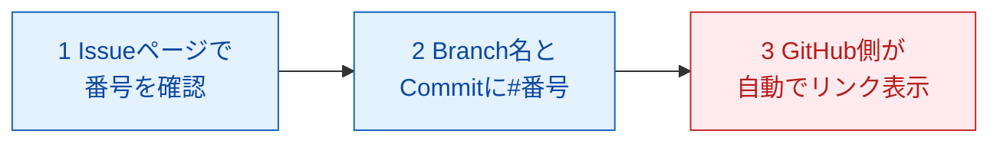

# 4-3：BranchとIssueを紐づける（AI先生用 内部台本）

## メタ情報

| 項目 | 内容 |
|---|---|
| レッスンID | MISSION-04-3 |
| Mission名 | BranchとIssueを紐づける |
| 対象LEVEL | LEVEL 4「GitHubでチーム開発」（コードネーム THE OFFICE） |
| 形式 | 圧縮形式 |
| 想定所要時間 | 20分 |
| XP | 80 |
| 付与スキル | GH |
| 前提 | Mission 4-2 完了（Issue Template と Labels がある） |
| このMissionの成果物 | Issue番号に対応したBranch（例：`feature/2-add-progress-days`） |
| 対になるopening | なし（Mission 4-2 と同一セッションのため、`opening-04-2.md` を先頭Missionとして1回だけ送信済み。本Missionのopeningは作らない） |

**このレッスンで扱う新出用語（最大3語）**：Issue参照（#番号） / 自動クローズ記法（Closes #番号） / Issue番号付きBranch名

## 参照ディレクティブ（進行AIが台本より先に読むもの）

- `docs/CONTEXT.md` §2（学習者プロフィールと環境）… 学習者名・OS・UI言語をここから取る
- `docs/CONTEXT.md` §4（観測されたつまずき）… 本レッスンで新たに再発を想定するつまずきは特にない。ただし新しいBranchを作るため、**#3**（Publish branch / Push origin の名称差）が再度現れる可能性がある
- `docs/CONTEXT.md` §5（教授方針）… 毎回必ず守る
- `content/metaphors.md` … 本レッスンで使う比喩：Issue＝業務依頼票、Branch＝正本はそのまま金庫に置き下書き用にコピーを1枚取ること（いずれもレジストリ登録済み。本レッスンはこの2つの比喩を**組み合わせる**だけで、新規の比喩は立てない）
- `content/level04/glossary-04.md` … 用語の4欄定義（用語IDは `04-3-` 接頭辞。**本レッスンは圧縮形式だが、学習者の理解定着のため STEP 1 に4欄カードも書き下ろしている**。glossaryと本文は同内容であり、片方だけを直さないこと）
- `content/level04/quizbank-04.md` … STEP6の問題バンク（`Q04-3-1〜3` を登録済み。本文の3問と同一）
- `content/level04/notional-machine-04.md` … STEP3の図（Mission 4-3 の節。本文にも同じ図を置いている。片方だけを直さないこと）

## 使い方メモ（進行AI向け・毎回読む）

- 答えを先に全部出さない。各STEPで「あなたはどう思いますか？」と予想を書かせてから解説する。
- 間違えていても、まず「どこまで合っていたか」を認めてから訂正する。**部分点で褒める。**
- ボタン名の表記ルール：**GitHub Desktop（英語UI）は英語表記のまま**（初出時のみ括弧で日本語訳を添える）。**github.com（日本語UI）は日本語表記＋括弧で英語原名**。例：`Commit to main`（メインに記録する）／`プルリクエストをマージする`（Merge pull request）。
- 初回だけ表示が変わる箇所・これから失敗する箇所は、**押す前に必ず 📢 予告する**。
- コードはAIが書き、学習者は「読む・予想する・直す・Gitで管理する」役割に徹する。大量の手入力はさせない。
- 学習者の環境は Mac / GitHub Desktop（英語UI）/ VS Code / github.com（日本語UI）。**`Cmd + S` の保存確認を省略しない。**
- 疲れの兆候（返信が短くなる・「とりあえず」が増える）が出たら、STEP4の途中でも区切ってSTEP7に飛んでよい。
- **本Missionは Mission 4-2 と同じセッションで続けて行う想定。** openingは送らないので、このSTEP 0 の質問2問を、進行AIが対話の中で**先に口頭出題**してから、届いた回答をここで答え合わせすること。
- Issue番号を書き間違えると別のIssueにリンクしてしまう。Branch名・Commit・PR本文のどこに書くときも、必ず対象のIssueページを開いて番号を目で確認してから書かせること。

---

## STEP 0：前回の想起（2分）

このMissionにはopeningが無い（Mission 4-2 と同一セッション）。進行AIが以下の質問2問を対話の中で先に口頭出題し、届いた回答をここで答え合わせする。**先に模範解答を送らない。**

**質問と模範解答（学習者には見せていない前提）**

1. Q. さっき（Mission 4-2で）`.github/ISSUE_TEMPLATE/` にファイルを置いたあと、動作を確かめる前にわざわざmainへMergeしたのはなぜでしたか？
   A. GitHubがIssue Templateを読みに行くのは **main（既定のブランチ）だけ**だから。ファイルを置いただけ・Branchに置いたままでは、`新しい Issue` を押しても選択画面に出てこない。「Branchはmainとは独立した作業スペース」（Mission 3-3）がここでも効いている。
2. Q. Labelsを増やしすぎると、なぜ良くないんでしたっけ？
   A. 選択肢が多いと毎回どれを貼ればいいか迷い、結局分類として機能しなくなるから。だから3〜5個に絞った。

**採点方針**：2問とも直前のMissionの結論が言えていればOK。曖昧でも**部分点で褒める**。「mainに入れないとダメなんだっけ」レベルの再現でも十分とする。誤答の場合は、正解を出す前に**合っていた部分を先に名指しする**。

---

## STEP 1：今日覚えること（3分）

今日の新しい言葉は **3つだけ** です。

### ① Issue参照（#番号）

| 観点 | 説明 |
|---|---|
| 正式な意味 | Issue・PR・Commitのメッセージ中に `#12` のように書くと、GitHub側が自動でIssue #12へのリンクに変換する記法 |
| 初学者向け説明 | 伝票番号（Issue番号）を、別の書類（PRやCommit）に書き添えると、自動でつながる仕組み |
| 現実世界での例え | 業務依頼票（Issueの比喩）の伝票番号を、対応する報告書に控えておくこと |
| 実際の開発で何に使うか | 「このBranch・このPRはどのIssueの作業か」が、後から誰にでも辿れるようになる |

### ② 自動クローズ記法（Closes #番号）

| 観点 | 説明 |
|---|---|
| 正式な意味 | PR本文またはCommit messageに `Closes #12` と書くと、そのPRがmainにMergeされた瞬間にIssue #12が自動でCloseされる記法 |
| 初学者向け説明 | 「この依頼は片付きました」という印を、PRがMergeされた瞬間に自動で押してくれる仕組み |
| 現実世界での例え | 業務依頼票を、完了と同時に自動で「完了済み」の引き出しに移してくれること |
| 実際の開発で何に使うか | Issueを手動でCloseし忘れることを防げる。ただし完了条件を満たしていないのに閉じてしまう危険もある（STEP3で扱う） |

### ③ Issue番号付きBranch名

| 観点 | 説明 |
|---|---|
| 正式な意味 | Mission 3-3の命名規則（`feature/` `fix/` `docs/`）に、Issue番号を足した命名（例：`feature/12-add-progress-days`） |
| 初学者向け説明 | 下書きコピー（Branch）の表紙に、対応する伝票番号（Issue番号）を書いておくこと |
| 現実世界での例え | 下書きコピー（Branchの比喩）に、対応する業務依頼票の番号を書き添えておくこと |
| 実際の開発で何に使うか | Branch名を見ただけで「どのIssueの作業か」が分かる。Mission 3-3のルールに1要素足すだけで、新しいルールを覚える必要はない |

> 💡 **今は覚えなくてよいこと**：複数のIssueを1つのPRでまとめてCloseする書き方、Milestoneとの連携、Projects上での自動移動設定。これらは後のMissionやLEVELで必要になったときに扱います。

---

## STEP 2：実際にやる（5分）

> 📢 **予告**：今日もBranchを新しく切ります。GitHubに送るボタンは初回だけ、いつもの `Push origin` ではなく **`Publish branch`（公開する）** という表示になります。前に見た表示と同じ現象なので、驚かなくて大丈夫です。

1. github.com（日本語UI）で、Mission 4-1で書いた自分のIssueの一覧を開き、対応させたい1件を選んでください。
2. Issueページの右上に表示されている番号（例：`#2`）を確認してください。
   - なぜ？：この番号を1文字でも間違えると、別のIssueにリンクしてしまう。
3. GitHub Desktopで `Current Branch`（現在のブランチ）が `main` になっていることを確認してください（Mission 4-2 の最後に `main` へ切り替えて `Pull origin` まで終えているはずです。なっていなければ `main` に切り替えて `Pull origin` を押してから進みます）。
   - なぜ？：新しいBranchは「今いるBranchのコピー」として作られる。古い状態や別の作業の途中から切ると、あとで余計な変更がPRに混ざる。
4. そのまま `Current Branch` → `New Branch`（新しいブランチ）。名前はMission 3-3の命名規則にIssue番号を足し、`feature/2-（作業内容を表す英単語）` のように入力して `Create Branch`（ブランチを作成）を押してください。
5. VS Codeで、対象のIssueの作業内容に沿ってファイルを編集してください。
6. **`Cmd + S` で保存してください**（保存を忘れると、次の手順で変更が何も表示されません）。
7. GitHub Desktopで `Commit to feature/2-…` を押してください。コミットメッセージの最後に `#2` と書き添えてください。
   - なぜ？：Commit messageに書いても、PR本文に書いても、`#番号` はGitHub上で自動的にIssueへのリンクになる。
8. 画面右上のボタン（**予告どおり** `Publish branch`）を押してください。
   - なぜ？：このBranchを公開しておくことで、次のMission 4-4 ではそのまま続きの作業に入れる。**4-4では同じボタンが `Push origin` に戻る**（今日ここで1回公開したため）。

> ⚠ **つまずきポイント**：Issue番号を確認せずに書くと、存在する別の番号のIssueに誤ってリンクしてしまいます（自分の作業は `#2` のはずが、うろ覚えで `#12` と書いてしまう、など）。書く前に必ずIssueページを開いて番号を目で確認してください。

---

## STEP 3：何が起きたか確認（2分）

**今、GitHub上で何が起きたのか。**



**重要なポイントが2つあります。**

1. Branch名に番号を入れただけでは、GitHubは自動でIssueとリンクしない。実際にリンクが張られるのは、Commit messageやPR本文に `#番号` と書いたときだけ。
2. `Closes #番号` は「Mergeされた瞬間」に効く。Branchを作った時点や、Commitしただけの時点ではまだIssueは閉じない。

**確認してみましょう：** Commitメッセージに `#2` と書いてPublishしたあと、対象のIssueページを開き、下部に「このCommitから参照されています」というリンクが表示されているか確かめてください。

---

> ### 🔍 なぜ？：なぜ自動クローズ記法を教えながら、同時にその危険性も教えるのか
>
> **ひとことで**：`Closes #番号` は便利ですが、完了条件を満たしていなくても、Mergeされた瞬間に機械的にIssueを閉じてしまうからです。
>
> **もう少し詳しく**：`Closes` はGitHubが「このPRの目的はこのIssueの解決だ」と自動で判断してCloseする機能で、人間が「本当に終わったか」を確認する工程を飛ばしてしまう可能性があります。Day2でPull Requestを扱ったとき、Issue #1は「v0.1の最小構成はできたが、完了条件をすべて満たしたか確認していない」という理由で、あえてCloseしませんでした。あの判断と同じ考え方が、今日の `Closes` 記法にも当てはまります。
>
> **設計思想まで**：本カリキュラムは「AIやツールに便利な自動化を渡すときほど、完了条件（Definition of Done）を先に固めておく」という考え方を一貫して置いています。Mission 4-1でIssueの5要素のうち「完了条件」が最も重要だと扱ったのも、同じ理由です。`Closes` は自動化の第一歩であり、ここで「便利だが取り返しがつきにくい操作もある」という感覚を持たせておくことが、LEVEL 15でAI Agentに仕事を任せるとき、「完了条件を曖昧にしたまま自動化を渡す危険」を理解する土台になります。実際にはIssueは再オープンできるので記録自体は取り消せますが、「閉じている」という誤った状態が、再オープンするまでの間ずっと他の人・他のAIに見えてしまう、という点は覚えておく必要があります。
>
> **では、いつ`Closes`を書いてはいけないか？** そのPRだけでIssueの完了条件をすべて満たせるか自信がないときです。迷ったら、`Closes` を書かずに本文に `#番号` とだけ書いて参照リンクだけを残し、確認が終わってから手動でCloseしてください。

---

## STEP 4：ミッション（4分）

**あなた自身でやってください。ヒントは最初に見ないでください。**

> 🎯 **今回のミッション**
>
> Mission 4-1で書いた自分のIssueのうち1件を選び、対応するBranchを命名規則どおりに切ってください。実際にファイルを1つ編集し、Commit messageにIssue番号を書き添えるところまでがゴールです（PRの作成は次のMission 4-4で行います）。
>
> 条件：
> - Branch名は `feature/` `fix/` `docs/` のいずれかに、Issue番号を足した形にすること
> - Commit messageに `#番号` を書き添えること

<details><summary>💡 ヒント1：方向（どこを見るか）</summary>

github.comの自分のIssue一覧と、Issueページ右上の番号を見てください。
</details>

<details><summary>💡 ヒント2：手順（何をするか）</summary>

1. 対応させたいIssueを1件選び、番号を確認する
2. `New Branch`（新しいブランチ）で、番号入りの名前をつけて作成する
3. 何か1つファイルを編集してCommitし、メッセージに `#番号` を書き添える

（それぞれの手順でどんな画面になるかは、ここでは言いません）
</details>

<details><summary>💡 ヒント3：答え（完全な手順）</summary>

例：Issue #2「学習アプリの表記を直す」を選んだ場合。`Current Branch` → `New Branch` → `feature/2-fix-typo` → `Create Branch`。VS Codeで対象ファイルを編集し `Cmd + S`。GitHub Desktopで `Commit to feature/2-fix-typo`、コミットメッセージ例：「表記を修正（#2）」。右上のボタン（`Publish branch`）を押す。
</details>

**採点方針**：Branch名にIssue番号が入っていて、Commit messageにも `#番号` が書けていれば通過。**ヒントを開いてもクリア扱い（減点なし）。**

---

## STEP 5：AIサポート（3分）

**まず、あなた自身の考えを書いてください。**（この欄が埋まるまで先に進みません）

> **★Q. もしPR本文に `Closes #2` と書いた状態でMergeしたのに、実は作業がまだ半分しか終わっていなかったら、何が起きると思いますか？**
>
> [　　　　　　　　　　　　　　　　　　　　　　　　　　]

**仮説が書けないときに提示する選択肢（進行AI用）**
- (a) GitHubがMergeを拒否してくれる
- (b) Issue #2が自動でCloseされてしまうが、中身は未完了のまま
- (c) 何も起きない（`Closes` は効かない）
- (d) 自動的に新しいIssueが作られる

書けたら、AIに聞いてみましょう。

#### ❌ 悪い質問

> Closesってどう使うんですか

自分が今どのIssueに対して何をしたいのかが書かれていないので、AIは一般的な文法しか返せません。

#### ✅ 良い質問（8項目テンプレート適用）

```
【目的】Issue #2 に対応するBranchとCommitを作り、後から辿れる状態にしたい
【現在の状態】Branch名に#2を入れ、Commit messageにも#2と書いた。まだPRは作っていない
【環境】Mac / GitHub Desktop（英語UI）/ VS Code / github.com（日本語UI）
【再現手順】まだ実行していない。PR本文にClosesと書くべきか判断したい
【エラー全文】エラーメッセージは出ていない。判断に迷っている状態
【自分の仮説】★必須 完了条件を全部満たしていない場合は、Closesを書かない方がいい気がする
【制約】Issue #2の完了条件を勝手に変えない
【完了条件】Closesをつけるべきかどうかを、AIと一緒に判断できること
```

**このMissionで詰まったときに投げるプロンプト例**（進行AIが提示する）
- 「Commit messageに書いた `#2` と、PR本文に書く `Closes #2` は何が違いますか？」
- 「今のBranch名がIssue番号と合っているか、命名規則的に確認してください。」
- 「このIssueは今日 `Closes` を書くべきタイミングですか、まだ早いですか？」

> 💡 **なぜ仮説を書かせるのか？**
> 仮説を立ててから答え合わせをすると、「合っていた／違っていた」という差分が記憶に残ります。仮説なしに正解だけ読むと分かった気になりますが、翌日には残りません。この手順は本カリキュラム全体を通じて必須です。

この8項目は、Mission 4-1の「Issueの5要素」と同じ形をしています。この同型性は、LEVEL 15でAI Agentに指示を出すときにも繋がっていきます。

---

## STEP 6：理解チェック（2分）

暗記ではなく「なぜそうするのか」を確認します。

**Q1.** Commit messageに `#2` とだけ書いた場合と、`Closes #2` と書いた場合、Issueの動きはどう違いますか？

<details><summary>解答</summary>
`#2` だけならリンクが張られるだけでIssueは閉じない。`Closes #2` はPRがMergeされた瞬間にIssueが自動でCloseされる。
</details>

**Q2.** 完了条件を満たしていない状態で `Closes #12` と書いてMergeしてしまったら、どうなりますか？

<details><summary>解答</summary>
Issueが自動でCloseされてしまうが、中身は未完了のまま。あとから気づいて再オープンすることはできるが、閉じている間は他の人・AIに「終わった」と見えてしまう。
</details>

**Q3.** Branch名にIssue番号を入れる理由は、Mission 3-3の命名規則とどう関係していますか？

<details><summary>解答</summary>
新しいルールを覚えるのではなく、既存の `feature/` `fix/` `docs/` という規則に、Issue番号を1要素足しただけ。Branch名を見ただけで、どの依頼に対応する作業かが辿れるようになる。
</details>

**採点方針**：3問中2問の趣旨が言えていれば通過。**言葉が正確でなくても、現象の因果が説明できていれば正解扱いにする。** 誤答は復習対象として STEP7 の成長ログ項目3に書かせる。

---

## STEP 7：GitHubへ記録（2分）

**1. Commit message の型**

```
LEVEL 4: {{何をしたか}}（#{{Issue番号}}）
```

例：`LEVEL 4: 学習アプリの表記を修正（#2）` / `LEVEL 4: READMEにセットアップ手順を追記（#3）`

**2. 成長ログを追記する**：`notes/log/{{YYYY-MM-DD}}.md`（Mission 4-2の分と同じ日付のファイルに続けて追記してよい）

```markdown
## {{YYYY-MM-DD}}  LEVEL 4 / Mission 4-3

### 1. やったこと（事実）
{{}}

### 2. 理解したこと（自分の言葉で）
{{教材の丸写し禁止}}

### 3. まだ分かっていないこと ★空欄保存不可
{{}}

### 4. 詰まった箇所と、詰まっていた時間
{{}}

### 5. 発生したエラー
{{なければ「なし」}}

### 6. AIに何と質問したか（開いたヒントの段階も書く）
{{}}

### 7. AIの回答は正しかったか
{{}}

### 8. 明日の自分への申し送り
{{}}
```

> ⚠ **つまずきポイント**：このリポジトリは **public** です。成長ログに実名・所属・住所・APIキー・トークンを書かないでください。一度Pushした記録は取り消しても痕跡が残ります。

**3. 記録すべき成果物**

- Issue番号に対応したBranch（例：`feature/2-fix-typo`）
- `#番号` を書き添えたCommit

**4. CONTEXT.md の更新**（学習者に確認してから追記する）
- §3「現在の到達点」に `Mission 4-3 完了` を追記
- 新しく詰まった点があれば §4 の表に1行追加（**消さずに残す**）

---

### 🎉 Mission 完了

> **あなたは今、どの作業がどの依頼（Issue）に対応するかを、後から誰でも辿れる状態にできるようになりました。**
> これは前回までは、Branchの名前とIssueが頭の中でしか繋がっていなかったことです。
>
> この技能は、次のMission 4-4（Pull Requestを出す）でPR本文に `Closes #番号` を書くとき、そしてLEVEL 15でAI Agentが同じ仕組みを使うときの土台になります。
>
> 成果物：Issue番号付きBranch / `#番号` を書き添えたCommit
> 次：**Mission 4-4「Pull Requestを出す」** — まず `content/level04/opening-04-4.md` を開いてください（今作ったBranchはGitHub Desktopでそのままにしておきます）。
>
> GH +80 XP

---

## 制作メモ（進行AIは学習者に見せない。受講テスト後に埋める）

| 項目 | 内容 |
|---|---|
| 想定所要時間 vs 実測 | {{分 / 分}} |
| 実際に詰まった箇所 | {{}} |
| 予告が足りなかった箇所 | {{}} |
| 新たに観測したつまずき（CONTEXT.md §4 へ転記したか） | {{}} |
| 比喩レジストリに追加した比喩 | {{}} |
| 次回改訂の候補 | {{}} |
