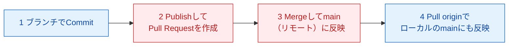

# 4-4：Pull Requestを出す（AI先生用 内部台本）

## メタ情報

| 項目 | 内容 |
|---|---|
| レッスンID | MISSION-04-4 |
| Mission名 | Pull Requestを出す |
| 対象LEVEL | LEVEL 4「GitHubでチーム開発」（コードネーム THE OFFICE） |
| 形式 | 圧縮形式 |
| 想定所要時間 | 25分 |
| XP | 100 |
| 付与スキル | GH |
| 前提 | Mission 4-3 完了（Issue番号付きBranchで作業中） |
| このMissionの成果物 | PR本文の3点が書かれたPR 1件（Merge済み）／CloseされたIssue 1件 |
| 対になるopening | `content/level04/opening-04-4.md` |

**このレッスンで扱う新出用語（最大3語）**：PR本文の3点（何を・なぜ・どう確認したか） / Review / Draft PR

## 参照ディレクティブ（進行AIが台本より先に読むもの）

- `docs/CONTEXT.md` §2（学習者プロフィールと環境）… 学習者名・OS・UI言語をここから取る
- `docs/CONTEXT.md` §4（観測されたつまずき）… 本レッスンで再発しうるのは **#1**（Dropbox的な自動同期の誤解）、**#3**（Publish branch / Push origin の名称差）
- `docs/CONTEXT.md` §5（教授方針）… 毎回必ず守る
- `content/metaphors.md` … 本レッスンで使う比喩：Pull Request＝「この内容を正本に反映していいですか」と提出する回覧書、Review＝上司の検収・品質確認（いずれもレジストリ登録済み）。Draft PRは新しい比喩を立てず、登録済みのPull Request（回覧書）の比喩の**下書き版**として説明する
- `content/level04/glossary-04.md` … 用語の4欄定義（用語IDは `04-4-` 接頭辞。**本レッスンは圧縮形式だが、学習者の理解定着のため STEP 1 に4欄カードも書き下ろしている**。glossaryと本文は同内容であり、片方だけを直さないこと）
- `content/level04/quizbank-04.md` … STEP6の問題バンク（`Q04-4-1〜3` を登録済み。本文の3問と同一）
- `content/level04/notional-machine-04.md` … STEP3の図（Mission 4-4 の節。本文にも同じ図を置いている。片方だけを直さないこと）

## 使い方メモ（進行AI向け・毎回読む）

- 答えを先に全部出さない。各STEPで「あなたはどう思いますか？」と予想を書かせてから解説する。
- 間違えていても、まず「どこまで合っていたか」を認めてから訂正する。**部分点で褒める。**
- ボタン名の表記ルール：**GitHub Desktop（英語UI）は英語表記のまま**（初出時のみ括弧で日本語訳を添える）。**github.com（日本語UI）は日本語表記＋括弧で英語原名**。例：`Commit to main`（メインに記録する）／`プルリクエストをマージする`（Merge pull request）。
- 初回だけ表示が変わる箇所・これから失敗する箇所は、**押す前に必ず 📢 予告する**。
- コードはAIが書き、学習者は「読む・予想する・直す・Gitで管理する」役割に徹する。大量の手入力はさせない。
- 学習者の環境は Mac / GitHub Desktop（英語UI）/ VS Code / github.com（日本語UI）。**`Cmd + S` の保存確認を省略しない。**
- 疲れの兆候（返信が短くなる・「とりあえず」が増える）が出たら、STEP4の途中でも区切ってSTEP7に飛んでよい。
- Squash Mergeの設定はMission 3-4で完了済み。設定画面を開かせたり、Merge方式を選ばせたりしない。ボタンは1種類しか出ないことを前提に進める。
- github.comのPR説明欄は空のまま送信できてしまう。「書き終えましたか？」と声に出して確認してから、作成ボタンを押させる（Day2でPR本文を書かずに出してしまった反省点そのもの）。

---

## STEP 0：前回の想起（3分）

opening（`opening-04-4.md`）で既に出題済み。回答が届いたら、ここで答え合わせをする。**先に模範解答を送らない。**

**質問と模範解答（学習者には見せていない前提）**

1. Q. Mission 4-3で、Branch名にIssue番号を入れる理由は何でしたか？
   A. あとから「どの作業がどの依頼（Issue）に対応するか」を辿れるようにするため。Mission 3-3で決めた `feature/` `fix/` `docs/` の命名規則に、Issue番号を足しただけ（新しいルールではなく、既存ルールへの追加）。
2. Q. PRの本文に `Closes #12` と書くと、Mergeしたときに何が起きるんでしたっけ？
   A. そのIssueが自動でClose（クローズ）される。ただし完了条件を満たしていないのに閉じてしまう危険もあるので、本当に完了しているときだけ書く、という注意も一緒に扱った。

**採点方針**：2問とも「命名規則へのIssue番号の追加」「自動Close」という骨格が言えていればOK。曖昧でも**部分点で褒める**。「番号つけると分かるやつだ」「閉じるやつだっけ」レベルの再現でも十分とする。誤答の場合は、正解を出す前に**合っていた部分を先に名指しする**。

---

## STEP 1：今日覚えること（3分）

今日の新しい言葉は **3つだけ** です。

### ① PR本文の3点（何を・なぜ・どう確認したか）

| 観点 | 説明 |
|---|---|
| 正式な意味 | Pull Requestの説明欄（Description）に書く、変更内容・判断理由・検証方法の3項目 |
| 初学者向け説明 | 「何をしたか」「なぜそうしたか」「ちゃんと動くか、どう確かめたか」の3行を書くだけ |
| 現実世界での例え | 回覧書（Pull Requestの比喩）の表紙に添える一言メモ。ハンコをもらう前に「これは何のための書類で、なぜこの内容にしたか、どう確認済みか」を一言添えておくと、確認する側がすぐ判断できる |
| 実際の開発で何に使うか | レビューする人（未来の自分・チームメイト・将来のAI）が、コードを1行も読まなくても「この変更が何のためのものか」を把握できる。LEVEL 15でAI Agentが作るPRも、同じ3点構成になるよう設計されている |

### ② Review（レビュー）

| 観点 | 説明 |
|---|---|
| 正式な意味 | 提出された変更内容を、正本に反映する前に確認すること |
| 初学者向け説明 | 「この内容で本当に大丈夫か」を誰か（または自分）がチェックする工程 |
| 現実世界での例え | 上司の検収・品質確認（レジストリ登録済み） |
| 実際の開発で何に使うか | Mission 4-5で、自分自身のレビューとAIのレビューを比較する。今日はまず、自分でPRを読み返すセルフレビューだけをやる |

### ③ Draft PR（下書きプルリクエスト）

| 観点 | 説明 |
|---|---|
| 正式な意味 | 通常のPull Requestとは別に、「まだレビュー準備ができていない」ことを示す状態で作成できるPR |
| 初学者向け説明 | 回覧書の下書き版。正式に提出する前に「途中経過ですが、方向性は合っていますか？」と机の上に置いておく仮の回覧 |
| 現実世界での例え | 回覧書（Pull Requestの比喩）の下書き版 |
| 実際の開発で何に使うか | 作業途中でも早めにチームに共有したいときに使う。**今日は使わない**（今日のPRは最初から正式版として作る）。名前だけ知っておく |

> 💡 **今は覚えなくてよいこと**：Draft PRの実際の使い方、Reviewの詳しい手順（Mission 4-5でAIレビューと比較します）、Branch protectionの設定（Mission 4-6で扱います）。これらはまだ知らなくても今日の作業はできます。

---

## STEP 2：実際にやる（6分）

> 📢 **予告**：**このBranchは Mission 4-3 ですでに `Publish branch` を1回押しています。** そのため今日は、右上のボタンの表示が `Publish branch` ではなく、いつもの **`Push origin`（発送する）** に戻っています。「公開する」ボタンを探しても見つからなくて正常です。`Publish branch` は「まだGitHub上に無いブランチを初めて公開する」ときだけの表示でした（Mission 3-5 でも同じ確認をしています）。

1. GitHub Desktopで `Current Branch`（現在のブランチ）が、Mission 4-3 で作ったIssue番号付きのBranch（例：`feature/2-fix-typo`）になっていることを確認してください。`main` になっていたら、そのBranchに切り替えてください。
   - なぜ？：mainのまま編集すると、PRを出す相手のBranchが無くなる。編集の前に `Current Branch` を確認する習慣は Mission 3-3 で作ったもの。
2. VS Codeで、Mission 4-3で選んだIssueの完了条件に沿って、実際の変更を1箇所加えてください（何を変えるかは、自分が書いたIssueの内容に従います）。
3. **`Cmd + S` で保存してください**（保存を忘れると、次の手順で変更が何も表示されません）。
4. GitHub Desktopに戻り、`Changes` タブで変更内容を確認してください。
   - なぜ？：Commitする前に「何を送ろうとしているか」を必ず自分の目で確認する習慣をつける。
5. 左下の要約欄にCommit messageを書き、`Commit to <ブランチ名>` ボタンを押してください。
6. 画面右上の `Push origin`（発送する）ボタンを押してください。
7. Push完了後、同じ場所に `Create Pull Request` が出るのでクリックしてください（ブラウザでgithub.comが開きます。このあとgithub.com上で押す緑色のボタンとは別の、GitHub Desktop側のボタンです）。
   <!-- 実地確認要：GitHub Desktop のバージョンによっては、この位置のボタンが `Preview Pull Request` と表示される（押すと差分プレビューを挟んでからブラウザが開く）。受講テスト時に実際の表示を確認し、違っていれば制作メモに記録して本文のボタン名を修正すること。見つからない場合の代替手順は `Branch` メニュー → `Create Pull Request`。 -->
8. github.com（日本語UI）でタイトルを確認し、説明欄（Description）に次の3点を書いてください。

   ```
   ## 何を

   ## なぜ

   ## どう確認したか

   Closes #（Issue番号）
   ```
   - なぜ？：Day2でもPRは作ったが、この説明欄は空のまま出していた。今日はそこを埋める回。
9. 書き終えたら、緑色の `プルリクエストを作成する`（Create pull request）ボタンを押してください。
10. PRのページで、自分が書いた3点をもう一度読み返してください（これが今日のセルフレビュー）。
11. 問題なければ `スカッシュしてマージする`（Squash and merge）ボタン → `マージを確定する`（Confirm squash merge）ボタンの順に押してください。
    - なぜ？：Squash Mergeの設定はMission 3-4で済んでいるので、選べる方式は1つだけ。Mission 3-4 で見たのと同じ表示になる。設定はここでは触らない。
12. GitHub Desktopに戻り、`Current Branch` を `main` に切り替えてください。

> ⚠ **つまずきポイント**：ここで `Pull origin` を押し忘れると、GitHub上（リモート）のmainは最新でも、自分のパソコン（ローカル）のmainは古いままになります。この状態に気づかず次のBranchを切ると、古い状態からコピーを作ってしまいます。郵送で言えば「発送」までは終わったが「受け取り」がまだ、という状態です（過去のつまずき#1「同期ではなく郵送」の最後の一手）。

13. 上部に出る `Pull origin` ボタンを押してください。

---

## STEP 3：何が起きたか確認（3分）

**今、GitHub上（リモート）と自分のパソコン上（ローカル）で何が起きたのか。**



**重要なポイントが3つあります。**

1. Mergeした瞬間に変わるのはGitHub上（リモート）のmainだけ。自分のパソコン（ローカル）のmainはまだ古いまま。`Pull origin` して初めて追いつく。GitHubはDropboxのように自動で同期しない、というあの話が、ここでも成り立つ。
2. PR本文に書いた「何を・なぜ・どう確認したか」は、Mergeされて画面から見えなくなったあとも、GitHub上の記録として残り続ける。
3. `Closes #（番号）` と書いておいたIssueは、Mergeが完了した瞬間に自動でClose（クローズ）される。

**確認してみましょう：** github.comでIssueのページを開き、「Closed」の表示になっているか確認してください。

---

> ### 🔍 なぜ？：なぜPR本文に「何を・なぜ・どう確認したか」を書く必要があるのか
>
> **ひとことで**：コードを読まなくても、その変更の意味がわかるようにするためです。
>
> **もう少し詳しく**：コード自体（差分）は「何が変わったか」は教えてくれますが、「なぜその判断をしたか」までは教えてくれません。PR本文にその3点を書いておくと、レビューする人（未来の自分・チームメイト・将来のAI）が、差分を1行ずつ読まなくても変更の妥当性を判断できます。
>
> **設計思想まで**：本カリキュラムでは、1人開発の段階からPR本文を書く習慣を作る設計になっています。理由は主に3つあります。第一に、Issueの5要素（Mission 4-1）・AIへの質問8項目（STEP 5で毎回使うもの）・PR本文の3点は、実は同じ構造の繰り返しです。この繰り返しによって「依頼と報告の型」が体に染み込みます。第二に、LEVEL 15でAI Agentが実際にコードを書きPRを出す段階になったとき、Agentが作るPR本文も同じ3点構成になるよう設計されています。人間が先にこの型を自分の手で書けていないと、Agentの報告が正しいかどうかを判断する基準を持てません。第三に、記録として残ったPR本文は、数か月後の自分が「なぜこう実装したか」を思い出すための最短の手がかりになります。差分だけを読み返しても、判断の理由までは分からないからです。
>
> **では、いつPR本文の3点をやってはいけないか？** 誤字修正など、判断の余地がなく検証も一目でわかる極小の変更まで、毎回3点フルセットで書く必要はありません。その場合は「何を」だけ一言書けば十分です。3点セットは「後から見て判断の理由が必要になる変更」にこそ効きます。

---

## STEP 4：ミッション（5分）

**あなた自身でやってください。ヒントは最初に見ないでください。**

> 🎯 **今回のミッション**
>
> Mission 4-3で切ったBranchに実際の変更を1つ加え、PR本文に「何を・なぜ・どう確認したか」の3点を自分で書いてPull Requestを作成し、Mergeまで行ってください。
>
> 条件：
> - PRの説明欄（Description）に「何を・なぜ・どう確認したか」の3点が入っていること
> - `Closes #（Issue番号）` と書き、Merge後にそのIssueが自動でClose（クローズ）されていること
> - Mergeのあと、GitHub Desktopでmainに切り替えて `Pull origin` まで終えること

<details><summary>💡 ヒント1：方向（どこを見るか）</summary>

GitHub Desktopの画面上部にある `Current Branch` の表示と、github.comのPRページの説明欄（Description）を見てください。
</details>

<details><summary>💡 ヒント2：手順（何をするか）</summary>

1. `Current Branch` が Mission 4-3 のBranchであることを確認する
2. VS Codeで変更を加え、`Cmd + S` で保存する
3. GitHub DesktopでCommitし、`Push origin` を押す（このBranchは4-3で公開済みなので `Publish branch` にはならない）
4. `Create Pull Request` から github.com に移動し、説明欄に3点と `Closes #（番号）` を書く
5. `プルリクエストを作成する` を押し、読み返してから `スカッシュしてマージする` → `マージを確定する` を押す
6. GitHub Desktopで `Current Branch` を `main` に切り替え、`Pull origin` を押す

（それぞれの手順でどんな画面になるかは、ここでは言いません）
</details>

<details><summary>💡 ヒント3：答え（完全な手順）</summary>

1. `Current Branch` が Mission 4-3 で作ったBranch（例：`feature/2-fix-typo`）になっていることを確認する。
2. VS CodeでIssueの完了条件に沿った変更を1箇所加え、`Cmd + S`。
3. GitHub Desktopの `Changes` タブで確認し、Commit messageを書いて `Commit to <ブランチ名>`。
4. 右上のボタン（`Push origin`）を押す。
5. `Create Pull Request` が出たらクリックし、github.comを開く。
6. 説明欄に以下のように書く。

   ```
   ## 何を
   READMEに〇〇の説明を追記した

   ## なぜ
   Issue #12で「〇〇が分かりにくい」と指摘されていたため

   ## どう確認したか
   github.com上でファイルのプレビュー表示を確認した

   Closes #12
   ```
7. `プルリクエストを作成する`（Create pull request）を押す。
8. 内容を読み返してから `スカッシュしてマージする`（Squash and merge）→ `マージを確定する`（Confirm squash merge）を押す。
9. GitHub Desktopで `Current Branch` を `main` に切り替え、`Pull origin` を押す。
10. github.comでIssueが「Closed」になっているか確認する。
</details>

**採点方針**：PR本文に3点が入っていて、Mergeと `Pull origin` まで終わっていればクリア。**ヒントを開いてもクリア扱い（減点なし）。** 部分的にできていれば、できた部分（例：PRを作れた、3点のうち2点書けた）を先に名指しして認めてから、残りを一緒に片付ける。

---

## STEP 5：AIサポート（3分）

**まず、あなた自身の考えを書いてください。**（この欄が埋まるまで先に進みません）

> **★Q. Mergeボタンを押した直後、github.com上ではmainの内容が新しくなっているのに、あなたのVS Codeで開いているファイルの中身はまだ変わっていません。なぜだと思いますか？**
>
> [　　　　　　　　　　　　　　　　　　　　　　　　　　]

**仮説が書けないときに提示する選択肢（進行AI用）**
- (a) VS Code自体が壊れている
- (b) まだ `Pull origin` を実行していないから
- (c) Merge自体が失敗している
- (d) `Current Branch` をmainに切り替えていないから

書けたら、AIに聞いてみましょう。

#### ❌ 悪い質問

> Mergeしたのに反映されません。なぜですか？

状況（どの画面で・何を見て「反映されていない」と判断したか）が書かれていないので、AIは「キャッシュの可能性があります」のような一般論しか返せません。

#### ✅ 良い質問（8項目テンプレート適用）

```
【目的】github.com上でMergeした変更を、自分のパソコン上でも見えるようにしたい
【現在の状態】github.comのmainには変更が反映されているが、VS Codeで開いているファイルの中身は古いまま
【環境】Mac / GitHub Desktop（英語UI）/ VS Code / github.com（日本語UI）
【再現手順】github.comで「マージを確定する」を押した → VS Codeでファイルを開き直しても内容が変わらない
【エラー全文】エラーメッセージは出ていない。ファイルの中身が古いままという症状
【自分の仮説】★必須 GitHub Desktopで Pull origin をまだ押していないからだと思う
【制約】mainブランチ以外は触らない
【完了条件】VS Code上のファイルの内容が、github.com上の最新のmainと一致すること
```

**このMissionで詰まったときに投げるプロンプト例**（進行AIが提示する）
- 「`スカッシュしてマージする` を押したのに、VS Code上のファイルが変わりません。原因を教えてください。」
- 「PR本文の『なぜ』の欄に何を書けばいいかわかりません。私がやった変更は〇〇です。書き方の例を教えてください。」
- 「`Closes #12` と書いてMergeしたのに、Issueがまだ開いたままです。何を確認すればいいですか？」

> 💡 **なぜ仮説を書かせるのか？**
> 仮説を立ててから答え合わせをすると、「合っていた／違っていた」という差分が記憶に残ります。仮説なしに正解だけ読むと分かった気になりますが、翌日には残りません。この手順は本カリキュラム全体を通じて必須です。

この8項目は、Mission 4-1の「Issueの5要素」と同じ形をしています。この同型性は、LEVEL 15でAI Agentに指示を出すときにも繋がっていきます。

---

## STEP 6：理解チェック（3分）

暗記ではなく「なぜそうするのか」を確認します。

**Q1.** MergeボタンとPull originボタンの、両方を押す必要があるのはなぜですか？

<details><summary>解答</summary>
Mergeで変わるのはGitHub上（リモート）のmainだけで、自分のパソコン（ローカル）のmainには自動で届かないから。郵送と同じで、「発送」の次に「受け取り」の手順が別に必要になる。
</details>

**Q2.** PR本文に「なぜ」を書かないと、あとで何に困りますか？

<details><summary>解答</summary>
差分（コード）を見ても、その判断をした理由まではわからない。数か月後の自分や、将来コードを読むAIが、その変更が正しかったのかを判断する手がかりを失う。
</details>

**Q3.** `Closes #12` と書いてMergeしたあと、実は完了条件を満たしていなかったとわかったらどうすればいいですか？

<details><summary>解答</summary>
Issueを開き直す（Reopen）、または新しいIssueとして足りない作業を書き直す。`Closes` は自動でClose（クローズ）してくれる便利な機能だが、完了条件を満たしているかどうかの最終判断は、常に自分でする必要がある。
</details>

**採点方針**：3問中2問の趣旨が言えていれば通過。**言葉が正確でなくても、現象の因果が説明できていれば正解扱いにする。** 誤答は復習対象として STEP7 の成長ログ項目3に書かせる。

---

## STEP 7：GitHubへ記録（3分）

**1. Commit message の型**

```
LEVEL 4: {{何をしたか}}（{{対象ファイル or 機能}}）
```

例：`LEVEL 4: READMEにセットアップ手順を追記（README.md）` / `LEVEL 4: notes/level03-cliの誤字を修正（notes/level03-cli.md）`

**2. 成長ログを追記する**：`notes/log/{{YYYY-MM-DD}}.md`

```markdown
## {{YYYY-MM-DD}}  LEVEL 4 / Mission 4-4

### 1. やったこと（事実）
{{}}

### 2. 理解したこと（自分の言葉で）
{{教材の丸写し禁止}}

### 3. まだ分かっていないこと ★空欄保存不可
{{}}

### 4. 詰まった箇所と、詰まっていた時間
{{}}

### 5. 発生したエラー
{{なければ「なし」}}

### 6. AIに何と質問したか（開いたヒントの段階も書く）
{{}}

### 7. AIの回答は正しかったか
{{}}

### 8. 明日の自分への申し送り
{{}}
```

> ⚠ **つまずきポイント**：このリポジトリは **public** です。成長ログに実名・所属・住所・APIキー・トークンを書かないでください。一度Pushした記録は取り消しても痕跡が残ります。

**3. 記録すべき成果物**

- 今日Mergeしたプルリクエストへのリンク（github.com上のPRページURL）
- CloseされたIssueへのリンク

**4. CONTEXT.md の更新**（学習者に確認してから追記する）
- §3「現在の到達点」に `Mission 4-4 完了` を追記
- 新しく詰まった点があれば §4 の表に1行追加（**消さずに残す**）

---

### 🎉 Mission 完了

> **あなたは今、Issue → Branch → PR → Merge の完全な1周を、自分の手で最初から最後までできるようになりました。**
> これはDay2で部分的に体験したことを、記録の質（PR本文の3点）まで含めて完成させたものです。
>
> この流れは、LEVEL 15 で AI Agent が同じ道を通ることになる仕組みそのものです。
>
> 成果物：今日のPR（Merge済み） / CloseされたIssue
> 次：**Mission 4-5「AIにレビューさせる」** — まず今日マージしたPRを開いてください。（このあとのバッチ予告：4-6「mainを守る」では自分がpushできなくなりますが、それが成功です／4-7「学習バックログを作る」／BOSS 2 GITHUB）
>
> GH +100 XP

---

## 制作メモ（進行AIは学習者に見せない。受講テスト後に埋める）

| 項目 | 内容 |
|---|---|
| 想定所要時間 vs 実測 | {{分 / 分}} |
| 実際に詰まった箇所 | {{}} |
| 予告が足りなかった箇所 | {{}} |
| 新たに観測したつまずき（CONTEXT.md §4 へ転記したか） | {{}} |
| 比喩レジストリに追加した比喩 | {{}} |
| 次回改訂の候補 | {{}} |
