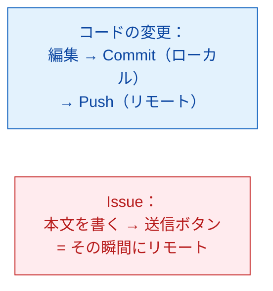
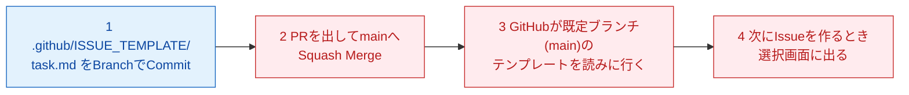
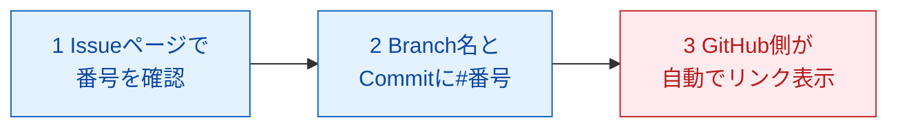
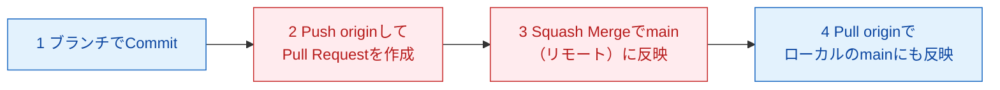

# notional-machine-04.md ― LEVEL 4 Mermaid図（圧縮形式で再掲用）

> 圧縮形式のレッスンが参照する正典。各レッスンの図をここに集約していく。
> **収録範囲：Mission 4-1〜4-4（本バッチ分）。** Mission 4-5〜4-7 と BOSS 2 の図は、次バッチ制作時にここへ追記すること。
> 配色規約：ローカル＝青系（`local`）、リモート＝赤系（`remote`）。
> 各Missionの台本本文にも同じ図がある場合、**本ファイルが正典**であり、両者は一致していなければならない（片方だけを直さない）。
>
> **更新履歴**：2026-08-16 レビューで、本ファイルが未作成のまま Mission 4-1 の STEP 3 から参照されていた（参照切れ）ため新規作成。

## Mission 4-1：Issueには「ローカル→リモート」の二段階が無い

Mission 4-1 の台本には図を置いていない。**理由を明示しておく**：Issueはコード変更と違い「手元に一旦置いてから発送する」という内部状態を持たず、`新しい issue の送信`（Submit new issue）を押した瞬間にGitHub上へ反映されるため、状態遷移として描くべき中間段階が存在しない。

図に代えて、この対比だけを口頭で確認する。

重要なポイント：
1. Issueには「ローカルに置いてから送る」段階が無い。送信ボタンを押した瞬間に公開される（**public リポジトリなので、書く前に内容を一度確認する**）。
2. 新しいIssueには自動で通し番号（`#2`、`#3`…）が振られる。この番号を Mission 4-3 でBranchやPRと紐づける。

## Mission 4-2：Issue Template は「main に置かれて初めて」効く

重要なポイント：
1. ファイルを置いただけでは何も起きない。GitHub側が「次にIssueを作るとき」に初めて読みに行く。
2. **読みに行く先は既定ブランチ（main）。** Branchに置いたままでは選択画面に出ない（Mission 3-3「Branchはmainとは独立した作業スペース」の再確認）。
3. テンプレートは強制ではない。`空の issue を開く`（Open a blank issue）を選べば白紙からも書ける。

## Mission 4-3：番号を書くまでIssueとはつながらない

重要なポイント：
1. Branch名に番号を入れただけでは、GitHubは自動でIssueとリンクしない。リンクが張られるのは、Commit messageやPR本文に `#番号` と書いたときだけ。
2. `Closes #番号` は「Mergeされた瞬間」に効く。Branchを作った時点やCommitしただけの時点では、まだIssueは閉じない。

## Mission 4-4：Issue → Branch → PR → Merge → Pull の1周

重要なポイント：
1. Mergeした瞬間に変わるのはGitHub上（リモート）のmainだけ。ローカルのmainは `Pull origin` して初めて追いつく（同期ではなく郵送。CONTEXT.md §4 #1）。
2. PR本文に書いた「何を・なぜ・どう確認したか」は、Mergeされて画面から見えなくなったあともGitHub上の記録として残り続ける。
3. `Closes #番号` と書いておいたIssueは、Mergeが完了した瞬間に自動でCloseされる。
