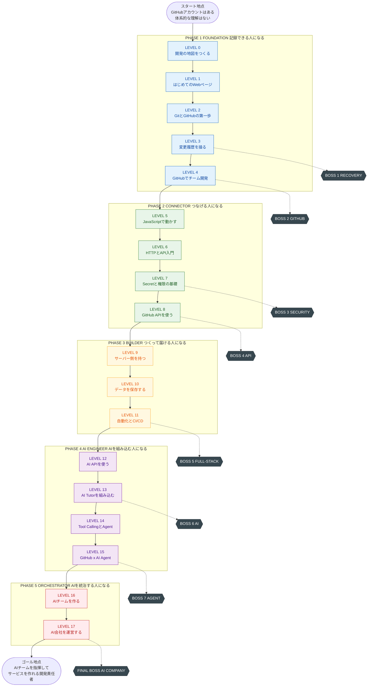
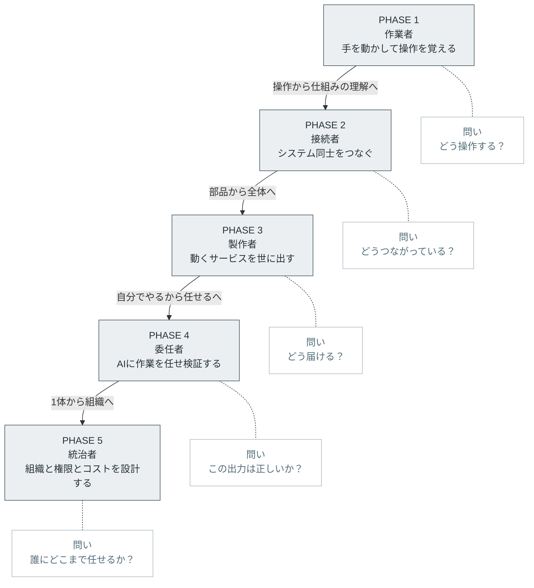
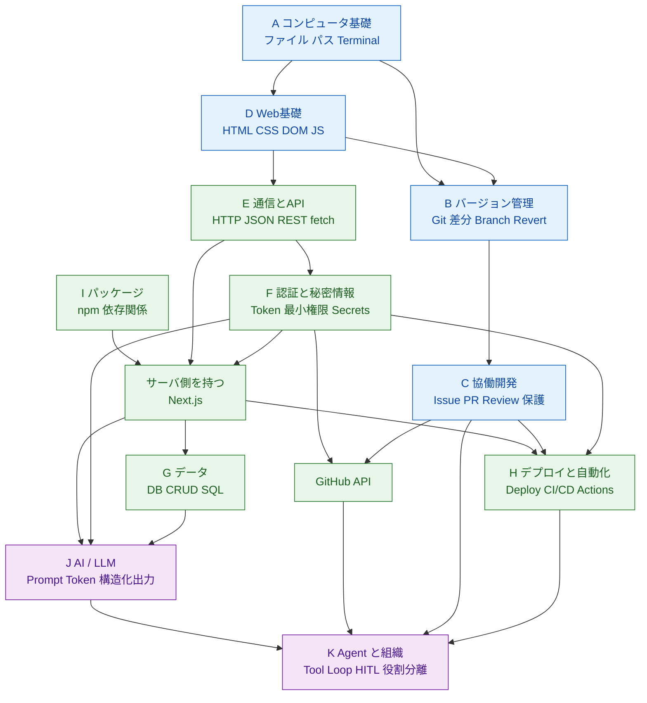
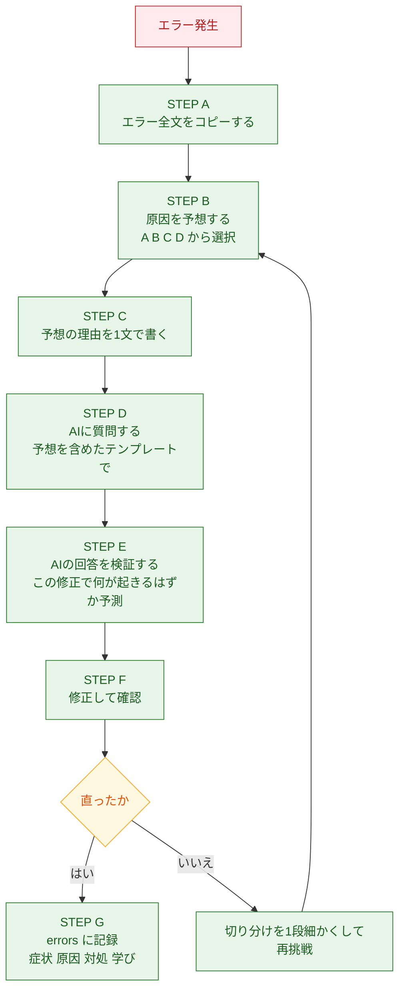

# 00. 教育設計書
### GitHub・API・AI開発 自走型学習アプリ ／ 教育設計フェーズ成果物

| 項目 | 内容 |
|---|---|
| 文書番号 | 00 |
| 文書名 | 教育設計書（Instructional Design Document） |
| 対応する要求仕様 | セクション33 の 1〜4、および 29-A |
| 版 | 1.0 |
| 作成日 | 2026-08-14 |
| 作成者 | シニアAIエンジニア兼プログラミング教育設計者 |
| 対象読者 | 依頼者本人（学習者＝開発者）、および後続設計書の作成者 |
| 関連文書 | `01_カリキュラム設計書.md`（LEVEL・Mission・Boss・スキルツリー）、以降 02〜 のアプリ設計書群 |

---

## 本書の位置づけと読み方

本書は「何を作るか」ではなく **「人をどう育てるか」** を決める文書である。
アプリの機能仕様・UI・技術スタック・データモデルは本書の範囲外であり、後続の設計書（02以降）が担当する。ただし後続設計書は、本書で定義した **教育方針・到達目標・評価方式に従属する** 。機能が教育方針に勝ってはならない。

読む順序の推奨：

1. 第1章（評価）… 現構想の何が良く、何を変えるべきかの結論
2. 第2章（ゴール再定義）… 変更後に目指す地点
3. 第3章（全体マップ）… 全体像を図で把握
4. 第4章（知識体系）… 何を教え、何を教えないか
5. 第5章（教育方針・評価方式）… どう教え、どう合格判定するか

急ぐ場合は「第0章 エグゼクティブサマリ」だけで意思決定に足りるように書いてある。

---

# 第0章 エグゼクティブサマリ

## 0.1 総合評価

**構想の質は高い。方向性は正しい。ただし「順序」と「規模」に重大な問題がある。**

要求仕様の思想面 — 実践形式、教材アプリ自体を学習対象にする、AIに丸投げさせない、Human-in-the-loop、セキュリティを後付けにしない — は、2026年時点のプログラミング教育として **極めて的確** である。特に「コードを暗記させない／AIが書いたコードを読む力を育てる」という中心思想は、この時代の初学者教育の正解に近い。

一方で、以下は率直に問題である。

- **LEVEL 順序に3か所の論理破綻がある**（Web が Git より後、GitHub API が認証より前、Deploy が終盤）
- **構造的な鶏と卵問題がある**（LEVEL 0 の学習者は、学習対象である教材アプリをまだ作れない）
- **AI会社12部門・完全自動開発は過剰設計**（1人の学習者が運営できる規模ではなく、現行LLMの信頼性でも成立しない）
- **不要な技術が3つ混入している**（Docker、Pythonの仮想環境、Webhook実装）
- **総学習時間の見積もりがなく、完走可能性が検証されていない**
- **到達レベル Stage 1〜10 が「説明できる」等の主観表現で、合否判定できない**

これらを修正すれば、本カリキュラムは **「AIエンジニアチームを指揮してサービスを作れる人材」を約4〜6.5か月・実働70〜103時間で育てる、実現可能な教材** になる。

## 0.2 本設計で加えた主要変更（10項目）

| # | 変更 | 理由（一言） |
|---|---|---|
| 1 | **HTML/CSS を LEVEL 1 へ前倒し**（旧 LEVEL 4） | Git を学ぶ前に「バージョン管理したい対象」が必要 |
| 2 | **Deploy 体験を LEVEL 2 へ前倒し**（GitHub Pages） | 「世界に公開できた」の成功体験を最速で与える |
| 3 | **Secret・認証を LEVEL 7 に置き、GitHub API を LEVEL 8 に後置** | 認証なしに GitHub API は実質使えない。順序が逆だった |
| 4 | **Seed App（完成済み最小アプリ）を配布し、Fork から始める** | 鶏と卵問題の解決。「作る」ではなく「育てる」に再定義 |
| 5 | **Docker・Python仮想環境・Webhook実装を削除**（付録に判断ガイドのみ） | 学習者がまだ「その技術が解決する問題」を持っていない |
| 6 | **OAuth の自作実装を禁止し、Supabase Auth の利用者に限定** | 認証自作はセキュリティ事故の最大要因 |
| 7 | **AI会社を12部門→5役割+Orchestratorに縮小** | 管理コストが学習効果を上回る。役割分離の本質は「文脈分離」 |
| 8 | **「完全自動開発」を非ゴール化し、Human Gate 3点付き半自動を最終到達点に** | 現行LLMの非決定性・コスト・責任所在の観点から |
| 9 | **XP を報酬ではなく進捗の可視化に降格し、実報酬を GitHub 上の実物に置く** | 外発的報酬による内発的動機の毀損（アンダーマイニング効果）を回避 |
| 10 | **Stage 1〜10 を観察可能な行動指標＋成果物で再定義** | 「説明できる」では合否判定できない |

## 0.3 変更後の全体像（数値）

| 指標 | 値 |
|---|---|
| LEVEL 数 | 18（LEVEL 0〜17）＋ Advanced 付録トラック |
| PHASE 数 | 5 |
| Mission 総数 | 133 |
| Boss Mission 数 | 8 |
| BLACKOUT MISSION 数 | 5 |
| 標準所要時間（Mission のみ） | 約 57 時間 |
| Boss・BLACKOUT 込み | 約 74 時間 |
| つまずき係数 1.4 を掛けた実測想定 | **約 103 時間** |
| 1日60分・週6日ペースでの想定期間 | **約 18 週（約4か月）** |
| 1日45分・週5日ペースでの想定期間 | 約 28 週（約6.5か月） |
| 到達 Stage | Stage 10（AI会社を設計・運営できる） |

---

# 第1章 この構想に対する評価

要求仕様セクション31 の指示（要求をそのまま肯定しない）に従い、率直に評価する。
まず正しく評価すべき点を述べ、その後に指摘を **重要度順** に並べる。

## 1.1 高く評価する点

### E-1. 「コードを暗記させない」というゴール設定（要求2, 7, 19）

これは正しい。2026年時点で、初学者に「まず1000行タイプさせる」教育を課すのは合理性を失っている。実際に価値があるのは、**AIが出力した成果物を評価・修正・統合する能力** であり、要求仕様はそこを正確に射抜いている。教育学的にも、初学者への「Worked Example（解答例）の提示」は、いきなり問題を解かせるより学習効率が高いことが繰り返し確認されている（Sweller & Cooper の worked example effect）。「AIに書かせて読ませる」は、この worked example を無限供給する仕組みとして機能する。

### E-2. 「教材アプリ自体が学習対象」という構造（要求4, 30）

**本構想で最も価値のあるアイデア。** 学習者のモチベーションが切れる最大の原因は「作っているものが使い捨てで、意味がない」ことである。自分が毎日使う学習ダッシュボードを、自分で育てていく構造は、この問題を根本から潰す。さらに副次効果として、

- 教材の題材と実務が一致する（学習用の架空要件が不要）
- LEVEL が上がるたびに「前に自分が書いたコード」がリファクタ対象になる（レガシーコードとの向き合いを自然に学べる）
- 最終的に AI Agent に処理させる Issue が、自分の実アプリの実課題になる

という、通常のカリキュラムでは作れない学習環境が生まれる。**ただし後述 P-1 の鶏と卵問題を解かないと成立しない。**

### E-3. Human-in-the-loop を最初から原則にした点（要求23, 26-9）

「Read → 提案 → 人間承認 → Write」を **初期段階から** 原則として置いたのは、教育設計としても安全設計としても正しい。多くの AI Agent 教材は「まず動かす、安全は後」で作られており、学習者に危険な癖をつける。後から安全な習慣に矯正するのは、最初から教えるより遥かにコストが高い。

### E-4. 「AIの回答を疑う力」を明示的な学習項目にした点（要求7-4）

これを独立した学習項目にしている教材はまだ少ない。存在しないAPI・古い仕様・過剰な変更提案は現実に頻発する。ここを鍛えないと、学習者は「AIが言ったから正しい」という最悪の態度で固定される。

### E-5. 「Gitで戻せる力」をAI時代の必須スキルにした点（要求7-5）

正しい。AI駆動開発の実際のリスクは「AIが間違える」ことではなく「間違えた状態から戻れない」ことである。Git を「履歴管理ツール」ではなく **「AIの失敗に対する保険」** として位置づけたのは優れた発想であり、本設計ではこれを更に強化して Boss Mission 化した（RECOVERY BOSS）。

### E-6. エラーを教材として扱う設計（要求13）

「原因予想 → 回答 → AI解説 → 修正」という流れは、Kapur の productive failure（生産的失敗）および予測—観察—説明（POE）法とほぼ同型で、教育学的に堅い。エラーを避けさせるのではなく、**エラーを遭遇させに行く** 設計にできればさらに強くなる（本設計では意図的エラー注入 Mission を各所に配置した）。

### E-7. GitHub を中心に据えた点（要求26-6）

学習の記録先を GitHub に統一する判断は、次の3つを同時に達成する点で秀逸である。

1. 学習履歴が Contribution グラフとして可視化され、継続の動機になる
2. 卒業時に「見せられるポートフォリオ」が自動的に完成している
3. 後半の AI Agent が扱う対象（Issue/PR/Commit）と、学習の記録先が同一になる — **学習インフラがそのまま AI 組織の基盤インフラになる**

3番目は特に重要で、他の教材にはない一貫性を生んでいる。

---

## 1.2 指摘事項（重要度順）

指摘は以下の区分を付与する。

- 🔴 **CRITICAL**：修正しないとカリキュラムが破綻する
- 🟠 **MAJOR**：修正しないと学習効率が大きく落ちる
- 🟡 **MINOR**：改善が望ましい

---

### 🔴 P-1【構造欠陥】鶏と卵問題：LEVEL 0 の学習者は、学習対象である教材アプリを作れない

**問題**

要求4・30 は「教材として作っているアプリ自体を学習対象にする」「MVPは Dashboard/LEVEL/Lesson/Mission/Progress 程度から開始」としている。しかし LEVEL 0 の学習者は、HTML も Git も知らない。**Dashboard を作る能力がない人間に、Dashboard を作らせながら Dashboard で学ばせる** ことはできない。

この矛盾は要求仕様内で解決されていない。放置すると、次のどちらかに転ぶ。

- (a) 最初にアプリを完成させる期間が必要になり、実質「LEVEL 0 の前に LEVEL 20 が要る」状態になる
- (b) 学習者が延々と環境構築で詰まり、GitHub を学ぶ前に離脱する（初学者教材の最頻の死因）

**代替案：Seed App 方式**

教材アプリを **完成品として与えるのではなく、意図的に未完成な最小種（Seed App）として配布する。**

| 要素 | 設計 |
|---|---|
| 配布形態 | GitHub 上のテンプレートリポジトリ。**LEVEL 1 で ZIP をダウンロードして開始し、LEVEL 2 でテンプレートリポジトリ（Use this template）に切り替える**（02 A-05） |
| Seed の中身 | 単一の `index.html` + `style.css` + `progress.json`。ビルド不要、依存ゼロ、100行未満 |
| 起動方法 | **LEVEL 1 の最後に導入する VS Code Live Server 拡張で開く。LEVEL 2 以降は公開URL（GitHub Pages）を正とする** |
| 成長のさせ方 | 各 LEVEL の最後の Mission が「今 LEVEL で学んだ技術だけを使って Seed App に1機能足す」 |
| LEVEL 9 での転換 | ここで初めて Next.js へ移行する。移行そのものを Mission 化し「なぜ移行が必要になったか」を体感させる |

これにより、要求26-4「学習した技術だけを使って次の機能を作る」が **設計上強制される** 。学習者は常に「自分が理解している技術の範囲内のコードだけ」が入ったアプリを持つことになり、AI が生成したコードを読む対象としても適正な難易度が保たれる。

**この変更は本設計の中で最も重要である。** 教材アプリの成長表は第3章 3.2 に示す。

---

### 🔴 P-2【順序破綻】Web（HTML/CSS）が LEVEL 4 は遅すぎる

**問題**

要求6 では LEVEL 1〜3 で Git/GitHub を学び、LEVEL 4 でようやく HTML/CSS/JavaScript に入る。これは3つの理由で不適切である。

1. **管理対象がない状態でバージョン管理を学ばせている。** LEVEL 1 の実践課題「Hello GitHub リポジトリを作る」で扱うのは README.md のみ。テキストファイル1つの履歴管理では、Branch も Merge も Conflict も「なぜ必要か」が体感できない。必然性のない概念は定着しない。
2. **視覚的成果が3レベル分遅れる。** 初学者の継続率は「画面に何かが表示された」瞬間に跳ね上がる。最初の3レベル（想定 10〜15日）を通じて画面に何も出ないカリキュラムは、離脱リスクが高い。
3. **Conflict の教材が作れない。** Conflict を実感させるには、複数箇所を同時編集できる程度の分量のファイルが要る。README だけで人工的な Conflict を起こしても「わざとらしい練習」にしかならない。

**代替案**

- **LEVEL 1 を「はじめてのWebページ」に変更**（HTML/CSSの骨格のみ、JavaScript は含めない）
- Git/GitHub を LEVEL 2 に後ろ倒し、**LEVEL 1 で作った進捗表を LEVEL 2 で GitHub に上げる**
- JavaScript は分離して LEVEL 5 に置く（HTML/CSS と JS を同時に教えると認知負荷が過大になるため）

これにより「作った → 履歴を残したい → Git」という **必然性の順序** が生まれる。

---

### 🔴 P-3【順序破綻】GitHub API（LEVEL 6）が認証（LEVEL 7）より前にある

**問題**

要求6 は LEVEL 6 で GitHub API、LEVEL 7 で認証・API Key・PAT・Secrets を扱う。しかし GitHub API は、

- 未認証だと IP あたり 60 リクエスト/時 という厳しい制限がかかる
- Issue 作成などの書き込み系は認証必須
- 自分の private リポジトリは未認証では読めない

つまり **LEVEL 6 で実践しようとした瞬間に、LEVEL 7 の知識が必要になる。** 順序が逆である。

さらに悪いことに、この順序のまま進めると学習者は「とりあえず動かすためにトークンをコードに直書きする」を実行し、それを GitHub に Push する。**要求23 が最も避けたい事故を、カリキュラム自身が誘発する。**

**代替案**

- **LEVEL 7「Secretと権限の基礎」→ LEVEL 8「GitHub API」の順に入れ替える。**
- さらに、Secret 意識は LEVEL 7 まで待たず、**LEVEL 2 の `.gitignore` Mission で第1段階を導入する**（「上げてはいけないもの」の最小リスト）。
- LEVEL 7 の直後に SECURITY BOSS を配置し、「漏らしたトークンを検知して revoke し、再発防止策を入れる」までを一連で演習させる。

---

### 🟠 P-4【順序】Deploy が LEVEL 9 は遅い

**問題**

要求6 では Deploy が LEVEL 9（GitHub Actions・CI/CD）まで登場しない。しかし「自分の作ったものが URL で世界に公開される」という体験は、初学者に対する報酬として極めて強力であり、これを 9 レベル分（想定 40〜50日）待たせるのは動機設計上もったいない。

**代替案**

Deploy を **2段階** に分ける。

| 段階 | 位置 | 内容 | 目的 |
|---|---|---|---|
| 第1段階：公開の体験 | **LEVEL 2 最終 Mission** | GitHub Pages を有効化し、LEVEL 1 で作ったページを公開 | 成功体験。設定2クリックで完了する |
| 第2段階：本番デプロイ | LEVEL 9 | Vercel へ Next.js アプリをデプロイ。環境変数・Preview環境 | 実務レベルのデプロイ理解 |
| 第3段階：自動デプロイ | LEVEL 11 | GitHub Actions による CI/CD | 自動化の理解 |

「Push しただけで世界中から見えるようになる」を LEVEL 2 で体験させることは、その後の Git 学習全体の意味づけを変える。

---

### 🟠 P-5【不要技術】Docker は本カリキュラムに不要

**問題**

要求1 の用語リストに Docker が含まれている。しかし本カリキュラムに Docker を入れるべきではない。

理由は「難しいから」ではなく、**学習者がまだ Docker が解決する問題を持っていないから** である。Docker が解く問題は「開発環境と本番環境の差異」「複数サービスの依存関係の再現」であり、これは

- 複数人のチーム開発
- 複数のミドルウェア（DB, キャッシュ, キュー等）をローカルで動かす構成
- 自前でサーバを運用する構成

を前提とする。本カリキュラムの構成（Next.js + Vercel + Supabase、開発者1名）では、**この3条件のいずれも発生しない。** 問題を持たない人に解決策を教えるのは、教育として最も効率が悪い形態である（「解決すべき問題の不在」＝ 学習の文脈欠如）。

**代替案**

- Docker を本編から削除。
- 代替として **LEVEL 9 で Node.js のバージョン固定**（`.nvmrc` / `package.json` の `engines`）と、**Vercel のビルド環境がどう決まるか** を1 Mission で扱う。これで「環境差異」という概念自体は理解できる。
- Advanced 付録に **「いつ Docker が必要になるかの判断ガイド（1ページ）」** だけを置く。将来自前サーバや複数ミドルウェア構成に進むときの入口を残す。

---

### 🟠 P-6【不要技術】Python の仮想環境も不要

**問題**

要求1 の用語リストに「Pythonの仮想環境」がある。一方、要求21 の技術スタック候補は Next.js/TypeScript 系で統一されている。**つまり要求仕様の中で言語方針が矛盾している。**

初学者に2言語のツールチェーン（npm/node_modules/package.json と pip/venv/requirements.txt）を並行して教えるのは、外在的認知負荷（extraneous cognitive load）の典型的な増大要因である。しかも両者は概念的にはほぼ同じことをしており、**2回教える教育的価値がほとんどない。**

**代替案**

- **TypeScript 一本化。** AI API・Agent・MCP のいずれも TypeScript SDK で完結できる（2026年時点で TS 側のエコシステムは十分に成熟している）。
- ただし現実には **AI は高確率で Python コードを提案してくる。** そこで「Python を書ける」ではなく **「AI が出した Python を読んで、TypeScript に置き換える判断ができる」** ことを LEVEL 12 の1 Mission として扱う。これは要求7-1「AIが書いたコードを読む力」と完全に整合する。
- 仮想環境そのものは Advanced 付録に「npm と pip の対応表」として1ページで済ませる。

---

### 🟠 P-7【後回し】Webhook の実装は初学者に不適

**問題**

Webhook を実装するには、GitHub から到達可能な公開 URL が必要になる。ローカル開発ではトンネリングツール（ngrok 等）の導入、署名検証、再送処理、冪等性の考慮が付いてくる。これは「HTTP を学んだ直後の初学者」の到達点を大きく超える。

**代替案**

- **概念のみ LEVEL 6 で扱う**（「相手が呼びに来る通信」という HTTP の裏返しとして15分）。
- 実装は **GitHub Actions の event トリガーで代替する。** 「Issue が作られたら動く」「PR が開いたら動く」は Actions で公開 URL なしに実現でき、Webhook の学習目的（イベント駆動）は完全に達成される。
- 教材上の説明は **「GitHub Actions は GitHub に内蔵された Webhook 受信サーバである」** とすれば、概念の橋渡しになる。
- 自前 Webhook 受信は Advanced 付録。

---

### 🟠 P-8【危険】OAuth の自作実装は行わせてはいけない

**問題**

要求6 の LEVEL 7 に OAuth/Login/Session/Cookie が並んでいる。ここで学習者が「OAuth フローを自分で実装する」方向に進むと、state パラメータ検証漏れ、トークンの localStorage 保存、リダイレクトURI の検証不備といった典型的脆弱性を、**教材が教えてしまう** 危険がある。

**代替案**

| 扱い | 対象 |
|---|---|
| 概念として教える（LEVEL 7） | 認可コードフローの流れ、なぜ他社サイトにパスワードを渡さなくて済むのか、スコープ（権限）の考え方 |
| 利用者として使う（LEVEL 10） | Supabase Auth 経由の GitHub ログイン。設定とコールバックのみ |
| **実装させない** | トークン交換、セッション発行、Cookie 属性設計、リフレッシュ処理 |
| Advanced 付録 | 「なぜ認証を自作してはいけないか」＋自作した場合のチェックリスト |

「作らせない」ことを明示的に教えるのも教育である。**自作を避ける判断力そのものがシニアの能力** であり、それを最初から教える。

---

### 🟠 P-9【過剰設計】AI会社12部門は、1人の学習者には運営不能

**問題**

要求2 では 12 部門（企画/リサーチ/設計/UI・UX/フロント/バック/QA/セキュリティ/GitHub管理/DevOps/ドキュメント/運営改善）が挙げられている。これは大企業の組織図の写像であり、次の問題を持つ。

1. **管理コストが成果を上回る。** 部門が増えるほど、役割定義ファイルの整備・引き継ぎ・重複作業の調停コストが増える。12体を動かすと、人間の承認作業だけで1回の開発サイクルが数時間になる。
2. **API コストが非線形に増える。** 各部門が文脈を持つと、1つの機能追加で数十回の LLM 呼び出しになる。学習者の自費で回すには重い。
3. **教育効果が飽和する。** 「役割を分離する」ことの学習効果は、3体目でほぼ得られる。4体目以降は同じ作業の反復であり、新しい学びがない。
4. **役割分離の本質が伝わらない。** 部門を増やすことが目的化する。本質は「1つの LLM 呼び出しに詰め込む文脈を減らし、各呼び出しの責務を単純化する」ことである。

**代替案：5役割 + Orchestrator**

| 役割 | 責務 | GitHub 上の担当 |
|---|---|---|
| Orchestrator（AI CEO） | 要求受領・分解・割り当て・進捗確認・人間へのエスカレーション。**自分では作業しない** | Issue の起票と Project 管理 |
| Planner | 要求 → 受け入れ条件付き Issue へ分解 | Issue 本文 |
| Developer | Issue → Branch → 変更案 → Commit → PR | Branch, Commit, PR |
| Reviewer | PR の批判的レビュー。要求からの逸脱・危険な変更の検出 | PR コメント |
| QA | 受け入れ条件の検証、テストの追加 | Actions のテスト結果 |
| Docs | README/CHANGELOG/decisions の更新 | ドキュメントの PR |

セキュリティは **独立部門ではなく Reviewer のチェックリスト項目として埋め込む。** 独立させると「セキュリティは誰かの仕事」という最悪の文化を教えることになる（要求26-10「セキュリティを後付けにしない」とも整合する）。

DevOps も部門化せず、**Actions のワークフローそのものがその役割を果たしている** ことを教える。

必要なら Advanced 付録で「部門を増やすときの判断基準（何が起きたら分割すべきか）」を扱う。**組織設計は増やす技術ではなく、増やさない判断の技術である** ことを教える方が価値が高い。

---

### 🟠 P-10【過剰設計】LEVEL 16「完全自動開発」は到達目標として不適切

**問題**

要求6 の LEVEL 16 は「入力 → 要件整理 → 設計 → Issue生成 → 実装 → テスト → PR → レビュー → QA → 人間承認 → Merge」を最終課題としている。人間承認が1か所入っている点は評価できるが、**この規模を「動く状態」にするのは、2026年時点でも研究開発レベルの難度** である。理由：

- LLM の非決定性により、同じ入力で成功/失敗が揺れる。**教材として「必ず成功する課題」にできない**
- 失敗時のデバッグ対象が「どのエージェントの、どのターンの、どの判断か」となり、初学者の切り分け能力を超える
- コストが読めない（1回の実行で数ドル〜数十ドルの幅が出る）
- 学習者が「最後に一度動いた」で終わり、再現できない

このまま最終課題にすると、**カリキュラム全体の合否が運に依存する。**

**代替案：スコープを縮小し、Human Gate を3点に増やす**

FINAL BOSS の要件を次に置き換える。

- 対象は **教材アプリへの機能追加1件**（新規アプリのゼロからの生成ではない）
- 変更規模の上限を **3ファイル・150行以内** と宣言し、超えたら Orchestrator が人間にエスカレーションする
- **Human Gate を3点**：① 着手前（計画の承認）② PR 作成前（diff の承認）③ Merge 前（最終承認）
- 成功条件は「AIが正しいコードを書いた」ではなく **「学習者が各ゲートで正しく判断し、その根拠を `decisions/` に記録できた」**
- 失敗ケース（AIが誤った変更を提案した）に遭遇した場合、**それを検出して差し戻せたなら満点とする**

つまり **評価対象を AI の性能から、人間の統治能力へ移す。** これは要求28 の最終イメージ「AIエンジニアチームを使ってサービスを作れる人」と完全に一致し、かつ再現可能な合否判定になる。

「全自動開発」は **非ゴールとして明示的に宣言する**（第2章 2.4）。

---

### 🟠 P-11【学習効果】XP を報酬として設計すると、内発的動機を損なう恐れがある

**問題**

要求8・9 は XP・レベル・スキルバーによるゲーム感覚を求めている。動機づけの初速としては有効だが、**外発的報酬（XP）を強調しすぎると、もともとあった内発的動機（作りたいから作る）が置き換わり、報酬が止まった瞬間に行動も止まる**（アンダーマイニング効果、Deci & Ryan の自己決定理論）。

学習者はすでに「AI会社を作りたい」という強い内発的動機を持っている。ここに XP を重ねると、動機を強化するどころか **希釈するリスク** がある。

**代替案：XP の役割を「報酬」から「地図」へ降格する**

| 変更前（要求のまま） | 変更後（本設計） |
|---|---|
| Mission クリアで XP 獲得（報酬） | Mission クリアで **スキルバーが伸びる（現在地の可視化）** |
| XP を集めることが目的 | **XP は「次に何を学ぶべきか」を示す指標** |
| レベルアップが報酬 | 報酬は **GitHub 上の実物**：公開URL、Contributionグラフ、マージ済みPR、動くアプリ |
| — | 追加：**「できるようになったこと」の言語化**（成長ログ）を報酬体験の中心に置く |

自己決定理論の3要素（自律性・有能感・関係性）に照らすと、有能感を与えるのは **数値ではなく「昨日できなかったことが今日できる」という具体的事実** である。したがって、Mission 完了時に表示すべきは「+100 XP」ではなく、

> 「あなたは今、GitHub上の履歴から特定のコミットを復元できるようになりました。これは昨日はできなかったことです。」

という **能力の言語化** である。XP バーはその横に小さく置く。

---

### 🟠 P-12【学習効果】各レッスン直後の理解チェックだけでは記憶に残らない

**問題**

要求5 の STEP 6 は「3〜5問の理解チェック」を各レッスン末に置いている。これ自体は良いが、**学習直後のテストは正答率が高く出るため、学習者に「わかった」という誤った確信を与える**（流暢性の錯覚）。実際には数日で失われる。

**代替案：3層のテスト設計**

| 層 | タイミング | 形式 | 目的 |
|---|---|---|---|
| 即時チェック | Mission 直後 | 3問・選択式 | 誤解の即時修正（形成的評価） |
| **想起テスト** | **次回セッションの冒頭 3分** | 2問・記述または口頭想起 | 間隔をあけた検索練習（testing effect / spacing effect） |
| 統合テスト | Boss Mission 前 | 実技・複数LEVEL横断 | 転移の確認（総括的評価） |

特に **「次回冒頭の3分復習」は、1日30〜90分という細切れ学習（要求17）における文脈復帰の役割も兼ねる** ため、費用対効果が極めて高い。これは後述 P-16 の中断・復帰問題の解でもある。

---

### 🟡 P-13【危険】学習アプリに与える GitHub 権限の段階設計が未定義

**問題**

要求14 は「危険な権限を最初から与えず段階的に追加」と正しく述べているが、**具体的な段階が定義されていない。** 定義がなければ実装時に「とりあえず全権限」になる（実際、初学者が PAT を作るとき classic の repo スコープ全付与が最も起きやすい）。

**代替案：権限エスカレーション表を教材の正式コンテンツにする**

| 段階 | 導入LEVEL | 権限 | 用途 | 事故時の被害 |
|---|---|---|---|---|
| 0 | LEVEL 6 | 認証なし | 公開APIの取得のみ | なし |
| 1 | LEVEL 7 | fine-grained PAT / Contents: **Read** | 自分のリポジトリ情報の読み取り | 情報漏洩のみ |
| 2 | LEVEL 8 | + Issues: **Write** | Issue の作成 | ノイズ作成。復旧可能 |
| 3 | LEVEL 10 | GitHub OAuth（Supabase Auth 経由）read-only スコープ | ログインと表示 | セッション奪取 |
| 4 | LEVEL 11 | Actions 内 `GITHUB_TOKEN` の最小権限指定 | CI/CD | ワークフロー範囲内 |
| 5 | LEVEL 15 | + Contents: Write / PR: Write（**Agent に付与**） | Branch と PR の作成 | **不正なコード変更。ここが最大の危険点** |
| — | 全期間 | **禁止**：`admin`, `delete_repo`, org 全体スコープ, main への直接 push 権限 | — | — |

段階5では **必ず branch protection が有効であること** を前提条件とする。つまり「Agent に書き込み権限を与える前に、main を守る仕組みを作っておく」順序を強制する。これは LEVEL 4 で branch protection を学ぶ理由でもある。

---

### 🟡 P-14【将来負債】特定ベンダへのロックインが教材化されていない

**問題**

Supabase / Vercel / 特定 AI ベンダに依存した構成は、初学者にとっては正しい選択（考えることを減らせる）だが、**依存していること自体を教えないと、学習者は「これが唯一のやり方」と誤認する。**

**代替案**

- LEVEL 12 で **プロバイダ非依存の薄い抽象化層**（`callLLM()` 1関数）を自作させる Mission を置く。実装は30行程度で済むが、「差し替え可能性を設計に埋め込む」という思想を体験できる。
- 各技術の初出時に、**「この技術が担っている役割」と「代替候補」** を1行で併記する（例：Vercel＝ホスティング。代替：Netlify, Cloudflare Pages, 自前サーバ）。
- Advanced 付録に「乗り換えコスト見積もりの練習」を置く。

---

### 🟡 P-15【計測不能】Stage 1〜10 が主観表現で、合否判定できない

**問題**

要求28 の Stage 定義は「GitHubの基本概念を説明できる」「エラーをAIと一緒に解決できる」等、**観察者によって判定が割れる表現** で書かれている。学習アプリが進捗を自動判定する必要があることを考えると、この曖昧さは実装段階で必ず問題になる。

**代替案** → 第2章 2.3 で、各 Stage に

- 観察可能な行動指標（何をしたら達成とみなすか）
- 判定に使う成果物（GitHub 上の実物）
- 判定者（自動 / AI / 自己 / 実技Boss）
- 認知レベル（Bloom 改訂版タキソノミー）

を付与して再定義する。

---

### 🟡 P-16【欠落】細切れ学習における中断・復帰の設計がない

**問題**

要求17 は「1日30〜90分、毎日長時間やらなくても進められる構造」を求めているが、**中断からの復帰設計がない。** 実際には、3日空けると前回どこまで理解していたか思い出せず、そこで離脱する。これは細切れ学習型教材の最大の死因である。

**代替案：3つの復帰装置**

1. **再開ポイントの明示**：Mission は必ず「次に開くファイル」「次に押すボタン」で終わる。曖昧な区切りで終わらせない
2. **前回の3分復習**（P-12 の想起テストと兼用）：セッション冒頭に前回の要点2問 + 前回の成果物のスクリーンショット表示
3. **ブランク検知**：7日以上空いた場合、直前 LEVEL の「要点だけ復習 Mission（10分）」を自動挿入する

---

### 🟡 P-17【欠落】要求仕様に含まれていないが必須の知識がある

以下は要求1 の用語リストに存在しないが、**AI駆動開発の自走に不可欠** である。本設計で追加した。

| 追加知識 | 追加理由 | 配置 |
|---|---|---|
| テストの基礎（何をテストと呼ぶか） | AI に「テストを書いて」と言えないと自動化が成立しない。CI の前提 | LEVEL 11 |
| ログとデバッグの基本 | AI にエラーを渡す前に「どの情報を渡すべきか」の判断に必要 | LEVEL 5, 拡張 LEVEL 14 |
| 依存関係とライセンス | AI は平気で怪しいライブラリを提案する。Supply Chain の入口 | LEVEL 9 |
| AI出力の評価（Eval）の初歩 | 「AIの回答を疑う力」を体系化するには、評価の型が要る | LEVEL 12 |
| コスト管理（トークン単価・上限設定） | Agent を回すと請求が跳ねる。実務上の必須知識 | LEVEL 12, 16 |
| 非同期処理（await と待つこと） | fetch を書いた瞬間に必ず遭遇する。避けて通れない | LEVEL 6 |
| Issue の書き方（要求の言語化） | AI への指示能力と完全に同型のスキル | LEVEL 4 |
| 意思決定の記録（ADR的なもの） | AI組織の監査可能性の基盤 | LEVEL 17 |

特に **「Issue の書き方」= 「AIへの指示の書き方」** という同型性の指摘は、本カリキュラムの中核的な教育アイデアである。要求7-2 の「AIへ仕事を依頼する力」（目的/現状/期待結果/制約/完了条件）は、そのまま良い Issue のテンプレートである。**LEVEL 4 で人間向けに練習した書き方が、LEVEL 15 でそのまま AI Agent への指示として機能する** — この橋渡しを明示的に設計する。

---

### 🟡 P-18【設計上の危険】禁止事項リストが未定義

以下は教材の全期間を通じて **禁止** とし、アプリ側でも警告する。要求23 の具体化である。

| 禁止事項 | 理由 |
|---|---|
| main ブランチへの直接 push | 復旧手段を1つ失う。LEVEL 4 以降は branch protection で機械的に禁止 |
| AI Agent による force push | 履歴が消え、Git という保険が無効化される |
| AI Agent による自動 Merge | 人間の承認ゲートが消える。Human-in-the-loop の破綻 |
| トークンのコードへの直書き | 最頻の事故 |
| `.env.local` の commit | 同上。`.gitignore` を LEVEL 2 で導入する理由 |
| Issue 本文の内容を AI に無検証で実行させる | Prompt Injection の主要な経路 |
| Agent への `admin` / `delete_repo` 権限付与 | 復旧不能な破壊が可能になる |
| 上限のない Agent Loop | コスト暴走と無限ループ。最大反復回数を必須にする |

---

## 1.3 指摘事項サマリ表

| # | 区分 | 重要度 | 指摘 | 代替案の要旨 |
|---|---|---|---|---|
| P-1 | 構造欠陥 | 🔴 | 教材アプリの鶏と卵問題 | Seed App を配布し「作る」→「育てる」に再定義 |
| P-2 | 順序 | 🔴 | Web が LEVEL 4 は遅い | HTML/CSS を LEVEL 1 へ、JS を LEVEL 5 へ分離 |
| P-3 | 順序 | 🔴 | GitHub API が認証より前 | Secret/認証 → GitHub API の順に入替 |
| P-4 | 順序 | 🟠 | Deploy が遅い | GitHub Pages を LEVEL 2 に、本番は LEVEL 9 |
| P-5 | 不要技術 | 🟠 | Docker | 削除。Node バージョン固定で代替。付録に判断ガイド |
| P-6 | 不要技術 | 🟠 | Python 仮想環境 | 削除。TS 一本化。「AIのPythonを読む」だけ残す |
| P-7 | 後回し | 🟠 | Webhook 実装 | 概念のみ。Actions の event トリガで代替 |
| P-8 | 危険 | 🟠 | OAuth 自作 | 概念のみ。Supabase Auth の利用者に限定 |
| P-9 | 過剰設計 | 🟠 | AI会社12部門 | 5役割 + Orchestrator に縮小 |
| P-10 | 過剰設計 | 🟠 | 完全自動開発が最終課題 | Human Gate 3点の半自動。評価対象を人間の判断へ |
| P-11 | 学習効果 | 🟠 | XP の報酬化 | XP は現在地の可視化へ降格。報酬は GitHub の実物 |
| P-12 | 学習効果 | 🟠 | 直後テストのみ | 即時／想起／統合の3層テスト |
| P-13 | 危険 | 🟡 | GitHub 権限の段階が未定義 | 権限エスカレーション表を正式教材化 |
| P-14 | 将来負債 | 🟡 | ベンダロックイン未教材化 | 抽象化層 Mission と代替候補の併記 |
| P-15 | 計測不能 | 🟡 | Stage 定義が主観的 | 行動指標＋成果物＋判定者で再定義 |
| P-16 | 欠落 | 🟡 | 中断・復帰設計なし | 再開ポイント／3分復習／ブランク検知 |
| P-17 | 欠落 | 🟡 | 必須知識が8項目不足 | テスト・ログ・依存関係・Eval・コスト等を追加 |
| P-18 | 危険 | 🟡 | 禁止事項リストなし | 8項目の禁止リストを全期間で適用 |

---

# 第2章 最終ゴールの再定義

## 2.1 ゴール文の書き換え

**変更前（要求2）**

> AIと協働してソフトウェア開発を進めるために必要な基礎知識を理解し、AIが生成したコード・設計・エラーをある程度理解し、自分で問題を切り分け、適切なAIへ適切な指示を出しながら開発を自走できる人材。

方向性は正しいが、「ある程度理解し」「自走できる」が計測できない。次に書き換える。

**変更後（本設計のゴール）**

> **GitHub 上で、AI に開発作業を委任し、その成果物を検証・承認・差し戻しできる開発責任者。**
>
> 具体的には、次の6つを **自分の学習アプリという実在のプロダクトに対して、他人の助けなしに** 実行できる状態を指す。
>
> 1. **要求を Issue に分解できる** — 曖昧な「こうしたい」を、受け入れ条件付きの実行可能な単位に落とせる
> 2. **AI に委任できる** — 目的・現状・制約・変更禁止範囲・完了条件を明示した指示を書ける
> 3. **成果物を検証できる** — AI が出したコード・設計・PR を読み、要求からの逸脱と危険な変更を検出できる
> 4. **失敗から復旧できる** — 壊れた状態を Git で元に戻し、原因を切り分け、再発を防ぐ仕組みを入れられる
> 5. **安全に運用できる** — 秘密情報・権限・自動実行の範囲を、被害が限定される形に設計できる
> 6. **判断を記録できる** — なぜその選択をしたかを GitHub 上に残し、後から自分と AI が参照できる

「コードを書ける」は **ゴールに含めない。** ただし「コードを読めて、修正指示を出せて、危険を見抜ける」は必須である。

## 2.2 能力軸の定義（5軸）

要求7 の5項目を再構成し、5つの能力軸として定義する。各軸は独立に成長し、スキルツリーおよび評価ルーブリックの縦軸になる。

| 軸 | 名称 | 定義 | 主に鍛える LEVEL |
|---|---|---|---|
| A | **読解力** | AIが生成したコード・設計・エラーを読み、何がどこで起きているか特定できる | 1, 5, 9, 12 |
| B | **指示力** | 目的・制約・完了条件を明示して、人間にもAIにも通じる依頼が書ける | 4, 13, 15, 16 |
| C | **復旧力** | 壊れた状態から元に戻し、原因を切り分けられる | 3, 5, 8, 15 |
| D | **懐疑力** | AI の出力・外部の入力を無条件に信用せず、検証手段を持てる | 7, 12, 13, 15 |
| E | **統治力** | 権限・コスト・承認フローを設計し、システム全体の暴走を防げる | 7, 11, 16, 17 |

このうち **D（懐疑力）と E（統治力）は、従来のプログラミング教育にほぼ存在しない軸** であり、AI時代に固有の能力である。本カリキュラムの差別化点はここにある。

## 2.3 Stage 1〜10 の精緻化

要求28 の Stage 定義を、**観察可能な行動指標・成果物・判定者・認知レベル** で再定義する。
認知レベルは Bloom 改訂版タキソノミー（記憶／理解／応用／分析／評価／創造）を用いる。

---

### Stage 1 — 指示に従って GitHub を操作できる

| 項目 | 内容 |
|---|---|
| 変更前 | AIの指示を見ながらGitHubを操作できる |
| **行動指標** | 手順が提示された状態で、リポジトリ作成・ファイル追加・Commit・Push を、**エラーなく最後まで**完了できる。エラーが出た場合、そのエラーメッセージ全文をコピーして質問できる |
| 成果物 | 自分のアカウントに、3件以上の Commit 履歴を持つリポジトリが存在する |
| 判定者 | 自動（GitHub API で Commit 数を確認） |
| 認知レベル | 記憶・理解 |
| 対応 LEVEL | 0〜2 |
| よくある誤判定 | 「一度成功した」を達成とみなさない。**別の日に、手順を見ずに再現できて初めて Stage 1** |

### Stage 2 — GitHub の基本概念を、他人に説明できる

| 項目 | 内容 |
|---|---|
| 変更前 | GitHubの基本概念を説明できる |
| **行動指標** | Repository / Commit / Push / Branch / Merge の5語を、**専門用語を使わずに** 各1〜2文で説明した文書を書ける。かつ「なぜ Commit を分けるのか」に自分の言葉で答えられる |
| 成果物 | 学習リポジトリの `notes/glossary.md` に、自分の言葉での用語定義 |
| 判定者 | AI（ルーブリックによる採点）＋ 自己評価 |
| 認知レベル | 理解 |
| 対応 LEVEL | 2〜3 |
| よくある誤判定 | 教材の文章をコピーしたものは不可。**「現実世界での例え」を自作できているか** が判定の鍵 |

### Stage 3 — AIが作った小規模アプリを GitHub で管理できる

| 項目 | 内容 |
|---|---|
| 変更前 | AIが作った小規模アプリをGitHub管理できる |
| **行動指標** | Issue を立て、Branch を切り、AI に変更させ、差分を確認し、PR を出し、Merge するまでを **1人で1周** できる。かつ、途中で問題が起きたとき revert して戻せる |
| 成果物 | Issue → PR → Merge が紐づいた履歴が1件以上。RECOVERY BOSS / GITHUB BOSS クリア |
| 判定者 | 実技（Boss Mission） |
| 認知レベル | 応用 |
| 対応 LEVEL | 3〜4 |

### Stage 4 — API を使ったアプリを AI と作れる

| 項目 | 内容 |
|---|---|
| 変更前 | APIを使ったアプリをAIと作れる |
| **行動指標** | 未知の API のドキュメントを読み、必要なエンドポイント・認証方式・レスポンス構造を特定し、AI に実装させ、動かせる。**403 / 404 / 429 の区別がつき、それぞれの対処を選べる** |
| 成果物 | 外部 API と GitHub API の両方を使うダッシュボード。API BOSS クリア |
| 判定者 | 実技（Boss Mission） |
| 認知レベル | 応用・分析 |
| 対応 LEVEL | 6〜8 |
| 追加要件 | **トークンをコードに直書きしていないこと** を必須条件とする |

### Stage 5 — エラーを AI と一緒に解決できる

| 項目 | 内容 |
|---|---|
| 変更前 | エラーをAIと一緒に解決できる |
| **行動指標** | エラー発生時に ①再現手順 ②エラー全文 ③直前の変更 ④自分の仮説 の4点を揃えて質問できる。かつ **AIの回答を試す前に「この修正が正しければ何が起きるはずか」を予測** できる |
| 成果物 | `errors/` ディレクトリに、上記4点＋解決結果を記録したファイルが5件以上 |
| 判定者 | 自動（ファイル数）＋ AI（記録の質） |
| 認知レベル | 分析 |
| 対応 LEVEL | 全期間（明示的には 5, 8, 9） |
| よくある誤判定 | 「AIに聞いたら直った」は Stage 5 ではない。**なぜ直ったかを説明できて Stage 5** |

### Stage 6 — GitHub を使った開発フローを設計できる

| 項目 | 内容 |
|---|---|
| 変更前 | GitHubを使った開発フローを設計できる |
| **行動指標** | 自分のプロジェクトに対し、Branch 戦略・PR ルール・保護設定・CI で自動実行する内容を **自分で決めて、その理由を説明** できる。他人の設定をコピーするのではなく、選択している |
| 成果物 | `docs/workflow.md`（自分のルールと理由）＋ 動作する Actions ワークフロー。FULL-STACK BOSS クリア |
| 判定者 | 実技 ＋ AI レビュー |
| 認知レベル | 評価・創造 |
| 対応 LEVEL | 9〜11 |

### Stage 7 — AI Agent にツールを持たせられる

| 項目 | 内容 |
|---|---|
| 変更前 | AI Agentへツールを持たせられる |
| **行動指標** | Tool Calling を使って、LLM に外部操作をさせられる。かつ **最大反復回数・停止条件・失敗時の挙動を自分で設計** している。読み取り専用ツールと書き込みツールを区別して扱える |
| 成果物 | 承認ゲート付きの Agent が動作するコード。**AGENT BOSS（B7）クリア** |
| 判定者 | 実技 |
| 認知レベル | 応用・創造 |
| 対応 LEVEL | **12〜15** |
| 必須条件 | **書き込み系ツールの前に必ず人間承認が入る実装であること**。無ければ不合格 |

### Stage 8 — GitHub Issue を AI Agent に処理させられる

| 項目 | 内容 |
|---|---|
| 変更前 | GitHub IssueをAI Agentへ処理させられる |
| **行動指標** | Issue を入力に、Agent が計画→変更案（diff）→承認→Commit→PR まで到達できる。かつ **悪意ある内容を含む Issue を与えたとき、Agent がそれを拒否するか、人間が検出して止められる** |
| 成果物 | Agent が作成した PR（人間の承認記録付き）。AGENT BOSS クリア |
| 判定者 | 実技（正常系＋攻撃系の2ケース） |
| 認知レベル | 分析・創造 |
| 対応 LEVEL | 15 |

### Stage 9 — 複数 AI Agent を役割分担させられる

| 項目 | 内容 |
|---|---|
| 変更前 | 複数AI Agentを役割分担させられる |
| **行動指標** | 3体以上の役割の異なる Agent を、**GitHub を介して**（直接の関数呼び出しではなく Issue/PR を経由して）連携させられる。かつ **なぜその粒度で役割を分けたかを説明** できる |
| 成果物 | 役割定義ファイル群（`departments/`）＋ 複数 Agent が関与した PR |
| 判定者 | 実技 ＋ 設計レビュー |
| 認知レベル | 評価・創造 |
| 対応 LEVEL | 16 |
| 追加要件 | コスト上限・実行回数上限が設定されていること |

### Stage 10 — AI会社を設計・運営できる

| 項目 | 内容 |
|---|---|
| 変更前 | AI会社を設計・運営できる |
| **行動指標** | ①要求を投入してから機能が Merge されるまでのワークフローを設計できる ②3つの Human Gate で正しく判断できる ③判断の根拠を記録できる ④**AIが誤った提案をしたケースで、それを検出し差し戻せる** ⑤リードタイム・手戻り率・コストを把握し、改善案を出せる |
| 成果物 | 会社リポジトリ一式 ＋ AI チームが完遂した機能追加1件 ＋ `decisions/` の記録 ＋ 振り返り文書。FINAL BOSS クリア |
| 判定者 | 実技 ＋ 自己評価 ＋ AI による総括レビュー |
| 認知レベル | 創造 |
| 対応 LEVEL | 17 |
| **合格の本質** | AI が優秀だったかではなく、**人間が正しく統治したか** で判定する |

---

## 2.4 非ゴール（意図的にやらないこと）

教材の輪郭を明確にするため、**やらないこと** を宣言する。これを書かないと、範囲は必ず膨張する。

| 非ゴール | 理由 |
|---|---|
| ゼロからフレームワークなしでコードを書けるようにする | ゴールが「AIとの協働」である以上、不要 |
| アルゴリズムとデータ構造の体系的学習 | AIが担当する領域。必要になった時点で学べばよい |
| **人間の承認なしに動く完全自動開発** | 責任所在が消える。教材として再現性がない（P-10） |
| 複数人チームでの協働（コードレビュー文化、コンフリクト調停） | 対象が1人の学習者。ただしAIを相手に疑似体験はする |
| 特定クラウドのインフラ運用（VPC/IAM/k8s） | Vercel/Supabase の抽象度で足りる |
| モバイルアプリ開発 | 範囲外 |
| 大規模データ処理・機械学習モデルの訓練 | 「AIを使う」であって「AIを作る」ではない |
| Docker / Python 仮想環境の実務運用 | P-5, P-6 |
| 認証機構の自作実装 | P-8 |

## 2.5 卒業判定の考え方

要求32 の「本当に自走できるようになるか」に対する回答の枠組みを、ここで先に定義しておく（詳細な最終レビューは別文書 26章の担当範囲）。

卒業判定は **4つの独立した検査** で行う。

| 検査 | 内容 | 合格条件 |
|---|---|---|
| **T1. 未知コードベース参入テスト** | 未知の OSS リポジトリを1つ指定し、指定の Issue に対する修正方針を PR の下書きとして提出させる（2時間以内） | 方針が的確で、既存コードの文脈を踏まえている |
| **T2. 破壊復旧テスト** | 意図的に壊されたリポジトリ（誤った変更が3件Mergeされた状態）を渡し、復旧させる | 原因3件を特定し、履歴を保ったまま復旧し、再発防止策を1つ入れられる |
| **T3. AI誤答検出テスト** | 巧妙に誤った提案（存在しないAPI、危険な権限要求、過剰な変更）を含むAIの回答を3件与える。**難度の異なる3件（明白に誤り／微妙に誤り／正しいものを1件混ぜる）を用いる** | 3件中2件以上で誤りを検出し、根拠を説明できる |
| **T4. 統治実績確認** | AI に処理させた Issue が3件以上あり、うち1件以上で差し戻しを行い、その判断が `decisions/` に記録されている | 3件の実績と1件以上の差し戻し記録 |

T3 が最も重要である。**AIを疑えない人は、AIを使えない。** この4つを通過して初めて「自走できる」と判定する。

---

# 第3章 初心者から AI会社構築までの全体マップ

## 3.1 学習の全体像（PHASE × LEVEL）



## 3.2 教材アプリの成長マップ

本カリキュラム最大の特徴である「教材アプリ自体が学習対象」を、具体的な成長段階として定義する。
学習者は **常に「自分が理解している技術だけで構成されたアプリ」** を持ち続ける。

```mermaid
flowchart LR
    S0["v0.1 Seed App<br/>index.html のみ<br/>進捗が手書きの表"]
    S1["v0.2<br/>進捗表（progress.html）<br/>CSSで装飾"]
    S2["v0.3<br/>GitHub Pagesで公開<br/>URLができる"]
    S3["v0.4<br/>CHANGELOGと<br/>ブランチ運用"]
    S4["v0.5<br/>Issueテンプレートで<br/>学習バックログ化"]
    S5["v1.0<br/>XPバーが動く<br/>localStorage保存"]
    S6["v1.1<br/>外部APIの結果を表示"]
    S7["v1.2<br/>Secretチェック機能"]
    S8["v2.0<br/>成長ログ自動集計<br/>GitHub APIダッシュボード"]
    S9["v3.0<br/>Next.jsへ移行<br/>Vercelで本番公開"]
    S10["v3.1<br/>DB保存とGitHubログイン"]
    S11["v3.2<br/>CI/CDと自動Issue生成"]
    S12["v4.0<br/>AI用語解説機能"]
    S13["v4.1<br/>AI Tutor搭載<br/>なぜボタン エラー解説"]
    S14["v5.0<br/>学習プラン提案Agent<br/>承認ゲート付き"]
    S15["v5.1<br/>Issue処理Agent<br/>自分でPRを作る"]
    S16["v6.0<br/>AIチーム<br/>Planner Dev Reviewer"]
    S17["v7.0<br/>AI会社<br/>Orchestrator運営"]

    S0 --> S1 --> S2 --> S3 --> S4 --> S5 --> S6 --> S7 --> S8
    S8 --> S9 --> S10 --> S11 --> S12 --> S13 --> S14 --> S15 --> S16 --> S17

    classDef p1 fill:#e3f2fd,stroke:#1565c0,color:#0d47a1
    classDef p2 fill:#e8f5e9,stroke:#2e7d32,color:#1b5e20
    classDef p3 fill:#fff8e1,stroke:#f9a825,color:#e65100
    classDef p4 fill:#f3e5f5,stroke:#7b1fa2,color:#4a148c
    classDef p5 fill:#ffebee,stroke:#c62828,color:#b71c1c
    class S0,S1,S2,S3,S4 p1
    class S5,S6,S7,S8 p2
    class S9,S10,S11 p3
    class S12,S13,S14,S15 p4
    class S16,S17 p5
```



**重要な設計上の含意**：LEVEL 15 で Agent が処理する Issue は、**この教材アプリ自身の実課題** である。架空の練習問題ではない。したがって、学習者は「自分が困っていることを AI に解決させる」という、実務と完全に同じ体験をする。

## 3.3 学習者の役割の変遷

学習が進むにつれ、学習者自身の立ち位置が変わる。これを明示することは、**メタ認知的な自己像の更新** として重要な教育効果を持つ。



## 3.4 学習時間の見積もり

| PHASE | LEVEL | Mission 数 | Mission 時間 | Boss 件数 | PHASE 合計 |
|---|---|---|---|---|---|
| 1 FOUNDATION | 0〜4 | 33 | 12.8 h | 2 | 約 16 h |
| 2 CONNECTOR | 5〜8 | 30 | 12.3 h | 2 | 約 15 h |
| 3 BUILDER | 9〜11 | 24 | 10.2 h | 1 | 約 13 h |
| 4 AI ENGINEER | 12〜15 | 31 | 14.6 h | 2 | 約 19 h |
| 5 ORCHESTRATOR | 16〜17 | 15 | 7.3 h | 1 | 約 11 h |
| **合計** | **0〜17** | **133** | **57.3 h** | **8** | **約 74 h** |

※ PHASE 計には Boss Mission（計13.5h）と BLACKOUT MISSION（計2.9h）を含む。内訳の確定値は `01_カリキュラム設計書.md` 1.5 を参照。

**補正後の現実的見積もり**

| 前提 | 値 |
|---|---|
| 標準所要時間 | 74 h |
| つまずき係数（初学者の実測は設計値の1.3〜1.5倍） | ×1.4 |
| **実測想定** | **約 103 h** |
| 1日45分・週5日ペース（3.75h/週） | **約 28 週（約6.5か月）** |
| 1日60分・週6日ペース（6h/週） | **約 18 週（約4か月）** |

**この見積もりから導かれる設計上の指示**：

1. PHASE 1 は最長（15h）だが最も離脱リスクが高い区間である。ここに **成功体験を3回**（LEVEL 1 のページ表示、LEVEL 2 の公開URL、LEVEL 4 の初 Merge）配置する。
2. PHASE 4 の Mission は 25〜30分に寄るため、要求17 の「1 Mission 15〜30分」の上限に張り付く。**LEVEL 12 以降は Mission 内にチェックポイントを設け、途中で中断・再開できる構造にする**（これは要求17 の趣旨を守るための実装要件として、後続のアプリ設計書に引き継ぐ）。
3. 全体を **1回で完走する設計にしない。** PHASE 1〜3 を終えた時点で「動くサービスを公開した人」として一度完結する。PHASE 4〜5 は続編として位置づけ、中断しても損にならない構造にする。

---

# 第4章 学習すべき知識体系

## 4.1 分類方針

要求1 の「体系的に理解できていないもの」33項目に、本設計で追加した項目（P-17）を加え、次の軸で整理する。

**優先度の定義**

| 記号 | 意味 | 扱い |
|---|---|---|
| **S** | 必須・早期 | PHASE 1〜2 で必ず扱う。これがないと後続が成立しない |
| **A** | 必須 | PHASE 3〜4 で必ず扱う |
| **B** | 必須・後半 | PHASE 5 または最終盤で扱う |
| **C** | 概念のみ | 「そういうものがある」と分かればよい。実装させない |
| **D** | **本カリキュラムでは不要** | 削除。Advanced 付録に判断ガイドのみ |

**理解の深さの定義**

| 記号 | 意味 |
|---|---|
| 🔵 使える | 自分で操作・実装できる |
| 🟢 読める | AIが書いたものを読んで意味が分かる |
| ⚪ 説明できる | 概念を人に説明できる。実装は不要 |

## 4.2 カテゴリ別・知識体系表

### カテゴリ A：コンピュータと開発環境の基礎

| 用語 | 優先度 | 深さ | LEVEL | 備考 |
|---|---|---|---|---|
| ファイル / フォルダ / 拡張子 | S | 🔵 | 0 | 全ての前提。ここを飛ばすと後で必ず詰まる |
| パス（絶対 / 相対） | S | 🔵 | 0 | AIが提示するコマンドを理解するために必須 |
| テキストエディタ（VS Code） | S | 🔵 | 0 | — |
| Terminal / CLI | S | 🔵 | 0, 3 | LEVEL 0 で `pwd/ls/cd` のみ。LEVEL 3 で Git CLI |
| Command / 引数 / オプション | S | 🟢 | 0 | AIの回答に必ず出る |
| Process | A | ⚪ | 9 | 「起動しっぱなしのプログラム」として `npm run dev` の時に |
| localhost / Port | A | 🔵 | 9 | サーバを起動する LEVEL 9 で導入。LEVEL 0 では不要 |
| ブラウザ開発者ツール | S | 🔵 | 1, 5 | 要素検証 → Console → Network の順に段階導入 |
| 文字コード / 改行コード | C | ⚪ | 付録 | 文字化けに遭遇したときのみ |

**設計判断**：要求6 の LEVEL 0 には localhost / Port / Server が含まれているが、**これらは LEVEL 9 に移動した。** 理由は、サーバを起動しない段階で「ポート」を教えても、抽象的な暗記になるだけで定着しないため。**概念は、それが必要になる場面と同時に導入する。**

---

### カテゴリ B：バージョン管理（Git）

| 用語 | 優先度 | 深さ | LEVEL | 備考 |
|---|---|---|---|---|
| Git（Gitとは何か） | S | ⚪ | 2 | 「変更履歴を記録する仕組み」 |
| Repository（Local / Remote） | S | 🔵 | 2 | 要求18 の通り「箱」の比喩から |
| Clone | S | 🔵 | 2 | — |
| Commit / Commit message | S | 🔵 | 2 | **何を1コミットにするかの判断**が本質 |
| Push / Pull / Fetch | S | 🔵 | 2 | Fetch と Pull の違いは LEVEL 3 |
| 差分（diff） | S | 🔵 | 3 | **AIの変更を検証する中心スキル。最重要** |
| History / log | S | 🔵 | 3 | — |
| HEAD | A | ⚪ | 3 | 「今いる場所」として最小限 |
| Branch | S | 🔵 | 3 | — |
| Merge | S | 🔵 | 3 | — |
| Conflict と解決 | S | 🔵 | 3 | 意図的に発生させて学ぶ |
| Revert | S | 🔵 | 3 | **AIの失敗からの復旧の主装置** |
| Restore / checkout（ファイル復元） | S | 🔵 | 3 | — |
| Reset（--soft / --hard） | A | 🟢 | 3 | `--hard` の危険性とセットで |
| Stash | C | ⚪ | 付録 | 必要になってから |
| Rebase | **C** | ⚪ | 付録 | **使わせない。** 履歴の書き換えは初学者に不要かつ危険 |
| Tag / Release | B | 🔵 | 11 | CI/CD の文脈で |
| `.gitignore` | S | 🔵 | 2 | **セキュリティ教育の第1段階として LEVEL 2 で導入** |
| GitHub Desktop | S | 🔵 | 2 | 入口はGUI |
| Git CLI | A | 🔵 | 3 | **GUIで意味を理解 → 同じ操作をCLIで再現**の二重提示 |

**設計判断（Rebase を教えない理由）**：Rebase は履歴を書き換える操作であり、「Gitは戻せる保険」という本カリキュラムの中心メッセージと矛盾する。マージ戦略は **Squash Merge に統一** し、履歴を単純に保つ。これにより Agent が作った PR の履歴も追いやすくなる（LEVEL 15 での可読性向上）。

**設計判断（GUI と CLI の二重提示）**：GitHub Desktop だけで進めると、AI が提示する `git` コマンドが読めず、AI との協働が成立しない。逆に最初から CLI だと離脱率が上がる。したがって **LEVEL 2 は GUI のみ、LEVEL 3 の最終 Mission で「今まで GUI でやった操作を CLI で再現する」** という構成にする。同じ操作を2つの表現で経験させることは、概念の抽象化を促す（dual coding に近い効果）。

---

### カテゴリ C：協働開発（GitHub）

| 用語 | 優先度 | 深さ | LEVEL | 備考 |
|---|---|---|---|---|
| GitHub と Git の違い | S | ⚪ | 2 | 最頻の混乱ポイント |
| README.md / Markdown | S | 🔵 | 2 | — |
| GitHub Pages | S | 🔵 | 2 | **早期の成功体験装置**（P-4） |
| Fork / Template repository | S | 🔵 | 2 | Seed App の取得手段 |
| Issue | S | 🔵 | 4 | **要求の言語化＝AIへの指示力の訓練**（P-17） |
| Issue Template | A | 🔵 | 4 | 指示の型を身体化する |
| Labels / Milestone | A | 🔵 | 4 | — |
| GitHub Projects | A | 🔵 | 4 | 学習バックログとして使う |
| Pull Request | S | 🔵 | 4 | — |
| Review / Approve / Request changes | S | 🔵 | 4 | **AIにレビューさせる体験を含む** |
| Branch protection | S | 🔵 | 4 | **セキュリティ教育の第2段階**。main を守る |
| Squash Merge | A | 🔵 | 4 | 戦略を1つに固定 |
| CODEOWNERS | C | ⚪ | 付録 | 1人開発では不要 |
| Discussions / Wiki | D | — | — | 本カリキュラムでは使わない |
| Contribution グラフ | A | ⚪ | 2 | 継続の動機装置として活用 |

---

### カテゴリ D：Web の基礎

| 用語 | 優先度 | 深さ | LEVEL | 備考 |
|---|---|---|---|---|
| HTML / タグ / 要素 / 属性 | S | 🔵 | 1 | **Git より前に配置**（P-2） |
| CSS / セレクタ / ボックスモデル | S | 🟢 | 1 | 書けなくてよい。読めればよい |
| DOM | S | 🟢 | 5 | 「HTMLをJSから触れる形にしたもの」 |
| JavaScript：変数 / 型 | S | 🔵 | 5 | — |
| 関数 / 引数 / 戻り値 | S | 🔵 | 5 | **AIのコードを読む最小単位** |
| 条件分岐 / ループ | S | 🔵 | 5 | — |
| 配列 / オブジェクト | S | 🔵 | 5 | JSON の前段として必須 |
| イベント（クリック等） | S | 🔵 | 5 | — |
| Console / エラーメッセージ | S | 🔵 | 5 | **エラー学習の主戦場** |
| 非同期 / await | A | 🟢 | 6 | fetch を書いた瞬間に必要になる（P-17） |
| Frontend / Backend / Client / Server | S | ⚪ | 1, 9 | LEVEL 1 で概念、LEVEL 9 で実体験 |
| import / モジュール | A | 🟢 | 9 | — |
| TypeScript の型 | A | 🟢 | 9 | **型パズルは教えない。** 「AIが付けた型を読む」まで |
| React / コンポーネント | A | 🟢 | 9 | 書けるより読める優先 |
| CSS フレームワーク | B | 🟢 | 9 | 見た目は AI に任せる領域と明示 |

**設計判断（CSS を「読める」止まりにする理由）**：CSS を書けるようになることの学習コストは高く、AI駆動開発における必要性は低い。「AIが出したCSSを読み、どこを変えれば何が変わるか分かる」水準で、本カリキュラムのゴールには十分である。浮いた時間を D（懐疑力）・E（統治力）の訓練に回す。

---

### カテゴリ E：通信と API

| 用語 | 優先度 | 深さ | LEVEL | 備考 |
|---|---|---|---|---|
| HTTP / HTTPS | S | ⚪ | 6 | — |
| URL の構造（スキーム/ホスト/パス/クエリ） | S | 🔵 | 6 | — |
| Request / Response | S | 🔵 | 6 | — |
| メソッド（GET/POST/PUT/PATCH/DELETE） | S | 🔵 | 6 | — |
| Status Code | S | 🔵 | 6 | **特に 401/403/404/429/500 の区別**が実務の要 |
| Header | S | 🟢 | 6 | 認証ヘッダを理解するために必須 |
| Body | S | 🔵 | 6 | — |
| JSON | S | 🔵 | 6 | — |
| REST API / Endpoint | S | 🔵 | 6 | — |
| fetch | S | 🔵 | 6 | — |
| CORS | A | ⚪ | 6 | 遭遇必至。**「なぜブラウザが止めるのか」まで** |
| Rate Limit | A | 🔵 | 6, 8 | 429 とセット。GitHub API で実体験 |
| ページネーション | A | 🔵 | 8 | — |
| リトライ / タイムアウト | A | 🟢 | 8 | — |
| GraphQL | C | ⚪ | 付録 | GitHub API v4 の存在に触れるのみ |
| **Webhook** | **C** | ⚪ | 6（概念のみ） | **実装しない**（P-7）。Actions で代替 |
| WebSocket / SSE | C | ⚪ | 12 | ストリーミング応答の文脈で名前だけ |

---

### カテゴリ F：認証・秘密情報・セキュリティ

| 用語 | 優先度 | 深さ | LEVEL | 備考 |
|---|---|---|---|---|
| 「上げてはいけないもの」の感覚 | **S** | 🔵 | **2** | **最優先。`.gitignore` と同時に導入** |
| API Key | S | 🔵 | 7 | — |
| Token | S | 🔵 | 7 | — |
| Personal Access Token（fine-grained） | S | 🔵 | 7 | **classic ではなく fine-grained を教える** |
| スコープ / 最小権限の原則 | S | 🔵 | 7 | 権限エスカレーション表（P-13）と対応 |
| 環境変数 / `.env.local` | S | 🔵 | 7 | — |
| `.env.local.example` | A | 🔵 | 7 | チーム開発の作法 |
| GitHub Secrets | S | 🔵 | 7, 11 | LEVEL 7 で設定、LEVEL 11 で使用 |
| 漏洩時の対応（revoke / rotate） | **S** | 🔵 | 7 | **漏らす前に対処法を教える。** 事故は必ず起きる |
| Secret Scanning / Push Protection | A | 🔵 | 7 | GitHub 標準機能で防御層を作る |
| public / private | S | 🔵 | 2, 7 | — |
| OAuth（認可コードフロー） | A | ⚪ | 7 | **概念のみ。実装させない**（P-8） |
| Session / Cookie | C | ⚪ | 10 | Supabase Auth が吸収する範囲 |
| 認証と認可の違い | A | ⚪ | 10 | — |
| Row Level Security | A | 🟢 | 10 | **設定は最小限、思想は理解させる** |
| Prompt Injection | **A** | 🔵 | 13, 15 | **AI時代固有の最重要脅威** |
| Supply Chain Attack / 依存関係 | A | ⚪ | 9, 11 | AIが怪しいライブラリを勧める前提で |
| Dependabot | B | 🔵 | 11 | GitHub 標準機能で代替できる好例 |
| CSRF / XSS / SQLi | C | ⚪ | 付録 | フレームワークが防ぐ範囲を明示 |
| 認証の自作 | **D** | — | — | **禁止**（P-8） |

**設計判断（セキュリティを「後付けにしない」の具体化）**：要求26-10 に応えるため、セキュリティは **独立した LEVEL 7 に集約するだけでなく、以下4か所に分散配置する。**

| 配置 | LEVEL | 内容 |
|---|---|---|
| 第1層：予防の習慣 | 2 | `.gitignore`、「上げてはいけないもの」リスト |
| 第2層：仕組みで守る | 4 | Branch protection、main への直接 push 禁止 |
| 第3層：体系的学習 | 7 | Secret 管理・最小権限・漏洩対応（＋SECURITY BOSS） |
| 第4層：AI固有の脅威 | 13, 15 | Prompt Injection、Agent の権限制御、暴走防止 |

---

### カテゴリ G：データと永続化

| 用語 | 優先度 | 深さ | LEVEL | 備考 |
|---|---|---|---|---|
| localStorage | S | 🔵 | 5 | DB の必要性を体感させるための踏み台 |
| Database とは | A | ⚪ | 10 | 「消えない置き場所」 |
| テーブル / カラム / レコード | A | 🔵 | 10 | — |
| 主キー（ID） | A | 🔵 | 10 | — |
| リレーション / 外部キー | A | 🟢 | 10 | 概念中心 |
| CRUD | A | 🔵 | 10 | — |
| SQL（SELECT / WHERE） | A | 🟢 | 10 | **書けるより読める優先。AIに書かせる** |
| SQL（JOIN） | C | 🟢 | 10 | 読めれば十分 |
| インデックス / 正規化 / トランザクション | **C** | ⚪ | 付録 | **初学者には早い。** 遅くなってから学ぶ |
| マイグレーション | B | 🟢 | 10 | 「スキーマにも履歴が要る」＝Gitの発想の再利用 |
| バックアップ | B | ⚪ | 10 | P-17 の追加項目 |

---

### カテゴリ H：デプロイと自動化

| 用語 | 優先度 | 深さ | LEVEL | 備考 |
|---|---|---|---|---|
| Deploy とは | S | 🔵 | 2, 9 | LEVEL 2 で Pages、LEVEL 9 で本番 |
| ホスティング | A | ⚪ | 9 | — |
| 本番 / Preview / ローカル環境 | A | 🔵 | 9 | 環境という概念の導入 |
| ビルド | A | ⚪ | 9 | 「書いたコードと配られるコードは違う」 |
| CI / CD | A | 🔵 | 11 | — |
| GitHub Actions | A | 🔵 | 11 | ただし LEVEL 4 で「1つ動かす体験」を先行 |
| YAML | A | 🟢 | 11 | インデントの罠を先に教える |
| Workflow / Job / Step / Trigger | A | 🔵 | 11 | — |
| テストの基礎 | A | 🔵 | 11 | P-17 の追加項目 |
| Actions の権限（permissions） | A | 🔵 | 11 | 最小権限の再登場 |
| ログの読み方 | A | 🔵 | 11 | 失敗した Actions のログを読む訓練 |
| **Docker** | **D** | — | 付録 | **削除**（P-5） |
| Kubernetes / IaC | D | — | — | 完全に範囲外 |
| 監視 / アラート | C | ⚪ | 付録 | 本番運用を始めたら |

---

### カテゴリ I：パッケージと依存関係

| 用語 | 優先度 | 深さ | LEVEL | 備考 |
|---|---|---|---|---|
| npm / package.json | A | 🔵 | 9 | LEVEL 9 まで登場させない（それまで依存ゼロ） |
| node_modules | A | ⚪ | 9 | `.gitignore` の代表例として |
| lockfile | A | ⚪ | 9 | 「同じものが入る保証」 |
| セマンティックバージョニング | A | ⚪ | 9 | — |
| 依存関係の危険性 | A | ⚪ | 9, 11 | AIが提案するライブラリの検証手順 |
| ライセンス | B | ⚪ | 9 | P-17 の追加項目 |
| Node.js バージョン管理（`.nvmrc`） | A | 🔵 | 9 | Docker の代替（P-5） |
| **Python 仮想環境（venv）** | **D** | — | 付録 | **削除**（P-6） |
| Python の読解 | C | 🟢 | 12 | 「AIが出したPythonを読む」だけ |

---

### カテゴリ J：AI / LLM

| 用語 | 優先度 | 深さ | LEVEL | 備考 |
|---|---|---|---|---|
| LLM / Model | A | ⚪ | 12 | 「確率的に続きを書く仕組み」 |
| Prompt / System / User / Assistant | A | 🔵 | 12 | — |
| Context / Context Window | A | 🔵 | 12 | **役割分離の必要性の根拠になる重要概念** |
| Token とコスト | A | 🔵 | 12 | 請求が発生する現実を早期に体感させる |
| Temperature 等のパラメータ | A | 🔵 | 12 | — |
| ストリーミング | B | 🟢 | 12 | UX 上必要になったとき |
| Structured Output（JSON出力） | A | 🔵 | 12 | **Agent の前提技術** |
| ハルシネーション | **A** | 🔵 | 12 | 懐疑力の中核 |
| 出力の検証 / Eval | **A** | 🔵 | 12 | P-17 の追加項目 |
| Tool Calling / Function Calling | A | 🔵 | 14 | — |
| Embedding / ベクトル検索 / RAG | C | ⚪ | 13, 付録 | **本編では文脈注入の最小形のみ。** RAG構築は付録 |
| Fine-tuning | D | — | — | 範囲外 |
| マルチモーダル | C | ⚪ | 付録 | — |
| プロバイダ抽象化 | A | 🔵 | 12 | ロックイン対策（P-14） |

---

### カテゴリ K：Agent と AI 組織

| 用語 | 優先度 | 深さ | LEVEL | 備考 |
|---|---|---|---|---|
| Agent の定義（LLM + Tools + Loop） | A | 🔵 | 14 | 「Loop があるかどうか」が Chatbot との境界 |
| Agent Loop / 停止条件 / 最大反復 | A | 🔵 | 14 | **暴走防止の基本装置** |
| Memory（短期 / 長期） | A | 🔵 | 14 | — |
| Tool の設計（読み取り / 書き込み） | A | 🔵 | 14 | 権限分離の実装 |
| **Human-in-the-loop / 承認ゲート** | **S** | 🔵 | 14, 15, 17 | **全 Agent 系 LEVEL の必須要素** |
| Guardrail / 拒否設計 | A | 🔵 | 14, 15 | — |
| Agent の観測（ログ / トレース） | A | 🔵 | 14 | 「何をしたか説明できる」ため |
| Issue 駆動開発 | A | 🔵 | 15 | — |
| Dry-run / 変更案の提示 | **S** | 🔵 | 15 | Write の前に必ず diff を見せる |
| Multi-Agent / 役割分離 | B | 🔵 | 16 | — |
| Orchestrator | B | 🔵 | 17 | **自分では作業しない管理者**として設計 |
| 役割定義ファイル（ROLE/RULES等） | B | 🔵 | 16 | — |
| Agent 間の受け渡し | B | 🔵 | 16 | **GitHub を経由させる**（監査可能性） |
| コスト / 実行回数の上限設計 | B | 🔵 | 16 | — |
| 意思決定の記録（decisions） | B | 🔵 | 17 | P-17 の追加項目 |
| **MCP** | **B** | 🟢/⚪ | 14（利用）/ 付録（自作） | **使う側は本編、サーバ自作は付録** |
| A2A 等のエージェント間プロトコル | C | ⚪ | 付録 | 仕様が流動的。名前と目的のみ |
| 自律的な完全自動化 | **D** | — | — | **非ゴール**（P-10） |

## 4.3 知識の依存関係グラフ



**このグラフから読み取るべき3つの設計判断**

1. **F（認証）は E（API）と GH（GitHub API）の間に必ず入る。** 要求仕様の順序（GitHub API → 認証）ではこの依存が逆流していた（P-3）。
2. **D（Web基礎）は B（Git）の前提でもある。** 管理対象がなければ Git は学べない（P-2）。
3. **K（Agent）は C（協働開発）と H（自動化）の両方に依存する。** Agent は「GitHub の作法」と「自動実行の仕組み」を理解していなければ設計できない。ここを飛ばして Agent から始める教材が多いが、それでは統治できない Agent しか作れない。

## 4.4 「後回し／不要」判定の一覧と根拠

| 技術 | 判定 | 根拠 | 代替 |
|---|---|---|---|
| **Docker** | ❌ 不要 | 学習者がまだ「環境差異」という問題に遭遇していない。Vercel + Supabase 構成では発生しない | `.nvmrc` によるバージョン固定 ＋ 付録の判断ガイド |
| **Python 仮想環境** | ❌ 不要 | TypeScript 一本化により言語が2つにならない。npm と概念が重複し教育価値が低い | 付録に「npm と pip の対応表」1ページ |
| **Webhook の実装** | ⏸ 後回し | 公開URL・署名検証・冪等性が必要で初学者の到達点を超える | GitHub Actions の event トリガー。概念は LEVEL 6 で15分 |
| **OAuth の自作実装** | ❌ 不要（禁止） | 脆弱性の温床。実務でも自作は非推奨 | Supabase Auth を利用者として使う（LEVEL 10） |
| **Git Rebase** | ⏸ 後回し | 履歴書き換えは「戻せる保険」という中心メッセージと矛盾 | Squash Merge に統一。付録で概念のみ |
| **SQL の JOIN / 正規化 / インデックス** | ⏸ 後回し | パフォーマンス問題に遭遇していない段階では抽象的暗記になる | 読める水準まで。AIに書かせる |
| **TypeScript の高度な型** | ⏸ 後回し | 型パズルは AI が担当する領域 | 「AIが付けた型を読む」まで |
| **RAG / ベクトル検索** | ⏸ 後回し | LEVEL 13 の AI Tutor は文脈注入の最小形で十分機能する | 付録に構築ガイド |
| **MCP サーバの自作** | ⏸ 後回し | 仕様変化が速く、利用側の理解で目的は達成される | 本編は「使う側」。自作は付録 |
| **CSS の詳細** | ⏸ 縮小 | 学習コストに対しゴールへの寄与が小さい | 読める水準＋AIに任せる範囲を明示 |
| **Kubernetes / IaC / 監視基盤** | ❌ 不要 | 完全に範囲外 | — |
| **Fine-tuning** | ❌ 不要 | 「AIを使う」であって「AIを作る」ではない | — |
| **GitHub Discussions / Wiki** | ❌ 不要 | Issue と `docs/` で足りる。管理対象を増やさない | — |
| **Milestone の高度な運用** | ⏸ 縮小 | 1人開発では過剰 | Projects の1ボードで足りる |
| **完全自動開発（人間承認なし）** | ❌ 非ゴール | 責任所在の消滅、再現性のなさ | Human Gate 3点の半自動 |

## 4.5 要求仕様にないが追加した知識（再掲・詳細）

| 追加知識 | なぜ必要か | 配置 | 深さ |
|---|---|---|---|
| **テストとは何か** | 「AIにテストを書かせる」ためには、テストという概念の理解が前提。CI の必須要素 | LEVEL 11 | 🔵 |
| **ログとデバッグの型** | AIにエラーを渡す前に「何を集めるか」の判断が要る。Stage 5 の中核 | LEVEL 5, 14 | 🔵 |
| **依存関係とライセンス** | AIは平気で保守放棄されたライブラリを提案する。検証手順が要る | LEVEL 9 | ⚪ |
| **AI出力の評価（Eval）** | 「AIを疑う力」を感覚ではなく手順にする。同じ質問を3回投げて比較する等 | LEVEL 12 | 🔵 |
| **コスト管理** | Agent Loop は簡単に請求を跳ね上げる。上限設定は必須スキル | LEVEL 12, 16 | 🔵 |
| **非同期処理（await）** | fetch を書いた瞬間に必ず遭遇する。避けられない | LEVEL 6 | 🟢 |
| **Issue の書き方（要求の言語化）** | **AIへの指示力と同型。本カリキュラムの隠れた中核スキル** | LEVEL 4 | 🔵 |
| **意思決定の記録** | AI組織の監査可能性。「なぜそう決めたか」がないと後で検証できない | LEVEL 17 | 🔵 |
| **中断からの復帰手順** | 細切れ学習の生存率を決める（P-16） | 全期間 | — |

---

# 第5章 教育方針・評価方式

## 5.1 7つの教育原則

要求26 の10原則を、教育設計の言葉に翻訳し、7原則に再構成する。各原則には教育学的根拠を付す。

### 原則1：必然性の順序で教える（Need-to-Know 原則）

**内容**：概念は「それが必要になる直前」に導入する。カリキュラムの都合で先に教えない。

**根拠**：認知負荷理論（Sweller）における「学習関連負荷（germane load）」は、学習者が自分の目的と結びつけられたときにのみ発生する。目的から切り離された概念は、外在的負荷（extraneous load）にしかならない。

**適用例**：
- Port / localhost は LEVEL 0 ではなく LEVEL 9（サーバを起動する時）
- Database は LEVEL 10（localStorage で不便を感じた直後）
- Next.js への移行は LEVEL 9（API Key をブラウザに置けないと分かった直後）
- Branch は LEVEL 3（「壊さずに試したい」と思った直後）

**逆に禁止すること**：「後で使うので今のうちに覚えておいてください」という導入。これは学習者の記憶に残らず、自信だけを削る。

---

### 原則2：見本を先に、練習を後に（Worked Example → Fading）

**内容**：初学者には完成した見本を先に見せ、徐々に埋める部分を増やしていく。最初から白紙で書かせない。

**根拠**：worked example effect（Sweller & Cooper）。初学者は、問題解決を通じて学ぶより、解答例を分析して学ぶ方が効率が高い。ただし習熟すると逆転する（expertise reversal effect）ため、段階的に支援を外す（fading）必要がある。

**本カリキュラムでの実装（4段階のフェーディング）**：

| 段階 | 学習者がすること | 使用 LEVEL |
|---|---|---|
| F1. 読む | AIが書いた完成コードを読み、各行の役割を答える | 1, 5 |
| F2. 予測する | 「この行を消すと何が起きるか」を予測してから実行する | 1, 3, 5 |
| F3. 穴埋める | 一部が欠けたコードを完成させる（completion problem） | 5, 6, 9 |
| F4. 指示する | 要求だけを書いてAIに作らせ、出力を検証する | 9 以降すべて |

**F4 が本カリキュラムのゴール状態である。** つまりフェーディングの終点は「自分で全部書ける」ではなく **「他者（AI）に書かせて検証できる」** であり、これは従来のプログラミング教育と決定的に異なる。

---

### 原則3：予測してから実行する（Predict-Observe-Explain）

**内容**：操作の前に必ず「何が起きると思うか」を答えさせ、実行後に予測との差を確認させる。

**根拠**：POE 法（予測—観察—説明）。予測を立てることで、既存の理解（メンタルモデル）が言語化され、予測が外れたときに認知的葛藤が生じる。この葛藤こそが概念変化の駆動力になる。予測なしに正解を見ても、既存の誤ったモデルは温存される。

**本カリキュラムでの実装**：
- Git 操作の前：「Push したら GitHub 側は何が変わると思いますか？」
- エラー発生時：「原因は A/B/C/D のどれだと思いますか？」（要求13 と一致）
- AI に質問する前：**「あなたはどこが原因だと思いますか？」を必須入力にする**（要求20 と一致）
- Agent 実行前：「このAgentは何回ループすると思いますか？」

**要求20 の「AI依存防止」は、この原則の直接の適用である。** 単なる制約ではなく、教育効果を持つ仕組みとして位置づける。

---

### 原則4：内部で何が起きているかを図で示す（Notional Machine）

**内容**：操作の裏側で何が動いているかを、簡略化されたモデル（notional machine）として毎回図示する。

**根拠**：プログラミング教育研究における notional machine の概念（du Boulay）。初学者の最大の障害は「機械の中で何が起きているか」の心的モデルの欠如である。正確な内部実装ではなく、**学習者が予測に使える程度に簡略化されたモデル** を与えることが有効。

**本カリキュラムでの実装（要求5 STEP 3 の強化）**：
- Git：ファイル変更 → 差分検知 → ステージ → Commit（ローカル履歴）→ Push（GitHub）
- HTTP：ブラウザ → リクエスト → サーバ → レスポンス → 描画
- API Key：なぜブラウザに置くと漏れるのか（開発者ツールで実際に見せる）
- LLM：入力トークン列 → 確率的に次のトークンを選ぶ → 出力（だから同じ質問で違う答えが出る）
- Agent Loop：思考 → ツール呼び出し → 結果 → 再思考 →（停止条件）

**LLM の notional machine を教えることは特に重要である。** 「確率的に続きを生成している」というモデルを持てば、ハルシネーションが「バグ」ではなく「仕組み上当然起きること」だと理解でき、懐疑力の基盤になる。

---

### 原則5：失敗を設計に組み込む（Productive Failure）

**内容**：エラーを避けさせるのではなく、安全な環境で意図的に遭遇させる。

**根拠**：productive failure（Kapur）。構造化された失敗の経験は、正解を先に与えるより深い理解を生む。ただし「失敗しっぱなし」では効果がなく、**失敗の後に統合的な説明が必要** である。

**本カリキュラムでの実装（意図的エラー注入 Mission）**：

| LEVEL | 意図的に起こさせる失敗 | 学ばせること |
|---|---|---|
| 1 | HTMLの閉じタグを消す | 構造が壊れる感覚 |
| 3 | Conflict を故意に発生させる | Conflict は事故ではなく日常 |
| 3 | AIに壊させてから revert する | Git は保険である |
| 5 | typo でエラーを出す | エラーメッセージの読み方 |
| 6 | 意図的に 401 / 404 / 429 を起こす | Status Code の意味 |
| 7 | ダミートークンを commit してみる | Push Protection が働く体験 |
| 9 | 環境変数の設定漏れでデプロイを失敗させる | 環境という概念 |
| 11 | Actions をわざと失敗させる | CI ログの読み方 |
| 13 | Prompt Injection を自分で仕掛ける | 攻撃者視点 |
| 15 | 悪意ある Issue を Agent に渡す | Agent の脆弱性 |

**設計上の注意**：意図的失敗は必ず **「元に戻せる状態」** で行う。復旧手段を教える前に破壊を体験させてはいけない。したがって revert（LEVEL 3）より前には破壊的な失敗を配置しない。

---

### 原則6：自分の言葉に翻訳させる（Self-Explanation）

**内容**：教材の説明を読んだだけで終わらせず、必ず自分の言葉で言い換えさせる。

**根拠**：self-explanation effect（Chi ら）。学習者が自分で説明を生成する行為は、理解のギャップを検出させ、既存知識との統合を促す。読むだけの受動学習との差は大きい。

**本カリキュラムでの実装**：
- `notes/glossary.md` に **自分の言葉での用語定義** を蓄積する（Stage 2 の判定材料）
- 用語カードに「教材の説明」欄と「自分の説明」欄を分けて用意する
- 要求18 の「初学者向け説明 → 現実世界の例え → 正式な技術的説明」に加え、**第4欄「あなたの説明」** を追加する
- 各 LEVEL 末に「この LEVEL を1段落で説明する」Mission を置く（成長ログに記録）

---

### 原則7：安全な習慣を最初から（Security by Default）

**内容**：セキュリティは後付けの章ではなく、初回から習慣として組み込む。

**根拠**：習慣の矯正コストは形成コストより大きい。「まず動かす、安全は後」で学んだ学習者は、後から安全側に矯正しても、締切に追われた瞬間に元の習慣に戻る。

**本カリキュラムでの実装**：4.2 カテゴリF の「4層配置」を参照。加えて、**教材アプリ側に常時表示のチェック機構** を置く（LEVEL 7 で学習者自身が実装する）。

---

## 5.2 7STEP 学習方式の設計

要求5 の 7STEP を、上記7原則にマッピングして精緻化する。

| STEP | 名称 | 時間目安 | 対応原則 | 設計上の要件 | 失敗パターン（避けるべき形） |
|---|---|---|---|---|---|
| 0 | **前回の想起**（追加） | 3分 | 原則3 | 前回の要点2問を、教材を見ずに答える | 省略すること。細切れ学習では最重要 |
| 1 | **今日覚えること** | 3〜5分 | 原則1, 6 | 新出用語は **1 Mission あたり最大3語**。4欄形式（正式／初学者向け／例え／実務での用途）＋自分の説明欄は **`content/glossary.json` に一元化し、Mission 本文からは用語IDで参照する（Mission ごとに書き下ろさない）** | 用語を10個並べる。認知負荷が飽和して1つも残らない |
| 2 | **実際にやる** | 5〜10分 | 原則2 | 「今から○○を押す」レベルの粒度。画面上の位置まで指定 | 「リポジトリを作成します」で終わる。初学者はボタンを見つけられない |
| 3 | **何が起きたか確認** | 3〜5分 | 原則4 | notional machine の図は **LEVEL ごとに1枚を用意し、その LEVEL 内で再掲する（Mission ごとには描かない）**。**操作の直後に置く**（時間差があると結びつかない） | 正確すぎる内部説明。簡略化されたモデルでよい |
| 4 | **ミッション** | 5〜10分 | 原則2, 3 | 答えを最初から見せない。**3段階ヒント**（方向 → 手順 → 答え）で自分で選ばせる | ヒントが1段階しかない。詰まった学習者が答えを見るしかなくなる |
| 5 | **AIサポート** | 3〜5分 | 原則3 | **「あなたの仮説」入力を必須**にしてからAIに送る。良い質問／悪い質問の対比を毎回示す | AIへのコピペボタンだけ置く。思考を飛ばさせる最悪の設計 |
| 6 | **理解チェック** | 3分 | 原則6 | 3問。**暗記問題を出さない。**「なぜそうするのか」「これを消すとどうなるか」型 | 「Commitとは何ですか」の4択。用語の再認は理解の証拠にならない |
| 7 | **GitHubへ記録** | 3分 | 原則7 | Commit メッセージの型を提供。**成長ログの記入とセット** | 記録が形骸化する。「Day03 completed」だけでは後で使えない |

**STEP 5 の詳細設計（AIサポート）**

要求5 の良い質問／悪い質問の対比を、**再利用可能なテンプレート** に構造化する。

```
【目的】     何をしたいのか
【現在の状態】どこまでできていて、今どうなっているか
【環境】     OS / 使っているツール / バージョン
【再現手順】 何をしたらこうなったか
【エラー全文】省略しない
【自分の仮説】どこが原因だと思うか（★必須入力）
【制約】     変更してよい範囲 / 変更してはいけない範囲
【完了条件】 どうなったら解決とみなすか
```

**この8項目は、LEVEL 4 で学ぶ「良いIssueの書き方」と完全に同じ構造にする。** 人間向けの依頼と AI 向けの依頼が同型であることを、学習者に明示的に気づかせる。これが LEVEL 15（AI Agent に Issue を処理させる）への最短の橋になる。

**STEP 4 の3段階ヒント設計**

| 段階 | 内容 | 例（Branchを作る Mission） |
|---|---|---|
| ヒント1：方向 | どこを見るべきか | 「GitHub Desktop の上部に、現在のブランチ名が表示されている場所があります」 |
| ヒント2：手順 | 何をするか（結果は言わない） | 「そこをクリックし、New branch を選びます。名前は feature/ で始めてください」 |
| ヒント3：答え | 完全な手順 | （スクリーンショット付きの完全手順） |

ヒントを見た場合も Mission はクリア扱いにする。ただし **どのヒントまで見たかを記録し、スキルバーの伸びに反映する**（ヒント3まで見た Mission は「要復習」としてマークされ、後日の想起テストに優先的に出る）。これは罰ではなく **適応的な復習スケジューリング** である。

### 5.2.1 教材コンテンツの制作形式（フル形式と圧縮形式）

7STEP は **全 Mission に適用する構造** であるが、**記述量は全 Mission で同じにしない。** 7STEP をフル形式（1 Mission あたり約230行）で全 Mission に展開すると、教材本文だけで数万行規模になり、制作が破綻する。その結果として最も価値の高い LEVEL 12〜17（AI・Agent）の教材が最も薄くなる、という本末転倒が起きる。

そこで、教材コンテンツの制作形式を次の2種類に分ける。

| 形式 | 適用対象 | 分量の目安 | 内容 |
|---|---|---|---|
| **フル形式** | **高リスク地点の 40 Mission**（内訳は `01_カリキュラム設計書.md` 6.2 を参照） | 1 Mission 約230行 | 7STEP をすべて展開する。5.9 の離脱リスク地点、および 01 の LEVEL 別つまずき分類で高リスクとされた地点に限定して充てる |
| **圧縮形式** | **残りの Mission** | フル形式の 1/3 程度 | 01 6.2 の Mission 設計テンプレートに従い、手順と成果物を中心に簡潔に記述する |

**制作ルール**

1. **圧縮するのは分量であって、構造ではない。** 圧縮形式でも 7STEP の骨格は保つ。
2. **STEP 0（前回の想起）と STEP 5（AIサポート）は、圧縮形式でも省略しない。** この2つは細切れ学習の生存率（P-16）と AI 協働訓練の中核であり、削ると本カリキュラムの目的そのものが損なわれる。
3. STEP 1 の用語は `content/glossary.json` を参照する形式に統一するため、圧縮形式でも記述量は増えない。
4. STEP 3 の notional machine 図は LEVEL ごとに1枚であるため、Mission 単位の制作コストには乗らない。

どの Mission をフル形式とするかの確定リストは `01_カリキュラム設計書.md` 6.2 に置き、本書では方針のみを定める。

---

## 5.3 Mission / XP / Boss Mission の設計方針

### 5.3.1 Mission の設計基準

| 基準 | 値 | 理由 |
|---|---|---|
| 所要時間 | 15〜30分（PHASE 4以降は最大30分、内部にチェックポイント） | 要求17。1回の集中の持続時間 |
| 新出用語数 | **最大3語** | 作業記憶の容量制約（同時に扱える新規要素は3〜4が限界） |
| 成果物 | 必ず1つ（ファイル / 設定 / URL / Commit） | 「何もできていない日」を作らない |
| 終了条件 | 客観的に判定可能 | 曖昧な終わり方は再開を妨げる（P-16） |
| 次への接続 | 「次に開くファイル」を明示して終わる | 再開ポイントの明確化 |

### 5.3.2 XP の設計（P-11 を反映）

**XP は報酬ではなく、現在地を示す座標である。**

| 項目 | 設計 |
|---|---|
| Mission XP | 所要時間に比例：15〜20分 = 80 XP / 25分 = 100 XP / 30分 = 120 XP |
| Boss XP | 500〜1200 XP（難度と横断範囲に応じて） |
| スキル配分 | 各 Mission は 1〜2 のスキルカテゴリに XP を配分する |
| スキルカテゴリ | GitHub / Web / API / DevOps / AI / Agent（要求8 に準拠、6種） |
| Security の扱い | **バーではなくランク（S0〜S3）で表現。** 横断的な性質のため、バーにすると希釈される |
| 表示の主役 | 「+100 XP」ではなく **「できるようになったこと」の文章** |
| ペナルティ | **なし。** 失敗・ヒント使用で XP を減らさない。減点は失敗の隠蔽を招く |

**Mission 完了画面の情報設計（優先順）**

1. **できるようになったこと**（1文、能力の言語化）… 最大表示
2. 成果物へのリンク（GitHub の該当 Commit / 公開URL）
3. 次の Mission と、次に開くファイル
4. スキルバーの伸び（小さく）
5. XP 数値（最小）

### 5.3.3 Boss Mission の設計方針

Boss Mission は **XP 稼ぎの場ではなく、Mastery Gate（習熟の関門）** である。

**根拠**：Bloom の mastery learning。次の単元に進む前に一定水準の習熟を確認することで、後続の学習効率が大きく改善する。特に本カリキュラムのように **知識が強く依存し合う構造** では、未習熟のまま進むと後半で必ず破綻する。

| 設計要件 | 内容 |
|---|---|
| 位置 | 複数 LEVEL の知識を統合できる地点（8か所） |
| 形式 | **手順を提示しない。** 要求と完了条件のみを与える |
| 時間 | 60〜120分（1日で終わらなくてよい） |
| ヒント | あり。ただし **Boss ではヒントを見ると「再挑戦推奨」マークが付く** |
| 合否 | 完了条件をすべて満たしたか（自動判定 + AI レビュー + 自己申告の3系統） |
| 不合格時 | 該当 LEVEL の復習 Mission を自動生成し、再挑戦 |
| **必須の失敗ケース** | PHASE 4 以降の Boss には「AIが誤った提案をする」ケースを必ず含める |

Boss Mission の詳細な内容は `01_カリキュラム設計書.md` 第4章に記載する。

---

## 5.4 「なぜ？」ボタンの設計（要求11）

### 問題

「教材のほぼすべてに『なぜ？』ボタン」という要求をそのまま実装すると、次の問題が起きる。

- ボタンが多すぎて、押す価値のあるものが埋もれる
- 深い説明を毎回読むと、認知負荷が飽和して本筋を見失う
- 押さない学習者は一度も押さず、機能が死ぬ

### 解決：3層構造 + 露出制御

**根拠**：elaborative interrogation（なぜ型の問いかけ）は記憶の定着に有効だが、**学習者自身が疑問を持ったタイミングで提示されたときに最も効く。** したがって「常時全部に置く」より「適切なタイミングで目立たせる」設計にする。

| 層 | ボタン | 分量 | 内容 | 対象 |
|---|---|---|---|---|
| L1 | **「ひとことで」** | 1〜2文 | 直接の理由 | 全操作に配置。読むコスト最小 |
| L2 | **「もう少し詳しく」** | 1段落＋図 | 仕組みの説明（notional machine） | L1 を読んだ後に展開可能 |
| L3 | **「設計思想まで」** | 3〜5段落 | なぜこの設計が選ばれたか、他の選択肢は何か、いつ選ばないか | L2 の後。**要求11 が本当に求めているのはここ** |

**露出制御**

- 各 Mission で **L3 が「今日のなぜ」として1つだけ強調表示** される。それ以外は折りたたみ
- L3 を読んだ回数を記録し、Boss Mission の設問に反映する（読んだ内容が問われる）
- L3 の末尾には必ず **「では、いつこれをやってはいけないか？」** を置く。適用条件を教えることが設計思想の教育である

**L3 の例（LEVEL 4「なぜ main を直接編集してはいけないのか」）**

> 表面的な理由は「壊すから」ですが、本質は違います。main を直接編集すると、**「動いていた状態」がどこだったか分からなくなる** のです。Branch は「動く状態を1つ確保したまま実験する」ための仕組みで、これは AI と開発するときに決定的な意味を持ちます。AI は高い頻度で、それらしいが間違ったコードを出します。main が常に動く状態であれば、何が起きても戻れます。逆に main で直接作業していると、AI の変更が壊したのか、自分の変更が壊したのか、切り分けができません。
>
> **では、いつ main を直接編集してよいか？** README のタイポ修正など、動作に影響しないことが確実な場合です。ただし、その判断を毎回するコストより、常に Branch を切るコストの方が小さいため、本カリキュラムでは例外なく Branch を使います。

---

## 5.5 エラー学習の設計（要求13）

### 設計



### 設計上の重要点

| 点 | 内容 | 理由 |
|---|---|---|
| **STEP B の選択肢は「わからない」を含めない** | A/B/C/D は全て具体的な仮説にする | 「わからない」を選べると思考を放棄する。当てずっぽうでも仮説を立てる訓練になる |
| **STEP C（理由を書く）を省略しない** | 選んだ理由を1文で言語化 | 選択だけでは思考の痕跡が残らない。自己説明効果を得るため |
| **STEP E（AIの回答の検証）が最重要** | 「この修正が正しければ何が起きるはずか」を先に予測させる | ここが懐疑力（能力軸D）の訓練点。**AIの言う通りに実行する前に止める** |
| **エラーは資産として蓄積** | `errors/YYYY-MM-DD-症状.md` に記録 | Stage 5 の判定材料であり、後に AI Tutor の Memory になる（要求16） |
| **同じエラーの再発を検知** | 記録済みエラーと類似する新規エラーを検出し「前に会っていますね」と提示 | 想起の機会を作る |

### エラー記録テンプレート

```markdown
# [症状の1行要約]
- 日付 / LEVEL / Mission
- 発生した操作：
- エラーメッセージ（全文）：
- **最初の予想**：
- 予想の理由：
- AIに送った質問：
- AIの回答の要点：
- **回答を実行する前の予測**：
- 実際に起きたこと：
- 最終的な原因：
- 対処：
- **次に同じ状況になったら、最初にどこを見るか**：
```

最後の項目が最も重要である。これが **転移可能な知識** になる。

---

## 5.6 成長ログの設計（要求16）

### 目的の再定義

要求16 は成長ログを「将来AIが学習者の弱点を判断するMemory」としている。これは正しいが、**それ以前に、学習者自身のメタ認知装置として機能させる** ことの方が効果が大きい。

**根拠**：メタ認知（Flavell）および自己調整学習。自分の理解状態を監視・評価する能力は、学習成果の最大の予測因子の1つである。「何が分からないか分かる」ようになることが、自走の前提条件である。

### 記録項目（要求16 を構造化）

```markdown
## YYYY-MM-DD  LEVEL x / Mission x-x

### 1. やったこと（事実）
### 2. 理解したこと（自分の言葉で。教材のコピー禁止）
### 3. まだ分かっていないこと ★最重要
### 4. 詰まった箇所と、詰まっていた時間
### 5. 発生したエラー（errors/ へのリンク）
### 6. AIに何と質問したか（実際の文面）
### 7. AIの回答は正しかったか（○ / △ / ×、△×の場合はどこが違ったか）
### 8. 明日の自分への申し送り
```

### 設計上の重要点

| 項目 | 設計 | 理由 |
|---|---|---|
| **項目3「まだ分かっていないこと」を必須にする** | 空欄では保存させない | 「分からないことを書く」訓練そのものが、自走の中核スキル。分からないことが言語化できれば AI に聞ける |
| **項目7「AIの回答は正しかったか」** | ○△× の3段階 | **懐疑力の定量化。** × が増えてきたら、AIへの依存が減っている証拠 |
| **項目8「明日の自分への申し送り」** | 1行必須 | 中断・復帰設計（P-16）の中核。次回の STEP 0 で表示する |
| 保存先 | 学習リポジトリの `notes/log/YYYY-MM-DD.md` | GitHub に蓄積 → Contribution グラフに反映 → 継続の動機 |
| AI への活用 | LEVEL 13 で、AI Tutor がこのログを読んで弱点を指摘する機能を **学習者自身が実装する** | 自分のログが自分のAIの燃料になる、という体験は強い |

**LEVEL 13 での回収が本設計の妙味である。** LEVEL 0 から書き溜めたログが、LEVEL 13 で AI Tutor の入力データになる。「なぜ最初からログを書かせたのか」がここで回収され、**データの価値を実体験として理解する。**

---

## 5.7 AI依存防止の設計（要求20）

### 問題の正確な定義

「AI依存を防ぐ」は目標として曖昧である。本カリキュラムでは、防ぐべきものを次の3つに特定する。

| 防ぐべきもの | 症状 | 対策 |
|---|---|---|
| **思考の外注** | 自分で仮説を立てずに質問する | 仮説入力の必須化（原則3） |
| **検証の放棄** | AIの回答を検証せずに実行する | 実行前予測の必須化、AI誤答の意図的注入 |
| **能力の錯覚** | 「AIと一緒ならできる」を「できる」と誤認する | AI Blackout Mission（後述） |

3つ目が最も見落とされやすく、最も危険である。

### 対策1：仮説入力の必須化

AI質問フォームに **「あなたはどこが原因だと思いますか？」** の入力欄を置き、空欄では送信できないようにする（要求20 の直接実装）。

ただし **形骸化を防ぐ仕組みが必要** である。「わかりません」と書いて送るようになったら意味がない。したがって：

- 入力が10文字未満、または「わからない」等のパターンに一致する場合、**選択式の仮説候補を4つ提示する**（自由記述より負荷が低い）
- 仮説が当たった場合、明示的にフィードバックする（「あなたの予想が当たりました」）— 有能感の供給
- 仮説の的中率を記録し、成長ログに反映（能力軸Aの指標になる）

### 対策2：AI Blackout Mission

各 PHASE の終わりに **「AIを使わずに実行する Mission」** を1つ置く。

| PHASE | AI Blackout Mission の内容 | 制限時間 |
|---|---|---|
| 1 | Issue → Branch → 変更 → PR → Merge を、手順書もAIも見ずに1周 | 30分 |
| 2 | 与えられたAPIドキュメントだけを読んで、1つのエンドポイントを呼ぶ | 30分 |
| 3 | 壊れた Actions ワークフローのログを読み、原因を特定する（修正はAI可） | 30分 |
| 4 | Agent のログを読み、なぜその判断をしたかを説明する | 30分 |
| 5 | AIチームの成果物3件をレビューし、問題点を指摘する | 45分 |

**重要**：Blackout は「AIなしで書けるようになれ」ではない。目的は **「AIがいない状態で、自分がどこまで理解しているかを自分で知る」** ことである。したがって不合格でも進行を止めず、**結果を成長ログに記録して自己認識の材料にする。**

### 対策3：AI誤答の意図的注入

PHASE 4 以降の教材に、**意図的に誤ったAI回答を混入させる Mission** を置く。

| 誤りの種類 | 例 | 学ばせること |
|---|---|---|
| 存在しないAPI | 実在しないエンドポイントを提案 | ドキュメントで確認する習慣 |
| 古い仕様 | 廃止された認証方式を提案 | 情報の鮮度を疑う |
| 過剰な変更 | 1行の修正依頼に対し10ファイル書き換えを提案 | 変更範囲を制約する指示の重要性 |
| 危険な権限 | 「簡単のため admin 権限を付けましょう」 | 最小権限の原則 |
| Secret の露出 | コードにトークンを直書きした例 | 反射的に気づく |
| 動くが不適切 | 動作はするが致命的に非効率 | 「動く＝正しい」ではない |

学習者は「この回答には問題があります。どこでしょうか」と問われる。**検出できたら大きくフィードバックする。** 懐疑力（能力軸D）の直接訓練である。

### 対策4：AI解説モードの情報設計（要求12）

要求12 の8項目のうち、最後の2項目が最も重要である。

| 項目 | 設計上の扱い |
|---|---|
| このコードの目的 | 必須 |
| 1行ずつ説明 | **必須だが、全行ではなく「意味のある単位」で。** 全行逐語解説は認知負荷が高すぎる |
| 入力 / 出力 | 必須 |
| なぜ必要なのか | 必須 |
| 消したらどうなるか | 必須（原則3 と接続） |
| **初心者が覚えるべきポイント** | **最重要。3点以内に絞る** |
| **今は覚えなくてもよい部分** | **最重要。明示的に「これは今は無視してよい」と言う** |

**「覚えなくてよい」を明示することが、初学者教育で最も過小評価されている技法である。** 初学者は画面上の全ての文字を等価に重要だと感じ、それが圧倒感を生む。「この7行のうち、今理解すべきはこの2行だけです」と言い切ることで、認知負荷は劇的に下がる。

---

## 5.8 評価方式

### 5.8.1 評価の三層構造

| 層 | 名称 | タイミング | 目的 | 判定者 |
|---|---|---|---|---|
| 1 | **形成的評価** | Mission 中・直後 | 誤解の即時修正。進行は止めない | 自動 / AI |
| 2 | **習熟判定** | Boss Mission | 次 PHASE へ進む資格の確認。**ここは通過を要求する** | 実技 + AI レビュー |
| 3 | **総括的評価** | 卒業判定（T1〜T4） | 自走可能性の検証 | 実技 + 自己評価 |

**進行制御の方針**：Mission は不合格でも進める（罰しない）。**Boss Mission のみが真のゲート** である。これにより「毎回の小テストで足止めされるストレス」を避けつつ、依存関係の破綻は防げる。

### 5.8.2 評価ルーブリック（能力軸別・4段階）

各能力軸を4段階で評価する。Boss Mission と成長ログから判定する。

**軸A：読解力**

| Lv | 状態 |
|---|---|
| 1 | コードを見ても、どこが何をしているか分からない |
| 2 | 関数・変数・条件分岐を識別でき、大まかな処理の流れを追える |
| 3 | 「どのファイルの何行目を変えれば、画面のどこが変わるか」を特定できる |
| 4 | AIが生成したコードを読み、**要求からの逸脱・不要な変更を指摘できる** |

**軸B：指示力**

| Lv | 状態 |
|---|---|
| 1 | 「動きません」「作って」レベルの依頼しか書けない |
| 2 | 目的とエラー全文を含めた質問ができる |
| 3 | 目的 / 現状 / 制約 / 完了条件を明示した依頼が書ける |
| 4 | **変更してよい範囲・してはいけない範囲を指定し、AIの暴走を事前に封じる指示が書ける** |

**軸C：復旧力**

| Lv | 状態 |
|---|---|
| 1 | 壊れたら諦める / 作り直す |
| 2 | 直前の変更を revert できる |
| 3 | 履歴から問題のコミットを特定し、他を壊さずに戻せる |
| 4 | **原因を切り分け、再発防止の仕組み（保護設定・CI・チェック）を入れられる** |

**軸D：懐疑力**

| Lv | 状態 |
|---|---|
| 1 | AIの回答をそのまま実行する |
| 2 | 動かなかったときに初めて疑う |
| 3 | 実行前に「この修正で何が起きるか」を予測してから実行する |
| 4 | **AIの回答の誤り（存在しないAPI・危険な権限・過剰変更）を、実行前に検出できる** |

**軸E：統治力**

| Lv | 状態 |
|---|---|
| 1 | 権限やコストを意識していない |
| 2 | Secret を安全に扱える。最小権限の意味が分かる |
| 3 | 自動実行の範囲・承認ポイントを自分で設計できる |
| 4 | **AI組織の権限・コスト・承認フローを設計し、暴走時の被害を限定できる** |

**卒業要件**：全5軸で Lv3 以上、かつ軸D・軸E のいずれかで Lv4。

### 5.8.3 スキルバーと LEVEL 表示の関係（要求8）

| 表示項目 | 定義 |
|---|---|
| **AI DEVELOPER LEVEL** | クリア済みの最高 LEVEL 番号（例：LEVEL 12） |
| 総合進捗率 | クリア Mission 数 / 全133 Mission |
| GitHub スキル | GitHub 系 Mission の獲得 XP / 該当カテゴリ総 XP |
| Web スキル | 同上 |
| API スキル | 同上 |
| DevOps スキル | 同上 |
| AI スキル | 同上 |
| Agent スキル | 同上 |
| **SECURITY RANK** | S0（未学習）/ S1（`.gitignore` 理解）/ S2（Secret管理・最小権限）/ S3（AI固有脅威の対策） |
| **能力軸レーダー** | A〜E の5軸を Lv1〜4 でレーダーチャート表示（Boss ごとに更新） |

能力軸レーダーは、XP バーより **卒業判定に直結する重要な表示** である。UI 設計時にはスキルバーと同等以上の面積を与えること（後続の UI 設計書への申し送り）。

---

## 5.9 つまずき対策と離脱防止

初学者教材の離脱は特定の地点に集中する。予測される高リスク地点と対策を明示する。

| # | 離脱リスク地点 | 予測される症状 | 対策 |
|---|---|---|---|
| 1 | LEVEL 0（環境構築） | インストールで詰まり、開始前に脱落 | Seed App はビルド不要。**LEVEL 0 でインストールするのは VS Code のみ＋ Live Server 拡張（LEVEL 1 最終 Mission で導入）**。他は既導入前提 |
| 2 | LEVEL 2（Git の概念） | ローカル / リモートの区別が付かない | LEVEL 単位の notional machine 図を LEVEL 2 の各 Mission で再掲（5.2 STEP 3）。GUI で「2つの箱」を常に見せる |
| 3 | LEVEL 3（Conflict） | 何が起きたか分からずパニック | **Conflict を「事故」ではなく「予定された演習」として先に宣言する**。安心感が理解を可能にする |
| 4 | LEVEL 5（JavaScript） | 文法量に圧倒される | 「覚えなくてよい部分」を毎回明示（5.7 対策4） |
| 5 | LEVEL 6（CORS / 非同期） | 原因不明のエラーで停止 | 遭遇する前に「これは必ず起きます」と予告。予告された失敗は挫折にならない |
| 6 | LEVEL 9（Next.js移行） | **最大の断層。** 概念が一気に増える | 移行を1 Mission にせず3 Mission に分割。「なぜ移行するのか」を先に納得させる |
| 7 | LEVEL 11（YAML） | インデントエラーの無限ループ | エディタの拡張機能を先に導入。失敗するYAMLを先に見せる |
| 8 | LEVEL 12（コスト） | 課金への不安で手が止まる | **上限設定を最初の Mission にする。** 安心してから使わせる |
| 9 | LEVEL 14〜15（Agent） | 動いたり動かなかったりで自信喪失 | 「非決定性は仕様である」と明示。**成功率を測る Mission** に変える |
| 10 | 全期間（中断からの復帰） | 3日空くと戻れない | STEP 0（前回の想起）+ 申し送り + ブランク検知（P-16） |

**共通原則：失敗を予告する。** 「ここでは必ずエラーが出ます」と事前に言われた失敗は、学習者の自己効力感を損なわない。逆に、予告のない失敗は「自分には向いていない」という結論に直結する。本カリキュラムでは、**高リスク地点の直前に必ず予告を置く。**

---

# 第6章 設計判断ログ

主要な設計判断を、後から検証できる形で記録する。これ自体が LEVEL 17 で学ぶ `decisions/` の実例になる。

| # | 決定 | 理由 | 却下した案 | リスク |
|---|---|---|---|---|
| D-01 | Seed App を配布し Fork から始める | 鶏と卵問題の解消（P-1） | ゼロから作らせる案 | Seed App の保守が必要。教材更新時の追随 |
| D-02 | HTML/CSS を LEVEL 1 に前倒し | Git に管理対象を与える（P-2） | 要求通り LEVEL 4 | HTML を「本題ではない」と誤解される可能性 → 目的を明示して回避 |
| D-03 | 認証 → GitHub API の順に入替 | 依存関係の逆流を解消（P-3） | 要求通りの順序 | なし |
| D-04 | GitHub Pages を LEVEL 2 に配置 | 早期の成功体験（P-4） | Deploy を LEVEL 9 のみに | 静的サイトのみという制約の説明が必要 |
| D-05 | Docker / Python venv を削除 | 問題の不在（P-5, P-6） | 付録すら作らない案 | 将来必要になったときの入口を付録で確保 |
| D-06 | TypeScript 一本化 | 認知負荷の削減 | Python 併用 | Python の実装例が多い領域で不利 → 読解 Mission で補う |
| D-07 | AI会社を5役割に縮小 | 管理コストと教育効果の逆転（P-9） | 12部門をそのまま | 「会社」感の希薄化 → 拡張ガイドを付録に |
| D-08 | 完全自動開発を非ゴール化 | 再現性と責任所在（P-10） | 要求通り最終課題に | 期待値とのギャップ → 第2章で明示的に宣言 |
| D-09 | XP を報酬から座標へ降格 | アンダーマイニング効果の回避（P-11） | XP 中心のゲーム設計 | ゲーム性の低下 → 実物報酬で補う |
| D-10 | Boss のみを進行ゲートにする | 形成的評価と総括的評価の分離 | 全 Mission を合格制に | 未習熟のまま Boss に到達 → 復習 Mission の自動生成で対応 |
| D-11 | Rebase を教えない | 「戻せる保険」との矛盾 | 通常通り教える | 実務で遭遇したときの戸惑い → 付録に概念のみ |
| D-12 | Security をバーでなくランクで表現 | 横断的性質のため希釈を防ぐ | 7本目のバーにする | 要求8 との差分 → 理由を明示 |
| D-13 | AI Blackout Mission の設置 | 能力の錯覚の検出（5.7） | AIを常に使わせる | 不快な体験になりうる → 進行を止めない設計で緩和 |
| D-14 | AI誤答を意図的に注入 | 懐疑力の直接訓練 | 誤答は自然発生に任せる | 「教材が嘘をつく」ことへの抵抗 → 目的を明示 |
| D-15 | 能力軸レーダーを主要指標に | 卒業判定と直結させる | スキルバーのみ | UI の複雑化 → UI 設計書へ申し送り |

---

# 第7章 後続設計書への引き継ぎ事項

本書で決定した教育方針のうち、**アプリ実装に制約を課す項目** を明示する。後続設計書（02以降）はこれらを満たすこと。

## 7.1 アプリ機能への必須要件

| # | 要件 | 由来 |
|---|---|---|
| R-01 | Mission 完了画面は「できるようになったこと」を最大表示し、XP は最小表示 | 5.3.2 |
| R-02 | AI質問フォームに「あなたの仮説」入力を必須項目として設ける | 5.7 対策1 |
| R-03 | ヒントは3段階。どの段階まで見たかを記録する | 5.2 |
| R-04 | セッション冒頭に「前回の想起」3分を必ず挿入する | 5.2 STEP 0 |
| R-05 | 「なぜ？」は3層。L3 は Mission ごとに1つだけ強調表示 | 5.4 |
| R-06 | エラー記録は定型テンプレートで `errors/` に GitHub 保存 | 5.5 |
| R-07 | 成長ログの「まだ分かっていないこと」欄は空欄保存不可 | 5.6 |
| R-08 | 能力軸レーダー（A〜E × Lv1〜4）を主要指標として表示 | 5.8.3 |
| R-09 | Boss Mission のみが進行ゲート。Mission は不合格でも進める | 5.8.1 |
| R-10 | 7日以上のブランクを検知し、復習 Mission を自動挿入 | P-16 |
| R-11 | GitHub 権限は段階的に要求。初期は read-only | P-13 |
| R-12 | LEVEL 12 以降の Mission は内部にチェックポイントを持ち、中断・再開できる | 3.4 |
| R-13 | AI 誤答注入 Mission の仕組み（正解の誤り箇所を持つコンテンツ形式） | 5.7 対策3 |
| R-14 | Seed App はビルド不要・依存ゼロで LEVEL 8 まで動作すること | D-01 |

## 7.2 未決事項（後続で決定すべきこと）

| # | 未決事項 | 担当文書 |
|---|---|---|
| U-01 | 技術スタックの最終決定と選定理由 | 12. 推奨技術スタック |
| U-02 | Seed App の具体的なファイル構成とコード | 19. Repository構成 / 21. MVP範囲 |
| U-03 | AI Tutor のプロンプト設計と、成長ログの活用方式 | 16. AI Tutor設計 |
| U-04 | AI 誤答注入コンテンツの作成・管理方法 | 10. 機能一覧 |
| U-05 | Boss Mission の自動判定ロジック（GitHub API での検証方法） | 15. GitHub連携設計 |
| U-06 | 能力軸レーダーの算出アルゴリズム | 14. データモデル |
| U-07 | AI API のコスト上限機構の実装方式 | 17. AI Agent設計 |
| U-08 | Advanced 付録トラック（Docker判断ガイド等）の作成優先度 | 22. 開発フェーズ |

---

## 付録：本書で参照した教育学的枠組み

| 枠組み | 提唱者・出典系統 | 本書での適用箇所 |
|---|---|---|
| 認知負荷理論（Cognitive Load Theory） | Sweller | 原則1、新出用語3語制限、Docker/Python除外の判断 |
| Worked Example Effect | Sweller & Cooper | 原則2、「AIに書かせて読ませる」の正当化 |
| Expertise Reversal Effect | Kalyuga ら | フェーディングの必要性 |
| 発達の最近接領域（ZPD）／足場かけ | Vygotsky / Wood, Bruner & Ross | 3段階ヒント、支援の段階的除去 |
| 予測—観察—説明（POE） | 理科教育由来 | 原則3、エラー学習の STEP B、AI回答の検証 |
| Notional Machine | du Boulay | 原則4、7STEP の STEP 3 |
| Productive Failure | Kapur | 原則5、意図的エラー注入 |
| 自己説明効果（Self-Explanation） | Chi ら | 原則6、自分の言葉での用語定義 |
| Elaborative Interrogation | Pressley ら | 「なぜ？」ボタンの設計 |
| テスト効果（Testing Effect） | Roediger & Karpicke | 3層テスト設計の「想起テスト」 |
| 分散学習（Spacing Effect） | Ebbinghaus 以降 | 次回冒頭の復習、適応的復習スケジューリング |
| 完全習得学習（Mastery Learning） | Bloom | Boss Mission を進行ゲートにする設計 |
| Bloom タキソノミー改訂版 | Anderson & Krathwohl | Stage 1〜10 の認知レベル付与 |
| 自己決定理論（SDT）／アンダーマイニング効果 | Deci & Ryan | XP の役割降格、実物報酬への転換 |
| メタ認知／自己調整学習 | Flavell / Zimmerman | 成長ログ、「まだ分かっていないこと」欄 |
| 自己効力感 | Bandura | 早期の成功体験配置、失敗の予告 |

---

**本書はここまで。**
LEVEL・Mission・Boss Mission・スキルツリーの具体設計は `01_カリキュラム設計書.md` に続く。
