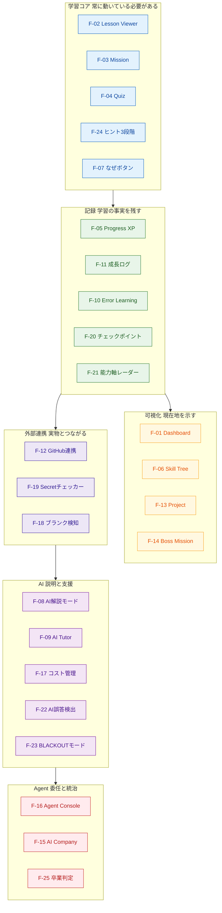
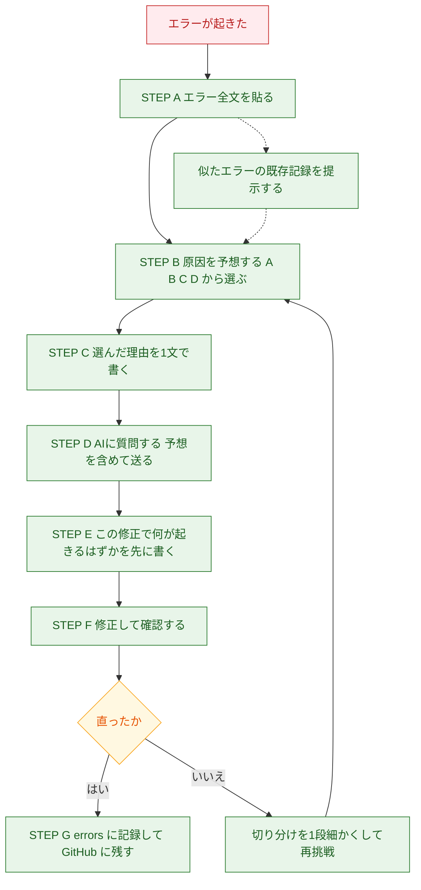
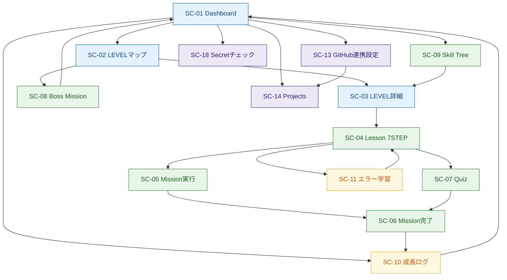
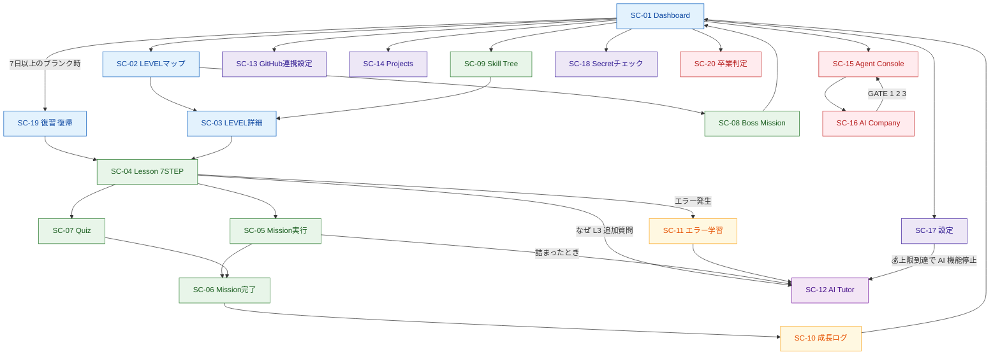
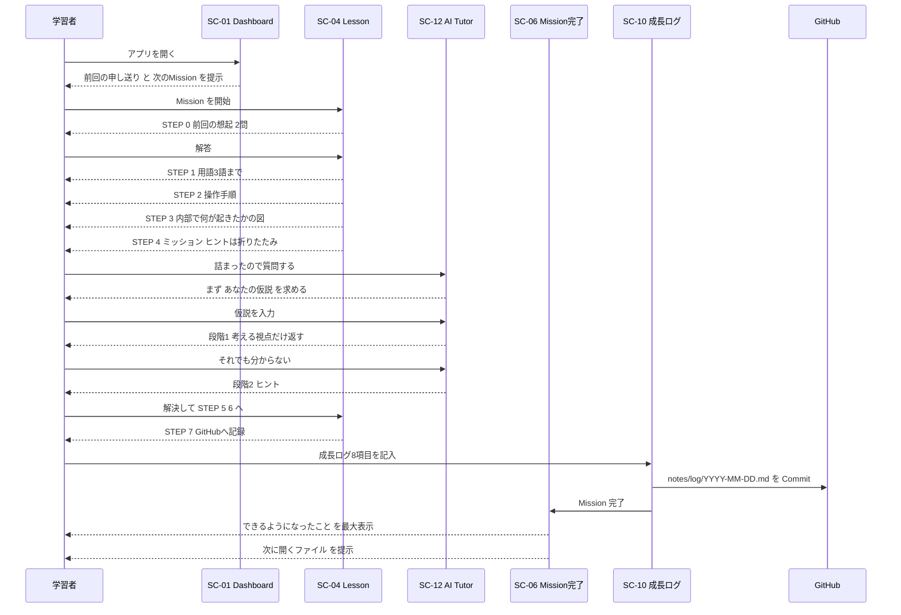

# 02. アプリ機能・UI/UX設計書
### GitHub・API・AI開発 自走型学習アプリ ／ 教材アプリの機能一覧・画面設計

| 項目 | 内容 |
|---|---|
| 対応する要求仕様 | セクション33 の 10（教材アプリの機能一覧）・11（UI/UX構成）、29-D（アプリ機能仕様）・29-E（UI画面一覧） |
| 前提文書 | `00_教育設計書.md`（教育方針・評価・全体マップ）／`01_カリキュラム設計書.md`（LEVEL・Mission・Boss・スキルツリー） |
| 本書が答える引き継ぎ事項 | 00 R-01〜R-14、01 C-02 / C-04 / C-07 / C-09、00 U-04 |
| 後続文書 | `03_技術スタック・アーキテクチャ設計書.md`（実装技術・データモデル）／`04_GitHub連携・AI設計書.md`／`05_セキュリティ設計書.md` |

---

## 本書の位置づけと読み方

本書は **「教材アプリが最終的に何であるか」** と **「その各部分を、学習者がどの LEVEL で自分の手で作るか」** を定義する。

本教材の最大の特徴は、教材アプリが完成品として与えられないことである（00 P-1「Seed App 方式」）。
したがって本書の機能一覧は、**完成品の仕様書であると同時に、17 LEVEL 分の実装課題リストでもある。**

読む順序：

1. **第1章** — 機能の全体像と、Seed App に最初から入っているものとの境界
2. **第2章** — 機能ごとの詳細仕様（25機能）
3. **第3章** — UI/UX構成（画面一覧・遷移図・ワイヤーフレーム・ゲーミフィケーションUI）
4. **第4章** — LEVEL × 機能の段階導入マトリクス
5. **第5章** — 過剰設計の指摘と簡素化案（要求31）

### 表記の約束

| 記号 | 意味 |
|---|---|
| 🌱 | Seed App に最初から含まれる（学習者は作らない） |
| 🧩 | 学習者がその LEVEL で実装する |
| 📦 | 教材提供側がコンテンツとして供給する（実装ではなくデータ） |
| 🛡 | セキュリティに関わる |
| 🤝 | Human-in-the-loop（人間の承認）に関わる |
| 💰 | コストに関わる |
| ⚠ | 意図的に失敗させる／注意喚起 |

---

# 第1章 機能一覧の全体像

## 1.1 設計の出発点：3種類の「作らないもの」を先に決める

機能一覧を書く前に、**アプリが持たないもの** を先に決める。これを決めないと、学習アプリは必ず「教材CMS」に膨張する。

| 作らないもの | 理由 | 代替 |
|---|---|---|
| 教材コンテンツの管理画面（CMS） | 利用者は学習者1人。管理画面を作る学習効果より保守コストが上回る | Markdown ファイルを Git で管理する（`content/` 配下）。編集はエディタ＋PR |
| ユーザー登録・招待・チーム機能 | 対象は1人の学習者（00 2.4 非ゴール） | GitHub アカウントでのログインのみ（LEVEL 10） |
| 通知・メール配信基盤 | 継続の仕組みは GitHub Actions の自動 Issue で代替できる（LEVEL 11） | 毎朝の「今日の学習」Issue（v3.2） |
| リアルタイム同期・WebSocket | 単一ユーザーの単一セッション。必要が発生しない | 通常のリクエスト／レスポンス |
| モバイルアプリ | 範囲外（00 2.4） | レスポンシブ Web |

**この5項目は、要求仕様31（過剰設計の指摘）に対する本書の最初の回答である。**

## 1.2 Seed App に入っているもの／学習者が作るもの

Seed App（v0.1）の中身は、00 P-1 で「単一の `index.html` + `style.css` + `progress.json`、ビルド不要・依存ゼロ・100行未満」と決まっている。
この制約を守ったうえで、機能の帰属を次のように分ける。

| 分類 | 内容 | 帰属 |
|---|---|---|
| **アプリの骨格** | `index.html`（見出しと空の進捗表）、`style.css`（最小限の色とレイアウト）、`progress.json`（LEVEL 0〜17 の定義データ） | 🌱 Seed |
| **教材コンテンツ** | 各 Mission の 7STEP 本文、用語表、ヒント、理解チェック問題、「なぜ？」L1〜L3 の文章、AI誤答サンプル、悪意ある Issue サンプル | 📦 教材提供側（Markdown / JSON） |
| **機能** | 進捗計算、XP、スキルバー、GitHub 連携、AI Tutor、Agent、承認ゲート等 | 🧩 学習者が実装 |

**重要な帰結**：学習者は「教材の文章を書く」のではなく **「教材を表示し、進捗を記録し、AIを組み込む機能」を作る。**
教材本文は最初から全 LEVEL 分がリポジトリに入っている（読める）。**（別リポジトリから取得スクリプトで展開されたものを含む。詳細は 04 5.2.1／5.3.4）**。ただし **v0.1 の時点ではそれを表示する機能がない**（Markdown ファイルとして直接読むことになる）。この「本文はあるのに、まだアプリで読めない」状態が、LEVEL 5〜6 の実装動機になる。

### 📌 教育設計との整合のための小さな調整（本書で確定）

00 P-1 は Seed App の配布形態を「LEVEL 2 で Use this template」としているが、01 の成長表では **LEVEL 1 で `progress.html` を作る**（まだ GitHub を知らない段階）。この2つを両立させるため、本書では次のように確定する。

| LEVEL | Seed App の扱い |
|---|---|
| 1 | 教材サイトから **ZIP でダウンロード**（GitHub を経由しない）。**LEVEL 1 の最終 Mission で VS Code Live Server 拡張を導入し、以降はそれで開く**（03 4.1）。`progress.html` の作成＝Seed の `index.html` を自分で書き換える作業として実施 |
| 2 | GitHub の **テンプレートリポジトリから自分のリポジトリを作成**し、LEVEL 1 の成果物を載せて Push。以降はこのリポジトリが唯一の正 |

この調整により、「GitHub を学ぶ前に GitHub 操作が必要になる」という順序の逆流を回避する。

## 1.3 機能一覧マスタ表（25機能）

| ID | 機能 | 目的（1行） | 初期実装 LEVEL | 完成 LEVEL | 版 | MVP-0 |
|---|---|---|---|---|---|---|
| F-01 | **Dashboard** | 現在地（LEVEL・進捗・スキル）を1画面で示す | 1 🌱🧩 | 10 | v0.2→v3.1 | ✅ |
| F-02 | **Lesson Viewer** | 7STEP 形式の教材本文を表示する | 6 🧩 | 9 | v1.1→v3.0 |  |
| F-03 | **Mission** | Mission の実行・完了記録・次の提示 | 5 🧩 | 10 | v1.0→v3.1 |  |
| F-04 | **Quiz（理解チェック）** | 「なぜ」型の3問で理解を確認する | 5 🧩 | 13 | v1.0→v4.1 |  |
| F-05 | **Progress / XP** | 現在地の可視化（報酬ではない） | 5 🧩 | 10 | v1.0→v3.1 |  |
| F-06 | **Skill Tree** | 知識の依存関係と到達済み範囲を示す | 5 🧩 | 9 | v1.0→v3.0 |  |
| F-07 | **「なぜ？」ボタン** | 操作の理由を3層で開示する | 1 🌱→🧩 | 13 | v0.2→v4.1 | ✅ |
| F-08 | **AI解説モード** | コードを選択して構造を説明させる | 12 🧩 | 13 | v4.0→v4.1 |  |
| F-09 | **AI Tutor** | 段階開示・弱点指摘を行う学習支援AI | 13 🧩 | 13 | v4.1 |  |
| F-10 | **Error Learning** | エラーを予想→検証→記録の教材にする | 5 🧩 | 13 | v1.0→v4.1 |  |
| F-11 | **成長ログ** | 学習の事実と自己認識を記録・蓄積する | 0 📦→🧩 | 13 | 手書き→v4.1 | ✅ |
| F-12 | **GitHub連携** | 学習の実績を GitHub から取得・記録する | 8 🧩 | 15 | v2.0→v5.1 |  |
| F-13 | **Project（成果物）** | これまでに作った実物を一覧する | 8 🧩 | 10 | v2.0→v3.1 |  |
| F-14 | **Boss Mission** | 複数 LEVEL 横断の習熟関門 | 5 🧩 | 11 | v1.0→v3.2 |  |
| F-15 | **AI Company Simulator** | Orchestrator と5役割の運営盤 | 16 🧩 | 17 | v6.0→v7.0 |  |
| F-16 | **Agent Console** | Agent の実行・Dry-run・🤝承認 | 14 🧩 | 15 | v5.0→v5.1 |  |
| F-17 | **💰 コスト管理** | AI 利用量と上限を可視化・強制する | 12 🧩 | 16 | v4.0→v6.0 |  |
| F-18 | **ブランク検知・復習** | 7日以上の中断から復帰させる | 11 🧩 | 13 | v3.2→v4.1 |  |
| F-19 | **🛡 Secretチェッカー** | 危険な文字列と `.gitignore` を自己診断 | 7 🧩 | 7 | v1.2 |  |
| F-20 | **チェックポイント** | Mission 途中の中断・再開 | 10 🧩 | 12 | v3.1 |  |
| F-21 | **能力軸レーダー** | A〜E の5軸を Lv1〜4 で示す | 5 🧩 | 10 | v1.0→v3.1 |  |
| F-22 | **AI誤答検出訓練** | 意図的に誤った回答を検出させる | 12 📦🧩 | 15 | v4.0→v5.1 |  |
| F-23 | **BLACKOUT モード** | AI機能を封じて自力の輪郭を測る | 13 🧩 | 13 | v4.1 |  |
| F-24 | **ヒント3段階** | 方向→手順→答えの段階的足場かけ | 1 🌱→🧩 | 10 | v0.2→v3.1 | ✅ |
| F-25 | **卒業判定（T1〜T4）** | 4検査で自走可能性を判定する | 17 🧩 | 17 | v7.0 |  |

**MVP-0 欄**：✅＝MVP-0 に含む／空欄＝含まない。**MVP-0 および MVP-L の定義は 06 第1章を参照する**（本書では定義を書き下さない）。
この欄は MVP-0 の範囲のみを表す。**MVP-L の範囲は「初期実装 LEVEL」欄が 8 以下の機能**であり、MVP-0 欄とは別の指標である。

> **F-14（Boss Mission）の注記**：初期実装 LEVEL は **5** のままでよい。**LEVEL 3・4 に配置される B1・B2 は Markdown 教材として GitHub 上で実施し（アプリ画面を使わない）、アプリ機能としての実装は LEVEL 5 から**である（3.2 の「提供形態」列を参照）。

## 1.4 機能と教材アプリ成長表の対応

01 の成長表（v0.1→v7.0）に、本書の機能IDを重ねる。

| 版 | LEVEL | 追加される機能ID | 中核となる体験 |
|---|---|---|---|
| v0.1 | 1（配布） | 🌱 骨格のみ | 「動かない紙の表」を手に入れる |
| v0.2 | 1 | F-01（静的）, F-07（静的）, F-24（静的） | 自分で HTML を書き換える |
| v0.3 | 2 | — | **公開URLができる**（GitHub Pages） |
| v0.4 | 3 | — | CHANGELOG とブランチ運用 |
| v0.5 | 4 | — | Issue テンプレートと学習バックログ |
| **v1.0** | 5 | F-03, F-04, F-05, F-06, F-10, F-14, F-21 | **アプリが初めて動く**（localStorage） |
| v1.1 | 6 | F-02 | 外部データが画面に流れ込む |
| v1.2 | 7 | F-19 | 🛡 自分を守る道具を自分で作る |
| **v2.0** | 8 | F-12（read）, F-13 | GitHub の実績が自動で集計される |
| **v3.0** | 9 | F-02（再実装）, F-12（API Route 経由） | 🛡 トークンがブラウザから消える |
| v3.1 | 10 | F-01（DB）, F-03（DB）, F-20, F-21（算出） | 端末を変えても引き継がれる |
| v3.2 | 11 | F-18 | 自動化が自分の行動を変える |
| **v4.0** | 12 | F-08, F-17, F-22 | 教材が自分自身の説明を生成する |
| **v4.1** | 13 | F-07（AI版）, F-09, F-10（AI解説）, F-23 | **AI Tutor が喋り出す** |
| **v5.0** | 14 | F-16 | 🤝 承認ゲート付きの最初の Agent |
| v5.1 | 15 | F-12（write） | 自分が11 LEVEL 前に書いた Issue を AI が処理する |
| **v6.0** | 16 | F-15（チーム） | 5役割が GitHub 経由で連携する |
| **v7.0** | 17 | F-15（会社）, F-25 | Orchestrator が3ゲートで運営する |

## 1.5 機能の分類（保守の単位）



**この5層は、そのまま「壊れたときの影響範囲」でもある。** 学習コアが壊れると学習が止まる。AI 層が壊れても学習は続けられる。この優先度は、後の障害時の切り分け（LEVEL 5 以降のデバッグ教材）でも使う。

---

# 第2章 機能別詳細仕様

各機能を次の項目で定義する。

- **目的**：この機能がないと何が失われるか
- **学習者が実装する LEVEL**：成長表と整合
- **入力 / 出力**
- **振る舞い**：主要な仕様
- **教育設計上の制約**：00 の R-xx に由来する必須要件
- **簡素化の指針**：やりすぎないための境界

---

## F-01 Dashboard

| 項目 | 内容 |
|---|---|
| 目的 | 「自分は今どこにいて、次に何をするか」を、起動して3秒で示す |
| 実装 LEVEL | **1**（静的HTML）→ **5**（JS で動的計算）→ **8**（GitHub 実績を合流）→ **10**（DB 同期） |
| 版 | v0.2 → v1.0 → v2.0 → v3.1 |
| 入力 | 進捗データ（localStorage / DB）、GitHub 集計値、成長ログの最終記録日 |
| 出力 | 現在 LEVEL、総合進捗率、スキルバー6本、SECURITY RANK、能力軸レーダー、次の Mission、前回の申し送り |

### 表示要素の優先順位（上から順に画面上部）

| 順 | 要素 | 根拠 |
|---|---|---|
| 1 | **次にやること**（Mission 名 + 所要時間 + 「次に開くファイル」） | 00 P-16。再開ポイントの明示が離脱防止の最大要因 |
| 2 | **前回の申し送り**（成長ログ項目8 の1行） | 00 5.6。中断からの復帰装置 |
| 3 | AI DEVELOPER LEVEL（クリア済み最高 LEVEL） | 要求8 |
| 4 | **能力軸レーダー**（A〜E × Lv1〜4） | 00 R-08。**スキルバーと同等以上の面積を与える** |
| 5 | スキルバー6本（GitHub / Web / API / DevOps / AI / Agent） | 要求8 |
| 6 | SECURITY RANK（S0〜S3、バーではなくバッジ） | 00 5.8.3 |
| 7 | 総合進捗率（完了 Mission / 133） | 要求8 |
| 8 | 直近の成果物リンク（公開URL / 最新 Commit / Merge 済み PR） | 00 5.3.2「実報酬は GitHub 上の実物」 |
| 9 | XP 総量 | **最小表示**（00 R-01） |

### 教育設計上の制約

- **XP を画面最上部・最大文字で出してはならない**（00 P-11 / R-01）。XP は座標であって報酬ではない
- 7日以上のブランクがある場合、最上部が「復習 Mission」に置き換わる（F-18）
- LEVEL 1 の時点では **すべて手書きの静的HTML**。動かないことが正しい

### 簡素化の指針

- グラフライブラリを導入しない。レーダーは **インライン SVG の直書き**（LEVEL 5 の学習範囲で書ける）、バーは `div` の幅指定で足りる
- ⚠ 「アニメーション付きの XP 加算演出」は作らない。演出は報酬設計であり、00 P-11 の判断と矛盾する

---

## F-02 Lesson Viewer

| 項目 | 内容 |
|---|---|
| 目的 | 7STEP 形式の教材本文を、認知負荷を制御した形で提示する |
| 実装 LEVEL | **6**（fetch で構造化 JSON を読む簡易版）→ **9**（Next.js のルーティング＋Markdown レンダラで正式版） |
| 版 | v1.1 → v3.0 |
| 入力 | **LEVEL 6**：`content/level{NN}/mission-{NN}-{N}.json`（ステップ単位で構造化）<br>**LEVEL 9 以降**：`content/level{NN}/mission-{NN}-{N}.md`（Markdown レンダラ導入後）<br>いずれも 📦 教材提供側 |
| 出力 | STEP 0〜7 を1画面に1STEP ずつ表示。進むボタンで次 STEP |

### 7STEP の画面上の扱い（00 5.2 と1対1で対応）

| STEP | 画面上の形式 | 必須要件 |
|---|---|---|
| 0 前回の想起 | 2問のカード。答えを入力してから前回の要点を開示 | **省略ボタンを置かない**（R-04） |
| 1 今日覚えること | 用語カード最大3枚。各カードは4欄＋「自分の言葉」入力欄 | 4枚目以降を表示しない（作業記憶の制約） |
| 2 実際にやる | 手順リスト。1手順1行。画面上の位置を明記 | チェックを付けながら進める |
| 3 何が起きたか | notional machine 図（Mermaid または静的 SVG） | 操作の直後に置く |
| 4 ミッション | 課題文＋ヒント3段階（F-24） | 答えを初期表示しない |
| 5 AIサポート | ★仮説入力欄（必須）＋8項目テンプレート生成 | 空欄で送信不可（R-02） |
| 6 理解チェック | Quiz 3問（F-04） | 暗記問題を出さない |
| 7 GitHubへ記録 | Commit メッセージ雛形＋成長ログ8項目フォーム | 項目3は空欄保存不可（R-07） |

### 振る舞い

- 1画面 = 1STEP。上下スクロールで全STEP を一望させない（**一望させると圧倒される**）
- 画面上部に常時「STEP 3 / 7」の進行インジケータ
- LEVEL 12 以降は STEP 単位がそのままチェックポイント（F-20）になる
- 「今は覚えなくてよいこと」は **薄いグレーの独立ブロック** で明示（00 5.7 対策4）

### 簡素化の指針

- **LEVEL 6 の簡易版では Markdown をレンダリングしない。** この時点では npm が存在せず（依存ゼロ制約）、レンダラを導入できない。したがって LEVEL 6 では `content/*.json` にステップ単位で構造化された教材を `fetch` して表示する（学習目的は fetch と JSON であり、Markdown 描画ではない）
- **LEVEL 9 で npm を得た後に、既製の Markdown レンダラを1つ導入する**（候補は 03 の U-11）。独自記法を発明しない
- ただし **3つの独自ブロック記法だけは必要**：`:::why`（なぜボタン）、`:::hint`（3段階ヒント）、`:::warn`（⚠ 失敗の予告）。これ以上は増やさない

> ⚠ **実行前提（03 4.1）**：この `fetch` は `file://` では動かない（ブラウザのスキーム制限でブロックされ、しかもエラーに "CORS" の語が含まれるため LEVEL 6 の学習内容と誤認される）。**LEVEL 1 以降は VS Code Live Server 拡張、または GitHub Pages の公開URLで開くことを前提とする。**

---

## F-03 Mission

| 項目 | 内容 |
|---|---|
| 目的 | 15〜30分で完結する単位を管理し、「何もできていない日」を作らない |
| 実装 LEVEL | **5**（localStorage）→ **10**（DB） |
| 版 | v1.0 → v3.1 |
| 入力 | Mission 定義（📦）、学習者の完了操作、ヒント使用履歴 |
| 出力 | 完了状態、XP、スキル配分、次 Mission の提示 |

### Mission 完了画面の情報設計（00 R-01 の直接実装）

```
┌──────────────────────────────────────────────┐
│  🎉  できるようになったこと                     │  ← 最大表示（24px相当）
│                                              │
│  「変更した内容を、いつでも戻せる形で             │
│    記録として残せるようになりました」            │
│                                              │
├──────────────────────────────────────────────┤
│  作ったもの                                    │
│   → github.com/you/ai-developer-training/... │  ← 実物へのリンク
├──────────────────────────────────────────────┤
│  次にやること                                  │
│   Mission 2-5：Push して GitHub で確認する      │
│   次に開くファイル：GitHub Desktop              │  ← 再開ポイント
├──────────────────────────────────────────────┤
│  GitHub ▓▓▓▓▓░░░░░ 48%   (+80)               │  ← 小さく
│  XP 1,240                                     │  ← 最小
└──────────────────────────────────────────────┘
```

### 教育設計上の制約

- ヒントを見ても、失敗しても **XP を減らさない**（00 5.3.2）
- ただし **ヒント3（答え）まで見た Mission は「要復習」フラグ** を持ち、後日の想起テストに優先出題（適応的復習）
- Mission は **不合格でも次に進める**。進行ゲートは Boss Mission のみ（R-09）

---

## F-04 Quiz（理解チェック）

| 項目 | 内容 |
|---|---|
| 目的 | 暗記ではなく「なぜそうするのか」を確認する |
| 実装 LEVEL | **5**（静的な問題データ）→ **13**（AI が問題を生成） |
| 版 | v1.0 → v4.1 |
| 入力 | 問題データ（📦）／ LEVEL 13 以降は AI 生成 |
| 出力 | 正誤、解説、誤答時の該当 STEP へのリンク |

### 出題形式の制約（00 5.2 STEP 6）

| 許可する形式 | 禁止する形式 |
|---|---|
| 「なぜ○○するのか」 | 「○○とは何ですか」の4択（用語の再認） |
| 「これを消すとどうなるか」 | 用語とその定義の線結び |
| 「この状況ではどちらを選ぶか、理由も」 | コマンドのスペル問題 |
| 「この AI の回答のどこが誤りか」（LEVEL 12 以降） | — |

- 1 Mission につき3問。全問正解を要求しない
- 誤答時は **正解を示す前に、該当 STEP へ戻すリンク** を出す
- LEVEL 13 以降の AI 生成問題には「暗記問題を出すな」というプロンプト制約を入れる（04 の AI Tutor 設計で定義）

---

## F-05 Progress / XP / スキルバー

| 項目 | 内容 |
|---|---|
| 目的 | **現在地の可視化**（報酬ではない） |
| 実装 LEVEL | **5** → **10**（DB 同期） |
| 版 | v1.0 → v3.1 |

### 数値の定義（00 5.8.3・01 6.3 と一致）

| 表示 | 定義 |
|---|---|
| AI DEVELOPER LEVEL | クリア済みの最高 LEVEL 番号 |
| 総合進捗率 | 完了 Mission 数 / 133 |
| スキルバー（6本） | カテゴリ別獲得 Mission XP / カテゴリ別 Mission XP 満点 |
| SECURITY RANK | S0 / S1（L2 到達）/ S2（L7 到達）/ S3（L13 到達） |
| 総 XP の満点 | 23,140（Mission 13,740 + Boss 8,400 + Blackout 1,000） |

**スキルバーの分母（実装ルール・01 第3章と一致）**

- **スキルバーの分母は Mission XP のみ（13,740。内訳は 01 第3章の LEVEL 別「主スキル」配分表）。**
- **Boss XP・Blackout XP はスキルバーには一切反映されず、総 XP 表示（23,140）にのみ加算される。** したがって全 Mission をクリアした学習者のスキルバーは6本すべて満タンになるが、総 XP は 13,740 / 23,140 にとどまる（これは不具合ではない）。
- Boss XP を個別スキルに配分する表は**作らない**（分母が二重定義になるため）。
- **スキルバーは、F-21 の能力軸レーダー（A〜E）とは別の指標である**（03 5.6）。スキルバーは XP の累積量、能力軸レーダーは Boss 通過という証拠で動く。

### 教育設計上の制約

- **ペナルティを実装しない。** 減点は失敗の隠蔽を招く
- レベルアップ演出・連続ログイン日数・ランキング・バッジ収集は **実装しない**（外発的報酬による内発的動機の毀損。00 P-11）
- 代わりに「実報酬」は GitHub 上の実物とする：公開URL、Contribution グラフ、Merge 済み PR 数 → これらは F-12 が取得して Dashboard に表示

---

## F-06 Skill Tree

| 項目 | 内容 |
|---|---|
| 目的 | 「なぜこの順序で学ぶのか」を構造として見せる |
| 実装 LEVEL | **5**（静的な CSS グリッド表示）→ **9**（コンポーネント化・現在地ハイライト） |
| 版 | v1.0 → v3.0 |
| データ源 | 01 第5章のスキルツリー（ノード ID・依存関係） |

### 表示仕様

- ノードは3状態：**未解放（グレー）／解放済み（色付き）／現在地（枠線強調）**
- ノードをクリックすると「このスキルを使う Mission 一覧」と「このスキルの前提スキル」を表示
- **依存の矢印を必ず描く。** ツリーの価値は「何を持っているか」ではなく「何の上に立っているか」の可視化にある

### 簡素化の指針

- ⚠ ドラッグ可能なグラフ描画ライブラリ（vis.js / cytoscape 等）は **導入しない**。ノード数は32、依存は固定。**CSS Grid に手で配置した静的レイアウトで十分**
- LEVEL 5 の学習者が書けるのは HTML/CSS/素の JS だけである。この制約は機能仕様側が守る

---

## F-07 「なぜ？」ボタン

| 項目 | 内容 |
|---|---|
| 目的 | 操作の背後にある設計思想まで開示する（要求11） |
| 実装 LEVEL | **1**（`<details>` による静的3層）→ **13**（L3 を AI が生成・拡張） |
| 版 | v0.2 → v4.1 |

### 3層構造（00 5.4）

| 層 | ラベル | 分量 | 実装 |
|---|---|---|---|
| L1 | 「ひとことで」 | 1〜2文 | 📦 教材本文に静的に含める |
| L2 | 「もう少し詳しく」 | 1段落＋図 | 📦 静的 |
| L3 | 「設計思想まで」 | 3〜5段落 | 📦 静的（**Mission ごとに1つだけ強調表示**）／LEVEL 13 以降は AI による追加質問に対応 |

### 振る舞い

- L1 は全操作の横に小さく常設。L2 / L3 は折りたたみ
- **各 Mission で L3 が1つだけ「今日のなぜ」として展開状態で表示される**（R-05）
- L3 の末尾には必ず **「では、いつこれをやってはいけないか？」** の節がある（適用条件の教育）
- L3 の閲覧履歴を記録し、Boss Mission の設問に反映（01 4.1）

---

## F-08 AI解説モード

| 項目 | 内容 |
|---|---|
| 目的 | AIが生成したコードを「読める」状態にする（要求12） |
| 実装 LEVEL | **12**（用語解説として）→ **13**（コード解説として完成） |
| 版 | v4.0 → v4.1 |
| 入力 | 選択されたコード範囲、ファイルパス、学習者の現在 LEVEL |
| 出力 | 7項目の構造化された解説（Structured Output で形式固定） |

### 出力項目と設計上の扱い（00 5.7 対策4）

| 項目 | 扱い |
|---|---|
| このコードの目的 | 必須 |
| 意味のある単位ごとの説明 | 必須。**全行逐語解説はしない**（認知負荷が過大） |
| 入力 / 出力 | 必須 |
| なぜ必要なのか | 必須 |
| 消したらどうなるか | 必須 |
| **初心者が覚えるべきポイント** | **3点以内に絞る。最重要** |
| **今は覚えなくてよい部分** | **明示的に列挙する。最重要** |

### 振る舞い

- **現在 LEVEL を必ずプロンプトに渡す。** LEVEL 5 の学習者に非同期処理の説明を始めてはいけない
- 未習の概念が出てくる場合、「これは LEVEL 9 で学びます」とだけ言って踏み込まない
- 同一コード片の解説結果はキャッシュする（💰 コスト削減。LEVEL 13）

---

## F-09 AI Tutor

| 項目 | 内容 |
|---|---|
| 目的 | 「自分で考える → ヒント → 解説」の段階開示を行い、丸投げを構造的に防ぐ |
| 実装 LEVEL | **13** |
| 版 | v4.1 |

（プロンプト設計・段階開示ロジック・Memory 設計の詳細は `04_GitHub連携・AI設計書.md` 第2章）

### 画面上の必須要素

| 要素 | 必須理由 |
|---|---|
| ★「あなたはどこが原因だと思いますか？」入力欄 | R-02。**空欄では送信ボタンが押せない** |
| 8項目テンプレートの自動生成ボタン | 00 5.2 STEP 5。良い質問の型を体で覚えさせる |
| 「まず自分で考える（3分）」タイマー | 段階開示の第1段階。スキップ可能だがスキップ率を記録 |
| 回答の直後に置く「この修正で何が起きるはずですか？」欄 | 00 5.5 STEP E。**実行前の予測が懐疑力の訓練点** |
| 「AIの回答は正しかったか（○△×）」の事後入力 | 成長ログ項目7。懐疑力の定量化 |

### 仮説入力の形骸化対策（00 5.7 対策1）

- 入力が10文字未満、または「わからない」等のパターンに一致した場合、**選択式の仮説候補を4つ提示**（自由記述より負荷が低い）
- 仮説が当たった場合、明示的に「あなたの予想が当たりました」と表示（有能感の供給）
- 仮説の的中率を記録し、能力軸 A / D の指標にする

---

## F-10 Error Learning

| 項目 | 内容 |
|---|---|
| 目的 | エラーを「失敗」ではなく教材として扱う（要求13） |
| 実装 LEVEL | **5**（記録フォーム）→ **13**（AI 解説の統合） |
| 版 | v1.0 → v4.1 |

### フロー（00 5.5 の実装）



### 教育設計上の制約

- **STEP B の選択肢に「わからない」を含めない**（当てずっぽうでも仮説を立てる訓練）
- **STEP C（理由を1文）を省略できない**（自己説明効果）
- **STEP E（実行前の予測）が最重要**。ここが懐疑力の訓練点
- 記録先は学習リポジトリの `errors/YYYY-MM-DD-症状.md`。テンプレートは 00 5.5 のもの
- 過去記録との類似検出は **キーワード一致で十分**（⚠ ベクトル検索は過剰。Advanced A-4 の範囲）

---

## F-11 成長ログ

| 項目 | 内容 |
|---|---|
| 目的 | 学習者自身のメタ認知装置。副次的に AI Tutor の Memory（要求16） |
| 実装 LEVEL | **0**（手書き Markdown）→ **8**（GitHub 集計）→ **10**（DB 化）→ **13**（AI が読む） |
| 版 | 手書き → v2.0 → v3.1 → v4.1 |

### 記録項目（00 5.6 の8項目）

1. やったこと（事実）
2. 理解したこと（自分の言葉で。教材のコピー禁止）
3. **まだ分かっていないこと ★空欄保存不可（R-07）**
4. 詰まった箇所と、詰まっていた時間
5. 発生したエラー（`errors/` へのリンク）
6. AIに何と質問したか（実際の文面）
7. AIの回答は正しかったか（○ / △ / ×）
8. 明日の自分への申し送り（1行必須）

### 二重保存の設計

| 保存先 | 目的 | LEVEL |
|---|---|---|
| 学習リポジトリ `notes/log/YYYY-MM-DD.md` | GitHub Contribution グラフに反映＝継続の動機。人間が読む正本 | 0〜 |
| DB（`growth_logs`） | AI Tutor が構造化データとして読む。集計・弱点分析 | 10〜 |

**正本は Markdown 側とする。** DB は派生データであり、失われても Markdown から再構築できる（03 のデータモデルで再掲）。

---

## F-12 GitHub連携

| 項目 | 内容 |
|---|---|
| 目的 | 学習の実績を「自己申告」ではなく「実物」で示す |
| 実装 LEVEL | **8**（ブラウザから読み取り）→ **9**（API Route 経由）→ **10**（ログイン）→ **15**（Agent の書き込み） |
| 版 | v2.0 → v3.0 → v3.1 → v5.1 |

（認証方式・API・Rate Limit の詳細は `04_GitHub連携・AI設計書.md` 第1章）

### 段階と画面上の表現

| LEVEL | 権限 | 画面上の表現 |
|---|---|---|
| 8 | fine-grained PAT / Contents: Read + Issues: Write | 設定画面（SC-13）でトークンを入力し **`sessionStorage`** に保持（タブを閉じると消える）。⚠ **開発者ツールで見えることを意図的に体験させる** |
| 9 | 同上（サーバ側に隔離） | トークン入力欄が消える。「サーバ側に保管中」の表示のみ |
| 10 | GitHub ログイン（Supabase Auth 経由） | 「GitHubでログイン」ボタン |
| 15 | GitHub App（Agent 用・Contents/PR: Write） | 🤝 Agent Console 内で権限の一覧と、承認なしでは実行されない旨を常時表示 |

### 🛡 SC-13（GitHub 連携設定）の PAT 入力欄の制約（03 4.4）

| 項目 | 仕様 |
|---|---|
| 保管先 | **`sessionStorage`**。`localStorage` にも `.env.local` にも置かない（STACK A にはビルドも Node.js もなく、ブラウザは `.env.local` を読めない） |
| 入力欄の有効条件 | `location.hostname` が `localhost` / `127.0.0.1` のときのみ有効 |
| **公開URL上での挙動** | **GitHub Pages の公開URLで開いた場合、PAT 入力欄は無効化（disabled）される。** 「トークンの入力はローカル（Live Server）でのみ行えます」という説明を画面上に常時表示する |
| LEVEL 9 以降 | 入力欄そのものが消える（サーバ側に隔離される） |

### 表示する集計値（v2.0）

総 Commit 数 / 作成 Issue 数 / Close した Issue 数 / Merge した PR 数 / 学習日数（Commit のある日数）/ 現在の連続記録

---

## F-13 Project（成果物一覧）

| 項目 | 内容 |
|---|---|
| 目的 | **実報酬の可視化。** XP ではなく「作った実物」を並べる |
| 実装 LEVEL | **8** → **10** |
| 版 | v2.0 → v3.1 |

一覧に並ぶもの：公開URL（GitHub Pages / Vercel）、リポジトリ、Merge 済み PR、Boss Mission の成果物、`errors/` の記録数、`decisions/` の記録数

**この画面が、00 P-11 で XP から降格させた「報酬」の受け皿である。**

---

## F-14 Boss Mission

| 項目 | 内容 |
|---|---|
| 目的 | 習熟の関門（Mastery Gate）。**唯一の進行ゲート** |
| 実装 LEVEL | **5**（表示と自己申告）→ **8**（GitHub API による自動判定）→ **11**（CI 結果の取り込み） |
| 版 | v1.0 → v2.0 → v3.2 |

> **B1・B2 の提供形態**：**B1（LEVEL 3後）・B2（LEVEL 4後）はアプリ画面（SC-08）を使わず、📦 Markdown 教材として GitHub 上で実施する**（この時点ではアプリに Boss を表示する機能が存在しないため）。判定は **AI レビュー＋自己申告**の2系統で行い、自動判定は使わない。アプリ機能としての Boss Mission は **LEVEL 5 から**である。

### 画面仕様

- **手順を表示しない。** 要求と完了条件のみ
- チェックポイント3〜5個（各30分以内）。中断・再開できる
- ヒントを見ると「再挑戦推奨」マークが付く（Mission と異なる扱い）
- 合否は3系統：**自動判定（GitHub API）＋ AI レビュー ＋ 自己申告**
- 不合格時は、該当 LEVEL の復習 Mission を自動生成して提示

### 自動判定の対象（B1〜B8）

判定ロジックの詳細は `04_GitHub連携・AI設計書.md` 1.5 に定義する。本書では画面上の扱いのみ規定：**判定結果は「合格／不合格」ではなく「満たした条件／満たしていない条件」の一覧で示す。**

---

## F-15 AI Company Simulator

| 項目 | 内容 |
|---|---|
| 目的 | 5役割 + Orchestrator の運営盤。**AI の性能ではなく人間の統治能力を可視化する** |
| 実装 LEVEL | **16**（チーム）→ **17**（会社・3ゲート・指標） |
| 版 | v6.0 → v7.0 |

（役割定義・ワークフローの詳細は `04_GitHub連携・AI設計書.md` 第4章）

### 画面上の要素

| 要素 | 内容 |
|---|---|
| 役割カード6枚 | Orchestrator / Planner / Developer / Reviewer / QA / Docs。各カードに **権限バッジ**（Read only / Contents:Write 等）を常時表示 |
| 進行ボード | GitHub Issue / PR と1対1で対応。**アプリ内に独自のタスク状態を持たない** |
| 🤝 Human Gate 表示 | GATE 1（着手前）/ GATE 2（PR前）/ GATE 3（Merge前）の3つ。承認待ちは画面上部に固定表示 |
| 運営指標 | リードタイム / 手戻り率 / コスト / **Gate 差し戻し率** |
| decisions | 各 Gate の判断を1行以上記録する入力欄。未記入では次に進めない |

### 教育設計上の最重要仕様

> **差し戻し率 0% は「見ていない」証拠として警告表示する。**（01 LEVEL 17 つまずき対策）

これは本アプリで最も逆説的な UI 仕様である。**全部承認している学習者に、赤い警告を出す。** 統治の教育とは、承認を止める訓練である。

---

## F-16 Agent Console

| 項目 | 内容 |
|---|---|
| 目的 | Agent の実行・観測・🤝承認を1画面で行う |
| 実装 LEVEL | **14**（学習プラン提案 Agent）→ **15**（Issue 処理 Agent） |
| 版 | v5.0 → v5.1 |

### 画面構成（3ペイン）

```
┌────────────────┬──────────────────────┬───────────────┐
│ 実行           │ トレース              │ 承認          │
│                │                      │               │
│ 対象Issue      │ [1] 思考             │ ⏸ 承認待ち     │
│ #42            │ [2] tool: read_file  │               │
│                │ [3] 結果 (280B)      │ 提案された変更 │
│ 上限           │ [4] 思考             │  3ファイル     │
│  反復 8回      │ [5] tool: propose... │  +42 -15行    │
│  コスト $0.20  │                      │               │
│  変更 3ファイル │ 反復 5 / 8          │ [ diff表示 ]  │
│                │ コスト $0.08 / $0.20 │               │
│ [ 実行 ]       │                      │ [承認] [差戻] │
└────────────────┴──────────────────────┴───────────────┘
```

### 必須の UI 制約（🛡 セキュリティ）

| 制約 | 理由 |
|---|---|
| **「常に承認する」チェックボックスを作らない** | 承認ゲートの無効化は禁止事項（00 P-18） |
| 承認ボタンは **diff を最後までスクロールしないと有効化されない** | 形骸化対策 |
| 上限（反復・コスト・変更規模）は実行前に常時表示 | 暴走の予防 |
| 停止ボタンを常時表示 | fail-safe |
| 差し戻し理由の入力を必須にする | 学習者の判断を言語化させる＝能力軸 E の訓練 |

---

## F-17 💰 コスト管理

| 項目 | 内容 |
|---|---|
| 目的 | 課金への不安を最初に解消し、暴走を仕組みで防ぐ |
| 実装 LEVEL | **12**（**LEVEL 12 の第1 Mission**）→ **16**（役割別の予算） |
| 版 | v4.0 → v6.0 |

### 仕様

- 月間上限を学習者自身が設定（初期値は控えめな既定値）
- **50% / 80% で警告。100% で AI 機能を停止**（学習は継続できる）
- 呼び出しごとに `input_tokens` / `output_tokens` / 概算コスト / モデル / 機能名を記録
- ダッシュボードに「今月の使用量」と「機能別の内訳」
- LEVEL 16 以降は **役割別（Planner / Developer / …）の内訳** を表示 → 「どの役割が高いか」の気づきが役割設計の改善につながる

**設計判断**：上限到達時に「課金してください」と促す導線を作らない。教材は無料枠の範囲で完結することを前提にする。

---

## F-18 ブランク検知・復習

| 項目 | 内容 |
|---|---|
| 目的 | 7日以上の中断からの復帰（00 P-16 / R-10） |
| 実装 LEVEL | **11**（GitHub Actions の schedule トリガー）→ **13**（AI が復習内容を生成） |
| 版 | v3.2 → v4.1 |

### 2系統の実装

| 系統 | 仕組み | LEVEL |
|---|---|---|
| **GitHub 側** | 毎朝 `schedule` で起動する Workflow が「今日の学習」Issue を自動生成。7日以上空いている場合は「復習 Mission 提案」Issue になる | 11 |
| **アプリ側** | 起動時に最終学習日を確認し、7日以上ならダッシュボード最上部を「10分の要点復習」に置き換える | 11（判定）／13（内容の AI 生成） |

**GitHub 側を先に作るのが重要である。** アプリを開かなくなった学習者に届くのは、GitHub の通知だけだからである。

---

## F-19 🛡 Secretチェッカー

| 項目 | 内容 |
|---|---|
| 目的 | 「自分を守る道具を、自分で作る」 |
| 実装 LEVEL | **7** |
| 版 | v1.2 |

### 仕様

- `.gitignore` の内容を貼り付けると、必須5項目（`.env.local`、`node_modules`、`*.key`、`.DS_Store`、ビルド成果物）の有無を判定
- コードを貼り付けると危険パターンを検出：`ghp_` / `github_pat_` / `sk-` 等で始まる文字列、`token = "..."`、`password = "..."`、`API_KEY = "..."` の直書き
- 検出時は **「まず失効させる → それから履歴から消す」** の順序を必ず表示（05 セキュリティ設計書 第8章と一致）

### 簡素化の指針

- 正規表現5〜10本で足りる。⚠ 既製のシークレットスキャナを組み込まない（GitHub の Push Protection がすでに存在する。**それを教えることが本質**）
- この機能の教育的価値は「検出精度」ではなく「危険なパターンの型を自分の手で書く」ことにある

---

## F-20 チェックポイント（中断・再開）

| 項目 | 内容 |
|---|---|
| 目的 | LEVEL 12 以降の30分 Mission を途中で中断・再開できるようにする（R-12） |
| 実装 LEVEL | **10**（DB を得た直後） |
| 版 | v3.1 |

- Mission 内の各 STEP 完了時に自動保存（明示的な保存ボタンを置かない）
- 再開時は「STEP 4 の途中から再開しますか？」と提示
- 保存されるもの：STEP 番号、入力途中のテキスト（仮説・成長ログ）、ヒント開示状態、Quiz の解答途中

---

## F-21 能力軸レーダー

| 項目 | 内容 |
|---|---|
| 目的 | A 読解力 / B 指示力 / C 復旧力 / D 懐疑力 / E 統治力 を Lv1〜4 で示す（00 R-08） |
| 実装 LEVEL | **5**（静的表示）→ **10**（算出ロジック） |
| 版 | v1.0 → v3.1 |

- **更新タイミングは Boss Mission（B1〜B8）および卒業判定（T2・T3）の通過時のみ**（日々の Mission では動かない）。軽々に動く指標にしない
- **証拠源は Boss / 卒業判定の結果のみ**。Quiz 正答率・予測的中率・誤答検出率などの副次的な数値は**参考値として表示してよいが、Lv の判定には使わない**
- **算出アルゴリズムの正典は 03 5.6**（Boss と軸の1対1対応表を含む）。本書では条件を書き下さない
- **スキルバー（F-05）とは別の指標である。** スキルバーは Mission XP の累積量、能力軸レーダーは Boss 通過という証拠で動く
- **スキルバーより上位の指標として扱う**（面積・位置ともに）

---

## F-22 AI誤答検出訓練

| 項目 | 内容 |
|---|---|
| 目的 | 懐疑力（能力軸 D）の直接訓練（00 5.7 対策3 / R-13 / U-04） |
| 実装 LEVEL | **12**（機能化）→ **15**（悪意ある Issue へ発展） |
| 版 | v4.0 → v5.1 |

### コンテンツ形式（U-04 への回答）

誤答サンプルは 📦 教材データとして次の JSON 構造で持つ。**AI に誤答を生成させない**（再現性がなく、教材として成立しない）。

```json
{
  "id": "wrong-012",
  "level": 12,
  "category": "存在しないAPI",
  "prompt": "学習者が投げた質問（文脈）",
  "ai_answer": "AIの回答全文（誤りを含む）",
  "flaws": [
    { "line_range": [4, 6], "type": "存在しないエンドポイント",
      "explanation": "このパスは実在しない。公式ドキュメントで確認する習慣を。" }
  ],
  "decoys": [
    { "line_range": [9, 9], "why_not_a_flaw": "見慣れないが正しい書き方" }
  ]
}
```

- **`decoys`（正しいのに怪しく見える箇所）を必ず含める。** 「全部疑う」は懐疑ではなく思考停止である
- 誤りの6分類（00 5.7 対策3）：存在しないAPI／古い仕様／過剰な変更／危険な権限／Secret の露出／動くが不適切
- 検出できたら大きくフィードバックする（有能感の供給）

---

## F-23 BLACKOUT モード

| 項目 | 内容 |
|---|---|
| 目的 | 「AIと一緒ならできる」を「できる」と誤認させない（00 5.7 対策2） |
| 実装 LEVEL | **13**（AI 機能が揃った後） |
| 版 | v4.1 |

- モードON中は AI Tutor・AI解説・なぜ？L3 の AI 拡張がすべて無効化される
- 制限時間タイマーを表示
- **不合格でも進行は止めない。** 結果を成長ログに記録し、自己認識の材料にする
- PHASE 1〜2 の BLACKOUT は紙とターミナルだけで行うため、アプリ側の実装は不要（LEVEL 13 で初めて機能として必要になる）

---

## F-24 ヒント3段階

| 項目 | 内容 |
|---|---|
| 目的 | ZPD に沿った足場かけ。答えを最初から見せない（R-03） |
| 実装 LEVEL | **1**（`<details>` の3段）→ **10**（開示履歴の記録） |
| 版 | v0.2 → v3.1 |

| 段階 | 内容 | 表示 |
|---|---|---|
| ヒント1 | 方向（どこを見るべきか） | 折りたたみ |
| ヒント2 | 手順（何をするか。結果は言わない） | ヒント1 を開いた後に出現 |
| ヒント3 | 答え（完全手順・スクリーンショット付き） | ヒント2 を開いた後に出現 |

- **段階を飛ばして開けない。** 順に開く必要がある
- 開示段階を記録し、ヒント3 まで見た Mission は「要復習」フラグ（F-03）

---

## F-25 卒業判定（T1〜T4）

| 項目 | 内容 |
|---|---|
| 目的 | 要求32「本当に自走できるようになるか」の判定（00 2.5） |
| 実装 LEVEL | **17** |
| 版 | v7.0 |

| 検査 | 内容 | 判定 |
|---|---|---|
| T1 未知コードベース参入 | 未知の OSS リポジトリを1つ指定し、指定の Issue に対する修正方針を PR の下書きとして提出する（2時間以内） | 方針が的確で、既存コードの文脈を踏まえている |
| T2 破壊復旧 | 誤った変更が3件 Merge されたリポジトリを復旧する | 原因3件特定 + 履歴保持 + 再発防止1つ |
| T3 AI誤答検出 | 巧妙に誤った AI 回答3件から誤りを検出する。**難度3段階（明白に誤り／微妙に誤り／正しいものを1件混ぜる）** | 3件中2件以上 + 根拠の説明。**正しい回答を誤りと申告しないこと**（過剰懐疑の検出） |
| T4 統治実績確認 | AI に処理させた Issue が3件以上あり、うち1件以上で差し戻しを行っている | 3件の実績と1件以上の差し戻し記録が `decisions/` にあること |

- T1 用の「未知の OSS リポジトリ・Issue のプール」は 📦 教材提供側が用意（B-2 で選定）
- T2 用の「壊れたリポジトリ」は 📦 教材提供側がテンプレートリポジトリとして用意（01 C-04）
- T3 は F-22 のコンテンツを流用（難度最高のものを使用）。**正答サンプル1件を混ぜるため、F-22 のコンテンツに「誤りのない回答」も含める必要がある**
- **T1・T2 の採点者は、第三者または別セッションの AI とすることを推奨する**（自己採点では判定が甘くなる）

---

# 第3章 UI/UX構成

## 3.1 UI設計の7原則

教育設計（00 第5章）から導かれる、本アプリ固有の UI 原則。

| # | 原則 | 具体的な帰結 |
|---|---|---|
| 1 | **一度に1つのことだけ見せる** | 1画面 = 1 STEP。全STEP を縦に並べない |
| 2 | **「覚えなくてよい」を明示する** | グレーの独立ブロック。これが認知負荷を最も下げる |
| 3 | **XP は座標であって報酬ではない** | 最小表示。演出しない。減点しない |
| 4 | **次の一歩を必ず示して終わる** | 画面の最後は常に「次に開くファイル／次に押すボタン」 |
| 5 | **失敗を予告する** | ⚠ ブロックで「ここでは必ずエラーが出ます」と事前に言う |
| 6 | **安全側を既定にする** | 承認ボタンは押しにくく、停止ボタンは押しやすく |
| 7 | **実物へのリンクを常に置く** | 学習の証拠は画面内の数値ではなく GitHub 上の実物 |

## 3.2 画面一覧

| ID | 画面 | 目的 | 主な表示内容 | 主な操作 | 遷移先 | 提供形態 | 初出LEVEL |
|---|---|---|---|---|---|---|---|
| SC-01 | **Dashboard** | 現在地と次の一歩 | 次のMission / 前回の申し送り / LEVEL / 能力軸レーダー / スキルバー / SEC RANK / 進捗率 / 成果物リンク | Mission開始、各画面へ | SC-02, SC-04, SC-09, SC-14 | 🧩 アプリ画面 | 1 |
| SC-02 | **LEVEL マップ** | 全体の見取り図 | 18 LEVEL と8 Boss の一覧、PHASE 区分、到達状況 | LEVEL選択 | SC-03, SC-08 | 🧩 アプリ画面（LEVEL 1〜4 は 🌱 Seed 同梱の静的一覧として閲覧のみ） | **5** |
| SC-03 | **LEVEL 詳細** | この LEVEL で何ができるようになるか | 目的 / 学習内容 / 用語 / Mission一覧 / クリア条件 / 追加される機能 | Mission選択 | SC-04 | 🧩 アプリ画面（LEVEL 1〜4 は 🌱 Seed 同梱の静的一覧として閲覧のみ） | **5** |
| SC-04 | **Lesson（7STEP）** | 学習の本体 | STEP 0〜7 を1つずつ | 次へ / ヒント開示 / なぜ？ / AI質問 | SC-05, SC-06, SC-07, SC-12 | 🧩 アプリ画面 | 6 |
| SC-05 | **Mission 実行** | 課題への取り組み | 課題文 / 完了条件 / ヒント3段階 / 作業チェックリスト | ヒント開示、完了申告 | SC-06 | 🧩 アプリ画面 | 5 |
| SC-06 | **Mission 完了** | 能力の言語化と次の提示 | できるようになったこと / 成果物リンク / 次のMission / スキル / XP | 次へ、成長ログ記入 | SC-10, SC-04 | 🧩 アプリ画面 | 5 |
| SC-07 | **Quiz** | 理解の確認 | 3問（なぜ型） | 解答、解説表示 | SC-04, SC-06 | 🧩 アプリ画面 | 5 |
| SC-08 | **Boss Mission** | 習熟の関門 | 要求と完了条件のみ / チェックポイント / 判定結果の内訳 | 挑戦、判定要求、中断 | SC-01 | 🧩 アプリ画面（LEVEL 5〜）<br>**B1（LEVEL 3後）・B2（LEVEL 4後）は 📦 Markdown（GitHub上で実施、アプリ画面なし）** | 5 |
| SC-09 | **Skill Tree** | 知識の依存構造 | 32ノードと依存の矢印、3状態 | ノード選択 | SC-03 | 🧩 アプリ画面 | 5 |
| SC-10 | **成長ログ** | メタ認知と記録 | 8項目フォーム / 過去ログ一覧 / 「まだ分かっていないこと」の推移 | 記入、GitHubへ保存 | SC-01 | 🧩 アプリ画面（LEVEL 0〜4 は 📦 Markdown 手書き） | 5 |
| SC-11 | **エラー学習** | エラーの教材化 | STEP A〜G / 過去のエラー記録 / 類似エラー | 予想選択、AI質問、記録 | SC-12, SC-04 | 🧩 アプリ画面 | 5 |
| SC-12 | **AI Tutor** | 段階開示の対話 | ★仮説入力 / 8項目テンプレート / 回答 / 事後評価○△× | 質問、評価入力 | 元の画面 | 🧩 アプリ画面 | 13 |
| SC-13 | **GitHub 連携設定** | 認証と権限の管理 | 現在の認証方式 / 権限一覧 / 接続状態 / Rate Limit 残量 / PAT 入力欄 | 接続、切断、権限確認 | SC-01 | 🧩 アプリ画面 | 8 |
| SC-14 | **Projects（成果物）** | 実報酬の可視化 | 公開URL / リポジトリ / Merge済PR / Boss成果物 / errors・decisions 件数 | 外部リンク | 外部 | 🧩 アプリ画面 | 8 |
| SC-15 | **Agent Console** | Agent の実行と承認 | 3ペイン（実行 / トレース / 🤝承認） | 実行、停止、承認、差し戻し | SC-16 | 🧩 アプリ画面 | 14 |
| SC-16 | **AI Company** | 組織の運営盤 | 役割カード6枚 / 進行ボード / 3ゲート / 運営指標 / decisions | 要求投入、Gate判断、指標確認 | SC-15 | 🧩 アプリ画面 | 16 |
| SC-17 | **設定** | 学習環境の調整 | AI プロバイダ / モデル / 💰上限 / テーマ / データ書き出し | 設定変更 | SC-01 | 🧩 アプリ画面 | 12 |
| SC-18 | **🛡 Secret チェック** | 自己診断 | `.gitignore` 診断 / 危険パターン検出 / 対処手順 | 貼り付け、診断 | SC-01 | 🧩 アプリ画面 | 7 |
| SC-19 | **復習・復帰** | ブランクからの再開 | 経過日数 / 10分の要点復習 / 前回の申し送り | 復習開始 | SC-04 | 🧩 アプリ画面 | 11 |
| SC-20 | **卒業判定** | 自走可能性の判定 | T1 / T2 / T3 / T4 の状態と結果 | 各検査の開始 | 外部 | 🧩 アプリ画面 | 17 |

**画面数は20。** これ以上増やさない。増やしたくなったら、既存画面のタブで表現できないかを先に検討する。

> **初出 LEVEL に関する注記（本書で確定）**
> - **LEVEL 1 の作業量は30分（第4章）、Seed App は100行未満（04 5.3.1）であり、3画面を書くことは物理的にできない。** したがって **LEVEL 1 で学習者が編集するのは SC-01 の進捗表14行のみ**とする。
> - **SC-02・SC-03 は 🌱 Seed App に同梱済みの静的一覧として LEVEL 1 から閲覧できるが、学習者がそれを機能として実装（編集）するのは LEVEL 5 からである。** そのため上表の初出 LEVEL は **5** とした。
> - **LEVEL 0〜5 の教材本文は、エディタと GitHub 上で直接読む**（SC-04 Lesson Viewer が動くのは LEVEL 6 から）。

## 3.3 画面遷移図

### 3.3.1 MVP-L 完成時点（LEVEL 8 / v2.0）

> **「MVP-L」の定義は 06 第1章を参照する**（本書では書き下さない）。
> **LEVEL 1 時点ではこの遷移図の全体は存在しない。** SC-01 の進捗表のみが動き、SC-02・SC-03 は Seed 同梱の静的一覧、SC-04 以降は LEVEL 5〜8 で順次実装される（3.2 の注記を参照）。



### 3.3.2 最終形（LEVEL 17 / v7.0）



### 3.3.3 学習者の1セッション（30〜90分）の標準動線



## 3.4 主要画面のワイヤーフレーム

### SC-01 Dashboard（v3.1 時点）

```
┌───────────────────────────────────────────────────────────┐
│  AI DEVELOPER TRAINING                        [設定] [GitHub]│
├───────────────────────────────────────────────────────────┤
│  ▶ 次にやること                                             │
│    Mission 12-3：System Prompt を変えて出力を比べる  (25分)  │
│    次に開くファイル： app/api/ai/route.ts        [ 開始 ]    │
│                                                            │
│  📝 前回の申し送り                                          │
│    「Structured Output の strict がまだ腑に落ちていない」    │
├───────────────────────────────────────────────────────────┤
│  AI DEVELOPER LEVEL 12          進捗 74 / 133 Mission       │
│                                                            │
│  ┌─ 能力軸 ────────────┐   ┌─ スキル ──────────────────┐  │
│  │        A 読解力       │   │ GitHub ▓▓▓▓▓▓▓▓░░  82%   │  │
│  │      ╱ Lv3 ╲          │   │ Web    ▓▓▓▓▓▓▓░░░  71%   │  │
│  │  E ─────────── B      │   │ API    ▓▓▓▓▓▓▓▓▓░  90%   │  │
│  │ Lv2         Lv3      │   │ DevOps ▓▓▓▓▓▓░░░░  63%   │  │
│  │    ╲       ╱         │   │ AI     ▓▓▓░░░░░░░  31%   │  │
│  │     D ─── C          │   │ Agent  ░░░░░░░░░░   0%   │  │
│  │   Lv3    Lv2         │   └──────────────────────────┘  │
│  └──────────────────────┘   🛡 SECURITY RANK  [ S2 ]       │
├───────────────────────────────────────────────────────────┤
│  作ったもの                                                 │
│   🌐 https://your-app.vercel.app      （LEVEL 9 で公開）    │
│   📦 ai-developer-training  Commit 214 / PR 31 / Issue 44  │
│   📕 errors/ 18件   📗 decisions/ 4件                       │
├───────────────────────────────────────────────────────────┤
│  XP 9,840                                                  │
└───────────────────────────────────────────────────────────┘
```

**注目すべき点**：XP は最下部・最小。最上部は「次にやること」。能力軸レーダーがスキルバーと同等の面積を占めている。

**2つの指標の動き方の違い（画面上で説明する）**

| 指標 | 何を表すか | 更新のタイミング |
|---|---|---|
| スキルバー（6本） | Mission XP の累積量 | **Mission を完了するたびに動く** |
| 能力軸レーダー（A〜E） | Boss 通過という証拠の充足 | **Boss（B1〜B8）と卒業判定（T2・T3）の通過時のみ動く**（03 5.6） |

レーダーの隣に「次に動くのは B◯ を通過したとき」を1行で示し、**日々の Mission でレーダーが動かないことが仕様であると分かるようにする**（動かないことを不具合と誤解させない）。

### SC-04 Lesson（STEP 4 表示中）

```
┌───────────────────────────────────────────────────────────┐
│  ← LEVEL 3 / Mission 3-4        STEP ●●●●○○○○  4 / 7      │
├───────────────────────────────────────────────────────────┤
│  STEP 4  ミッション                                (5〜10分)│
│                                                            │
│  AI に index.html を「改善」させてください。                 │
│  その後、表示が壊れていることを確認し、変更前に戻してください。│
│                                                            │
│  完了条件                                                   │
│   ☐ AI が変更を加えた                                       │
│   ☐ ブラウザで表示が壊れたことを確認した                     │
│   ☐ 変更前の状態に戻った                                    │
│   ☐ 履歴に「壊した記録」が残っている                         │
│                                                            │
│  ⚠ この Mission では、必ず一度アプリが壊れます。             │
│     壊すことが目的です。                                    │
│                                                            │
│  ▸ ヒント1：どこを見るか                                    │
│  ▸ ヒント2：手順                       （ヒント1の後に開く） │
│  ▸ ヒント3：完全な手順                 （ヒント2の後に開く） │
│                                                            │
│  ❓ 今日のなぜ：なぜ「戻せること」が、AIと開発する上で       │
│     決定的に重要なのか                              [展開]  │
├───────────────────────────────────────────────────────────┤
│                        [ AIに質問する ]   [ 次へ STEP 5 ] │
└───────────────────────────────────────────────────────────┘
```

### SC-12 AI Tutor（仮説入力の必須化）

```
┌───────────────────────────────────────────────────────────┐
│  AI Tutor                             今月の使用 $1.24/$5.00│
├───────────────────────────────────────────────────────────┤
│  ★ あなたはどこが原因だと思いますか？          （必須）      │
│  ┌─────────────────────────────────────────────────────┐  │
│  │ ファイル名の綴りが違っているのかもしれない            │  │
│  └─────────────────────────────────────────────────────┘  │
│                                                            │
│  ▸ 質問テンプレートを自動生成する（8項目）                   │
│    【目的】【現在の状態】【環境】【再現手順】                 │
│    【エラー全文】【自分の仮説】【制約】【完了条件】           │
│                                                            │
│                              [ まず自分で3分考える ] [送信] │
├───────────────────────────────────────────────────────────┤
│  Tutor                                                     │
│  いい仮説です。確かめる方法を1つ挙げます。                   │
│  ターミナルで、そのフォルダの中身を一覧してみてください。     │
│  （まだ答えは言いません）                        [ヒントを出す]│
├───────────────────────────────────────────────────────────┤
│  ★ この修正で何が起きるはずですか？（実行する前に）          │
│  ┌─────────────────────────────────────────────────────┐  │
│  │                                                     │  │
│  └─────────────────────────────────────────────────────┘  │
├───────────────────────────────────────────────────────────┤
│  この回答は正しかったですか？   ( ) ○  ( ) △  ( ) ×        │
└───────────────────────────────────────────────────────────┘
```

### SC-16 AI Company（v7.0）

```
┌───────────────────────────────────────────────────────────┐
│  AI COMPANY                     今月 $12.40 / $20.00  💰    │
├───────────────────────────────────────────────────────────┤
│ ⏸ GATE 2 承認待ち：PR #88「XPバーの色をLEVELで変える」       │
│    変更 2ファイル / +31 -8行           [ diff確認 ] [判断]  │
├───────────────────────────────────────────────────────────┤
│  役割                                                       │
│  ┌────────────┐┌────────────┐┌────────────┐               │
│  │Orchestrator││ Planner    ││ Developer  │               │
│  │ 権限:なし   ││ Issues:W   ││Contents:W  │               │
│  │ 作業しない  ││ 待機中     ││ 作業中 #88 │               │
│  └────────────┘└────────────┘└────────────┘               │
│  ┌────────────┐┌────────────┐┌────────────┐               │
│  │ Reviewer   ││ QA         ││ Docs       │               │
│  │🛡 Read only ││tests/ のみ ││ docs/ のみ │               │
│  │ 待機中     ││ 待機中     ││ 待機中     │               │
│  └────────────┘└────────────┘└────────────┘               │
├───────────────────────────────────────────────────────────┤
│  運営指標（直近5件）                                        │
│   リードタイム 平均 42分   手戻り率 40%                     │
│   Gate差し戻し率  G1:20% G2:40% G3:0%                       │
│   ⚠ GATE 3 の差し戻し率が 0% です。                         │
│      本当に確認していますか？                               │
├───────────────────────────────────────────────────────────┤
│  decisions/ 直近                                            │
│   0007 Reviewer に書き込み権限を与えない理由                 │
│   0006 変更規模を3ファイル150行に制限した理由                │
└───────────────────────────────────────────────────────────┘
```

## 3.5 ゲーミフィケーション UI の設計

### 3.5.1 設計判断：何をゲーム的にし、何をしないか

00 P-11 の判断（XP を報酬から現在地の可視化に降格）を UI レベルで具体化する。

| 要素 | 採用 | 理由 |
|---|---|---|
| LEVEL 表記（AI DEVELOPER LEVEL 12） | ✅ 採用 | **現在地の表現。** 到達順序が意味を持つ本カリキュラムと相性が良い |
| スキルバー6本 | ✅ 採用 | 領域ごとの偏りが見える＝次に何をやるかの判断材料 |
| Mission / Boss という呼称 | ✅ 採用 | 「課題」より心理的抵抗が小さい。**呼称のゲーム化はコストゼロで効果がある** |
| 能力軸レーダー | ✅ 採用（最重要） | 卒業判定に直結。XP より上位の指標 |
| SECURITY RANK（S0〜S3） | ✅ 採用 | バーにすると希釈される横断的性質をランクで表現 |
| XP 数値 | △ 最小表示 | 座標として必要。ただし主役にしない |
| **レベルアップ演出・効果音** | ❌ 不採用 | 外発的報酬の強化。内発的動機を毀損する（アンダーマイニング効果） |
| **連続ログイン日数（ストリーク）** | ❌ 不採用 | 1日空けた瞬間に離脱理由になる。**細切れ学習前提の本教材と最悪の相性** |
| **ランキング・他者比較** | ❌ 不採用 | 利用者は1人。比較対象がない |
| **バッジ収集・実績解除** | ❌ 不採用 | 収集自体が目的化する。実物（GitHub 上の成果）で代替 |
| **ライフ・体力・時間制限** | ❌ 不採用 | 失敗にペナルティを与える設計は、失敗の隠蔽を招く |
| **課金・ガチャ的要素** | ❌ 不採用 | 論外 |

> **代わりに置く「報酬」**：Contribution グラフの緑、公開URL、Merge 済み PR、`errors/` の蓄積件数。
> **これらはすべて GitHub 上に実在し、教材が終わっても残る。** それが本教材における報酬の定義である。

### 3.5.2 「現在地の可視化」を成立させる3つの表示

| 表示 | 答える問い | 更新頻度 |
|---|---|---|
| LEVEL + 進捗率 | 「全体のどこにいるか」 | Mission ごと |
| スキルバー | 「何が厚くて、何が薄いか」 | Mission ごと |
| 能力軸レーダー | 「どういう能力の人になったか」 | **Boss ごとのみ** |

**3つ目だけ更新頻度を落とすのが要点である。** 毎日動く指標は「現在地」ではなく「行動へのフィードバック」になり、報酬化してしまう。

### 3.5.3 色とアイコンの規約

| 用途 | 色系統 | 記号 |
|---|---|---|
| PHASE 1 FOUNDATION | 青 | — |
| PHASE 2 CONNECTOR | 緑 | — |
| PHASE 3 BUILDER | 黄 | — |
| PHASE 4 AI ENGINEER | 紫 | — |
| PHASE 5 ORCHESTRATOR | 赤 | — |
| セキュリティ関連 | 赤 | 🛡 |
| 人間の承認が必要 | 橙 | 🤝 |
| コスト関連 | 緑 | 💰 |
| 意図的な失敗の予告 | 黄 | ⚠ |
| アプリが成長する Mission | — | 🧩 |

**色だけに意味を持たせない**（記号を併用）。色覚特性への配慮であり、同時に印刷・スクリーンショットでの可読性を担保する。

## 3.6 情報アーキテクチャとナビゲーション

```
Dashboard（起点。常にここに戻れる）
├── 学ぶ
│   ├── LEVELマップ → LEVEL詳細 → Lesson → Mission → 完了
│   ├── Boss Mission
│   └── 復習・復帰（ブランク時に自動で最上位に浮上）
├── 記録
│   ├── 成長ログ
│   ├── エラー学習
│   └── Projects（成果物）
├── 見る
│   ├── Skill Tree
│   └── 卒業判定（LEVEL 17 以降）
├── AI
│   ├── AI Tutor
│   ├── Agent Console（LEVEL 14 以降）
│   └── AI Company（LEVEL 16 以降）
└── 設定
    ├── GitHub連携
    ├── 🛡 Secretチェック
    └── 💰 コスト上限・モデル選択
```

### ナビゲーションの段階解放

**未到達の機能はメニューに表示しない。** LEVEL 3 の学習者に「AI Company」というメニューが見えていると、圧倒感を生む。
ただし **Skill Tree では未解放ノードが見える。** 「これから何が来るか」の地図としての価値があるためである。

| 表示方針 | 対象 |
|---|---|
| 到達するまでメニューに出さない | AI Tutor / Agent Console / AI Company / 卒業判定 / 設定内の AI 項目 |
| 最初から見えるが未解放と分かる | Skill Tree のノード、LEVEL マップの先の LEVEL |

## 3.7 レスポンシブとアクセシビリティの最小要件

| 項目 | 要件 | 理由 |
|---|---|---|
| 画面幅 | デスクトップ（1280px以上）を主対象。**モバイルは閲覧のみ**（Lesson の読み返し・成長ログの確認） | 学習作業は VS Code / Terminal / GitHub Desktop と並行するため、実質デスクトップ専用 |
| Mission の実行 | モバイルでは実行させない（「PCで開いてください」と表示） | 中途半端な対応が最も混乱を生む |
| 文字サイズ | 本文16px 以上、コード14px 以上 | 長時間の読解 |
| コントラスト | WCAG AA 相当を目標 | 一般的な最低ライン |
| キーボード操作 | 7STEP の「次へ」と折りたたみの開閉はキーボードで到達可能 | 反復操作の効率 |
| 色 | 色のみで情報を伝えない（記号併用） | 3.5.3 |

⚠ **完全な WCAG 準拠を目標にしない。** 利用者が学習者本人1人である以上、投じるコストに対する効果が見合わない。ただし「最低限の配慮を設計時にした」という事実自体は、後の実務で効く（この判断理由を `decisions/` に記録することを推奨する）。

---

# 第4章 LEVEL × 機能 段階導入マトリクス

学習者が各 LEVEL で「何を作るか」の一覧。**これがそのまま各 LEVEL 最終 Mission（🧩）の仕様になる。**

| LEVEL | 版 | 実装する機能 | 使える技術 | 作業量の目安 |
|---|---|---|---|---|
| 0 | — | （なし）`docs/map.md` を書く | テキストのみ | 20分 |
| 1 | v0.2 | F-01 静的 / F-07 静的 / F-24 静的 | HTML / CSS | 30分 |
| 2 | v0.3 | （公開作業。コード追加なし） | Git / GitHub Pages | 25分 |
| 3 | v0.4 | （CHANGELOG。コード追加なし） | Branch / Merge | 20分 |
| 4 | v0.5 | （Issue Template。コード追加なし） | Issue / PR / Projects | 25分 |
| 5 | **v1.0** | F-03 / F-04 / F-05 / F-06 / F-10 / F-14 / F-21（静的） | JS / DOM / localStorage | 30分 × 2 |
| 6 | v1.1 | F-02（構造化 JSON を fetch して表示） | fetch / JSON / await | 30分 |
| 7 | v1.2 | F-19 | JS の正規表現 | 25分 |
| 8 | **v2.0** | F-12（read）/ F-13 / F-14（自動判定） | GitHub API / PAT | 30分 |
| 9 | **v3.0** | F-02 / F-12 を Next.js + API Route で再実装 | Next.js / TS / Vercel | 30分 × 3 |
| 10 | v3.1 | F-01 / F-03 / F-11 の DB 化、F-20、F-21 算出 | Supabase / Auth / RLS | 30分 × 2 |
| 11 | v3.2 | F-18（Actions の schedule） | GitHub Actions / YAML | 25分 |
| 12 | **v4.0** | F-08（用語解説）/ F-17 / F-22 | AI API / Structured Output | 30分 × 2 |
| 13 | **v4.1** | F-09 / F-07（AI 拡張）/ F-10（AI 解説）/ F-04（AI 生成）/ F-23 | プロンプト設計 | 30分 × 3 |
| 14 | **v5.0** | F-16（学習プラン提案 Agent） | Tool Calling / Loop / 🤝承認 | 30分 × 3 |
| 15 | v5.1 | F-12（write）/ F-16（Issue 処理 Agent） | GitHub API × Agent | 30分 × 3 |
| 16 | **v6.0** | F-15（チーム） | Multi-Agent / 役割定義 | 30分 × 3 |
| 17 | **v7.0** | F-15（会社・3ゲート・指標）/ F-25 | Orchestration / decisions | 30分 × 3 |

### 検証：未習技術の混入がないか

01 6.4 の検証表と照合し、本書の機能仕様が未習技術を要求していないことを確認した。特に注意した箇所：

| 危険だった箇所 | 回避方法 |
|---|---|
| F-06 Skill Tree をグラフライブラリで作りたくなる | LEVEL 5 は素の JS のみ → **CSS Grid の静的レイアウト**に仕様を落とした |
| F-21 レーダーチャートをライブラリで描きたくなる | **インライン SVG の直書き**（polygon 1つ）に仕様を落とした |
| F-02 Lesson Viewer を LEVEL 5 で作りたくなる | `fetch` は LEVEL 6 の技術。**LEVEL 6 に後置した** |
| F-10 の類似エラー検出をベクトル検索でやりたくなる | **キーワード一致**に落とした（Advanced A-4 の範囲を本編に持ち込まない） |
| F-20 チェックポイントを LEVEL 5 の localStorage でやりたくなる | 端末間の引き継ぎが要件なので **LEVEL 10（DB）に後置**。LEVEL 12 の要件（R-12）に間に合う |

---

# 第5章 過剰設計の指摘と簡素化案（要求31）

要求仕様31 の指示に従い、**本アプリの機能要求のうち、そのまま作ると過剰になる箇所** を指摘する。

| # | 過剰になりうる箇所 | 何が問題か | 簡素化案 |
|---|---|---|---|
| O-1 | 「教材のほぼすべてに『なぜ？』ボタン」（要求11） | ボタンが多すぎて価値が埋もれ、認知負荷が飽和する | **3層化＋露出制御。** L3 は Mission ごとに1つだけ強調（00 5.4 で既に決定済み。本書はそれを UI として実装） |
| O-2 | AI Company Simulator を「独自のタスク管理システム」として作る | GitHub Issues / Projects と二重管理になり、必ず不整合が起きる | **アプリ内に独自のタスク状態を持たない。** 表示は GitHub API の結果のみ。**GitHub が唯一の正** |
| O-3 | Skill Tree をインタラクティブなグラフにする | ノード32個・依存固定。ライブラリ導入のコストに見合わない | 静的レイアウト。**Mermaid で描いた図を画像として置くだけでも要件を満たす** |
| O-4 | エラーの類似検出をベクトル検索で行う | 件数は数十件。RAG は明確な過剰 | キーワード一致 |
| O-5 | AI Tutor に会話履歴を無制限に持たせる | 💰 コストが線形に増え、Context Window を圧迫する | **1 Mission = 1 会話スレッド。** Mission が終われば要約1件だけ残す |
| O-6 | 教材コンテンツを DB に格納し、管理画面を作る | 利用者1人。Git 管理の方が履歴・レビュー・復旧すべてで優れる | **Markdown as code。** 編集は PR 経由（これ自体が教材になる） |
| O-7 | 独自の認証を作る | セキュリティ事故の最大要因（00 P-8） | Supabase Auth 経由の GitHub ログインのみ。**LEVEL 10 まで認証機能を持たない** |
| O-8 | 全画面のモバイル完全対応 | 学習作業は PC 必須。工数が学習効果に結びつかない | 閲覧のみ対応。実行は「PCで開いてください」 |
| O-9 | Boss Mission の完全自動採点 | 「PR の本文の質」等は自動判定できない | **3系統併用**（自動＋AIレビュー＋自己申告）。自動判定は客観的事実（Commit 数・PR の存在・CI の成否）に限定 |
| O-10 | Agent の実行環境を Docker で隔離する | Docker は本カリキュラムから削除済み（00 P-5） | **ツールの allowlist と権限の最小化で代替**（05 セキュリティ設計書 第7章）。任意コマンド実行 Tool を作らないことが本質 |
| O-11 | XP に演出・ストリーク・バッジを付ける | 内発的動機の毀損（00 P-11） | 実報酬を GitHub 上の実物に置く（F-13） |
| O-12 | 進捗の「％」を細かく出しすぎる | 数値の精緻化は学習に寄与しない | Mission 単位の整数で足りる |

### さらに簡単な代替が存在する箇所（要求31「現在の GitHub 機能で代替できる」）

| 機能 | 自作せず GitHub 機能で代替できる部分 |
|---|---|
| F-18 ブランク検知 | GitHub Actions の `schedule` + Issue 作成で完結。**アプリ側の実装は補助** |
| F-13 Projects | GitHub Projects のボードをそのまま見せれば足りる場面が多い |
| F-19 Secretチェッカー | GitHub の **Push Protection / Secret Scanning** が既に存在する。自作は「仕組みを理解するため」の教材であり、実運用の主役ではない **— この位置づけを教材内で明言すること** |
| F-14 Boss 判定の一部 | GitHub Actions のチェック結果をそのまま使う |
| F-16 Agent 実行 | GitHub Copilot coding agent という既製品が存在する（04 第3章で詳述）。**自作の目的は「中身を理解すること」であり、生産性ではない** |

**この「既製品があるのに自作する理由」を、機能ごとに教材内で明示することが重要である。** 明示しないと、学習者は「自作が常に正しい」という誤った価値観を身につける。

---

# 第6章 後続文書への引き継ぎと未決事項

## 6.1 本書で確定した事項（後続文書はこれに従う）

| # | 確定事項 | 影響する文書 |
|---|---|---|
| A-01 | 機能は25個（F-01〜F-25）。画面は20個（SC-01〜SC-20）。これ以上増やさない | 03, 04, 05 |
| A-02 | 教材コンテンツは DB に入れず、Markdown / JSON として Git 管理する | 03（データモデル） |
| A-03 | 成長ログの正本は Markdown（GitHub）。DB は派生データ | 03, 04 |
| A-04 | AI Company Simulator は独自のタスク状態を持たず、GitHub を唯一の正とする | 03, 04 |
| A-05 | Seed App は LEVEL 1 で ZIP 配布、LEVEL 2 でテンプレートリポジトリ化 | 04（Repository構成） |
| A-06 | 承認 UI に「常に承認する」を作らない。diff を最後まで見ないと承認できない | 04, 05 |
| A-07 | ゲーミフィケーションからストリーク・バッジ・演出・ランキングを除外 | — |
| A-08 | AI Tutor は 1 Mission = 1 会話スレッド。終了時に要約1件を残す | 03（データモデル）, 04 |
| A-09 | 差し戻し率 0% を警告表示する | 04 |
| A-10 | 誤答サンプルは AI 生成せず、JSON 教材データとして固定管理する | 04 |

## 6.2 未決事項

| # | 未決事項 | 決定すべき文書・時期 |
|---|---|---|
| V-01 | Markdown の独自ブロック記法（`:::why` 等）の正確な構文 | 教材コンテンツ作成時 |
| V-02 | 能力軸レーダーの具体的な算出式 | **03 5.6 で確定済み**（Boss と軸の1対1対応）。残るのは B 軸 Lv3 に対応する Boss の割当のみ（B-2 で確定） |
| V-03 | Boss Mission ごとの自動判定条件の詳細 | 04（1.5）で提示 → 教材作成時に確定 |
| V-04 | 誤答サンプル（F-22）の必要件数と作成体制 | 教材コンテンツ作成計画 |
| V-05 | Lesson Viewer の Markdown レンダラの選定 | 03（技術スタック）で候補提示 → 実装時に確定 |
| V-06 | v0.1 Seed App の正確なファイル内容（100行未満の制約下での配分） | Repository 構成（04 第5章）で骨子提示 → 実装時に確定 |

---

**本書はここまで。**
実装技術・システム構成・データモデルは `03_技術スタック・アーキテクチャ設計書.md` に続く。
