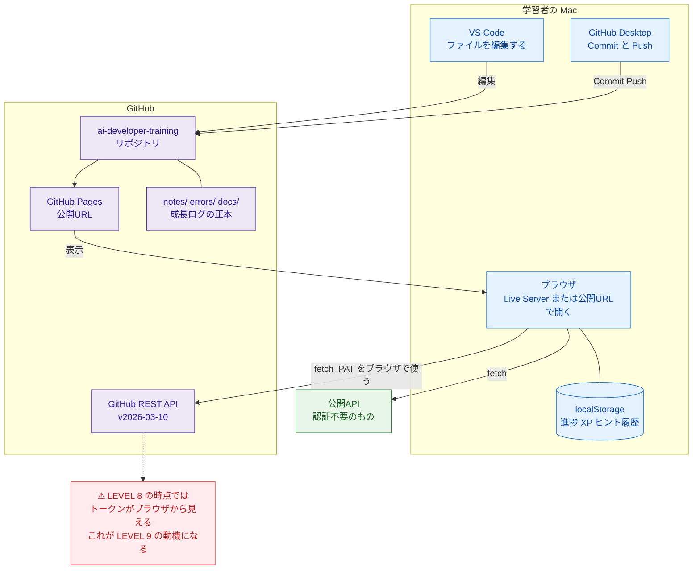
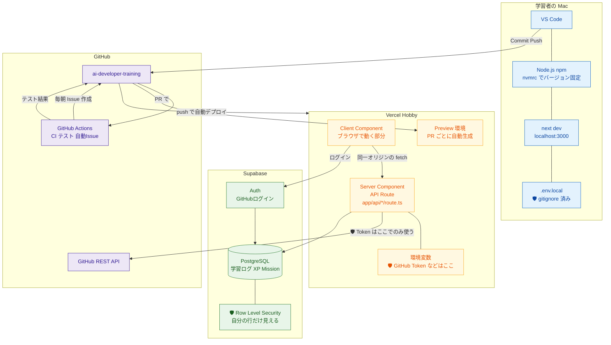
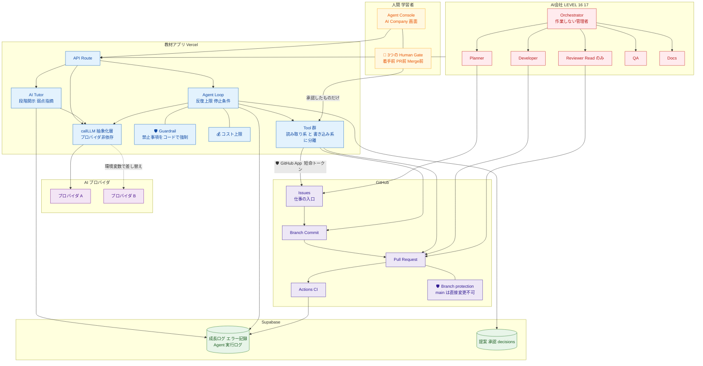
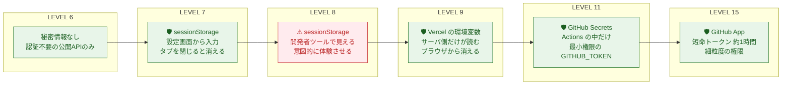
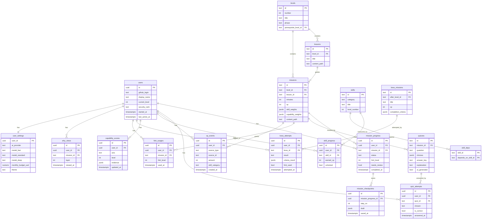
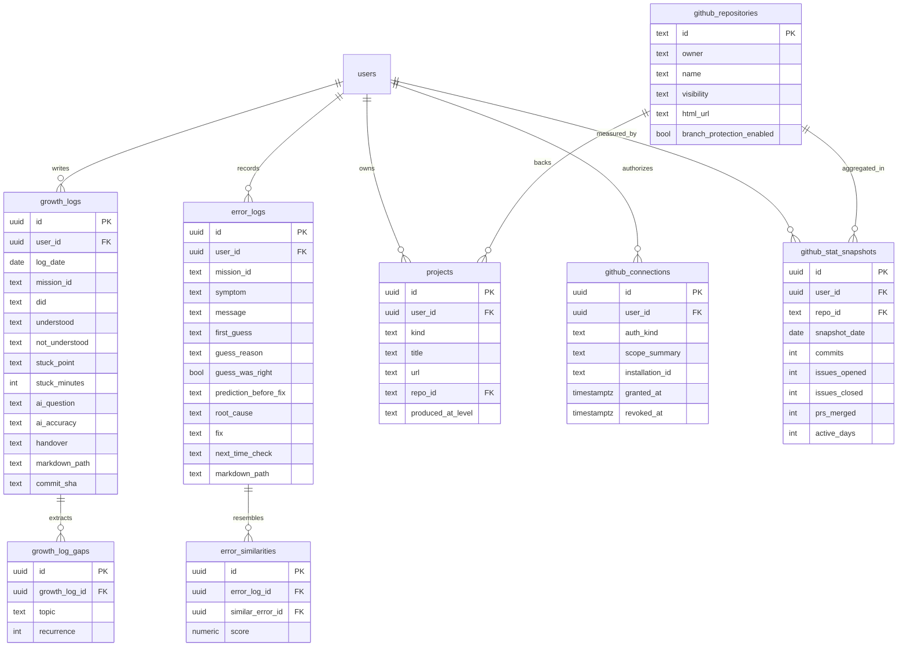
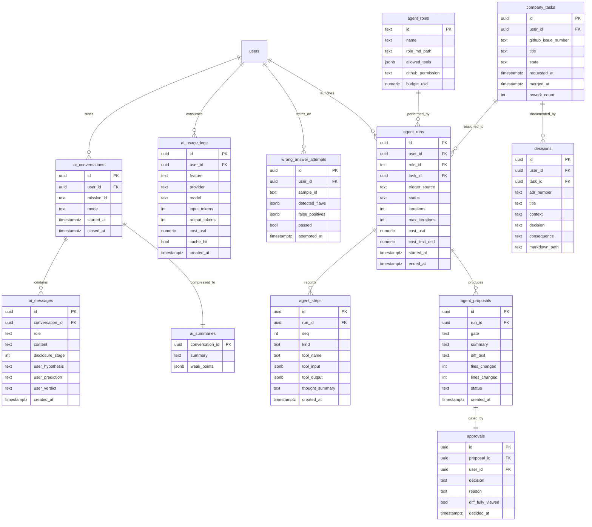

# 03. 技術スタック・アーキテクチャ設計書
### GitHub・API・AI開発 自走型学習アプリ ／ 技術選定・システム構成・データモデル

| 項目 | 内容 |
|---|---|
| 対応する要求仕様 | セクション33 の 12（推奨技術スタック）・13（システムアーキテクチャ）・14（データモデル）、21（技術スタック条件）、29-F・29-G |
| 前提文書 | `00_教育設計書.md` / `01_カリキュラム設計書.md` / `02_アプリ機能・UIUX設計書.md` |
| 参照した外部調査 | `research/findings.md`（2026年8月時点） |
| 本書が答える未決事項 | 00 U-01 / U-06、01 Q-01 / Q-04 / Q-05 / C-06 / C-08 / C-12 |

---

## 本書の位置づけ

要求仕様21 は候補技術（Next.js / TypeScript / React / Tailwind / Supabase / PostgreSQL / GitHub OAuth / Vercel）を挙げたうえで、**「候補をそのまま採用する必要はなく、2026年時点で最適な構成を判断せよ」** と求めている。

本書はこれに対し、**候補を批判的に検討したうえで、大半を採用しつつ、採用の仕方に強い制約をかける** という結論を出す。理由は本教材固有の制約にある。

> **本教材の技術選定は、「良いアプリを作る」ためではなく「学習者が理解できる範囲で段階的に成長させる」ために行われる。**
> したがって評価軸に「初期の技術がゼロであること」が含まれる。これは通常のアプリ設計には存在しない軸である。

---

# 第1章 選定の前提と評価軸

## 1.1 本教材固有の制約

| # | 制約 | 出所 | 技術選定への影響 |
|---|---|---|---|
| 1 | **LEVEL 1〜8 は依存ゼロ・ビルド不要で動く**こと | 00 D-01 / R-14 | 最初の8 LEVEL でフレームワークを使えない。npm すら LEVEL 9 まで登場しない |
| 2 | **学習した技術だけで次の機能を作る** | 要求26-4 | 技術は「必要になった LEVEL で初めて導入」する。前倒し導入は禁止 |
| 3 | **AI が保守しやすい** | 要求21 | 情報量が多く、AI の学習データに厚く含まれる技術を選ぶ |
| 4 | **初心者が読める** | 要求21 | 抽象度の高い技術（DI コンテナ、型パズル、複雑な状態管理）は避ける |
| 5 | **Mac のローカルで動く／将来クラウドへ出せる** | 要求21 | ローカル開発と本番の差が小さい構成 |
| 6 | **無料枠で完走できる** | 00 5.9 #8 | 課金への不安は初学者の最大の離脱要因。有料前提の技術は不可 |
| 7 | **Docker / Python 仮想環境を使わない** | 00 P-5 / P-6 | 環境差の吸収は `.nvmrc` とマネージドサービスで代替する |
| 8 | **認証を自作しない** | 00 P-8 | 認証基盤の「利用者」になれる技術が必要 |
| 9 | **特定ベンダへのロックインを教材化する** | 00 P-14 | 差し替え可能性を設計に埋め込む（最低限 AI プロバイダは抽象化） |

## 1.2 評価軸（7軸）

| 軸 | 意味 | 重み |
|---|---|---|
| **E1 認知負荷** | 初学者が理解すべき概念の数 | ★★★ |
| **E2 AI 保守性** | AI が正しいコードを出せるか。情報量・安定性 | ★★★ |
| **E3 段階導入可能性** | 一部だけ使い始められるか（全部理解しないと動かない技術は減点） | ★★★ |
| **E4 GitHub 親和性** | GitHub との統合が自然か | ★★ |
| **E5 無料枠** | 学習期間（4〜6か月）を無料で完走できるか | ★★ |
| **E6 情報量** | 日本語を含む解説記事・公式ドキュメントの厚さ | ★★ |
| **E7 ロックイン** | 乗り換えコストと、それを教材化できるか | ★ |

**E3（段階導入可能性）が本教材固有の軸である。** 通常の技術選定には存在しない。これが Next.js の評価を大きく左右する。

---

# 第2章 技術選定の結論

## 2.1 結論の全体像：3段階のスタック

技術は一度に決めない。**LEVEL の進行に合わせて3段階で導入する。**

| 段階 | LEVEL | 版 | スタック | 追加される概念数 |
|---|---|---|---|---|
| **STACK A：素の Web** | 1〜8 | v0.2〜v2.0 | HTML / CSS / 素の JavaScript / localStorage / GitHub Pages | 0（ブラウザだけ） |
| **STACK B：フルスタック** | 9〜11 | v3.0〜v3.2 | + Node.js / npm / Next.js 16 / TypeScript / Tailwind / Vercel / Supabase / GitHub Actions / Vitest | 9 |
| **STACK C：AI と Agent** | 12〜17 | v4.0〜v7.0 | + AI API（抽象化層経由）/ 自作 Agent Loop / GitHub App | 3 |

**STACK A に「技術」がほとんど存在しないことが最も重要な設計判断である。**
LEVEL 1 の学習者にとって、ビルドツールもパッケージマネージャも「まだ存在しない世界」でなければならない。

## 2.2 採用一覧

| 技術 | 採用 | 導入 LEVEL | 採用理由（要旨） |
|---|---|---|---|
| **HTML / CSS（素）** | ✅ | 1 | AI が生成するコードの土台。フレームワークの前に読解対象が要る |
| **JavaScript（素・ES2020相当）** | ✅ | 5 | 「5部品（変数・関数・分岐・反復・配列）」だけで動くものが作れる |
| **localStorage** | ✅ | 5 | DB なしで永続化を体験できる唯一の手段。**DB の必要性を体で理解させるための踏み台** |
| **GitHub Pages** | ✅ | 2 | 設定3クリックで公開URLが得られる。**成功体験の最速化**（00 P-4） |
| **Node.js（LTS）** | ✅ | 9 | Next.js の前提。`.nvmrc` でバージョン固定（**Docker の代替**） |
| **npm** | ✅ | 9 | 最も情報量が多く、AI の出力と一致しやすい |
| **Next.js 16（App Router / 機能を限定）** | ✅ | 9 | **API Route が「トークンを隠す場所」として教材の核心を担う** |
| **TypeScript** | ✅ | 9 | 🟢 読める水準。型は AI に投げてよい領域と宣言する |
| **Tailwind CSS** | ✅ | 9 | 2026年時点で AI が最も安定して生成するスタイル記法。**LEVEL 1 では使わない** |
| **Vercel（Hobby）** | ✅ | 9 | PR ごとの Preview 環境が LEVEL 9・11 の教材そのものになる |
| **Supabase（Postgres + Auth + RLS）** | ✅ | 10 | **RLS の教材価値が決定的。** 認証自作の禁止（P-8）を成立させる |
| **GitHub Actions** | ✅ | 11 | パブリックリポジトリなら無料・無制限。CI/CD と自動化の唯一の学習基盤 |
| **Vitest** | ✅ | 11 | 「テストとは何か」を最小コストで教えられる |
| **AI API（プロバイダ非依存の自作抽象化層経由）** | ✅ | 12 | ロックイン回避を30行の自作コードで体験させる（00 P-14） |
| **GitHub App（Agent の書き込み用）** | ✅ | 15 | findings 1-1 の公式推奨。短命トークン＋細粒度権限 |
| **fine-grained PAT** | ✅ | 7 | findings 1-2。2025年3月に GA。最初から fine-grained を標準にする |

## 2.3 不採用一覧と理由

| 技術 | 不採用の理由 | 代替 |
|---|---|---|
| **Vite + React（STACK B の代替として）** | **サーバがない。** LEVEL 9 の中心教材である「トークンをサーバ側に隠す」が成立しない。別途 Express 等を立てると、リポジトリ2つ・デプロイ2つ・CORS 設定が同時に発生し、断層がさらに大きくなる | Next.js の API Route |
| **React（STACK A での採用）** | LEVEL 5 で JSX・コンポーネント・状態管理を同時導入すると新出概念が10を超える。localStorage を触るだけなら素の DOM で足りる | 素の JavaScript（LEVEL 5）→ React は LEVEL 9 |
| **Astro / SvelteKit / Nuxt / Remix** | いずれも技術的には妥当。しかし **E2（AI 保守性）と E6（情報量）で Next.js に劣る。** AI が生成するコードの既定値が Next.js に寄っており、学習者が「AI の出力をそのまま読める」利点が大きい | Next.js |
| **Next.js の Cache Components（`"use cache"`）** | findings 5-1。明示的キャッシュモデルは強力だが、**初学者が最初に理解すべき概念ではない。** 「なぜ更新が反映されないのか」という最悪のデバッグ体験を生む | 使わない。必要になるまで導入しない |
| **Next.js の Server Actions** | フォーム送信とサーバ処理の境界が見えなくなる。**LEVEL 9 の教材目的は「境界を見せる」ことなので逆行する** | API Route（`app/api/*/route.ts`）を明示的に使う |
| **`proxy.ts`（旧 middleware）** | findings 5-1。全リクエストに介入する仕組みは、初学者にとって「見えない場所で何かが起きる」体験になる | 使わない |
| **React Compiler / 高度な最適化** | 自動メモ化は便利だが、性能問題が発生していない段階で導入する理由がない | 既定のまま触らない |
| **Redux / Zustand / Jotai 等の状態管理** | 単一ユーザー・単一画面の状態。React の `useState` と DB で足りる | useState + サーバからの取得 |
| **Docker** | 00 P-5。学習者がまだ「Docker が解決する問題」を持っていない | `.nvmrc` によるバージョン固定 + マネージドサービス |
| **Python / 仮想環境** | 00 P-6。TypeScript 1言語に統一する方が認知負荷が低い | TypeScript。Python の読解は Advanced A-7 |
| **Prisma / Drizzle 等の ORM** | スキーマ定義・マイグレーション・生成コードという3つの新概念が同時に来る。SQL を「読める」ことの学習が飛ばされる | Supabase クライアント（`.from().select()`）＋ SQL エディタ |
| **LangChain / LlamaIndex 等の Agent フレームワーク** | **Agent の中身がブラックボックスになる。** 本教材の目的は「Agent の構造（LLM+Tools+Memory+Instructions+Loop）を自分で組むこと」 | 自作 Agent Loop（100行程度） |
| **Anthropic Agent SDK / OpenAI の Agent 機能** | findings 4-1。実務では有力。ただし **教育目的では「既に完成しているもの」を使うことになり、LEVEL 14 の学習が空洞化する** | 自作 → 完成後に比較教材として紹介（04 第3章） |
| **MCP サーバの自作** | 00 / 01 Advanced A-3。使う側の理解で足りる | 概念理解（LEVEL 14）＋ GitHub 公式 MCP サーバの紹介 |
| **Webhook の自作実装** | 00 P-7。署名検証・公開エンドポイント・トンネリングが同時に必要になる | GitHub Actions の `on:` トリガーで代替（LEVEL 11） |
| **OAuth の自作実装** | 00 P-8。セキュリティ事故の最大要因 | Supabase Auth の利用者になる |
| **Playwright 等の E2E テスト** | LEVEL 11 の学習目的は「テストとは何か」。E2E は概念が多すぎる | Vitest の単体テスト数本 + CI |
| **モノレポ（Turborepo 等）** | リポジトリは実質1〜2本。ツールの学習コストが純損失 | 単一リポジトリ |
| **pnpm / bun / yarn** | 速いが、AI の出力と教材の記述が `npm` に寄っている | npm |
| **独自 CMS / 管理画面** | 02 O-6。利用者1人 | Markdown as code |

---

# 第3章 主要な技術判断の詳細

要求仕様31 の指示（要求をそのまま肯定しない）に従い、**最も議論が必要な4つの判断** を掘り下げる。

## 3.1 判断1：Next.js 16 は複雑すぎないか

### 論点

findings 5-1 の通り、Next.js 16 は Turbopack・Cache Components・React Compiler・`proxy.ts` など機能が非常に豊富である。「初学者には複雑すぎる」という批判は二次情報として多数存在する（公式見解ではない点に留意）。

### 検討した3案

| 案 | 内容 | 評価 |
|---|---|---|
| **案1** | STACK B から Next.js を採用（App Router） | ✅ 採用 |
| 案2 | Vite + React（フロント）＋ 別 Node サーバ（バック） | ❌ 断層が増える |
| 案3 | STACK A のまま最後まで進み、サーバは Vercel Functions 単体で持つ | ❌ LEVEL 9 以降の構造化ができない |

### 案2 を退けた理由（最重要）

LEVEL 9 の教材目的は **「LEVEL 8 で直面した『トークンを隠す場所がない』問題を、自分の手で解決する」** である（01 LEVEL 9）。

案2 を採ると、この1つの目的を達成するために学習者は同時に次を扱うことになる：

1. Vite のビルド設定
2. 別プロセスとしての API サーバ（Express 等）
3. **CORS**（オリジンが異なるため必ず発生する）
4. デプロイ先が2つ（フロント／バック）
5. 環境変数が2系統

**Next.js なら、これらのうち3・4・5 が消える。** 同一オリジンの `app/api/*/route.ts` に置くだけで「サーバ側」が手に入る。
**認知負荷の総量で比較すると、Next.js の方が明確に少ない。** これが本教材における Next.js 採用の唯一かつ十分な理由である。

### ただし採用の仕方を強く制限する

**「Next.js を採用する」ことと「Next.js の全機能を使う」ことは別である。**
本教材では、使ってよい機能を明示的に列挙し、それ以外を使わない。

| 使ってよい機能（LEVEL 9 時点） | 使わない機能 |
|---|---|
| `app/page.tsx`（ページ） | Cache Components（`"use cache"`） |
| `app/layout.tsx`（共通レイアウト） | Server Actions |
| フォルダによるルーティング | `proxy.ts`（旧 middleware） |
| `app/api/*/route.ts`（API Route） | 並列ルート / インターセプトルート |
| Server Component と Client Component の区別（`"use client"`） | 動的 OG 画像生成 |
| 環境変数（`process.env` / `NEXT_PUBLIC_`） | ISR の細かい制御 |
| `next dev` / `next build` | カスタム Webpack / Turbopack 設定 |

この一覧は **教材アプリの `docs/tech-constraints.md` に置き、AI への指示にも毎回含める。**
> 「Next.js の Server Actions や Cache Components は使わないでください。API Route を使ってください。」

**これは AI 駆動開発における実務的なテクニックでもある。** AI は放っておくと最新機能を使いたがる。使ってよい技術の範囲を明文化して渡すことは、AI と働くうえでの標準的な作法であり、LEVEL 9 で学ぶべき内容そのものである。

### ⚠ 注意（未確認事項）

- Next.js 16 系の Node.js 要求バージョン、`create-next-app` の既定構成、非推奨機能の状況は **バージョンによって変化する。** 実装着手時に公式ドキュメント（`https://nextjs.org/docs`）で確認すること。
- findings 5-1 に記載の「Next.js DevTools MCP」は AI 駆動開発との親和性を示す重要な材料だが、**教材では LEVEL 14（MCP の概念導入）以降での紹介にとどめる。** LEVEL 9 の学習者に MCP を持ち込まない。

## 3.2 判断2：Supabase 無料枠の「1週間で自動一時停止」問題

### 問題

findings 5-3 の通り、Supabase Free プランは **アクティブプロジェクト2つまで、かつ1週間操作がないと自動的に一時停止** される。

本教材の学習ペースは「1日30〜90分、毎日でなくてよい」（要求17）であり、**00 P-16 では7日以上のブランクを想定して復帰装置を設計している。** つまり **本教材は、Supabase が自動停止する条件をほぼ確実に踏む。**

これは設計上、無視できない。学習者が1週間ぶりにアプリを開いたときに「データベースに接続できません」というエラーが出れば、それが離脱点になる。

### 対策（4層）

| 層 | 対策 | 実装 LEVEL |
|---|---|---|
| **1. データの正本を DB に置かない** | 成長ログ・エラー記録・教材コンテンツの正本は **GitHub 上の Markdown**（02 A-02 / A-03）。DB は派生データ。**DB が止まっても学習は止まらない** | 設計原則（全期間） |
| **2. 停止を「教材」として扱う** | 「無料サービスには停止条件がある」ことを LEVEL 10 の学習内容に含める。復旧手順（ダッシュボードから Restore）を `docs/runbook.md` に書かせる | 10 |
| **3. ブランク検知と統合する** | 00 P-16 のブランク検知（7日）と Supabase の停止条件（7日）は **同じ閾値**。ブランク復帰 Issue のチェックリストに「Supabase プロジェクトを再開する」を含める | 11 |
| **4. 接続失敗時のフォールバック** | DB 接続失敗時は localStorage の値で表示を継続し、「同期は保留中」と表示する。**エラーで画面を白くしない** | 10 |

### 検討して採らなかった対策

| 案 | 不採用の理由 |
|---|---|
| GitHub Actions の cron で定期的にクエリを打ち、停止を回避する | **無料枠の趣旨に反する可能性がある。** また「使っていないのに動かし続ける」ことを教材で教えるのは筋が悪い。⚠ 規約上の可否は本調査で未確認のため、教材では推奨しない |
| Supabase を諦めて別の DB（Neon / Turso / Cloudflare D1）にする | **Auth と RLS が失われる。** 認証自作の禁止（00 P-8）と RLS の教材価値（LEVEL 10 の中核）を同時に満たせるのは Supabase の統合構成である。停止問題より認証自作のリスクの方がはるかに大きい |
| 有料プランを前提にする | 無料完走の原則（E5）に反する |

### ⚠ 注意（未確認事項）

Supabase の無料枠の条件（容量・MAU・停止条件・アクティブプロジェクト数）は変更されうる。**教材内に数値を直接書かず、「公式の pricing ページを確認する」という Mission にする**（これ自体が「一次情報を確認する習慣」の教材になる）。

## 3.3 判断3：最初から DB を使わない設計は正しいか

### 結論：正しい。むしろ本教材の中核的な設計判断である

要求仕様は LEVEL 8（旧）で Backend/Database を導入するとしていたが、本設計では **LEVEL 1〜9 の間、永続化は localStorage と GitHub 上のファイルだけで行う。**

### 根拠

| # | 理由 |
|---|---|
| 1 | **DB の必要性は、localStorage の限界に直面して初めて理解できる。** 「消える／共有できない／容量が小さい」という3つの限界（01 LEVEL 10）は、体験しないと概念にならない |
| 2 | **依存ゼロ制約（00 R-14）と両立する唯一の方法。** LEVEL 8 まではブラウザだけで完結する |
| 3 | **無料枠の消費が LEVEL 10 まで発生しない。** 学習の前半で外部サービスのアカウントを増やさない |
| 4 | localStorage → DB の移行そのものが、**データ移行という実務で必ず遭遇する作業の教材になる** |

### 具体的な設計

| 期間 | 保存先 | 保存されるもの |
|---|---|---|
| LEVEL 1〜4 | **なし**（手書きの HTML） | 進捗は人間が HTML を書き換える |
| LEVEL 5〜9 | **localStorage**（キー `adt.v1.*`） | Mission 完了状態、XP、ヒント開示、Quiz 結果 |
| LEVEL 0〜 全期間 | **GitHub 上の Markdown** | 成長ログ、エラー記録、decisions（**正本**） |
| LEVEL 10〜 | **Supabase（Postgres）** | 上記の構造化コピー＋端末間同期＋AI が読むデータ |

**LEVEL 10 の移行 Mission は「localStorage の JSON を読み、DB に投入する」。** これは実務のデータ移行と同型であり、同時に「10 LEVEL 分の学習履歴が初めて構造化データになる」という体験を与える（01 LEVEL 10）。

## 3.4 判断4：AI プロバイダをどう選ぶか

### 方針：既定値を1つ決めるが、コードは抽象化層を通す

findings 4-1 / 4-2 の通り、2026年8月時点で Anthropic（Fable 5 / Opus 5 / Sonnet 5 / Haiku 4.5）と OpenAI（GPT-5.6 sol / terra / luna）がいずれも Tool Calling・Structured Output・MCP 統合を備えている。**教材の要件を満たすうえで、どちらでも成立する。**

したがって本設計では次のようにする。

| 項目 | 決定 |
|---|---|
| **既定値** | 環境変数 `AI_PROVIDER` と `AI_MODEL` で指定。教材は「1社を選んで設定する」手順を示すのみ |
| **モデル名を教材本文に固定表記しない** | findings 4-1 の設計上の含意。モデル名は数か月で陳腐化する |
| **抽象化層** | LEVEL 12 で `callLLM()` を学習者自身が実装（30行程度）。**2社以上で同じコードが動くことを確認する Mission がある**（01 LEVEL 12 実践課題7） |
| **モデルの使い分け** | 用途を3階層に分け、環境変数で割り当てる（下表） |

| 階層 | 用途 | 求める性質 | 環境変数 |
|---|---|---|---|
| 軽量 | 用語解説、理解チェック生成、要約 | 速い・安い | `AI_MODEL_FAST` |
| 標準 | エラー解説、コード解説、AI Tutor 対話 | バランス | `AI_MODEL_STANDARD` |
| 上位 | 弱点分析、Agent の計画立案、Reviewer | 推論品質 | `AI_MODEL_DEEP` |

### 💰 コストの目安（Q-05 への回答）

| 項目 | 想定 |
|---|---|
| LEVEL 12〜13 の学習期間中 | 1日あたり AI 呼び出し 20〜50回、1回あたり入出力合計 2〜5k トークン |
| LEVEL 14〜17（Agent） | 1回の Agent 実行で 20〜80k トークン（反復あり）。1日 3〜10 実行 |
| 想定される月額 | **軽量モデル中心なら月 1〜3 米ドル程度、上位モデルを多用すると月 10〜30 米ドル程度** |

⚠ **この数値は概算である。** findings 4-1 の通り Anthropic の公式 pricing ページは本調査で取得できておらず（403）、単価は変動する。**教材では金額を断定せず、「LEVEL 12 の第1 Mission で自分の上限を設定し、実測する」設計にする。** 実装時に各社の公式 pricing ページで最新単価を確認すること。

### コストを構造的に下げる設計（F-17 と対応）

| 手段 | 効果 | 実装 LEVEL |
|---|---|---|
| 用語解説のキャッシュ | 同じ用語は再利用。教材の用語は有限なので効果が大きい | 13 |
| 会話を 1 Mission = 1 スレッドに限定 | Context の肥大化を防ぐ（02 O-5） | 13 |
| 軽量モデルへの振り分け | 用途の8割は軽量で足りる | 12 |
| Agent の反復上限 | 暴走の防止（そのままコスト上限） | 14 |
| 役割別の予算上限 | どの役割が高いかが見える | 16 |

---

# 第4章 段階的アーキテクチャ

## 4.1 STACK A（LEVEL 1〜8 / v0.2〜v2.0）

> **用語**：本書は STACK A の範囲を指す語として「MVP」を用いない（「MVP-0」「MVP-L」の定義は **06 第1章**を参照）。



### この段階の特徴

| 項目 | 内容 |
|---|---|
| **サーバが存在しない** | ブラウザとファイルだけ。`npm` も `node_modules` もない |
| **ビルドが存在しない** | ビルドは存在しない。**LEVEL 1 以降は VS Code Live Server 拡張で開くか、GitHub Pages の公開URLを開く**（`file://` で開くと `content/*.json` の `fetch` がブラウザのスキーム制限でブロックされ、LEVEL 6 が動作しない） |
| **秘密情報の置き場所がない** | ⚠ これが LEVEL 9 への移行動機。**意図的な未完成である**（LEVEL 7〜8 の PAT は設定画面から入力し `sessionStorage` に保持する。4.4 参照） |
| デプロイ | GitHub Pages（設定3クリック） |
| 学習者が理解すべき箱の数 | **4個**（ブラウザ / ファイル / GitHub / 公開API） |

## 4.2 STACK B：中盤（LEVEL 9〜11 / v3.0〜v3.2）



### この段階で「増えた箱」と、なぜ増えたか

| 増えた箱 | なぜ増えたか（学習者にとっての必然性） | LEVEL |
|---|---|---|
| Node.js / npm | Next.js を動かすため。**部品を取り寄せる仕組み** | 9 |
| Next.js サーバ（API Route） | 🛡 **トークンを隠す場所が必要になったから**（LEVEL 8 の問題の解決） | 9 |
| Vercel | 「自分の PC でだけ動く」から卒業するため | 9 |
| Preview 環境 | 変更を本番に出す前に確認するため | 9 |
| Supabase Postgres | localStorage が消える・共有できない・小さいから | 10 |
| Supabase Auth | 🛡 誰のデータかを識別するため（**自作しない**） | 10 |
| RLS | 🛡 アプリにバグがあっても他人のデータが漏れないようにするため | 10 |
| GitHub Actions | 手作業のテストとデプロイを自動化するため | 11 |

**「増えた箱」には必ず「その直前の LEVEL で困ったこと」が対応している。** これが「必然性の順序」（01 1.1 原則1）の構造的な表現である。

## 4.3 STACK C：最終形（LEVEL 12〜17 / v4.0〜v7.0）



### 実行環境に関する重要な制約（設計上の含意）

findings 5-4 の通り、Vercel Hobby プランの **Vercel Function 最大実行時間は300秒（5分）** である。
一方、Agent Loop は反復するため、素朴に実装すると **1リクエストで完結しない可能性がある。**

**したがって Agent は「1リクエスト = 1ステップ」で設計する。**

| 設計 | 内容 |
|---|---|
| 状態の保持 | Agent の状態（反復回数・履歴・提案）は **DB に保存**（`agent_runs` / `agent_steps`）。メモリに持たない |
| 1リクエストの責務 | 「次の1ステップを実行して、状態を保存して返す」だけ |
| 画面側 | ステップごとにトレースが1行ずつ増える（02 SC-15 の中央ペイン） |
| 中断・再開 | DB に状態があるので、ブラウザを閉じても再開できる |
| 長時間実行が必要な場合 | GitHub Actions 側で実行する選択肢がある（パブリックリポジトリなら無料・最大6時間）。**ただし本編では扱わず、Advanced 扱い** |

**この制約はむしろ教育的に望ましい。** 1ステップずつ止まる Agent は、**中身が見える Agent** である。「ブラックボックスとして一気に動く Agent」を作らせないことは、LEVEL 14 の学習目的（Agent の構造理解）と完全に一致する。

## 4.4 秘密情報の置き場所の変遷

本教材で最も重要な「見えない構造の変化」を図示する。**この図は LEVEL 7・9・15 の教材で繰り返し提示する。**



**LEVEL 8 が赤いことが、この図の要点である。** 学習者は一度だけ、意図的に危険な状態を作り、それを自分の目で確認する。そのうえで LEVEL 9 で解決する。

**LEVEL 7〜8 の PAT の扱い（重要）**

| 項目 | 内容 |
|---|---|
| 置き場所 | **`sessionStorage`**。設定画面（02 SC-13）から入力し、タブを閉じると消える |
| 入力欄の有効条件 | `location.hostname` が `localhost` / `127.0.0.1` のときのみ有効。**GitHub Pages の公開URL上では入力欄を無効化する** |
| `.env.local` の位置づけ | **LEVEL 7 で `.env.local` と `.env.local.example` を作るのは LEVEL 9 で使う仕組みの予習であり、LEVEL 7〜8 では読み込まれない。** STACK A には Node.js もビルドも存在せず、ブラウザは `.env.local` を読めない |

> ⚠ `sessionStorage` に PAT を置くことは XSS に対して安全ではない。**これは「安全な最終形」ではなく、LEVEL 9 でサーバ側に移すまでの過渡的な状態である**（脅威の詳細は 05 第2章）。

## 4.5 環境の3系統

| 環境 | 用途 | 秘密情報の置き場所 | 導入 LEVEL |
|---|---|---|---|
| **ローカル** | 開発 | `.env.local`（🛡 `.gitignore` 済み） | 9 |
| **Preview** | PR ごとの確認 | Vercel の Preview 用環境変数 | 9 |
| **本番** | 公開 | Vercel の Production 用環境変数 | 9 |

- 3環境で **別々の値を持てる** ことを LEVEL 9 で教える（本番の Supabase と開発の Supabase を分けるかどうかは、無料枠のプロジェクト数2の制約から **分けない** ことを推奨し、その判断を `decisions/` に記録させる）
- ⚠ LEVEL 9 では **意図的に環境変数の設定漏れを起こす Mission** がある（01 LEVEL 9 実践課題7）

---

# 第5章 データモデル

## 5.1 設計方針

| # | 方針 | 理由 |
|---|---|---|
| 1 | **教材コンテンツ（マスタ）は DB に入れず、Git 管理の Markdown / JSON を正とする** | 02 A-02。履歴・レビュー・復旧のすべてで Git が優れる |
| 2 | **成長ログ・エラー記録の正本は GitHub 上の Markdown。DB は派生データ** | 02 A-03。DB が停止しても学習が止まらない（3.2 対策1） |
| 3 | **STACK A（localStorage 期）は DB を持たない。** localStorage の JSON スキーマだけを定義する | 3.3 |
| 4 | **GitHub の状態を DB に複製しない。** 表示のたびに API から取得し、キャッシュのみ持つ | 02 O-2。二重管理は必ず不整合を生む |
| 5 | すべてのユーザーデータ行に `user_id` を持たせ、🛡 RLS を必ず有効化する | LEVEL 10 の教材の核心 |
| 6 | 論理削除しない。**削除は物理削除**（初学者に2つの状態を持たせない） | 認知負荷 |

## 5.2 localStorage 期のデータモデル（LEVEL 5〜9）

DB を持たない期間の永続化構造。**キーは1つだけにする**（複数キーに散らすと、学習者が壊したときに復旧できない）。

```jsonc
// localStorage キー: "adt.v1.state"
{
  "schemaVersion": 1,
  "startedAt": "2026-04-01",
  "currentLevel": 7,
  "missions": {
    "5-3": { "status": "done", "completedAt": "2026-05-02T10:20:00Z",
             "hintLevel": 0, "needsReview": false },
    "5-4": { "status": "in_progress", "checkpoint": 4 }
  },
  "quizzes": {
    "5-3": { "correct": 2, "total": 3, "answeredAt": "2026-05-02T10:25:00Z" }
  },
  "xp": {
    "total": 4820,
    "bySkill": { "GH": 1800, "WEB": 1420, "API": 900, "DEV": 400, "AI": 0, "AG": 0 }
  },
  "securityRank": "S2",
  "capability": { "A": 2, "B": 2, "C": 2, "D": 1, "E": 1 },
  "whyViews": { "L3": ["4-2", "5-1"] },
  "blankCheck": { "lastActiveAt": "2026-05-02" },
  "settings": { "theme": "light" }
}
```

### 教材コンテンツ側（📦 読み取り専用・Git 管理）

```
content/
├── levels.json          LEVEL 0〜17 の定義（タイトル・PHASE・前提・XP）
├── missions.json        133 Mission の定義（時間・XP・スキル配分・能力軸重み）
├── skills.json          スキルツリー32ノードと依存関係
├── boss.json            Boss 8件の定義と完了条件
├── glossary.json        用語（4欄形式）
├── wrong-answers.json   AI誤答サンプル（02 F-22）
└── level{NN}/
    └── mission-{NN}-{N}.md   7STEP 本文
```

**この分離が重要である。** 学習者の進捗（可変）と教材（不変）を混ぜない。
LEVEL 10 で DB を導入したとき、移行対象は左側（localStorage）だけになる。

## 5.3 最終形のデータモデル

エンティティ数が多いため、**3つの領域に分けて ER 図を示す。**

### 5.3.1 学習コア領域



### 5.3.2 記録・GitHub 領域



### 5.3.3 AI・Agent・AI会社 領域



## 5.4 テーブル定義（要点）

**全34テーブル。** 主要なものについて、型・制約・RLS・導入 LEVEL を示す。

### 5.4.1 学習コア

| テーブル | 主な列 | 制約・注記 | RLS | 導入 |
|---|---|---|---|---|
| `users` | `id`(uuid, PK, auth.users と同一), `github_login`, `current_level`(int), `security_rank`(text: S0〜S3) | Supabase Auth の user と1対1 | 自分の行のみ | 10 |
| `levels` | `id`(text: `L07`), `number`(int), `phase`(text) | **Git の `content/levels.json` から同期。DB では読み取り専用** | 全員読み取り可 | 10 |
| `lessons` | `id`, `level_id`(FK), `content_path` | 同上 | 全員読み取り可 | 10 |
| `missions` | `id`(text: `7-3`), `minutes`(int: 20/25/30), `xp`(int), `skill_weights`(jsonb), `capability_weights`(jsonb) | `xp = minutes * 4` を制約で検証 | 全員読み取り可 | 10 |
| `mission_progress` | `user_id`, `mission_id`, `status`(not_started/in_progress/done), `hint_level`(0〜3), `needs_review`(bool) | `UNIQUE(user_id, mission_id)`。`hint_level=3` なら `needs_review=true` | 自分のみ | 10 |
| `mission_checkpoints` | `mission_progress_id`, `step_no`(0〜7), `draft`(jsonb) | 02 F-20。LEVEL 12 以降で必須（R-12） | 自分のみ | 10 |
| `quizzes` | `id`, `mission_id`, `question`, `choices`(jsonb), `ai_generated`(bool) | 静的問題は Git 由来、AI 生成分のみ DB に追加 | 全員読み取り可 | 10 |
| `quiz_attempts` | `user_id`, `quiz_id`, `is_correct` | 全問正解を要求しない | 自分のみ | 10 |
| `xp_events` | `source_type`(mission/boss/blackout), `amount`, `skill_category` | **加算のみ。減算行を作らない**（ペナルティ禁止） | 自分のみ | 10 |
| `skill_progress` | `user_id`, `skill_id`, `earned_xp`, `unlocked` | `xp_events` から集計。冪等に再計算可能 | 自分のみ | 10 |
| `capability_scores` | `axis`(A〜E), `level`(1〜4), `evidence`(jsonb) | **Boss クリア時のみ更新**（02 F-21） | 自分のみ | 10 |
| `boss_attempts` | `boss_id`, `result`(pass/fail), `criteria_result`(jsonb) | 完了条件ごとの充足状況を保持 | 自分のみ | 10 |
| `hint_usages` / `why_views` | `mission_id`, `hint_level` / `layer`(1〜3) | 適応的復習と Boss 出題に使用 | 自分のみ | 10 |
| `user_settings` | `ai_provider`, `model_*`, `monthly_budget_usd` | 💰 上限。**モデル名は文字列で保持し、固定しない** | 自分のみ | 12 |

### 5.4.2 記録・GitHub

| テーブル | 主な列 | 制約・注記 | RLS | 導入 |
|---|---|---|---|---|
| `growth_logs` | 8項目（`did`〜`handover`）, `markdown_path`, `commit_sha` | 🛡 **`not_understood` は NOT NULL かつ空文字禁止**（R-07）。`markdown_path` が正本へのポインタ | 自分のみ | 10 |
| `growth_log_gaps` | `topic`, `recurrence` | 「まだ分かっていないこと」を正規化。**弱点指摘（LEVEL 13）の入力** | 自分のみ | 13 |
| `error_logs` | `symptom`, `first_guess`, `prediction_before_fix`, `next_time_check` | `next_time_check` が転移可能知識。**正本は `errors/*.md`** | 自分のみ | 10 |
| `error_similarities` | `score` | キーワード一致による類似度（02 O-4：ベクトル検索は使わない） | 自分のみ | 13 |
| `projects` | `kind`(url/repo/pr/boss), `url`, `produced_at_level` | 02 F-13 の実報酬一覧 | 自分のみ | 10 |
| `github_repositories` | `owner`, `name`, `visibility`, `branch_protection_enabled` | 🛡 `branch_protection_enabled=false` の間は Agent に書き込み権限を与えない（05 と連動） | 自分のみ | 10 |
| `github_stat_snapshots` | 日次の commits / issues / prs_merged / active_days | **API 結果のキャッシュ。** Rate Limit 対策（04 1.4） | 自分のみ | 10 |
| `github_connections` | `auth_kind`(pat/oauth/app), `scope_summary`, `installation_id`, `revoked_at` | 🛡 **トークン本体は保存しない**（05 第6章）。ここに置くのはメタ情報のみ | 自分のみ | 10 |

### 5.4.3 AI・Agent・AI会社

| テーブル | 主な列 | 制約・注記 | RLS | 導入 |
|---|---|---|---|---|
| `ai_conversations` | `mission_id`, `mode`(tutor/why/error/code/quiz/weakness) | **1 Mission = 1 スレッド**（02 A-08） | 自分のみ | 13 |
| `ai_messages` | `role`, `content`, `disclosure_stage`(1〜3), `user_hypothesis`, `user_prediction`, `user_verdict`(○△×) | 🛡 `user_hypothesis` は NOT NULL（R-02）。**段階開示の状態をここで持つ** | 自分のみ | 13 |
| `ai_summaries` | `summary`, `weak_points`(jsonb) | 会話終了時に1件生成。**以降の Context にはこれだけ渡す**（💰 コスト対策） | 自分のみ | 13 |
| `ai_usage_logs` | `feature`, `model`, `input_tokens`, `output_tokens`, `cost_usd`, `cache_hit` | 💰 F-17 の基礎データ。**全 AI 呼び出しで必ず1行書く** | 自分のみ | 12 |
| `wrong_answer_attempts` | `sample_id`, `detected_flaws`, `false_positives`, `passed` | AI誤答検出訓練（02 F-22）の記録。**能力軸 D の Lv 判定には使わない**（判定は Boss 結果のみ。5.6）。参考値として表示するのみ | 自分のみ | 12 |
| `agent_roles` | `id`(orchestrator/planner/developer/reviewer/qa/docs), `role_md_path`, `allowed_tools`(jsonb), `github_permission`, `budget_usd` | 🛡 **`role_md_path` は Git 上の ROLE.md を指す。定義の正本は Git** | 自分のみ | 16 |
| `agent_runs` | `role_id`, `task_id`, `status`, `iterations`, `max_iterations`, `cost_usd`, `cost_limit_usd` | 🛡 `iterations <= max_iterations` と `cost_usd <= cost_limit_usd` を **アプリ側で強制**（Guardrail） | 自分のみ | 14 |
| `agent_steps` | `seq`, `kind`(thought/tool_call/tool_result/error), `tool_name`, `tool_input`, `tool_output` | **1リクエスト = 1ステップ**（4.3）。観測可能性の基盤 | 自分のみ | 14 |
| `agent_proposals` | `gate`(plan/diff/pr), `diff_text`, `files_changed`, `lines_changed`, `status` | 🛡 `files_changed <= 3` / `lines_changed <= 150` を超えたら `status=blocked` | 自分のみ | 14 |
| `approvals` | `decision`(approve/reject), `reason`, `diff_fully_viewed`(bool) | 🤝 **`diff_fully_viewed=false` では approve を保存できない**（02 A-06） | 自分のみ | 14 |
| `company_tasks` | `github_issue_number`, `state`, `rework_count` | **GitHub Issue が正。** ここはリードタイム計測用のミラー | 自分のみ | 17 |
| `decisions` | `adr_number`, `context`, `decision`, `consequence`, `markdown_path` | 正本は `decisions/*.md`。3行でよい | 自分のみ | 17 |

## 5.5 localStorage 期と最終形の区別

| 区分 | 保持するもの | 実体 |
|---|---|---|
| **localStorage 期（LEVEL 5〜9）** | Mission 進捗 / XP / スキル / Quiz 結果 / ヒント履歴 / 能力軸 | localStorage の単一 JSON（5.2） |
| **全期間（GitHub 側）** | 成長ログ / エラー記録 / decisions | GitHub 上の Markdown |
| **LEVEL 10 で DB 化** | 上記 localStorage 相当 + 成長ログ・エラー記録の構造化コピー | 14テーブル |
| **LEVEL 12 で追加** | AI 利用ログ / 設定 / 誤答訓練 | 3テーブル |
| **LEVEL 13 で追加** | AI 会話 / 要約 / 弱点 / 類似エラー | 4テーブル |
| **LEVEL 14〜15 で追加** | Agent 実行 / ステップ / 提案 / 承認 | 4テーブル |
| **LEVEL 16〜17 で追加** | 役割 / タスク / decisions | 3テーブル |

**LEVEL 10 の時点で必要な最小テーブルは 5 つである**：`users` / `mission_progress` / `xp_events` / `growth_logs` / `user_settings`。
残りは「必要になった LEVEL で追加する」。**最初から34テーブルを設計させない。**

> ⚠ **これは要求仕様31 に対する指摘でもある。** 要求29-G は User/Course/Level/Lesson/Mission/Progress/Skill/Quiz/Project/GitHubRepository/AIConversation/ErrorLog を列挙しているが、**これらを LEVEL 10 の時点で一度に作らせるのは過剰である。** マイグレーションを段階的に積むこと自体が「スキーマにも履歴が要る」という LEVEL 10 の学習内容（01）と一致する。

## 5.6 能力軸レーダーの算出アルゴリズム（00 U-06 / 01 C-08 への回答）

### 方針

- **更新は Boss Mission（B1〜B8）および卒業判定（T2・T3）の通過時のみ**（日々の Mission では動かさない）
- 各軸は **Lv1〜4**。「XP の合計」ではなく **証拠（evidence）の充足** で決まる
- **証拠源は Boss Mission／卒業判定の結果（`boss_attempts`）のみに限定する。** 複数テーブルを跨ぐ複合判定は行わない（誤判定は学習者の信頼を最も損なうため、判定できないものは判定しない）
- **1つの Boss は1つ以上の軸に1対1で対応する。** ある軸のある Lv は、対応する Boss の通過のみで決まる

### 軸ごとの証拠源

**Boss と軸の対応（正典）**

| Boss / 判定 | 昇格させる軸と Lv |
|---|---|
| **B1 RECOVERY** | C Lv2 |
| **B2 GITHUB** | B Lv2 |
| **B3 SECURITY** | C Lv3 ／ SEC S2 |
| **B4 API** | D Lv2 ／ A Lv2 |
| **B5 FULL-STACK** | E Lv2 ／ A Lv3 |
| **B6 AI** | D Lv3 ／ B Lv3 |
| **B7 AGENT** | E Lv3 ／ A Lv4 |
| **B8 FINAL** | E Lv4 ／ B Lv4 |
| **T2 破壊復旧テスト** | C Lv4 |
| **T3 AI誤答検出テスト** | D Lv4 |

**軸から見た昇格条件**

| 軸 | 証拠源 | Lv2 の条件 | Lv3 の条件 | Lv4 の条件 |
|---|---|---|---|---|
| **A 読解力** | Boss 結果のみ | B4 通過 | B5 通過 | B7 通過 |
| **B 指示力** | Boss 結果のみ | B2 通過 | B6 通過 | B8 通過 |
| **C 復旧力** | Boss 結果のみ | B1 通過 | B3 通過 | T2 通過 |
| **D 懐疑力** | Boss 結果のみ | B4 通過 | B6 通過 | T3 通過 |
| **E 統治力** | Boss 結果のみ | B5 通過 | B7 通過 | B8 通過 |

- **SEC（セキュリティランク）は能力軸レーダーとは別系統の指標であり、B3 通過で S2 に昇格する**（レーダーの5軸には含めない）
- **B 軸 Lv3 は B6 通過で認定する（本改訂で確定）。** 理由は2点である。① B 軸 Lv3 のルーブリック（00 5.8.2）は「目的 / 現状 / 制約 / 完了条件を明示した依頼が書ける」であり、B6 は **Structured Output による出力形式の固定・プロンプト制約（禁止事項の明示）・Prompt Injection 対策** を課題要件としているため、「AI に通じる依頼を制約付きで書けたか」の直接の証拠になる（00 2.2 は B 軸を鍛える LEVEL に **13** を挙げており、B6 は LEVEL 12〜13 を統合する Boss である）。② 昇格条件は累積（飛び級しない）ため、B Lv3 は **B2（LEVEL 4）と B8（LEVEL 17）の間**に置く必要があり、間隔の均等性と 1 Boss への判定集中の回避（B7 は既に E Lv3・A Lv4 の2軸を担う）からも B6 が最適である。**新規の Boss・卒業判定は追加しない**（B8 に Lv3 と Lv4 を同時に持たせる案は、中間到達の意味が失われるため採らない）
- **上の2表により、A〜E の5軸すべてで Lv2 / Lv3 / Lv4 の判定イベントが埋まっている**（Lv1 は初期値）。各軸の判定イベントは学習順に単調（例：B＝B2 → B6 → B8）であり、累積判定が途中で止まる軸は存在しない
- **副次的な証拠（`ai_messages.user_prediction` の予測的中率、Issue 本文の8項目充足率、`error_logs.next_time_check` の記入率、`decisions` 件数、Gate 差し戻し率など）は画面上に参考値として表示してよいが、Lv 判定には使わない。**

### 算出の擬似コード

```
function recalcCapability(user, axis):
    evidence = collectEvidence(user, axis)     # 上表の証拠を集める
    level = 1
    for candidate in [2, 3, 4]:
        if allConditionsMet(axis, candidate, evidence):
            level = candidate
        else:
            break                               # 条件は累積。飛び級しない
    save(capability_scores, user, axis, level, evidence)
```

### 設計上の注意

- **下がらない設計にする。** 一度到達した Lv は下げない（減点は失敗の隠蔽を招く。00 5.3.2 と同じ思想）
- **「全部承認している学習者は統治していない」（01 LEVEL 17）という論点は、Lv 判定条件からは外し、B8 の完了条件および AI レビューの観点として扱う。** レーダーの判定に複合条件を持ち込まないことを優先する
- **能力軸レーダーは、02 F-05 のスキルバー（GH / WEB / API / DEV / AI / AG）とは別の指標である。** スキルバーは Mission XP の累積を表し、能力軸レーダーは Boss 通過という証拠のみで動く。両者を同一視しないこと
- 各軸の条件は**教材コンテンツ側（`content/capability.json`）に外出しする。** アプリのコードに埋め込まない（調整可能にするため）

---

# 第6章 非機能・運用

## 6.1 無料枠での運用可否

| サービス | 無料枠（findings 時点） | 本教材での想定使用量 | 判定 |
|---|---|---|---|
| GitHub（パブリックリポジトリ） | Actions 無料・無制限 | 毎朝の Issue 生成 + PR ごとの CI（月100〜300分相当） | ✅ 余裕 |
| GitHub API | 認証あり 5,000 req/h | 日次スナップショット + 画面表示（1日100 req 未満） | ✅ 余裕 |
| Vercel Hobby | Function 100万回 / 1日100デプロイ / Function 300秒 | 個人利用。1日数十デプロイ | ✅（⚠ 4.3 の300秒制約に注意） |
| Supabase Free | DB 500MB / MAU 50,000 / **1週間で自動停止** | 単一ユーザー・数MB | ✅（⚠ 3.2 の停止対策必須） |
| AI API | 従量課金（無料枠なし） | 3.4 の試算 | ⚠ **唯一の実費**。上限設定を必須にする |

**結論：AI API 以外はすべて無料枠で完走できる。** この事実を LEVEL 0 の時点で明示することが、課金不安による離脱（00 5.9 #8）の予防になる。

### ⚠ パブリックリポジトリにすることの副作用

Actions を無料・無制限にするためリポジトリを public にするが、**学習ログ・エラー記録・成長ログがすべて公開される。**
これは 05 セキュリティ設計書 第2章の脅威として扱い、次の運用を必須とする。

- 成長ログに個人情報・所属・実名を書かない（テンプレートに注意書きを入れる）
- スクリーンショットにトークン・メールアドレスが写り込まないことを LEVEL 2 で教える
- private にしたい場合は Actions の無料枠（Linux 2,000分/月）で足りるため、**private も選択可能**とし、判断を `decisions/` に記録させる

## 6.2 パフォーマンスの目標（緩い目標でよい）

| 指標 | 目標 | 理由 |
|---|---|---|
| Dashboard の初期表示 | 2秒以内 | 単一ユーザー・小データ。**最適化を教材化しない**（早すぎる最適化） |
| AI 応答の開始 | 3秒以内（ストリーミング表示） | 沈黙が長いと壊れたと思われる |
| Agent の1ステップ | 30秒以内 | 300秒制限に対する安全余裕 |

**性能チューニングは本教材の学習範囲外である**（Advanced A-9）。⚠ 目標を厳しくすると、教育と無関係な作業が発生する。

## 6.3 ロックイン対策（00 P-14 への実装）

| 依存先 | ロックインの強さ | 教材での扱い |
|---|---|---|
| **AI プロバイダ** | 弱い（抽象化済み） | `callLLM()` を自作し、LEVEL 12 で2社での動作を確認する |
| **GitHub** | 強い（意図的） | **本教材の前提。** 代替（GitLab 等）の存在だけ1行で言及 |
| **Vercel** | 中（Next.js との統合が深い） | 代替（Netlify / Cloudflare Pages / 自前 Node サーバ）を1行で併記。Advanced で乗り換えコスト見積もりの練習 |
| **Supabase** | 中（Auth + RLS の統合） | 代替（Neon + 別の Auth / Firebase）を1行で併記。**「Auth を分離すると自作の誘惑が生まれる」というリスクも同時に教える** |
| **Next.js** | 中 | `docs/tech-constraints.md` で使用機能を限定していること自体が乗り換え余地の確保になっている |

**各技術の初出時に「この技術が担っている役割」と「代替候補」を1行で併記する**（00 P-14）。これを教材コンテンツ作成時の必須ルールとする。

---

# 第7章 過剰設計の指摘（要求31）

| # | 指摘 | 代替 |
|---|---|---|
| S-1 | **要求29-G のデータモデルを LEVEL 10 で一度に作らせるのは過剰** | 5.5 の段階導入。LEVEL 10 の最小は5テーブル |
| S-2 | **`Course` エンティティは不要** | コースは1本しかない。`levels` で足りる。**存在しない概念を作らない** |
| S-3 | ORM の導入は過剰 | Supabase クライアント + SQL エディタ。SQL を「読む」学習が飛ばされない |
| S-4 | Agent フレームワーク（LangChain 等）の導入は教育目的に反する | 自作 Agent Loop 100行 |
| S-5 | E2E テストは LEVEL 11 には過剰 | Vitest の単体テスト数本 |
| S-6 | 開発用と本番用で Supabase プロジェクトを分けるのは、無料枠2プロジェクト制約下では過剰 | 1プロジェクトで運用し、判断を `decisions/` に記録 |
| S-7 | 監視・可観測性基盤（Sentry 等）の導入は過剰 | Vercel のログ（1時間保持）と `agent_steps` で足りる。Advanced A-9 |
| S-8 | GraphQL API の採用は過剰 | REST で足りる。GraphQL は LEVEL 8 の発展話題として1回触れるのみ（findings 2-1） |
| S-9 | 多言語対応（i18n） | 利用者1人。日本語のみ |
| S-10 | PWA / オフライン対応 | localStorage で十分（LEVEL 5〜9）。それ以降はネットワーク前提の学習内容 |

### さらに簡単な代替が存在する箇所

| やろうとしがちなこと | より簡単な代替 |
|---|---|
| 進捗を DB に持つ（LEVEL 5〜9） | **localStorage で足りる。** DB は LEVEL 10 まで不要 |
| 教材コンテンツを DB で管理 | **Git 上の Markdown。** レビュー・履歴・復旧すべて優れる |
| GitHub の状態を DB に同期 | **API を都度呼ぶ + 日次スナップショットのみ保持** |
| Agent 実行用の常駐サーバを立てる | **1リクエスト = 1ステップ + DB に状態**（4.3） |
| Webhook 受信サーバを立てる | **GitHub Actions の `on:` トリガー**（00 P-7） |

---

# 第8章 未確認事項・実装時に確認すべきこと

findings.md で「未確認」とされた事項、および本書の作成時点で断定を避けた事項を列挙する。
**いずれも実装着手時に公式ドキュメントで確認すること。**

| # | 事項 | 確認先 |
|---|---|---|
| U-01 | Next.js 16 系の正確な Node.js 要求バージョン、`create-next-app` の既定構成、非推奨機能の状況 | `https://nextjs.org/docs` |
| U-02 | Supabase Free プランの最新の制限値（容量・MAU・自動停止条件・アクティブプロジェクト数） | `https://supabase.com/pricing` |
| U-03 | Supabase プロジェクトの停止・再開の正確な手順と所要時間 | Supabase 公式ドキュメント |
| U-04 | Vercel Hobby プランの最新の制限（Function 実行時間・デプロイ回数・非商用条件） | `https://vercel.com/docs/plans/hobby` |
| U-05 | Vercel の GitHub 連携（Preview デプロイ）の詳細フロー | `https://vercel.com/docs/git`（findings で未確認） |
| U-06 | GitHub Actions の無料枠の正確な数値（findings は二次情報中心） | `https://docs.github.com/en/actions/administering-github-actions/usage-limits-billing-and-administration` および `https://github.com/pricing` |
| U-07 | GitHub Actions workflow YAML の基本構文の一次情報 | `https://docs.github.com/en/actions/writing-workflows`（findings で未確認） |
| U-08 | AI 各社の最新の料金体系（Batch 割引率・Prompt Caching 割引率を含む） | 各社の公式 pricing ページ（findings 4-1 は 403 で未取得） |
| U-09 | AI 各社のモデル一覧と ID（教材には固定表記しない） | 各社の公式モデル一覧 |
| U-10 | GitHub GraphQL API の 2026年時点の詳細仕様 | `https://docs.github.com/en/graphql`（findings で未確認） |
| U-11 | Markdown レンダラの選定（候補：react-markdown + remark-gfm 等） | 実装時に依存関係とメンテナンス状況を確認（**LEVEL 9 の「依存関係とライセンス」の教材にそのまま使える**） |
| U-12 | Supabase 無料枠での keep-alive 的なクエリ送信が規約上許容されるか | Supabase の利用規約。**確認できるまで教材では推奨しない** |

### 本書における「断定しない」書き方の方針

教材コンテンツに数値（無料枠・料金・バージョン）を直接書かない。代わりに **「公式ページで現在の値を確認する」という Mission にする。**
これは手抜きではなく、**「一次情報を確認する習慣」という要求7-4（AIの回答を疑う力）の直接的な訓練** である。

---

**本書はここまで。**
GitHub 連携の認証設計・AI Tutor・AI Agent・AI会社・Repository 構成は `04_GitHub連携・AI設計書.md` に続く。
