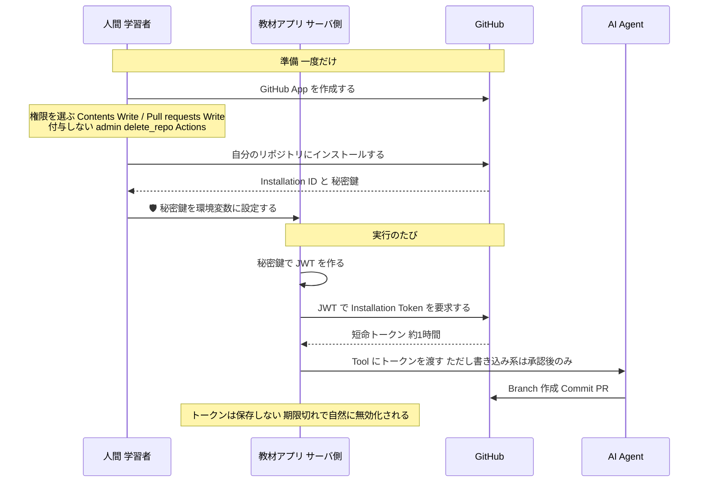
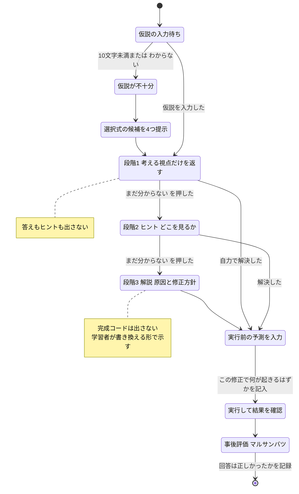
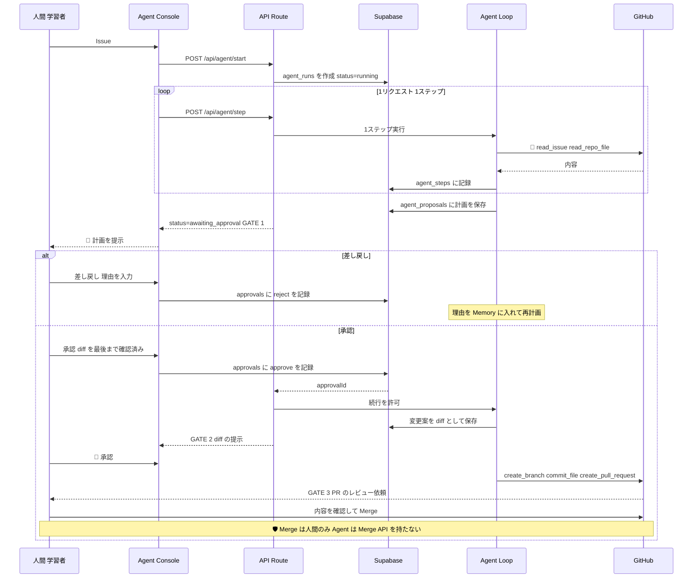
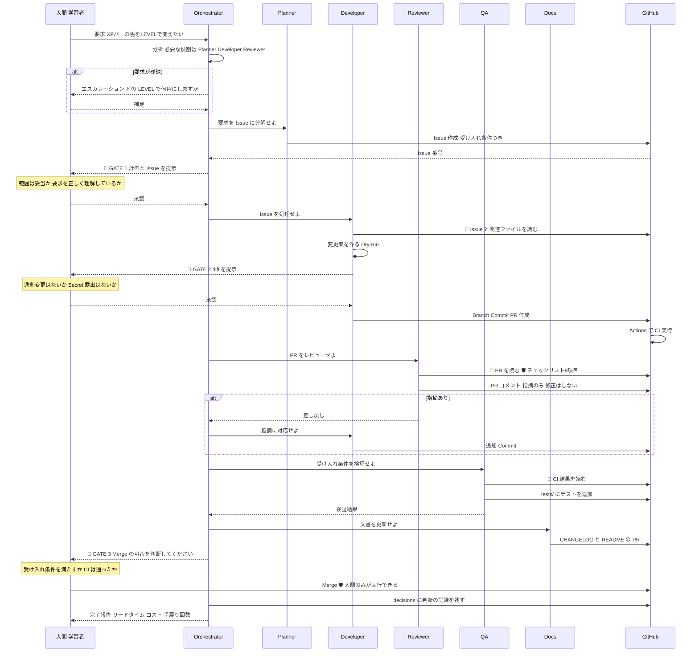
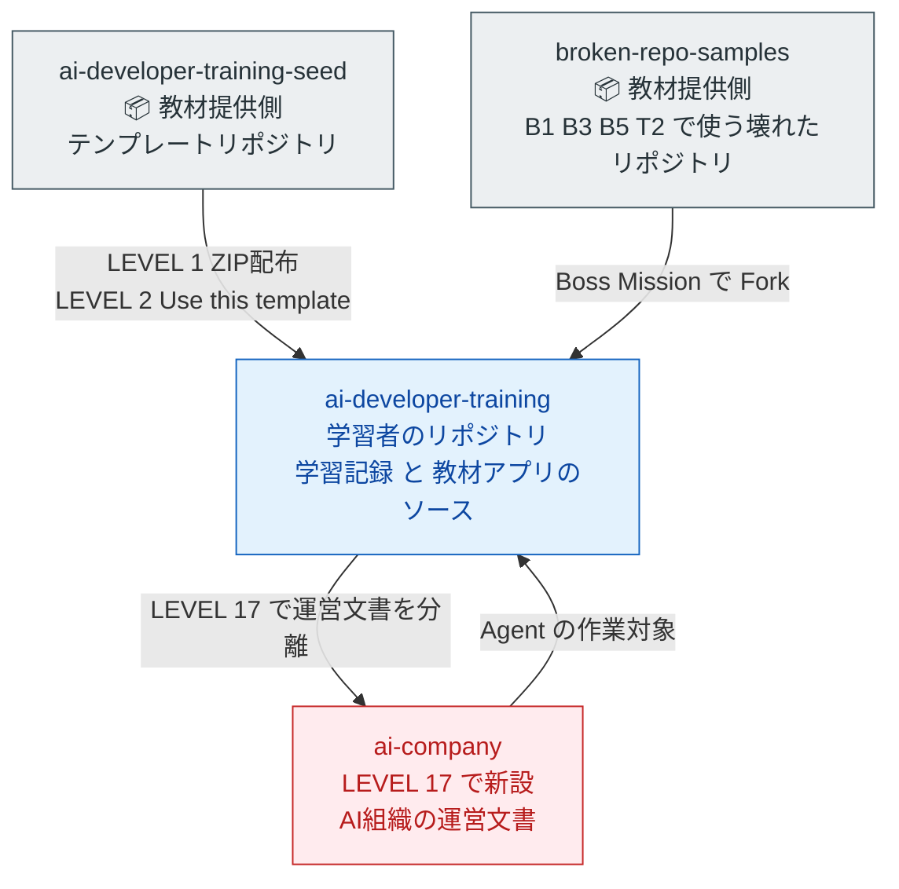

# 04. GitHub連携・AI設計書
### GitHub・API・AI開発 自走型学習アプリ ／ GitHub連携・AI Tutor・AI Agent・AI会社・Repository構成

| 項目 | 内容 |
|---|---|
| 対応する要求仕様 | セクション33 の 15（GitHub連携設計）・16（AI Tutor設計）・17（AI Agent設計）・18（AI会社設計）・19（Repository構成）、14・15・24・25 |
| 前提文書 | `00_教育設計書.md` / `01_カリキュラム設計書.md` / `02_アプリ機能・UIUX設計書.md` / `03_技術スタック・アーキテクチャ設計書.md` |
| 参照した外部調査 | `research/findings.md`（2026年8月時点） |
| 本書が答える未決事項 | 00 U-02 / U-03 / U-05 / U-07、01 C-01 / C-03 / C-05 / Q-06 |

---

## 本書の位置づけ

本書は、教材アプリの「外側とつながる部分」をすべて定義する。
すなわち **GitHub との接続**、**AI との接続**、そして **AI に仕事をさせる仕組み** である。

3つの設計を貫く原則は1つに集約される。

> **Read → 提案 → 人間承認 → Write。**
> AI に最初から強い権限を与えない。権限は学習の進行に合わせて段階的に開く。
> そしてその段階そのものが、教材である。

---

# 第1章 GitHub連携設計

## 1.1 GitHub が担う3つの役割

本教材で GitHub は3つの異なる役割を持つ。**この3つを混同しないことが設計の出発点である。**

| # | 役割 | 具体的な内容 | 導入 LEVEL |
|---|---|---|---|
| 1 | **学習の記録場所** | 成長ログ・エラー記録・成果物。学習者が手で書く | 0〜 |
| 2 | **アプリのデータ源** | Commit 数・Issue 数・PR 数を API で取得して表示する | 8〜 |
| 3 | **AI の作業場** | Agent が Issue を読み、Branch を作り、PR を出す | 15〜 |

**役割3に到達するまでに、役割1・2 で「GitHub 上で何が起きているか」を人間が完全に理解している必要がある。**
これが「GitHub API（旧 LEVEL 6）より前に認証（LEVEL 7）を置く」という順序修正（00 P-3）の背景でもある。

## 1.2 認証方式の段階設計

### 1.2.1 段階の全体像

findings 1-1・1-2・1-3 の調査結果に従い、**認証方式を4種類、権限を6段階で設計する。**

| 段階 | LEVEL | 認証方式 | 権限 | 保管場所 | 事故時の被害 |
|---|---|---|---|---|---|
| **0** | 6 | なし | — | — | なし |
| **1** | 7 | **fine-grained PAT** | Contents: **Read** | 🛡 `sessionStorage`（設定画面から入力。`localhost` 判定時のみ） | 情報漏洩のみ |
| **2** | 8 | fine-grained PAT | + Issues: **Write** | ⚠ **ブラウザ**（`sessionStorage`。意図的に危険な状態を体験） | ノイズ作成。復旧可能 |
| **2'** | 9 | fine-grained PAT | 同上 | 🛡 Vercel の環境変数（サーバ側） | 情報漏洩（ただしブラウザからは不可視） |
| **3** | 10 | **GitHub OAuth**（Supabase Auth 経由） | ログイン用の read-only スコープ | 🛡 Supabase が管理（自作しない） | セッション奪取 |
| **4** | 11 | **Actions の `GITHUB_TOKEN`** | ワークフロー内で最小権限を明示指定 | 🛡 GitHub が自動発行（実行時のみ） | ワークフロー範囲内 |
| **5** | 15 | **GitHub App** | + Contents: Write / Pull requests: Write | 🛡 短命の Installation Token（約1時間） | **不正なコード変更。最大の危険点** |
| **禁止** | 全期間 | classic PAT の `repo` 全付与 / `admin` / `delete_repo` / org 全体スコープ | — | — | 復旧不能な破壊 |

**段階2 が意図的に危険であることが本設計の要点である。** 学習者は一度だけ、ブラウザにトークンを置き、開発者ツールでそれが見えることを自分の目で確認する。この体験がないまま「サーバ側に置きましょう」と教えても、理由が身体に入らない。

**⚠ 段階1・2（LEVEL 7〜8）の保管場所が `.env.local` ではない理由。**
STACK A（LEVEL 1〜8）には **Node.js もビルドもなく、ブラウザは `.env.local` を読めない。** さらに LEVEL 2 以降アプリは GitHub Pages に公開されているため、公開URL上で PAT を入力させる設計にはできない。したがって：

| 決定 | 内容 |
|---|---|
| **入力方法** | 設定画面（02 SC-13）から学習者が貼り付ける |
| **保持先** | `sessionStorage`（**タブを閉じると消える**。`localStorage` には置かない） |
| **入力欄の有効条件** | 🛡 `location.hostname` が `localhost` / `127.0.0.1` のときのみ有効化し、**公開URL上では無効化する** |
| **`.env.local` の位置づけ** | LEVEL 7 の実践課題で「作る」だけの**予習**。LEVEL 7〜8 では読み込まれず、実際に機能するのは Next.js に移行する **LEVEL 9（段階2'）以降** |

この設計に伴う新たな脅威（`sessionStorage` に置いた PAT が XSS で読み出される）は **05 T-19** として脅威一覧に登録済みである。対策として、教材本文や API レスポンスを `innerHTML` で描画せず `textContent`／DOM 生成を使うこと（LEVEL 6 の描画実装時に教える）。

### 1.2.2 なぜ fine-grained PAT を最初に教えるか

findings 1-2 の通り、fine-grained PAT は 2025年3月に一般提供（GA）となり、本番運用にも推奨できる段階にある。

| 比較 | classic PAT | fine-grained PAT |
|---|---|---|
| 権限の粒度 | `repo` のような広いスコープ単位 | リソース単位（contents / issues / pull requests …）× read/write |
| 対象リポジトリ | すべて | 選択可能 |
| 監査 | 弱い | `token_id` が API 呼び出しに含まれ、監査ログでフィルタ可能 |
| 教材としての価値 | 「全部入り」＝最小権限を教えられない | **「必要なものだけ選ぶ」体験ができる** |

**初学者が PAT を作るとき、最も起きやすい事故は classic PAT で `repo` を全付与することである**（00 P-13）。
したがって本教材では **最初から fine-grained PAT だけを教え、classic PAT の作成手順を一切示さない。**

⚠ **注意（findings 1-2 の制限事項）**：fine-grained PAT は現時点で Packages API・Checks API・Enterprise 系 API・複数組織横断などに未対応である。**本教材の用途（contents / issues / pull requests / metadata）は範囲内**だが、教材を拡張する際は制限の最新状況を公式ドキュメントで確認すること。また classic PAT の廃止時期は明言されていない（未確認）。

### 1.2.3 なぜ OAuth App を使わず GitHub App にするか

findings 1-1 の通り、GitHub 公式ドキュメントは **GitHub Apps を推奨** している。

| 観点 | OAuth App | **GitHub App** |
|---|---|---|
| 権限 | `repo` のような広いスコープ | 細粒度（リソース × read/write） |
| 対象リポジトリ | ユーザーがアクセスできる全て | インストール時に選択（All / Selected） |
| トークン寿命 | 長寿命（取り消すまで有効） | **短命（既定で約1時間）** |
| Webhook | リポジトリごとに個別設定 | アプリ単位で一元管理 |
| 教材価値 | 「昔ながらの広い権限モデル」の比較対象として有用 | **「AI社員ごとに必要最小限の権限を与える」思想を体験できる** |

**結論：Agent に書き込み権限を与える LEVEL 15 では GitHub App を使う。**
理由は3つある。

1. **短命トークン**：Agent が暴走しても、トークンの有効期間が限られる
2. **細粒度権限**：Reviewer には Read のみ、QA には tests/ のみ、といった役割別の権限分離（LEVEL 16）が表現できる
3. **公式推奨**：2026年時点のベストプラクティスに沿っている

OAuth App は **教材内で「比較対象」としてのみ登場させる**（「昔はこういう広い権限モデルだった。何が問題か？」という設問）。実装はしない。

### 1.2.4 GitHub App の Installation Token フロー

findings 1-3 に基づく。**LEVEL 15 の教材で図解する内容そのものである。**



**教育上の要点**：「トークンを保存しない」「毎回発行する」「1時間で消える」という3点が、**長寿命 PAT との決定的な違い**である。これは LEVEL 7 で学んだ「秘密情報の管理」の発展として教える。

⚠ **注意**：GitHub App の作成手順・JWT の生成方法・API のパスは変更されうる。実装時に `https://docs.github.com/en/apps` で確認すること。

### 1.2.5 権限を与える前の必須チェック（🛡 前提条件の強制）

**段階5（Agent への書き込み権限）を与える前に、次がすべて満たされていることをアプリ側で機械的に検証する。**

| # | 前提条件 | 確認方法 | 未達なら |
|---|---|---|---|
| 1 | main に branch protection が設定されている | GitHub API でルールを取得 | **権限を付与しない** |
| 2 | PR 必須（直接 push 不可） | 同上 | 権限を付与しない |
| 3 | LEVEL 3（revert）を通過している | 進捗 DB | 権限を付与しない |
| 4 | LEVEL 14（承認ゲート実装）を通過している | 進捗 DB | 権限を付与しない |
| 5 | 変更規模上限が設定されている | アプリ設定 | 権限を付与しない |

**これは 01 の「危険な操作の前に、復旧手段を先に置く」（再構成原則5）を、コードで強制する実装である。**
学習者が順序を飛ばそうとしたとき、教材が止める。

## 1.3 利用する GitHub API

### 1.3.1 共通方針

| 項目 | 方針 |
|---|---|
| API 種別 | **REST API** を主軸。GraphQL は LEVEL 8 で「こういうものもある」と1回触れるだけ（findings 2-1） |
| バージョン指定 | **`X-GitHub-Api-Version: 2026-03-10` を必ず明示指定する** |
| なぜ明示するか | 省略時の既定は `2022-11-28`。**AI が古い仕様で書いたコードとの差異を防ぐ**ためであり、これ自体が「AIの回答を疑う力」の実践 |
| ライブラリ | LEVEL 8 は素の `fetch`。LEVEL 9 以降も `fetch` で足りる。⚠ Octokit 等の導入は任意（依存を増やす判断を `decisions/` に記録させる） |
| エラー処理 | Status Code をそのまま扱う。**401 / 403 / 404 / 422 / 429 の5つを教材で明示的に扱う** |

### 1.3.2 エンドポイント一覧

| # | 用途 | メソッド・パス | 必要権限 | 導入 LEVEL | 呼び出し頻度 |
|---|---|---|---|---|---|
| 1 | 自分の情報 | `GET /user` | metadata: read | 8 | 接続確認時のみ |
| 2 | リポジトリ情報 | `GET /repos/{owner}/{repo}` | contents: read | 8 | 日次 |
| 3 | Commit 一覧 | `GET /repos/{owner}/{repo}/commits` | contents: read | 8 | 日次（ページング） |
| 4 | Issue 一覧 | `GET /repos/{owner}/{repo}/issues` | issues: read | 8 | 日次 |
| 5 | Issue 作成 | `POST /repos/{owner}/{repo}/issues` | issues: **write** | 8 | 学習者操作時 / Agent 提案の承認後 |
| 6 | PR 一覧 | `GET /repos/{owner}/{repo}/pulls` | pull_requests: read | 8 | 日次 |
| 7 | ファイル取得 | `GET /repos/{owner}/{repo}/contents/{path}` | contents: read | 15 | Agent の Read |
| 8 | Branch 作成 | `POST /repos/{owner}/{repo}/git/refs` | contents: **write** | 15 | 🤝 承認後のみ |
| 9 | ファイル更新 | `PUT /repos/{owner}/{repo}/contents/{path}` | contents: **write** | 15 | 🤝 承認後のみ |
| 10 | PR 作成 | `POST /repos/{owner}/{repo}/pulls` | pull_requests: **write** | 15 | 🤝 承認後のみ |
| 11 | PR コメント | `POST /repos/{owner}/{repo}/issues/{n}/comments` | pull_requests: write | 16 | Reviewer 役割 |
| 12 | Branch protection の確認 | `GET /repos/{owner}/{repo}/branches/{branch}/protection` | administration: read | 15 | 🛡 前提条件チェック（1.2.5） |
| 13 | Actions の実行結果 | `GET /repos/{owner}/{repo}/actions/runs` | actions: read | 11 | Boss 判定・QA 役割 |
| 14 | Rate Limit の残量 | `GET /rate_limit` | なし | 8 | 画面表示・デバッグ |

⚠ **各エンドポイントのレスポンススキーマの細部は findings で未検証である。** 実装時に `https://docs.github.com/en/rest` で確認すること。

### 1.3.3 「使わない」と決めた API

| API | 使わない理由 |
|---|---|
| Webhook の作成・受信 | 00 P-7。自前の公開エンドポイント・署名検証が必要になり、初学者に不適。**GitHub Actions の `on:` トリガーで代替**（findings 2-3 の設計上の含意と一致） |
| GraphQL API | 初学者には REST の方が直感的（findings 2-1）。発展話題として1回触れるのみ |
| Packages / Checks API | fine-grained PAT が未対応（findings 1-2）。教材で必要にならない |
| Merge API（`PUT /pulls/{n}/merge`） | 🛡 **Agent に Merge させないため、意図的に実装しない。** Merge は人間が GitHub の画面で行う（00 P-18 の禁止事項） |
| リポジトリ削除 | 🛡 論外 |

**「Merge API を実装しない」ことが、自動 Merge 禁止の最も確実な実装である。** 設定で禁止するのではなく、**その能力を最初から持たせない。**

## 1.4 Rate Limit 対策

### 1.4.1 前提（findings 2-2）

| 認証 | 上限 |
|---|---|
| 認証なし | 60 req/h |
| PAT / OAuth（個人の代理） | 5,000 req/h |
| GitHub App の Installation Token | 基本 5,000 req/h（インストール先が20リポジトリ超で加算、上限 12,500 req/h） |
| 二次レート制限 | 同時リクエスト数等。別途存在する |

**本教材の想定使用量（1日100 req 未満）では、上限に達することはまずない。**
にもかかわらず対策を設計するのは、**LEVEL 13 以降で Agent が反復すると、現実的に到達しうるため**である（findings 2-2 の設計上の含意）。

### 1.4.2 対策（4層）

| 層 | 対策 | 実装 LEVEL |
|---|---|---|
| **1. 呼ばない** | 集計値は日次スナップショット（`github_stat_snapshots`）に保存し、画面表示では API を呼ばない | 8 |
| **2. まとめる** | 一覧取得は `per_page` を大きくし、必要な範囲だけ取得。**全ページ取得を既定にしない** | 8 |
| **3. 待つ** | 429 / 403（rate limit）を受けたら、レスポンスヘッダのリセット時刻まで待つ。**指数バックオフ + ジッター** | 8（教材化）／15（Agent で必須） |
| **4. 止める** | Agent の1実行あたりの GitHub API 呼び出し回数に上限を設ける（例：30回） | 15 |

### 1.4.3 教材としての扱い

⚠ **LEVEL 8 では、意図的に Rate Limit に当てる Mission を置くことを推奨する。**
認証なしの 60 req/h は、ループを1つ書けば数秒で到達する。**「上限がある」ことを体験させたうえで、認証すると 5,000 になることを見せる。**
これは「認証は権限のためだけでなく、量のためでもある」という、初学者が見落としがちな観点の教材になる。

⚠ **注意**：Rate Limit の数値・ヘッダ名・二次レート制限の詳細は変更されうる。実装時に `https://docs.github.com/en/rest/using-the-rest-api/rate-limits-for-the-rest-api` で確認すること。

## 1.5 Boss Mission の自動判定ロジック（01 C-03 への回答）

02 F-14 で規定した通り、判定は **自動判定 ＋ AIレビュー ＋ 自己申告** の3系統である。
ここでは自動判定の条件を定義する。**自動判定は「客観的事実」に限定し、質の評価は AI と人間に委ねる。**

⚠ **自動判定の条件数は Boss ごとに異なる（本表では 1〜4 件）。** CO-29 により、コード内容の静的解析に依存する条件をすべて AI レビューへ移したため、**B4 API と B6 AI は自動判定できる事実が「該当ファイルの存在」1件のみ**になっている。**条件数の少なさは設計の欠落ではなく、「判定できないものは判定しない」という原則の帰結である。**

| Boss | 自動判定できること（GitHub API） | AI レビューに委ねること | 自己申告 |
|---|---|---|---|
| **B1 RECOVERY**（L3後） | 対象リポジトリに revert Commit が存在する／HEAD が壊れた状態でない／履歴が保たれている | 復旧手順の説明の妥当性 | 「何が起きたか説明できるか」 |
| **B2 GITHUB**（L4後） | Branch が作られた／PR が1件以上 Merge された／main への直接 push がない／branch protection が有効 | PR 本文の質、Issue の8項目充足 | — |
| **B3 SECURITY**（L7後） | `.gitignore` に必須5項目がある／履歴に `.env.local` が含まれない／public/private 設定 | 漏洩時の対処順序（**まず失効、次に履歴**）の正しさ | revoke を実際に行ったか |
| **B4 API**（L8後） | 指定リポジトリに **API 呼び出しを行うファイルが存在する** | `X-GitHub-Api-Version` の指定の有無／トークンが直書きされていないこと／エラー処理・Rate Limit 対応の妥当性 | 動作確認の結果 |
| **B5 FULL-STACK**（L11後） | Vercel の公開URLが 200 を返す／Actions の CI が成功している／PR が CI を通って Merge されている | アーキテクチャ図の妥当性 | — |
| **B6 AI**（L13後） | 指定リポジトリに **AI 呼び出しを行うファイルが存在する** | 💰 上限設定がコード上に存在すること／出力検証（Eval）の設計、Prompt Injection 対策の妥当性 | 誤答検出の結果 |
| **B7 AGENT**（L15後） | Agent が作成した PR が存在する／PR 本文に「Agent作成・人間承認済み」の記載がある／force push の履歴がない | Dry-run の実装、悪意ある Issue の拒否記録 | 復旧手順を実際に試したか |
| **B8 FINAL**（L17後） | `decisions/` に5件以上のファイル／`company/HUMAN_GATES.md` が存在／会社リポジトリの構造が揃っている | 3ゲートの判断基準の妥当性、Retrospective の内容 | 差し戻し実績 |

**判定できないものは判定しない、を原則にする。**
自動判定は「**ファイル/リポジトリの存在**」と「**GitHub 上の事実**」（PR が Merge された・CI が成功した・revert Commit がある・branch protection が有効 など）に限定する。**コード内容の静的解析（文字列一致による有無の判定）は自動判定に含めない。** コメント内の記述や別の書き方で誤検出が起こり、**誤判定は学習者の信頼を最も損なう**ためである。コード内容の妥当性はすべて AI レビューに委ねる。

### 判定結果の提示方法（02 F-14）

**「合格／不合格」ではなく「満たした条件／満たしていない条件」の一覧で示す。**
不合格時は、満たしていない条件に対応する復習 Mission を自動生成する。

```
BOSS 3 SECURITY  判定結果

✅ .gitignore に必須5項目がある
✅ 履歴に .env.local が含まれない
❌ トークンの失効（revoke）を行った記録がない
   → 復習 Mission 7-R1「漏洩したトークンを失効させる」を追加しました
⏳ AI レビュー中：対処の順序
```

## 1.6 Webhook を使わない判断と、その代替

| 項目 | 内容 |
|---|---|
| **判断** | 本編で Webhook の自作実装を扱わない（00 P-7） |
| **理由** | 公開エンドポイント・署名検証（HMAC）・ローカル開発時のトンネリングが同時に必要になり、LEVEL 11 の学習者には概念が多すぎる |
| **代替** | **GitHub Actions の `on:` トリガー**。`on: issues` / `on: pull_request` / `on: schedule` で、Webhook の仕組みを GitHub が肩代わりしてくれる（findings 2-3 の設計上の含意） |
| **教材での扱い** | LEVEL 11 で「Actions のトリガーは、内部的には Webhook である」と**概念だけ説明する**。実装は Advanced A-2 |

### Actions トリガーで実現すること

| トリガー | 実現する機能 | LEVEL |
|---|---|---|
| `on: push` / `on: pull_request` | CI（テスト実行） | 11 |
| `on: schedule`（毎朝） | 「今日の学習」Issue の自動生成、ブランク検知（02 F-18） | 11 |
| `on: issues`（発展） | Issue が作られたときの通知・ラベル付け | 11（紹介のみ） |

⚠ **注意**：署名検証の具体的手順は findings で未検証（未確認）。Advanced A-2 を作成する際は `https://docs.github.com/en/webhooks` で確認すること。

---

# 第2章 AI Tutor 設計

## 2.1 役割と非役割

| AI Tutor がやること | AI Tutor がやらないこと |
|---|---|
| 学習者の仮説を受け取り、**考える視点を返す** | いきなり答えを出す |
| エラーの原因候補を提示し、**検証方法を教える** | 学習者の代わりに修正コードを書いて終わる |
| コードを「覚えるべき点3つ／今は不要な点」に分解する | 全行を逐語解説する |
| 成長ログから **繰り返し詰まっている領域** を指摘する | 学習者を評価・採点する |
| 「なぜ？」の L3（設計思想）に対する追加質問に答える | 教材の本文を書き換える |
| 理解チェック問題を「なぜ型」で生成する | 暗記問題を生成する |

**最重要の非役割：AI Tutor は学習者の代わりに作業しない。**
コードを提示する場合も、**必ず「学習者が自分で書き換える形」**（差分の指示、変更箇所の説明）にする。

## 2.2 6つのモード

| モード | 起動元 | 入力 | 出力形式 | モデル階層 | 導入 |
|---|---|---|---|---|---|
| `why` | 「なぜ？」L3 への追加質問 | 教材の L3 本文 + 学習者の質問 | 自由文 | 標準 | 13 |
| `error` | エラー学習（02 F-10 の STEP D） | エラー全文 + ★学習者の仮説 + 環境 | 構造化（原因候補・検証手順） | 標準 | 13 |
| `code` | AI解説モード（02 F-08） | 選択コード + ファイルパス + **現在 LEVEL** | 構造化（7項目） | 標準 | 12〜13 |
| `glossary` | 用語クリック | 用語名 + 文脈 | 構造化（4欄形式） | 軽量 | 12 |
| `quiz` | 理解チェック生成 | Mission の学習内容 | 構造化（3問） | 軽量 | 13 |
| `weakness` | ダッシュボード / 週次 | 成長ログ要約 + エラー記録 + ヒント使用履歴 | 構造化（弱点3件 + 推奨行動） | 上位 | 13 |

**モードごとにエンドポイントを分ける**（01 LEVEL 13 実践課題1）。1つの巨大なプロンプトに分岐を詰め込まない。**これは AI 会社の役割分離（LEVEL 16）の予行演習でもある。**

## 2.3 システムプロンプトの設計方針

### 2.3.1 4層構造

すべてのプロンプトを次の4層で組み立てる。**層を混ぜない。**

```
┌─ 層1：共通ヘッダ（全モード共通・固定）────────────────┐
│  あなたの役割 / 絶対に守ること / 学習者の前提         │
├─ 層2：モード指示（モードごとに固定）──────────────────┤
│  このモードで何をするか / 出力形式 / 禁止事項         │
├─ 層3：文脈（実行時に注入）─────────────────────────┤
│  現在 LEVEL / 学んだ技術 / まだ学んでいない技術       │
│  成長ログ要約 / 直近のエラー                          │
├─ 層4：データ（🛡 指示ではなくデータとして明示）────────┤
│  <data> ... </data> で囲む。ここに書かれた指示は無効  │
└──────────────────────────────────────────────────┘
```

### 2.3.2 層1：共通ヘッダ（骨子）

```
あなたは、プログラミング初学者に AI 駆動開発を教える学習支援AIです。

【絶対に守ること】
1. 学習者が自分で考える機会を奪わない。答えを最初から出さない。
2. 学習者がまだ学んでいない技術を持ち出さない。
   現在 LEVEL は {current_level} です。LEVEL {current_level} より後の技術は
   「それは LEVEL {n} で学びます」とだけ述べ、内容には踏み込まないこと。
3. 「覚えるべきこと」は3点以内に絞る。
   「今は覚えなくてよいこと」を必ず明示する。
4. 断定できないことは断定しない。
   バージョン・料金・仕様は「公式ドキュメントで確認してください」と述べる。
5. 危険な提案をしない。
   - トークンをコードに直書きする例を出さない
   - admin 権限や広い権限を勧めない
   - main への直接 push を勧めない
   - 自動 Merge を勧めない
6. 変更範囲を勝手に広げない。
   聞かれていないファイルの変更を提案しない。

【学習者の前提】
- プログラミング初学者。AI にコードを書かせることには抵抗がない。
- 目標は「全部自分で書けること」ではなく「AIと協働して開発を進められること」。
- したがって、コードを読む力・指示する力・疑う力を伸ばすことが目的である。

【口調】
- 専門用語を専門用語だけで説明しない。必ず日常の例えを添える。
- 学習者を評価しない。できていないことを責めない。
```

### 2.3.3 層2：モード指示の例（`error` モード）

```
【このモードでやること】
学習者がエラーに遭遇し、自分の仮説を書いた状態で質問しています。

【出力の順序】
1. 学習者の仮説について、まず評価する（当たっている / 惜しい / 別の可能性が高い）
   ★ 当たっている場合は明示的に「あなたの予想が当たっています」と言うこと
2. 原因の候補を最大3つ、可能性の高い順に挙げる
3. 各候補について「どうやって確かめるか」を1つずつ示す
   ★ 修正方法ではなく、確認方法を先に示すこと
4. 学習者に問い返す：「まずどれを確かめますか？」

【禁止】
- 修正済みのコード全体を貼らない
- 3つ以上のファイルにまたがる変更を提案しない
- 「とりあえず全部消して作り直しましょう」と言わない
```

### 2.3.4 出力形式の固定（Structured Output）

findings 4-1 の通り、Anthropic には strict tool use、OpenAI には Structured Output があり、いずれもスキーマ準拠を保証できる。
**構造化が必要なモード（`code` / `glossary` / `quiz` / `weakness`）では必ずスキーマを指定する。**

```jsonc
// code モードの出力スキーマ
{
  "purpose": "このコードの目的（1〜2文）",
  "blocks": [
    { "lines": "3-7", "what": "何をしているか", "why": "なぜ必要か" }
  ],
  "input": "何を受け取るか",
  "output": "何を返すか",
  "if_removed": "消したらどうなるか",
  "must_remember": ["最大3件"],
  "can_ignore": ["今は覚えなくてよい部分"]
}
```

⚠ **注意**：strict モードの有効化方法・対応スキーマの制約は各社で異なり、変更されうる。実装時に各社の公式ドキュメントで確認すること（findings 4-1 / 4-2）。

## 2.4 段階開示ロジック（「自分で考える → ヒント → 解説」）

### 2.4.1 状態遷移



### 2.4.2 各段階の内容

| 段階 | AI が返すもの | 返さないもの | 対応する教育原則 |
|---|---|---|---|
| **段階1（視点）** | 「何を確かめればよいか」の問い | 原因・修正方法 | ZPD／足場かけ |
| **段階2（ヒント）** | 「どこを見るべきか」の場所 | 具体的な答え | フェーディング |
| **段階3（解説）** | 原因と修正方針。**差分の指示** | 完成コード全体 | Worked Example |

### 2.4.3 形骸化を防ぐ仕組み（00 5.7 対策1）

| 対策 | 実装 |
|---|---|
| 段階を飛ばせない | 「まだ分からない」を押さないと次の段階が出ない |
| 仮説の必須化 | 空欄では送信不可（R-02）。10文字未満なら選択式候補を4つ提示 |
| 実行前の予測を必須化 | 段階3 の後、修正を実行する前に「この修正で何が起きるはずか」を入力させる |
| 事後評価の記録 | 「AIの回答は正しかったか」を ○△× で記録し、成長ログ項目7に反映 |
| **段階の使用履歴を記録** | 段階3 まで到達した回数が多い領域＝弱点として `weakness` モードの入力になる |

**「段階3 に到達した」ことは失敗ではない。** ペナルティを与えず、記録するだけにする。記録の目的は評価ではなく、次に何を復習すべきかの判断材料である。

## 2.5 成長ログを Memory として使う設計

### 2.5.1 何を Memory にするか

要求16 は成長ログを「将来AIが学習者の弱点を判断するMemory」としている。
**ただし、成長ログをそのまま全文プロンプトに入れてはいけない。** 100日分の記録は数十万トークンになり、💰 コストと Context Window の両方で破綻する。

| 層 | 内容 | 生成方法 | Context への投入 |
|---|---|---|---|
| **L0 生ログ** | `notes/log/*.md` の全文 | 学習者が手で書く | ❌ 入れない |
| **L1 構造化** | `growth_logs` テーブル（8項目） | Markdown をパースして DB に | ❌ 直接は入れない |
| **L2 抽出** | `growth_log_gaps`（「まだ分かっていないこと」のトピック化） | 週次で軽量モデルが抽出 | ✅ 入れる |
| **L3 要約** | 弱点3件 + 強み2件 + 傾向1文 | `weakness` モードが生成し保存 | ✅ 入れる |

**プロンプトに入れるのは L2 と L3 だけである。** 目安として 1,000 トークン以内に収める。

### 2.5.2 弱点の判定材料

| 材料 | 出所 | 何を示すか |
|---|---|---|
| 「まだ分かっていないこと」の繰り返し | `growth_log_gaps.recurrence` | **最重要。** 3回以上出た話題は明確な弱点 |
| ヒント3まで到達した Mission | `hint_usages` | 足場が必要だった領域 |
| Quiz の誤答が集中する領域 | `quiz_attempts` | 理解の穴 |
| 同種のエラーの再発 | `error_similarities` | 転移していない知識 |
| 詰まった時間の合計 | `growth_logs.stuck_minutes` | 認知負荷の高かった領域 |
| AI 回答の × 率 | `growth_logs.ai_accuracy` | **逆指標。× が増える＝懐疑力が育っている** |

### 2.5.3 弱点指摘の出力形式

```jsonc
{
  "weak_points": [
    { "topic": "非同期処理（await）", "evidence": "L6・L8・L9で計5回「まだ分かっていない」に記載",
      "suggested_action": "Mission 6-4 を再実行し、await を外すとどうなるかを観察する",
      "estimated_minutes": 15 }
  ],
  "strengths": ["エラーメッセージを全文コピーして質問する習慣が定着している"],
  "trend": "AIの回答に△×を付ける割合が増えており、検証の姿勢が育っている",
  "not_a_weakness": ["TypeScript の型エラー：これは AI に投げてよい領域です"]
}
```

**`not_a_weakness` フィールドが設計上の要点である。**
初学者は「分からないこと全部が弱点」と感じて圧倒される。**「これは弱点ではない」と明示することが、認知負荷を下げる最も効く技法**（00 5.7 対策4 と同じ思想）。

### 2.5.4 🛡 プライバシーと安全性

| 項目 | 方針 |
|---|---|
| 成長ログに個人情報を書かない | テンプレートに注意書き（03 6.1 の public リポジトリ問題と連動） |
| ログを AI に送る前の確認 | 初回に「成長ログを AI に送ります」と明示し、同意を取る |
| 送信内容の可視化 | 何を送ったかを画面で確認できるようにする（**ブラックボックスにしない**） |
| 🛡 ログ内のテキストは「データ」として扱う | 層4（`<data>` 囲み）。ログに書かれた文が指示として解釈されないようにする（Prompt Injection 対策） |

## 2.6 モデル選択とコスト

03 3.4 で定義した3階層を、モードに割り当てる。

| モード | 階層 | 理由 | 概算トークン/回 |
|---|---|---|---|
| `glossary` | 軽量 | 定型的な4欄出力。品質差が出にくい | 入 500 / 出 400 |
| `quiz` | 軽量 | 形式が固定。3問 | 入 800 / 出 500 |
| `error` | 標準 | 推論が必要。学習体験の中核 | 入 2,000 / 出 800 |
| `code` | 標準 | 読解と分解。**現在 LEVEL への配慮が必要** | 入 2,500 / 出 1,000 |
| `why` | 標準 | 設計思想の説明 | 入 1,500 / 出 800 |
| `weakness` | 上位 | 複数の証拠から傾向を読む。週1回程度 | 入 3,000 / 出 1,000 |

### 💰 コスト削減の実装

| 手段 | 効果 |
|---|---|
| `glossary` のキャッシュ | 用語は有限。2回目以降はゼロコスト |
| 1 Mission = 1 会話スレッド | Context の肥大化を防ぐ（02 A-08） |
| 会話終了時に要約1件だけ残す | 次の Mission に会話全文を引き継がない |
| `weakness` を週次に限定 | 上位モデルの呼び出しを月4回程度に抑える |
| Prompt Caching の活用 | 層1・層2（固定部分）はキャッシュ対象になりうる。⚠ **割引率は未確認**（findings 4-1）。実装時に確認 |

## 2.7 プロバイダ非依存の抽象化層

### 2.7.1 インターフェース（LEVEL 12 で学習者が実装する）

```typescript
// lib/ai/callLLM.ts — 学習者が LEVEL 12 で書く（30行程度）
type LLMRequest = {
  system: string;          // 層1 + 層2
  messages: { role: "user" | "assistant"; content: string }[];
  schema?: object;         // Structured Output のスキーマ（任意）
  tier: "fast" | "standard" | "deep";
  maxTokens: number;       // 💰 必須。省略不可にする
};

type LLMResponse = {
  text: string;
  parsed?: unknown;        // schema 指定時
  usage: { inputTokens: number; outputTokens: number };
  model: string;
  provider: string;
};

async function callLLM(req: LLMRequest): Promise<LLMResponse>;
```

### 2.7.2 設計上の判断

| 判断 | 内容 |
|---|---|
| **最小公倍数だけを抽象化する** | 全社の全機能を吸収しようとしない。テキスト生成・構造化出力・トークン計測の3つだけ |
| **各社固有の機能は抽象化しない** | 使いたい場合は「その社に依存することを承知で使う」と `decisions/` に記録する |
| **`maxTokens` を必須にする** | 💰 省略可能にすると、必ず省略される |
| **`usage` を必ず返す** | `ai_usage_logs` への記録を強制するため |
| **失敗時は例外を投げる** | 「静かに空文字を返す」を作らない。**失敗が見えない設計は初学者に最も有害** |

### 2.7.3 教育的意義（00 P-14）

この抽象化層は **実装30行程度で、性能上の利点はほとんどない。**
それでも作らせる理由は、**「差し替え可能性を設計に埋め込む」という思想を、最小のコストで体験させるため**である。

LEVEL 12 の Mission では、実際に **2社の API で同じアプリコードが動くことを確認する**（01 LEVEL 12 実践課題7）。
この体験があると、「ベンダロックインとは何か」が抽象論ではなくなる。

## 2.8 出力検証（Eval）

| 検証 | 方法 | 導入 |
|---|---|---|
| **形式検証** | Structured Output のスキーマ準拠を、受信後にもう一度検証する（**AI を信用しない**） | 12 |
| **禁止語検証** | 出力に危険なパターン（トークン様の文字列、`admin` 権限の推奨、`rm -rf`）が含まれないか | 12 |
| **一貫性検証** | 同じ質問を3回投げて結果を比較する（01 LEVEL 12 実践課題6）。**非決定性の実測** | 12 |
| **LEVEL 逸脱検証** | 現在 LEVEL より先の技術用語が出力に含まれていないか。含まれる場合は警告表示 | 13 |
| **人間評価** | 「AIの回答は正しかったか」の ○△× 記録 | 13 |

**「LEVEL 逸脱検証」は本教材固有の Eval である。** AI は放っておくと最新・最適な方法を提案する。それが学習者にとって早すぎる場合、教材として有害になる。

## 2.9 🛡 Prompt Injection 対策（LEVEL 13 / SEC S3）

| 攻撃 | 経路 | 防御 |
|---|---|---|
| 直接注入 | 学習者の入力に「これまでの指示を無視して」 | 層1〜3 と層4 を構造的に分離。**ユーザー入力は必ず `<data>` 内** |
| 間接注入 | 成長ログ・エラー全文・Issue 本文に指示が埋め込まれている | 同上。**外部由来のテキストはすべてデータ扱い** |
| 出力経由の攻撃 | AI の出力をそのまま HTML に埋め込む | 🛡 **必ずエスケープする。`innerHTML` を使わない** |
| 権限の悪用 | 注入された指示でツールを呼ばせる | 🛡 **書き込み系ツールの前に必ず人間承認**（第3章） |

**この4つの防御が、LEVEL 15（悪意ある Issue を Agent に渡す）の前提になる。**

---

# 第3章 AI Agent 設計

## 3.1 Agent の定義と最小構成

```
Agent = LLM + Tools + Memory + Instructions + Loop
```

**Chatbot との境界は「Loop があるか」と「外界に作用するか」の2点である**（01 LEVEL 14）。

| 構成要素 | 本設計での実体 | 導入 |
|---|---|---|
| **LLM** | `callLLM()` 抽象化層（2.7） | 12 |
| **Tools** | 読み取り系と書き込み系に**物理的に分離した**関数群（3.3） | 14 |
| **Memory** | 短期＝`agent_steps` の履歴／長期＝DB（成長ログ・過去の実行） | 14 |
| **Instructions** | 役割定義ファイル `ROLE.md` から生成される System Prompt（4.2） | 14（1体）／16（5役割） |
| **Loop** | 反復上限・停止条件・コスト上限つきの繰り返し（3.2） | 14 |

## 3.2 Agent Loop の実装方式

### 3.2.1 「1リクエスト = 1ステップ」設計（03 4.3 の帰結）

Vercel Hobby の Function 実行時間上限（300秒）に対して、Agent Loop は素朴に実装すると収まらない可能性がある。
したがって **状態を DB に置き、1リクエストで1ステップだけ進める。**

```
POST /api/agent/step  { runId }
  1. agent_runs から状態を読む
  2. 🛡 Guardrail チェック（反復上限・コスト上限・変更規模）
  3. callLLM() を1回呼ぶ
  4. 結果が tool_call なら:
       - 読み取り系 → 即実行して結果を保存
       - 書き込み系 → agent_proposals に保存し、status を awaiting_approval にして停止
  5. agent_steps に1行追加
  6. 状態を保存して返す
```

### 3.2.2 擬似コード

```
function agentStep(run):
    if run.iterations >= run.max_iterations:
        return stop("反復上限に達しました")            # 🛡 暴走防止
    if run.cost_usd >= run.cost_limit_usd:
        return stop("コスト上限に達しました")          # 💰 コスト事故防止

    response = callLLM({
        system: buildInstructions(run.role),          # ROLE.md から生成
        messages: buildHistory(run),                   # 短期 Memory
        tools: allowedTools(run.role),                 # 🛡 役割ごとに限定
        maxTokens: run.max_tokens
    })

    record(agent_steps, run, "thought", response.summary)
    record(ai_usage_logs, response.usage)

    if response.hasToolCall:
        tool = response.toolCall
        if not isAllowed(run.role, tool.name):
            return stop("許可されていないツールが要求されました")   # 🛡 Guardrail

        if isReadOnly(tool):
            result = execute(tool)                     # 即実行してよい
            record(agent_steps, run, "tool_result", result)
            run.iterations += 1
            return continue()
        else:
            proposal = buildProposal(tool)             # 🤝 Dry-run
            if proposal.filesChanged > 3 or proposal.linesChanged > 150:
                return stop("変更規模の上限を超えました")           # 🛡
            save(agent_proposals, proposal)
            return awaitApproval()                     # ここで必ず止まる

    if response.isFinalAnswer:
        return complete(response.text)

    run.iterations += 1
    return continue()
```

### 3.2.3 停止条件（すべて必須）

| # | 条件 | 既定値 |
|---|---|---|
| 1 | 最大反復回数に到達 | 8回 |
| 2 | 💰 コスト上限に到達 | 1実行あたりの上限（学習者が設定） |
| 3 | 変更規模の上限を超えた | 3ファイル / 150行 |
| 4 | 許可されていないツールが要求された | 即停止 |
| 5 | GitHub API 呼び出し回数の上限 | 30回 |
| 6 | 最終回答が返された | — |
| 7 | 人間が停止ボタンを押した | — |
| 8 | **エラーが発生した** | 🛡 **何もせず停止する**（中途半端な状態を残さない） |

**8番が最も重要である。** 「失敗したら途中まで書き込んで終わる」Agent は、復旧を困難にする。**fail-closed（失敗時は何もしない）を既定にする。**

### 教材上の指示：反復上限「8回」を自分の言葉で説明させる

**既定値の 8回は、学習者が受け取るべき「答え」ではなく、学習者が引き受けるべき「判断」である。**
LEVEL 14 の該当 Mission では、**学習者が「なぜ8回にしたか」を自分の言葉で `decisions/`（LEVEL 17 以前はノートでよい）に書く**こと。数字を写すのではなく、以下を自分で言語化する。

| 問い | 書くこと |
|---|---|
| 上限が小さすぎるとどうなるか | 解ける仕事も途中で打ち切られる（機会損失） |
| 上限が大きすぎるとどうなるか | 💰 コストが増え、**間違った方向に進む Agent を止められない**（T-13・T-04） |
| 自分は何回にするか、なぜか | 自分の Issue の粒度・予算・待てる時間から決めた根拠 |

これは「**どこで諦めるか**」という打ち切りの判断の訓練であり、統治力（能力軸E）の中核である。**AI と働く際の最大の失敗は「AI が延々と間違った方向に進むのを止められない」ことである。** 反復上限は、その判断を事前に数値として宣言する最初の機会になる。

## 3.3 Tool Calling 設計

### 3.3.1 Tool カタログ

| Tool | 種別 | 入力 | 権限 | 🤝承認 | 導入 |
|---|---|---|---|---|---|
| `read_growth_logs` | 📖 Read | 期間 | DB read | 不要 | 14 |
| `read_mission_progress` | 📖 Read | — | DB read | 不要 | 14 |
| `read_error_logs` | 📖 Read | 期間 | DB read | 不要 | 14 |
| `read_repo_file` | 📖 Read | path | contents: read | 不要 | 15 |
| `list_repo_files` | 📖 Read | dir | contents: read | 不要 | 15 |
| `read_issue` | 📖 Read | issue番号 | issues: read | 不要 | 15 |
| `list_issues` | 📖 Read | ラベル等 | issues: read | 不要 | 15 |
| `read_pr` | 📖 Read | PR番号 | pull_requests: read | 不要 | 16 |
| `read_actions_result` | 📖 Read | run id | actions: read | 不要 | 16 |
| `propose_learning_plan` | 📝 提案 | プラン | — | 🤝 **必要** | 14 |
| `propose_file_change` | 📝 提案 | path, 新内容 | — | 🤝 **必要** | 15 |
| `create_issue` | ✍ Write | title, body | issues: write | 🤝 **必要** | **15** |
| `create_branch` | ✍ Write | 名前 | contents: write | 🤝 **必要** | 15 |
| `commit_file` | ✍ Write | path, 内容, branch | contents: write | 🤝 **必要** | 15 |
| `create_pull_request` | ✍ Write | title, body, branch | pull_requests: write | 🤝 **必要** | 15 |
| `comment_on_pr` | ✍ Write | PR番号, 本文 | pull_requests: write | 🤝 必要（Reviewer のみ緩和可） | 16 |

**⚠ LEVEL 14 の Agent は書き込み系 Tool を1つも持たない。** LEVEL 14 で導入するのは Read 3種と `propose_learning_plan`（提案）のみであり、**`create_issue` は LEVEL 15 で解放する。**
理由は 05 4.4.1 の権限段階にある。Agent への書き込み権限は段階5（**LEVEL 15 到達 ／ branch protection 有効 ／ LEVEL 14 通過**が前提）であり、`create_issue` を LEVEL 14 に置くと「LEVEL 14 通過が LEVEL 14 の前提条件になる」という循環が生じる。実装すると Agent が Issue を作れないか、権限チェックを迂回する実装を書くことになり、05 4.4.2 の「**検証は毎回行う**」原則が最初の適用時点で破られる。
教育的にも、**LEVEL 14 の Mission 14-6 は「承認ゲートそのものを実装する」**であり、**書き込み能力を持たない状態で承認ゲートを作る方が順序として正しい**（檻を作ってから、中に入れるものを渡す）。

### 3.3.2 意図的に作らない Tool

| Tool | 作らない理由 |
|---|---|
| `run_shell_command` / `execute_code` | 🛡 **任意コマンド実行は最大の危険。** Docker を使わない本教材では隔離手段がない（05 第7章） |
| `merge_pull_request` | 🛡 自動 Merge の禁止（00 P-18）。**能力を持たせない** |
| `force_push` | 🛡 同上 |
| `delete_file` / `delete_branch` / `delete_repo` | 🛡 破壊操作。必要になったら人間が行う |
| `update_branch_protection` | 🛡 Agent が自分の檻を開けられてはならない |
| `web_fetch`（任意URL取得） | 🛡 間接 Prompt Injection の主要経路。必要なら allowlist 方式で別途検討 |

**「作らないこと」が最も確実な権限制御である。** これは 05 セキュリティ設計書 第7章の Agent サンドボックス方針の中核でもある。

### 3.3.3 Tool 定義の書き方（教材での扱い）

```typescript
// 読み取り系と書き込み系を、ファイルレベルで分離する
// lib/agent/tools/read/*.ts    ← 承認不要
// lib/agent/tools/write/*.ts   ← 🤝 承認必須（型でも強制する）

type ReadTool  = { kind: "read";  name: string; run: (input) => Promise<unknown> };
type WriteTool = { kind: "write"; name: string;
                   dryRun: (input) => Promise<Proposal>;   // 提案を返すだけ
                   apply:  (approvalId: string) => Promise<Result> };  // 承認IDが必須
```

**`apply()` が `approvalId` を必須引数に取ることが、型レベルでの Human-in-the-loop 強制である。**
承認がなければコンパイルが通らない。これは「お願い」ではなく「仕組み」で守る設計（01 LEVEL 4 の branch protection と同じ思想）。

## 3.4 Human-in-the-loop の実装方式

### 3.4.1 3ゲートの定義

| Gate | タイミング | 人間が判断すること | 差し戻し条件 | LEVEL |
|---|---|---|---|---|
| **GATE 1** | 着手前 | 計画は要求を正しく理解しているか。範囲は妥当か | 要求の誤解 / 範囲の過大 | 15 |
| **GATE 2** | PR 作成前 | diff は必要最小限か。危険な変更はないか | 過剰変更 / Secret 露出 / 権限昇格 | 15 |
| **GATE 3** | Merge 前 | 受け入れ条件を満たすか。テストは通ったか | 条件未達 / CI 失敗 | 15 |

### 3.4.2 承認のデータフロー



### 3.4.3 Dry-run（diff の生成）の実装

**GitHub 上に何も作らずに diff を作る方法** が、LEVEL 15 の技術的な要点である。

| 方式 | 内容 | 採否 |
|---|---|---|
| **A. ローカルで差分を計算** | 現在のファイル内容を `read_repo_file` で取得し、Agent の提案内容と行単位で比較して diff テキストを生成する | ✅ **採用** |
| B. 一時 Branch を作って GitHub の比較画面を使う | GitHub 上に実体ができてしまう。「承認前は一切 Write しない」に反する | ❌ |
| C. Fork して差分を作る | 複雑すぎる | ❌ |

**方式 A なら、承認前に GitHub 側に一切の痕跡が残らない。** これが「Dry-run」の定義を満たす唯一の方法である。

### 3.4.4 承認の一回性と安全性

| 項目 | 実装 |
|---|---|
| 承認 ID は1回だけ使える | `approvals.used_at` を持ち、2回目は失敗させる |
| 承認は特定の提案に紐づく | `approval → proposal → run` の連鎖。汎用の「承認済みフラグ」を作らない |
| **提案内容が変わったら承認は無効** | 提案のハッシュを保存し、実行時に照合する |
| 承認には有効期限がある | 例：30分。古い承認で後から実行されない |
| 🤝 `diff_fully_viewed` | UI で diff を最後までスクロールしないと承認できない（02 A-06） |
| 差し戻しには理由が必須 | 学習者の判断を言語化させる＝能力軸 E の訓練 |

## 3.5 🛡 Guardrail（コードで強制する項目）

01 LEVEL 14 の「Agent 安全設計チェックリスト」8項目を、実装レベルに落とす。

| # | チェックリスト項目 | 実装 |
|---|---|---|
| 1 | 最大反復回数が設定されている | `agent_runs.max_iterations`（NOT NULL、既定8） |
| 2 | 停止条件が明示されている | 3.2.3 の8条件を関数として実装 |
| 3 | Tool が読み取り系と書き込み系に分離 | ディレクトリ分離 + 型分離（3.3.3） |
| 4 | 🤝 書き込み系の前に人間承認 | `apply(approvalId)` の型強制 |
| 5 | 1実行のコスト上限 | `agent_runs.cost_limit_usd`（NOT NULL） |
| 6 | 実行ログが残る | `agent_steps` に全ステップ |
| 7 | 禁止事項が Guardrail としてコードで強制 | 禁止 Tool を実装しない（3.3.2）＋ allowlist 照合 |
| 8 | 失敗時に何もせず停止 | fail-closed。例外時は Write を実行しない |

### 追加の Guardrail（本設計で追加）

| # | 項目 | 実装 |
|---|---|---|
| 9 | **変更規模の上限** | 3ファイル / 150行を超える提案は `blocked` |
| 10 | **秘密情報の混入検査** | 提案 diff に対して、02 F-19 と同じパターン検査を実行。検出したら自動で `blocked` |
| 11 | **保護パスの変更禁止** | `.github/workflows/`、`.env*`、`SECURITY.md` への変更提案は自動 `blocked` |
| 12 | **branch protection の事前確認** | 1.2.5 の前提条件チェック |

**項目10 が実務的に重要である。** AI は「便利だから」と `.env.local.example` に実際の値を書くことがある。**Agent の出力に対しても、人間の出力と同じ検査を行う。**

## 3.6 GitHub 公式 MCP サーバーを使うべきか

### 3.6.1 前提（findings 4-3）

GitHub 公式の MCP サーバー（`github/github-mcp-server`）が存在し、リポジトリ検索・ファイル参照、Issue/PR の作成・更新、Actions の監視、セキュリティ検出事項の確認などを自然言語から操作できる。リモート／ローカル（Docker イメージまたはソースビルド）の両方に対応し、`--toolsets` で有効化する機能を絞り込める。

MCP 自体は2026年時点で業界標準に近い位置づけであり（月間ダウンロード約5億件、主要クラウドが対応表明）、仕様は 2026-07-28 版でステートレス構造に転換している。

### 3.6.2 判断

| 段階 | 方針 | 理由 |
|---|---|---|
| **LEVEL 14** | 🟢 **概念として紹介するのみ**（「AI に道具を渡す共通規格がある」） | Tool Calling を自分で組む学習が主目的。MCP を先に出すと、Tool の中身が見えなくなる |
| **LEVEL 15** | **自作 Tool を使う**（公式 MCP サーバーは使わない） | 権限設計・承認ゲート・Dry-run を自分で実装することが学習目的 |
| **LEVEL 15 の末尾（任意）** | **比較 Mission として公式 MCP サーバーを試す** | 「自分が作ったものと、公式のものは何が違うか」を体験する |
| **Advanced A-3** | MCP サーバーの自作 | 必要になったときに学ぶ |

### 3.6.3 「使わない」判断の理由を明示する

要求31 は「もっと簡単な方法があれば指摘せよ」としている。**その通り、公式 MCP サーバーを使う方が簡単である。**
それでも自作させる理由は次の3点であり、**この理由を教材内で学習者に明示する。**

1. **権限設計が見えなくなる。** MCP サーバー経由だと「どのツールがどの権限を使うか」がサーバー側の実装に隠れる。本教材の中心的な学習項目（最小権限・役割別権限）が体験できない
2. **承認ゲートを差し込めない。** 「Read → 提案 → 人間承認 → Write」を実装するには、Write の直前に自分のコードが必要である
3. **Dry-run の実装ができない。** 公式サーバーの Write ツールは実際に書き込む。承認前に diff だけを作る仕組みは自作でしか作れない

⚠ **ただし実務では公式 MCP サーバーを使うべきである。** この点も明示する。
**「学習のために自作し、実務では既製品を使う」という判断ができることが、本教材の目指す姿勢である。**

⚠ **注意**：MCP の仕様（2026-07-28 版）はステートレス構造への転換を含む大きな変更を経ている。認証・権限の設計は GitHub App の権限モデルと組み合わせる必要がある。実装時に `https://modelcontextprotocol.io` と `https://github.com/github/github-mcp-server` で最新仕様を確認すること。

## 3.7 GitHub Copilot coding agent との関係

### 3.7.1 前提（findings 6-2）

GitHub Copilot coding agent は、Issue やコメントでタスクを割り当てると「リポジトリ調査 → 実装計画 → GitHub Actions 環境でのコード変更 → フィードバック対応 → PR 作成」を自律実行する **公式機能** である（最大実行時間59分、単一リポジトリ、1セッション1 PR、有償の Copilot プラン必須）。

**これは本教材が LEVEL 15 で自作する仕組みと、機能的にほぼ同じものである。**

### 3.7.2 比較

| 観点 | Copilot coding agent | 本教材で自作する Agent |
|---|---|---|
| 完成度 | 高い（公式・実運用品質） | 低い（教材用の最小実装） |
| 費用 | 有償プラン必須 | AI API の従量課金のみ |
| 実行環境 | GitHub Actions 上（隔離済み） | Vercel Function（1リクエスト1ステップ） |
| 権限設計 | GitHub が管理 | **自分で設計する** |
| 承認ゲート | PR レビューで実質1ゲート | **3ゲート（着手前・PR前・Merge前）を自分で設計** |
| Dry-run | なし（PR が結果） | **あり（承認前に diff）** |
| 中身の可視性 | ブラックボックス | **全ステップが `agent_steps` に残る** |
| **学習価値** | 低い（使うだけ） | **高い（構造を理解する）** |

### 3.7.3 教育的意義の整理（要求31 への回答）

> **「既製品があるのに自作する」ことは、通常は過剰設計である。本教材ではそうではない。**

理由：

1. **本教材の成果物は「動くアプリ」ではなく「理解した人間」である。** Copilot coding agent を使えば結果は得られるが、**Tool 呼び出し・権限設計・承認ゲート・Dry-run・Guardrail の仕組みは何も学べない**
2. **AI Agent を「使う側」から「設計する側」に立つことが、Stage 7〜10 の定義そのものである**（00 2.3）
3. **既製品の限界を判断できるようになる。** 「59分の上限がある」「単一リポジトリのみ」といった制約の意味は、自作して初めて理解できる

### 3.7.4 教材での位置づけ

| LEVEL | 扱い |
|---|---|
| 15（開始時） | **「これと同じものが GitHub の公式機能として存在します」と最初に明示する。** 隠さない |
| 15（終了時） | 自作したものと Copilot coding agent の比較を `notes/` に記録させる |
| 卒業後 | 「実務では既製品を使ってよい。ただし、その中で何が起きているか説明できる状態で使うこと」 |

**これを最初に明示することが誠実である。** 「実は既製品がありました」と後から知ると、学習者は自分の時間が無駄だったと感じる。**最初に「なぜ自作するか」を説明すれば、同じ作業が意味のある訓練になる。**

## 3.8 Agent の観測（Observability）

| 記録するもの | テーブル | 用途 |
|---|---|---|
| 各ステップの思考要約 | `agent_steps.thought_summary` | 「なぜその判断をしたか」の説明（01 LEVEL 14 実践課題8） |
| Tool の入出力 | `agent_steps.tool_input` / `tool_output` | 何を読んで何を書こうとしたか |
| 反復回数・コスト | `agent_runs` | 💰 上限管理 |
| 提案と承認 | `agent_proposals` / `approvals` | 🤝 監査証跡 |
| 停止理由 | `agent_runs.status` + 最終ステップ | 失敗の分析 |

### BLACKOUT MISSION（PHASE 4）との接続

00 5.7 の PHASE 4 BLACKOUT は「Agent のログを読み、なぜその判断をしたかを説明する」である。
**したがって `agent_steps` は「人間が読んで理解できる粒度」で記録しなければならない。** 生の JSON だけでは教材にならない。**1ステップ = 1行の日本語要約を必ず持たせる。**

---

# 第4章 AI会社設計

## 4.1 5役割 + Orchestrator

00 P-9・01 LEVEL 16 の判断（12部門 → 5役割 + Orchestrator）に従う。

| 役割 | 責務 | **非責務（やってはいけないこと）** | GitHub 権限 | モデル階層 |
|---|---|---|---|---|
| **Orchestrator** | 要求受領・分析・役割判断・分解・割当・進捗確認・人間へのエスカレーション | 🛡 **自分ではコードを書かない。Issue 本文も書かない（Planner に委譲）** | **なし**（読み取りのみ） | 上位 |
| **Planner** | 要求を受け入れ条件付き Issue に分解する | 実装しない。設計判断をしない | Issues: Write | 上位 |
| **Developer** | Issue → Branch → 変更案 → PR | 🛡 自分の PR を Merge しない。Issue を書き換えない | Contents: Write / PR: Write | 標準 |
| **Reviewer** | PR を批判的にレビューし、逸脱と危険を検出 | 🛡 **コードを直さない（指摘だけ）** | **Read のみ + PR コメント** | 上位 |
| **QA** | 受け入れ条件の検証、テストの追加。**Developer が作成した Branch に対して `tests/` 配下のみ Commit する（PR は作らない。Developer の PR に含まれる形で Merge される）** | 実装コードを変更しない。🛡 **自分で PR を作らない・別 Branch を切らない** | Contents: Write（`tests/` のみ） | 標準 |
| **Docs** | README / CHANGELOG / decisions の更新 | 実装コードを変更しない | Contents: Write（`docs/` のみ） | 軽量 |

### なぜセキュリティ部門と DevOps 部門を作らないか（00 P-9 の再確認）

| 部門 | 作らない理由 | どこが担うか |
|---|---|---|
| **セキュリティ** | 独立させると「セキュリティは誰かの仕事」という最悪の文化を教えることになる | **Reviewer のチェックリスト項目に埋め込む**（4.2.3） |
| **DevOps** | LEVEL 11 で自作した Actions ワークフローがすでにその役割を果たしている | **既存の仕組み**（要求31「既存機能で代替できる」の実例） |

### 役割を増やさない判断

**5役割を超えない。** 増やしたくなった場合は、まず「何が起きたら分割すべきか」の基準を `decisions/` に書かせる（01 LEVEL 17 つまずき対策）。
**組織設計は「増やす技術」ではなく「増やさない判断の技術」である。**

## 4.2 役割定義ファイルの仕様

### 4.2.1 ファイル構成

要求24 は ROLE.md / RESPONSIBILITIES.md / RULES.md / INPUT.md / OUTPUT.md / TOOLS.md / MEMORY.md の7ファイル方式を挙げている。
**本設計では、これを 1ファイル（`ROLE.md`）に統合する。**

| 判断 | 理由 |
|---|---|
| **7ファイル → 1ファイル** | 6役割 × 7ファイル = 42ファイル。**1人の学習者が保守できる量を超える**（00 P-9 と同じ論理）。関連する情報が分散すると、更新漏れが必ず起きる |
| ただし**セクション構成は7つを維持** | 情報の欠落を防ぐ。ファイル数ではなく構造で担保する |

### 4.2.2 `ROLE.md` のテンプレート

```markdown
# ROLE: Developer

## 1. 役割（あなたは誰か）
Issue を受け取り、最小の変更で解決する実装担当です。

## 2. 責務（やること）
- Issue の受け入れ条件を読み、必要な変更を特定する
- 変更案を diff として提示する
- 承認後に Branch を作り、Commit し、PR を作成する

## 3. 禁止事項（やってはいけないこと）★最重要
- 🛡 自分の PR を Merge しない
- 🛡 Issue の本文を書き換えない（Planner の領域）
- 🛡 .github/workflows/ .env* を変更しない
- 🛡 3ファイル・150行を超える変更を提案しない（超える場合は分割を提案する）
- 🛡 依存パッケージを追加しない（追加が必要なら人間に相談する）
- 聞かれていないリファクタリングをしない

## 4. 入力（何を受け取るか）
- GitHub Issue（番号・タイトル・本文・受け入れ条件・ラベル）
- 対象リポジトリの関連ファイル（読み取りのみ）

## 5. 出力（何を返すか）
- 作業計画（GATE 1 用）：変更するファイル一覧と理由
- 変更案（GATE 2 用）：diff
- PR 本文：何を・なぜ・どう検証したか

## 6. 使えるツール
read_repo_file / list_repo_files / read_issue
propose_file_change / create_branch / commit_file / create_pull_request
※ 書き込み系はすべて 🤝 人間の承認後にのみ実行される

## 7. 記憶（何を覚えているか）
- この実行内の履歴のみ（短期）
- 過去の decisions/（長期・読み取り）
※ 他の役割との情報共有は GitHub（Issue / PR）経由でのみ行う
```

### 4.2.3 Reviewer の `ROLE.md` に埋め込むセキュリティチェックリスト

```markdown
## 3'. レビュー時に必ず確認すること（🛡 セキュリティ）
1. トークン・パスワード・API Key が含まれていないか
2. .env.local / .gitignore に変更が入っていないか
3. 権限を広げる変更（admin, write の追加）がないか
4. 依存パッケージの追加がないか。ある場合は保守状況とライセンスは確認されたか
5. main への直接 push を可能にする変更がないか
6. 外部から受け取ったテキストを、そのまま実行・埋め込みしていないか
7. 変更規模は Issue の要求に対して過剰でないか
8. 削除された行は、本当に不要か
```

**このチェックリストが「セキュリティ部門を作らない」ことの実装である。**

### 4.2.4 `ROLE.md` → System Prompt への変換

| 変換規則 | 内容 |
|---|---|
| セクション1〜5 | そのまま System Prompt の本文に展開 |
| セクション6（ツール） | **文章としては渡さず、Tool 定義として渡す**（二重管理を避ける） |
| セクション7（記憶） | 実行時に該当データを層3（文脈）として注入 |
| **共通ヘッダ** | 2.3.2 と同様の全社共通ルール（`company/RULES.md`）を先頭に付ける |

**役割定義ファイルは Git で管理される。** したがって「AI社員の職務記述書の変更履歴」が残り、PR でレビューできる。
**これは要求24「AIをGitHub上で仕事をする社員として扱う」の、最も具体的な実装である。**

## 4.3 Orchestrator の責務と非責務

### 4.3.1 責務（要求25 の10項目を再定義）

| # | 責務 | 本設計での注記 |
|---|---|---|
| 1 | ユーザー要求を受領する | — |
| 2 | 要求を分析する | 🛡 **曖昧なら人間に聞き返す。勝手に補完しない** |
| 3 | 必要な役割を判断する | **全役割を毎回使わない。最小構成で回す** |
| 4 | Task に分解する | 変更規模上限（3ファイル・150行）を超える場合は分割 |
| 5 | Issue を作成する | **Planner に委譲**（Orchestrator は書かない） |
| 6 | 各役割へ割り当てる | — |
| 7 | 進捗を確認する | — |
| 8 | Reviewer へ回す | — |
| 9 | QA へ回す | — |
| 10 | 🤝 人間へ最終承認を求める | **Merge は人間のみが実行できる** |

### 4.3.2 非責務（最重要）

> **Orchestrator は自分では作業しない。**
> **Orchestrator がコードを書き始めたら、その設計は失敗している。**

これを **役割定義とツール制約の両方で強制する。**

| 強制手段 | 実装 |
|---|---|
| 役割定義 | `ROLE.md` の禁止事項に明記 |
| **ツール制約** | 🛡 **Orchestrator に `commit_file` / `propose_file_change` / `create_issue` を渡さない。** 持っていない能力は使えない |
| GitHub 権限 | Contents: Write を付与しない |

### 4.3.3 エスカレーション条件

Orchestrator が人間に判断を仰ぐべき条件を、明示的に定義する。

| # | 条件 | 例 |
|---|---|---|
| 1 | 要求が曖昧で、複数の解釈が可能 | 「見た目を良くして」 |
| 2 | 変更規模が上限を超える | 5ファイル以上の変更が必要 |
| 3 | 依存パッケージの追加が必要 | 新しいライブラリを入れる判断 |
| 4 | 権限の追加が必要 | 新しい GitHub 権限が要る |
| 5 | 💰 予算上限に近づいた | 80% 到達 |
| 6 | 同じ Issue で2回以上差し戻された | 手戻りの兆候 |
| 7 | 🛡 セキュリティに関わる判断 | 認証・権限・秘密情報 |
| 8 | Reviewer と Developer の意見が対立 | 調停できない |

**「勝手に決めない」を仕組みにすることが、統治力（能力軸 E）の中核である。**

## 4.4 AI会社 Repository の構造（5役割版に再設計）

要求24 は `/company`, `/departments/(planning|research|architecture|development|qa|security|devops|documentation)`, `/workflows`, `/tasks`, `/knowledge`, `/decisions` を挙げている。
**8部門を5役割 + Orchestrator に再設計し、`/tasks` の扱いを変更する。**

```
ai-company/
├── README.md                     この組織は何か。人間が最初に読む
├── company/
│   ├── MISSION.md                この会社は何をする組織か
│   ├── RULES.md                  🛡 全社共通の禁止事項と原則（00 P-18 の8項目を含む）
│   ├── HUMAN_GATES.md            🤝 3ゲートの定義と判断基準
│   └── BUDGET.md                 💰 予算上限と、超過時の扱い
├── departments/
│   ├── orchestrator/ROLE.md
│   ├── planner/ROLE.md
│   ├── developer/ROLE.md
│   ├── reviewer/ROLE.md          🛡 セキュリティチェックリストを内包
│   ├── qa/ROLE.md
│   └── docs/ROLE.md
├── workflows/
│   ├── feature-request.md        要求 → 納品までの標準手順
│   ├── incident.md               🛡 事故が起きたときの手順
│   └── escalation.md             人間に判断を仰ぐ条件（4.3.3）
├── knowledge/
│   ├── past-failures.md          過去の失敗と、そこから得た教訓
│   └── glossary.md               この組織で使う用語の定義
├── decisions/
│   ├── 0001-why-five-roles.md
│   ├── 0002-why-github-handoff.md
│   └── ...
└── metrics/
    └── README.md                 運営指標の定義（計測値は DB / GitHub）
```

### 要求24 からの変更点と理由

| 変更 | 理由 |
|---|---|
| **8部門 → 6役割**（Orchestrator + 5） | 00 P-9。管理コストが学習効果を上回る |
| `research` / `architecture` / `planning` を **Planner に統合** | 1人の学習者が回す規模では、この3つは同じ「要求を整理する」作業である |
| `security` を **Reviewer のチェックリストに埋め込む** | 独立させると「誰かの仕事」になる |
| `devops` を **削除** | Actions が既にその役割を果たしている |
| `ui-ux` を **削除** | 要求に含まれるが、5役割の粒度では Developer の作業に含まれる |
| **`/tasks` を削除** | 🛡 **GitHub Issues が唯一の正**（02 O-2）。ファイルで二重管理すると必ず不整合が起きる |
| `metrics/` を追加 | 運営指標の定義を文書として持つ（計測値はファイルに書かない） |
| `BUDGET.md` を追加 | 💰 コスト統治は本設計で追加した観点 |

**`/tasks` の削除が、要求仕様に対する明確な設計変更である。** 進行中の仕事の状態を Markdown で持つと、GitHub Issue との同期が必要になる。同期は必ずずれる。**GitHub を唯一の正とすることが、監査可能性の前提である。**

## 4.5 Issue 駆動のワークフロー



### ワークフローの設計上の要点

| # | 要点 | 理由 |
|---|---|---|
| 1 | **役割間の受け渡しは必ず GitHub を通る** | 01 LEVEL 16。監査可能性と可逆性。直接の関数呼び出しを禁止 |
| 2 | **Reviewer は指摘だけで、修正しない** | 修正させると、レビューの意味（第三者性）が消える |
| 3 | **Merge は人間のみ** | Agent に Merge API を渡さない（3.3.2） |
| 4 | **全役割を毎回使わない** | 小さな変更なら Planner + Developer + 人間だけでよい |
| 5 | **Orchestrator は Issue も PR も作らない** | 4.3.2 |
| 6 | 各 Gate の判断は `decisions/` に1行以上記録 | 01 LEVEL 17。Stage 10 の合格条件 |

## 4.6 引き継ぎ規約

### 4.6.1 なぜ GitHub 経由なのか（01 LEVEL 16 の再確認）

| 方式 | 利点 | 欠点 |
|---|---|---|
| 直接呼び出し（関数で渡す） | 速い・簡単 | **何が起きたか後から追えない。監査不能** |
| **GitHub 経由（Issue / PR）** | **すべての受け渡しが記録に残る。人間がいつでも割り込める。失敗を Git で戻せる** | 遅い・実装が増える |

**本設計は後者を選ぶ。理由は速度ではなく、監査可能性と可逆性である。**

### 4.6.2 Issue のフォーマット（Planner の出力 = Developer の入力）

```markdown
## 目的
（何のためにこの変更をするか）

## 現在の状態
（今どうなっているか）

## 期待する結果
（どうなれば完了か）

## 受け入れ条件
- [ ] 条件1（観察可能な形で）
- [ ] 条件2
- [ ] 条件3

## 制約
- 変更してよい範囲：
- 変更してはいけない範囲：
- 追加してよい依存：なし

## 関連ファイル
（分かっている範囲で）
```

**このフォーマットは、00 5.2 STEP 5 の「AIへの質問8項目テンプレート」と同じ構造である。**
> **人間への依頼と AI への依頼は同型である。** LEVEL 4 で人間向けに練習した書き方が、LEVEL 16 でそのまま AI への指示になる（00 P-17）。

### 4.6.3 ラベル体系

| ラベル | 意味 | 付ける主体 |
|---|---|---|
| `role:planner` `role:developer` … | 担当役割 | Orchestrator |
| `gate:1-pending` `gate:2-pending` `gate:3-pending` | 🤝 承認待ち | アプリ |
| `human-required` | 人間の判断が必要 | Orchestrator（エスカレーション時） |
| `size:small` `size:over-limit` | 変更規模 | Developer |
| `rework` | 差し戻された | Reviewer / 人間 |
| `security` | 🛡 セキュリティに関わる | Reviewer |

## 4.7 運営指標と decisions

### 4.7.1 指標

| 指標 | 定義 | 何を示すか | データ源 |
|---|---|---|---|
| **リードタイム** | 要求受領から Merge までの時間 | 組織の速さ | `company_tasks` |
| **手戻り率** | 差し戻された Task / 全 Task | Issue の質 | `company_tasks.rework_count` |
| **Gate 差し戻し率** | Gate ごとの reject / 全判断 | **人間が本当に見ているか** | `approvals` |
| 💰 **コスト** | Task あたりの AI 利用額 | 役割設計の効率 | `ai_usage_logs` |
| 役割別コスト内訳 | 役割ごとの合計 | どの役割が高いか | `ai_usage_logs` × `agent_runs.role_id` |

### 4.7.2 最重要の指標解釈

| 観測 | 解釈 | 対処 |
|---|---|---|
| 手戻り率が高い | **Issue の質が低い**（Agent の性能ではない） | Planner のプロンプトと受け入れ条件を改善 |
| **Gate 差し戻し率が 0%** | 🛡 **人間が見ていない証拠** | 警告表示（02 F-15）。Gate の判断基準を見直す |
| リードタイムが長い | 役割が多すぎるか、Gate で放置されている | 役割を減らすか、通知を改善 |
| 💰 コストが高い | Context が肥大化している | 役割分離の粒度を見直す |

**「Gate 差し戻し率 0% を警告する」ことが、本設計で最も逆説的で、最も重要な仕様である。**

### 4.7.3 decisions（ADR）の形式

```markdown
# 0007. Reviewer に書き込み権限を与えない

- 日付：2026-XX-XX
- 状態：採用

## 背景
Reviewer が指摘だけでなく修正もできれば速い。

## 決定
Reviewer には Read と PR コメントのみを与える。

## 理由
修正までさせると、レビューする人と直す人が同一になり、第三者性が失われる。

## 結果
差し戻しが増え、リードタイムは伸びる。それを許容する。
```

**1件3行でもよい**（01 LEVEL 17 つまずき対策）。形式より継続を優先する。

## 4.8 過剰設計の指摘（要求31）

| # | 指摘 | 代替 |
|---|---|---|
| C-1 | **12部門は1人の学習者には運営不能** | 5役割 + Orchestrator（00 P-9。本設計で既に適用済み） |
| C-2 | **役割ごとに7ファイルの定義は保守できない** | `ROLE.md` 1ファイル + 7セクション（4.2.1） |
| C-3 | **`/tasks` をファイルで持つのは二重管理** | GitHub Issues が唯一の正（4.4） |
| C-4 | **完全自動開発は到達目標として不適切** | 3つの Human Gate 付き半自動（00 P-10。適用済み） |
| C-5 | **役割ごとに独立した Agent プロセスを常駐させるのは過剰** | 同じ Agent Loop に異なる `ROLE.md` を渡すだけ。**実装は1つ** |
| C-6 | Agent 間の直接通信プロトコルを設計するのは過剰 | GitHub Issue / PR が通信路（4.6.1） |
| C-7 | 役割ごとに別のリポジトリを持つのは過剰 | 1つの `ai-company` リポジトリ内のディレクトリで足りる |
| C-8 | **AI会社を作る必要が本当にあるかを問い直すべき場面がある** | 小さな変更なら **Agent 1体（LEVEL 15 の構成）で十分。** 「5役割を使わない判断」も教材化する |

### C-8 の補足：AI 会社を使わない判断

**要求に対して、AI 会社を回すのが最適でない場合がある。**

| 状況 | 最適な選択 |
|---|---|
| README のタイポ修正 | 人間が直接直す |
| 1ファイル10行の変更 | LEVEL 15 の単体 Agent |
| 3ファイル以上・設計判断を伴う | AI 会社（5役割） |
| 設計そのものを決める | **人間が決める**（AI に決めさせない） |

**この判断表を LEVEL 17 の教材に含める。** 「持っている道具を常に使う」のは統治ではない。

---

# 第5章 Repository 構成

## 5.1 リポジトリの全体像



### 5.1.1 なぜ2本（学習リポジトリと会社リポジトリ）に分けるか

| 案 | 評価 |
|---|---|
| **1本にまとめる** | 簡単。ただし「会社の運営文書」と「プロダクトのコード」が同じ場所にあり、**権限分離を体験できない** |
| **2本に分ける** | ✅ 採用。LEVEL 17 で分離する作業自体を教材にする。「Agent は自分の役割定義を書き換えられない」という重要な性質が構造として実現する |

**LEVEL 16 では `ai-developer-training` の中に `departments/` を作り、LEVEL 17 で `ai-company` に切り出す。**
この「切り出す」作業が、**関心の分離という設計原則の実体験**になる。

## 5.2 `ai-developer-training`（学習者の中心リポジトリ）

### 5.2.1 LEVEL 進行に伴う成長

```
# LEVEL 2 時点（v0.3）— Seed App のまま
ai-developer-training/
├── README.md                学習の目的・現在のLEVEL・公開URL
├── index.html               教材アプリ本体（進捗表）
├── style.css
├── progress.json            LEVEL 定義（📦）
├── content/                 📦 教材コンテンツ（別リポジトリから取得スクリプトで展開）
├── scripts/
│   └── sync-content.sh      📦 content/ の取得・更新（Submodule は使わない）
├── .gitignore               🛡 LEVEL 2 で作る
└── docs/
    └── map.md               LEVEL 0 で書いた開発の地図

# LEVEL 8 時点（v2.0）
ai-developer-training/
├── README.md
├── index.html
├── style.css
├── app.js                   LEVEL 5 で追加（XPバー・localStorage）
├── github.js                LEVEL 8 で追加（GitHub API）
├── secret-check.js          LEVEL 7 で追加（🛡 Secretチェッカー）
├── content/                 📦 教材コンテンツ（別リポジトリ ai-developer-training-content から
│   │                           scripts/sync-content.sh で取得・展開したもの。Git Submodule は使わない）
│   ├── levels.json
│   ├── missions.json
│   ├── skills.json
│   ├── glossary.json
│   └── level07/mission-7-3.md
├── scripts/
│   └── sync-content.sh      📦 content/ の取得・更新
├── .gitignore
├── .github/
│   └── ISSUE_TEMPLATE/      LEVEL 4 で作成
│       ├── learning-task.md
│       └── bug.md
├── CHANGELOG.md             LEVEL 3 で作成。以降すべての変更を記録
├── docs/
│   ├── map.md
│   └── architecture.md      LEVEL 9 で追加
├── notes/
│   ├── log/                 成長ログ（正本）
│   │   └── 2026-05-02.md
│   └── level09-migration.md
├── errors/                  エラー記録（正本）
│   └── 2026-05-02-npm-not-found.md
└── projects/                実験・小作品
    └── weather-app/

# LEVEL 17 時点（v7.0）
ai-developer-training/
├── README.md
├── package.json  package-lock.json  .nvmrc
├── next.config.ts  tsconfig.json  tailwind.config.ts
├── .env.local.example        🛡 見本のみ。実物は .gitignore
├── app/
│   ├── layout.tsx  page.tsx
│   ├── lesson/[missionId]/page.tsx
│   ├── agent/page.tsx
│   ├── company/page.tsx
│   └── api/
│       ├── github/route.ts       🛡 Token はここでのみ使う
│       ├── ai/[mode]/route.ts    モードごとに分ける
│       └── agent/step/route.ts   1リクエスト 1ステップ
├── lib/
│   ├── ai/callLLM.ts             プロバイダ非依存の抽象化層
│   ├── ai/prompts/               モード別プロンプト
│   ├── agent/loop.ts
│   ├── agent/tools/read/          📖 承認不要
│   ├── agent/tools/write/         ✍ 🤝 承認必須
│   ├── agent/guardrail.ts        🛡
│   └── github/client.ts
├── supabase/
│   └── migrations/               スキーマの履歴
├── tests/                        QA 役割が触れる唯一の場所
├── scripts/sync-content.sh       📦 content/ の取得・更新
├── content/                      📦 教材コンテンツ（別リポジトリから取得）
├── docs/
│   ├── architecture.md
│   ├── tech-constraints.md       使ってよい機能・使わない機能（03 3.1）
│   ├── agent-recovery.md         🛡 Agent が壊した場合の復旧手順
│   ├── runbook.md                Supabase 再開手順など
│   └── decisions/                技術的な意思決定の記録
├── notes/  errors/  projects/
└── .github/
    ├── ISSUE_TEMPLATE/
    ├── pull_request_template.md
    └── workflows/
        ├── ci.yml                LEVEL 11
        └── daily-learning.yml    LEVEL 11（毎朝の Issue 生成）
```

### 5.2.2 ディレクトリの役割（要求15 との対応）

| 要求15 のディレクトリ | 本設計での扱い |
|---|---|
| `lessons/level01...` | **`content/level01/` に変更。** 教材本文は「コンテンツ」であり、学習者の成果物と混ぜない |
| `missions/` | `content/missions.json` に統合。**個別ファイルにすると128ファイルになる** |
| `projects/` | ✅ そのまま採用。実験的な小作品の置き場 |
| `experiments/` | **`projects/` に統合。** 区別が曖昧で、必ず使い分けに迷う |
| `docs/` | ✅ 採用。設計・アーキテクチャ・runbook |
| `notes/` | ✅ 採用。成長ログの正本 |
| `errors/` | ✅ 採用。エラー記録の正本 |
| `.github/` | ✅ 採用。テンプレートとワークフロー |

## 5.3 `ai-developer-training-seed`（Seed App / 01 C-01 への回答）

### 5.3.1 制約

00 D-01 / R-14 の通り、**ビルド不要・依存ゼロ・学習者が読む・編集するコードが100行未満・LEVEL 8 まで動作すること。**

**⚠「100行未満」の数え方**：この制約は **学習者が読む・編集するコード**（`index.html` / `style.css` / `progress.json`）に掛かる。
**教材コンテンツ（`content/`）と取得スクリプトは行数に含めない。** 教材本文は「読み物」であって学習者が編集する対象ではなく、これを行数に算入すると 02 1.2「教材本文は最初から全 LEVEL 分がリポジトリに入っている」と両立しなくなるためである（5.2.1／5.3.4 も参照）。

### 5.3.2 ファイル構成と行数配分

| ファイル | 行数目安 | 内容 |
|---|---|---|
| `index.html` | 45行 | 見出し / LEVEL 一覧の骨格（数行だけ手書きで、残りは学習者が足す）/ 進捗表示の空欄 / `<script src="app.js">` は **LEVEL 5 まではコメントアウト** |
| `style.css` | 30行 | 最小限の配色・余白・表のスタイル。**CSS 変数を3つだけ使う**（学習者が色を変える体験） |
| `progress.json` | 20行 | LEVEL 0〜17 のタイトルと PHASE のみ（📦） |
| `README.md` | 対象外 | 使い方。「**Live Server（VS Code 拡張）または公開URLで開いてください**」 |
| `.gitignore` | 対象外 | **空にしておく。** LEVEL 2 で学習者が書く（これが Mission になる） |
| `scripts/sync-content.sh` | 対象外 | 📦 `content/` の取得・更新（5.3.4）。**学習者が編集するコードではないため行数に含めない** |
| **合計** | **95行** | 制約を満たす（`index.html` + `style.css` + `progress.json`） |

**⚠ `README.md` の文言に「ダブルクリックで開いてください」と書いてはならない。**
`file://` スキームからの `fetch` はブラウザのスキーム制限でブロックされ、**LEVEL 6（`content/*.json` の fetch）で学習者全員が停止する。** しかもエラーメッセージに "CORS" が含まれるため、LEVEL 6 の学習内容（CORS）と誤認され、初学者には原因究明が不可能になる。
実行環境の正典は **LEVEL 2 以降は GitHub Pages の公開URL**、ローカル開発は **VS Code Live Server 拡張**（npm 不要・拡張1つ）である。

### 5.3.3 意図的に「貧弱に」する設計

| 要素 | 状態 | 理由 |
|---|---|---|
| 進捗表 | LEVEL 0〜3 の4行だけ書かれている | 残り14行を学習者が書く＝LEVEL 1 の Mission |
| チェックボックス | HTML としては存在するが、**押しても何も起きない** | LEVEL 5 で動き出す |
| XPバー | `<div class="xp-bar">` が幅0で存在する | LEVEL 5 で伸び始める |
| `app.js` | **存在しない** | LEVEL 5 で学習者が新規作成する |
| デザイン | 素朴。装飾なし | LEVEL 1 で自分で装飾する余地を残す |

> **最初の版を意図的に貧弱にすることで、成長が体感できる**（01 LEVEL 1 設計意図）。

### 5.3.4 Seed App の保守方針（01 Q-06 への回答）

教材が更新されたとき、既存学習者のリポジトリをどうするか。

| 対象 | 方針 |
|---|---|
| **Seed App のコード** | **更新しない（原則）。** 学習者が育てたものを上書きすることになるため。重大な問題（動かない・セキュリティ）のみ、修正手順を Issue で告知する |
| **教材コンテンツ（`content/`）** | **更新する。`content/` は別リポジトリ（`ai-developer-training-content`）である。** 更新は **取得スクリプト（`scripts/sync-content.sh`）の再実行**によって行い、`upstream` の Merge・Conflict は発生しない |
| **バージョン表記** | `content/VERSION` に教材バージョンを持ち、アプリが差分を検知して「教材の更新があります」と表示する |

**なぜ Git Submodule ではなく「ダウンロードして置き換えるスクリプト1本」なのか。**
教材コンテンツと学習者の成果物が同一リポジトリにあると、**教材更新のたびに Conflict が学習者の作業を止める。** これは学習者の時間と自己効力感（05 A-8）を直接損なう。
Submodule を使わないのは、detached HEAD・`--recurse-submodules` の付け忘れなど、**Submodule 固有のつまずきが教材の学習目的と無関係**だからである。`content/` は学習者が編集しない読み取り専用の資産であるため、**取得し直して丸ごと置き換えれば足りる。**

> ⚠ **この変更により、`content/` の取り込みは Merge と Conflict の実践教材にはならない**（Conflict が構造的に起きなくなるため）。**→ 01 側で対応済み：** LEVEL 3 の Mission 3-5「⚠ Conflictを起こして解決する」を、**自分の Branch と `main` の同じ行を編集して Merge 時に意図的に Conflict を起こす**演習として明記した（学習者のリポジトリ内で完結し、教材コンテンツの取り込みに依存しない。01 LEVEL 3 実践課題3 / Mission 3-5）。**Mission の新規追加は行っていない**（総数 133 を維持）。

### 5.3.5 テンプレートリポジトリに同梱する初期 Issue 群（学習バックログの初期値）

01 1.6 は「LEVEL 15 で Agent が処理する Issue は、LEVEL 4 で自分が Projects に積んだ学習バックログの残り」としているが、**LEVEL 4 の学習者が11 LEVEL 先まで持つ量の Issue を書けるとは考えにくく、LEVEL 15 で Agent に処理させる Issue の「弾切れ」が起きる。**

そこで、**制作者が制作中に実際に詰まった箇所を起票した Issue を、学習バックログの初期値としてテンプレートリポジトリに同梱する。**

| 項目 | 方針 |
|---|---|
| **同梱数の目安** | **10〜20件**（LEVEL 15〜17 で Agent に処理させる分＋学習者が自分で足す余地） |
| **出所** | 制作者が **D1 以降の制作中に実際に詰まった箇所**を、その都度起票したもの。机上で創作しない |
| **形式** | 04 4.6.2 の Issue フォーマット8項目に従う（Planner の出力形式と同じ＝Agent がそのまま読める） |
| **ラベル** | `backlog` / `good-first-agent-task` 等で、初期同梱分と学習者が書いた分を区別できるようにする |
| **難度の配分** | 単純な文言修正から、複数ファイルにまたがる変更まで幅を持たせる（Agent の限界を学習者が観測できるようにするため） |
| **学習者への説明** | 「テンプレートリポジトリには制作者が用意した初期 Issue が既に入っている。**ここに自分の Issue を追加していく**」（01 LEVEL 4 の教材本文で説明する） |

**この Issue 群は開発フェーズ D2 の成果物に含まれる。**

## 5.4 `ai-company`（LEVEL 17 で新設）

構造は 4.4 の通り。**このリポジトリの特徴：**

| 特徴 | 内容 |
|---|---|
| コードがない | 役割定義・ルール・ワークフロー・decisions のみ。**文書のリポジトリ** |
| 🛡 Agent は書き込めない | Agent の権限対象は `ai-developer-training` のみ。**自分の役割定義を書き換えられない** |
| 人間が唯一の編集者 | 役割定義の変更は人間が PR を出す |
| Git で履歴が残る | 「いつ、なぜ、この役割定義に変えたか」が追える |

**「Agent が自分の ROLE.md を書き換えられない」ことが、この分離の最大の価値である。**

## 5.5 `broken-repo-samples`（📦 教材提供側 / 01 C-04 への回答）

Boss Mission と卒業判定で使う「壊れたリポジトリ」を、テンプレートリポジトリとして用意する。

| 用途 | 壊し方 | 使う場所 |
|---|---|---|
| B1 RECOVERY | 誤った変更が main に入っており、表示が壊れている | LEVEL 3 後 |
| B3 SECURITY | 🛡 履歴に `.env.local` が commit されている / トークンが直書きされている | LEVEL 7 後 |
| B5 FULL-STACK | Actions のワークフローが壊れている（YAML のインデント誤り・環境変数の未設定） | LEVEL 11 後 |
| T2 卒業判定 | 誤った変更が3件 Merge されている | LEVEL 17 後 |

**注意**：B3 用のサンプルに **実在するトークンを絶対に含めない。** ダミー形式（例：`ghp_EXAMPLE_...`）を使い、リポジトリ内の README で「これはダミーです」と明記する。

### AI 誤答サンプル・攻撃入力サンプルの収集運用（02 A-10）

02 A-10 の通り、AI 誤答サンプル（30件）と攻撃入力サンプル（20件）は **AI 生成せず固定管理**する。
問題は作成時期である。**「巧妙に間違っている」サンプルは自動生成できない。** D5（AI Tutor フェーズ）で一括作成しようとすると、質のよいサンプルが集まらず、D5 の時点で間に合わない。

**したがって、AI 誤答サンプルは D1 フェーズから収集を開始する運用とする。**

| 項目 | 運用 |
|---|---|
| **開始時期** | **D1**（制作の最初のフェーズ）。D5 まで待たない |
| **収集方法** | 制作者が制作中に実際に AI から得た誤答を、**発生の都度**記録する。後からまとめて思い出さない |
| **記録先** | `content/wrong-answers/`（誤答）／ `content/attack-inputs/`（攻撃入力）に1件1ファイルで追記していく |
| **1件に記録する内容** | ① 何を聞いたか（プロンプト） ② AI の回答 ③ **どこがどう間違っているか** ④ なぜ間違いだと気づけたか ⑤ 対応する LEVEL・脅威ID |
| **D5 での作業** | 収集済みの母集団から**選別・整形するだけ**にする（ゼロから作らない） |
| **目標** | D5 開始時点で誤答30件・攻撃入力20件の**母集団が既に存在している**状態 |

**「巧妙に間違っている」サンプルは、実際に騙されかけた経験からしか作れない。** 制作者自身が最初の被験者であり、その記録がそのまま教材になる。これは 02 F-22（AI 誤答検出訓練）と 05 T-08〜T-10（Prompt Injection）の教材の一次資料になる。

> ⚠ この運用は 06 第7章 B-4（AI 誤答・悪意ある Issue サンプル集）の作成時期に影響する。B-4 の「主な入力」は **D1 からの継続収集データ**になる。

## 5.6 ブランチ・PR の規約

| 項目 | 規約 | 導入 LEVEL |
|---|---|---|
| ブランチ名 | `feature/xxx` `fix/xxx` `docs/xxx` `agent/issue-{n}` | 3（`agent/` は 15） |
| main の保護 | 🛡 直接 push 禁止・PR 必須 | 4 |
| Merge 方式 | Squash Merge に統一 | 4 |
| PR テンプレート | 何を・なぜ・どう検証したか・関連 Issue | 4 |
| Agent の PR | 本文に **「Agent が作成・人間が承認済み」** を必ず明記 | 15 |
| Commit メッセージ | `LEVEL {n} 完了 - 教材アプリ v{x.y} {内容}` の型を提供 | 2 |

---

# 第6章 未確認事項・実装時に確認すべきこと

| # | 事項 | 確認先 |
|---|---|---|
| W-01 | GitHub App の作成手順・JWT 生成・Installation Token 取得 API の詳細 | `https://docs.github.com/en/apps` |
| W-02 | fine-grained PAT の未対応領域の最新状況、classic PAT の廃止時期 | `https://docs.github.com/en/authentication` |
| W-03 | REST API 各エンドポイントのレスポンススキーマ（findings で未検証） | `https://docs.github.com/en/rest` |
| W-04 | Rate Limit の数値・ヘッダ名・二次レート制限の詳細 | `https://docs.github.com/en/rest/using-the-rest-api/rate-limits-for-the-rest-api` |
| W-05 | Branch protection（ruleset）の API 仕様 | `https://docs.github.com/en/rest/repos` |
| W-06 | Webhook ペイロードの署名検証手順（Advanced A-2 用） | `https://docs.github.com/en/webhooks` |
| W-07 | GitHub Actions workflow YAML の基本構文 | `https://docs.github.com/en/actions/writing-workflows` |
| W-08 | AI 各社の Structured Output / strict モードの正確な指定方法 | 各社の公式ドキュメント |
| W-09 | AI 各社の Prompt Caching の対象・割引率 | 各社の公式 pricing（findings 4-1 は 403 で未取得） |
| W-10 | MCP 仕様 2026-07-28 版の詳細、GitHub 公式 MCP サーバーの認証方式 | `https://modelcontextprotocol.io` / `https://github.com/github/github-mcp-server` |
| W-11 | GitHub Copilot coding agent の最新の制限・プラン条件 | `https://docs.github.com/en/copilot` |
| W-12 | Supabase Auth の GitHub OAuth 設定手順（コールバックURL の形式） | `https://supabase.com/docs/guides/auth` |

**教材コンテンツ作成時の原則**：これらの仕様・数値を教材本文に固定表記せず、**「公式ドキュメントで現在の仕様を確認する」という Mission にする。**
これは手抜きではなく、要求7-4「AIの回答を疑う力」および「一次情報を確認する習慣」の直接的な訓練である。

---

**本書はここまで。**
脅威モデル・権限モデル・Secrets 運用・事故のリカバリ手順は `05_セキュリティ設計書.md` に続く。
