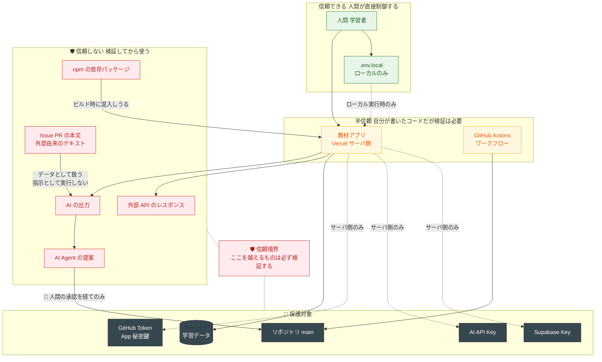
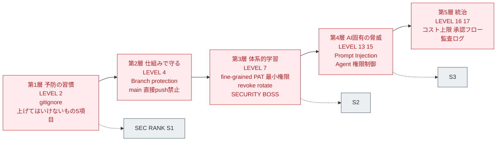
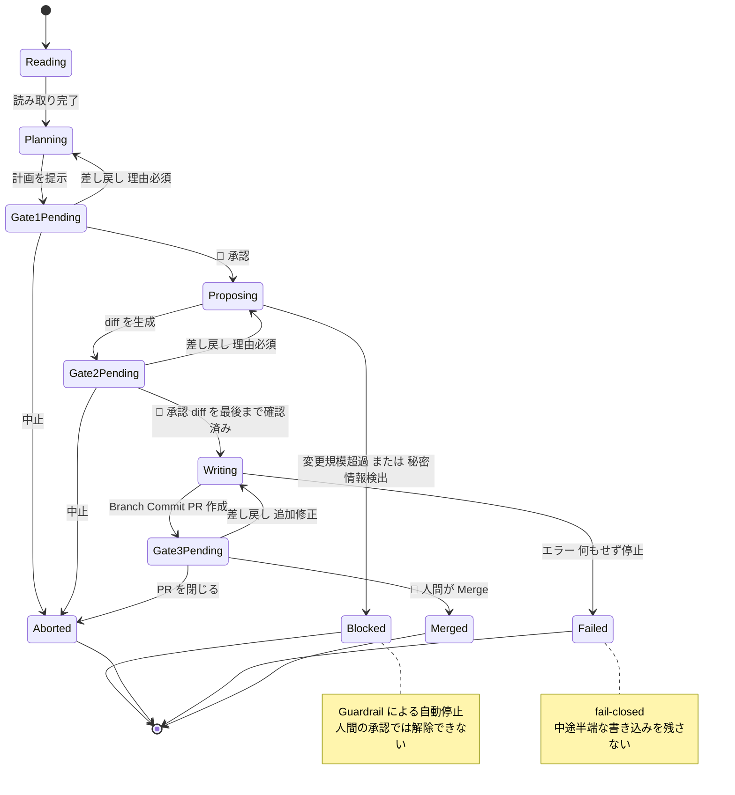
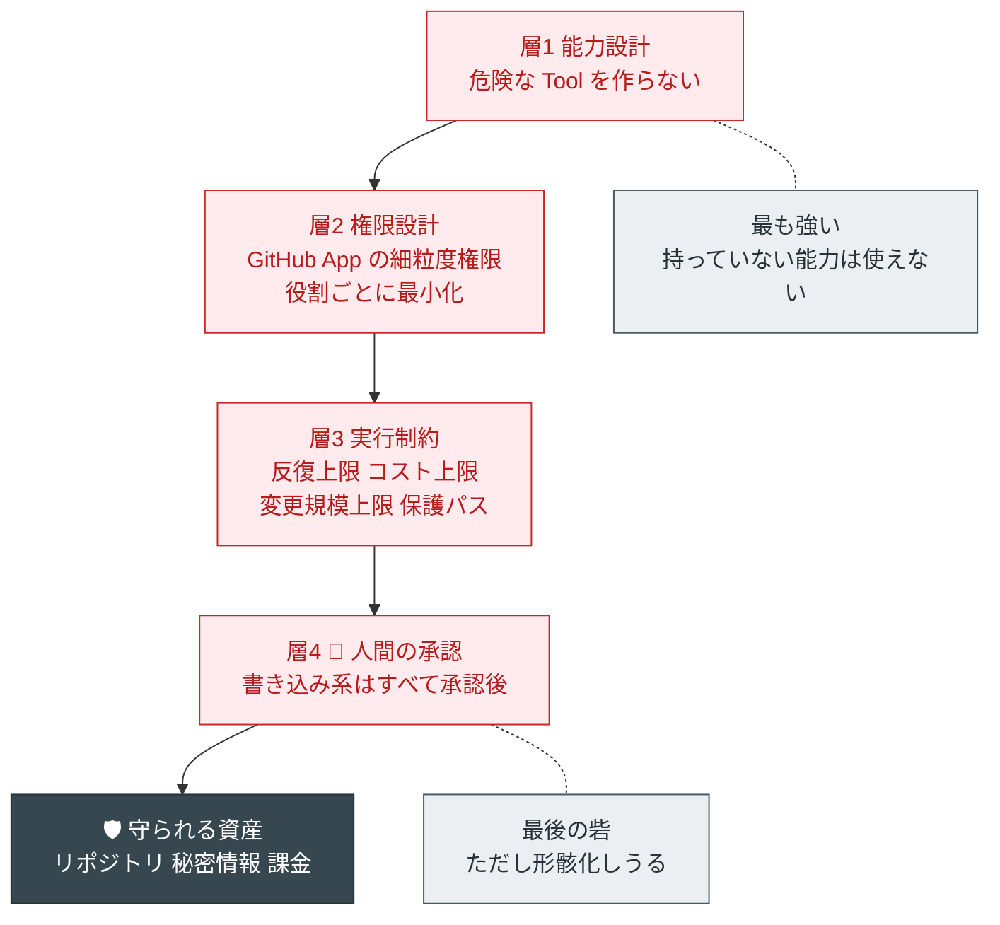

# 05. セキュリティ設計書
### GitHub・API・AI開発 自走型学習アプリ ／ 脅威モデル・権限モデル・Secrets運用・事故対応

| 項目 | 内容 |
|---|---|
| 対応する要求仕様 | セクション33 の 20（セキュリティ設計）、23（セキュリティ）、26-10（後付けにしない） |
| 前提文書 | `00_教育設計書.md` / `01_カリキュラム設計書.md` / `02_アプリ機能・UIUX設計書.md` / `03_技術スタック・アーキテクチャ設計書.md` / `04_GitHub連携・AI設計書.md` |
| 参照した外部調査 | `research/findings.md`（2026年8月時点） |
| 本書が答える引き継ぎ事項 | 01 C-10（権限エスカレーションの実装方式）、00 P-13 / P-18 |

---

## 本書の位置づけ

本書は2つの目的を同時に果たす。

| 目的 | 対象 |
|---|---|
| **1. 教材アプリ自体を安全に作るための設計** | 実装者（＝学習者本人） |
| **2. セキュリティを教材化するための設計** | 学習者（＝同じ人） |

**この2つが同一人物であることが、本教材のセキュリティ設計の特殊性である。**
学習者は「守られる側」ではなく「守る側」として設計に参加する。したがって本書のすべての対策には **「どの LEVEL で学ぶか」** が付随する。

> **セキュリティを後付けにしない**（要求26-10）とは、章を最後に置かないことではない。
> **危険な能力を持つ前に、その危険を制御する手段を先に持たせること**である。

---

# 第1章 基本方針

## 1.1 5つの原則

| # | 原則 | 具体的な帰結 |
|---|---|---|
| 1 | **Human-in-the-loop を例外なく適用する** | Read → 提案 → 人間承認 → Write。書き込み系の操作に例外を作らない |
| 2 | **最小権限を既定にする** | 権限は「必要になった LEVEL で、必要な分だけ」開く。事前付与しない |
| 3 | **可逆性を確保してから危険を導入する** | revert（L3）→ branch protection（L4）→ CI（L11）→ 承認ゲート（L14）が揃ってから Agent に書き込み権限（L15） |
| 4 | **能力を持たせないことで守る** | 危険な Tool を「作らない」。設定で禁止するより確実 |
| 5 | **失敗を前提に設計する（fail-closed）** | エラー時は何もせず停止する。中途半端な状態を残さない |

### 原則4 が最も重要である

本教材は Docker を使わない（00 P-5）。したがって **プロセスレベルの隔離手段を持たない。**
その代わりに採るのが原則4である。

> **任意コマンド実行 Tool を作らなければ、任意コマンドは実行されない。**
> **Merge API を実装しなければ、自動 Merge は起きない。**
> **Orchestrator に書き込みツールを渡さなければ、Orchestrator はコードを書けない。**

これは「サンドボックスを作る」より確実で、かつ初学者にとって理解しやすい。**能力設計こそが、本教材における隔離の実装である。**

## 1.2 保護対象資産

| # | 資産 | 失うと何が起きるか | 重要度 |
|---|---|---|---|
| A-1 | **GitHub のトークン / GitHub App の秘密鍵** | リポジトリの改ざん・削除。他のリポジトリへの波及 | 🔴 最高 |
| A-2 | **AI API キー** | 💰 課金の暴走。第三者による悪用 | 🔴 最高 |
| A-3 | **Supabase のサービスロールキー** | 全ユーザーデータへの無制限アクセス（RLS を迂回する） | 🔴 最高 |
| A-4 | Git の履歴（main の健全性） | 「動いていた状態」を失う。復旧の起点が消える | 🟠 高 |
| A-5 | 学習ログ・成長ログ | 学習の蓄積。AI Tutor の Memory の元 | 🟡 中（正本が Markdown なので復旧可能） |
| A-6 | 公開リポジトリ上の個人情報 | プライバシー。実名・所属・メールアドレス | 🟠 高 |
| A-7 | Vercel / Supabase のアカウント | サービス全体の掌握 | 🔴 最高 |
| A-8 | 学習者の時間と自己効力感 | **事故で挫折すると、教材の目的そのものが失われる** | 🟠 高 |

**A-8 を資産に含めることが、教育教材のセキュリティ設計の特徴である。**
「厳格すぎて先に進めない」設計は、セキュリティとしては正しくても、教材としては失敗である。

## 1.3 信頼境界



### 信頼境界から導かれる3つのルール

| # | ルール | 実装 |
|---|---|---|
| 1 | **AI の出力を信頼しない** | 形式検証・禁止語検証・LEVEL 逸脱検証（04 2.8） |
| 2 | **外部由来のテキストを指示として扱わない** | プロンプトの層4（`<data>` 囲み。04 2.3.1） |
| 3 | **秘密情報は信頼境界を越えない** | サーバ側にのみ存在し、ブラウザにも AI にも渡さない |

---

# 第2章 脅威モデル

## 2.1 脅威一覧

要求23 が列挙する脅威をすべて含み、本設計で追加した脅威を加えた **19件**。

| ID | 脅威 | 発生経路 | 影響 | 起こりやすさ | 教材化 LEVEL |
|---|---|---|---|---|---|
| **T-01** | **API Key / Token の漏洩（コード直書き）** | AI が直書きの例を出す / 学習者が急いで貼る | 🔴 リポジトリ改ざん・💰 課金暴走 | **非常に高い** | 2（予防）/ 7（体系）/ B3 |
| **T-02** | **`.env.local` の Commit** | `.gitignore` の記述漏れ | 🔴 同上 | **非常に高い** | 2 / 7 / B3 |
| **T-03** | **過剰権限の付与** | classic PAT の `repo` 全付与 / 「簡単のため admin を」 | 🔴 復旧不能な破壊が可能に | 高い | 7 / 15 |
| **T-04** | **AI Agent による意図しない変更** | 曖昧な Issue / AI の過剰解釈 | 🟠 コードの破壊。手戻り | 高い | 14 / 15 / B7 |
| **T-05** | **main への直接 push** | 習慣の欠如 | 🟠 「動いていた状態」の喪失 | 高い | 4 |
| **T-06** | **自動 Merge** | 承認が面倒になり自動化したくなる | 🔴 人間の承認ゲートの消失 | 中 | 15 / 17 |
| **T-07** | **悪意ある Issue** | 外部から Issue を受け取る（public リポジトリ） | 🔴 Agent の乗っ取り | 中 | 15 / B7 |
| **T-08** | **Prompt Injection（直接）** | ユーザー入力に「これまでの指示を無視して」 | 🟠 AI の挙動の逸脱 | 中 | 13 |
| **T-09** | **Prompt Injection（間接）** | 成長ログ / Issue 本文 / 外部 API のレスポンスに指示が埋まる | 🔴 Tool の悪用 | 中 | 13 / 15 |
| **T-10** | **Prompt Injection（出力経由）** | AI の出力をそのまま HTML に埋め込む | 🟠 XSS | 中 | 13 |
| **T-11** | **Supply Chain Attack** | 悪意ある npm パッケージ / タイポスクワッティング | 🔴 ビルド時に秘密情報が抜かれる | 低〜中 | 9 / 11 |
| **T-12** | **Dependency の脆弱性** | 保守放棄されたライブラリ | 🟠 脆弱性の混入 | 中 | 9 / 11 |
| **T-13** | 💰 **コストの暴走（Denial of Wallet）** | Agent の無限ループ / 上限未設定 | 🟠 予期しない請求 | **高い** | 12（第1 Mission）/ 14 |
| **T-14** | **RLS の設定漏れ** | テーブル追加時に RLS を有効化し忘れる | 🔴 他人のデータの露出 | 中 | 10 |
| **T-15** | **Supabase サービスロールキーのクライアント露出** | `NEXT_PUBLIC_` を付けてしまう | 🔴 RLS の完全な迂回 | 中 | 10 |
| **T-16** | **public リポジトリからの個人情報漏洩** | 成長ログに実名・所属・メールを書く / スクリーンショットの写り込み | 🟠 プライバシー | 中 | 2 |
| **T-17** | **セッションの奪取** | OAuth のトークン管理不備 | 🟠 なりすまし | 低（Supabase Auth に委譲） | 10 |
| **T-18** | **Agent による自己権限の拡大** | Agent が `.github/workflows/` や自分の `ROLE.md` を書き換える | 🔴 檻を内側から開ける | 低（対策済み） | 15 / 17 |
| **T-19** | **`sessionStorage` へのPAT保持の XSS リスク** | STACK A では PAT を `sessionStorage` に持つ（6.1）。教材本文や API レスポンスを `innerHTML` で描画すると、混入したスクリプトから `sessionStorage` の PAT を読み出される | 🔴 リポジトリ改ざん（PAT の権限範囲まで） | 低〜中 | 6（描画方法）/ 7（保持方法）/ 13（XSS として体系化） |

## 2.2 起こりやすさで並べ替えた「本当に危ないもの」

初学者教材のセキュリティ設計では、**理論上の危険度より発生頻度が重要である。**

| 順位 | 脅威 | なぜ最頻か |
|---|---|---|
| 1 | **T-01 / T-02（トークンの漏洩・`.env.local` の Commit）** | 初学者の事故の大半がこれ。**AI も平気で直書きの例を出す** |
| 2 | **T-13（💰 コスト暴走）** | Agent を書いた翌日に起きる。上限設定は最初の Mission |
| 3 | **T-05（main への直接 push）** | 習慣で防げない。**仕組みで防ぐ**（branch protection） |
| 4 | **T-03（過剰権限）** | PAT 作成画面で「全部チェック」が最も簡単だから |
| 5 | **T-04（Agent の意図しない変更）** | LEVEL 15 以降、日常的に起きる。**それが正常** |

**この5つに対策を集中する。** 残りは重要だが、頻度が低いか、既に構造で防いでいる。

## 2.3 STRIDE による整理（簡易）

| 分類 | 該当する脅威 | 本設計での主要対策 |
|---|---|---|
| **S** なりすまし | T-17 | Supabase Auth に委譲（自作しない） |
| **T** 改ざん | T-04, T-05, T-06, T-18 | 🤝 承認ゲート + branch protection + 能力設計 |
| **R** 否認 | （Agent が何をしたか不明） | `agent_steps` / `approvals` / `decisions` による監査証跡 |
| **I** 情報漏洩 | T-01, T-02, T-14, T-15, T-16, T-19 | Secrets 運用 + RLS + `.gitignore` + 動的 HTML 挿入の回避 |
| **D** サービス妨害 | T-13 | 💰 コスト上限 + 反復上限 + Rate Limit 対応 |
| **E** 権限昇格 | T-03, T-07, T-09, T-18 | 最小権限 + 保護パス + Prompt Injection 対策 |

**R（否認）の対策が AI 時代に特に重要である。** 「AI がやった」で終わらせず、**誰がいつ承認したかを残す**ことが、AI 組織の信頼性の根拠になる（01 LEVEL 17 の監査可能性）。

---

# 第3章 対策 × LEVEL マッピング

## 3.1 セキュリティ学習の5層（01 1.7 と一致）



**設計判断（01 1.7 の再確認）**：**予防の習慣（L2）が体系的学習（L7）より先に来る。**
理由を理解する前に、まず安全な手癖をつける。理由は L7 で回収する。

## 3.2 脅威 × 対策 × 教材化 の対応表

| 脅威 | 対策（技術） | 対策（運用） | 教材化する LEVEL・形式 |
|---|---|---|---|
| **T-01** トークン直書き | 🛡 Secretチェッカー（02 F-19）／ GitHub Push Protection ／ Agent の提案に対する自動検査（04 3.5 項目10） | 「上げてはいけないもの5項目」の暗唱 | L2（習慣）→ L7（理由）→ **B3 SECURITY BOSS**（実技） |
| **T-02** `.env.local` の Commit | `.gitignore` の必須5項目 ／ `.env.local.example` のみを commit | 初回 commit 前の確認手順 | L2（作成）→ L7（理由）→ B3 |
| **T-03** 過剰権限 | fine-grained PAT のみを教える ／ 権限エスカレーション表の機械的強制（4.4） | 「なぜ read だけで足りるか」を毎回問う | L7（表の宣言）→ L8 → L15 |
| **T-04** Agent の意図しない変更 | 🤝 3ゲート ／ Dry-run ／ 変更規模上限 ／ 保護パス | 差し戻し理由の記録 | L14（承認ゲート実装）→ L15 → **B7 AGENT BOSS** |
| **T-05** main 直接 push | 🛡 Branch protection（第5章） | Squash Merge に統一 | L4（設定）→ 以降常時 |
| **T-06** 自動 Merge | 🛡 **Merge API を実装しない**（04 3.3.2） | 「面倒さと安全のトレードオフ」を議論させる | L15（禁止の明示）→ L17（Gate 3） |
| **T-07** 悪意ある Issue | Issue 本文をデータとして扱う ／ Guardrail | 攻撃例4種類を教材が提供 | L15（実戦）→ B7 |
| **T-08〜10** Prompt Injection | 層構造の分離 ／ 出力のエスケープ ／ ツール権限の最小化 | 攻撃と防御の対応表 | **L13（SEC S3 到達）** → L15 |
| **T-11** Supply Chain | 依存追加を Agent に禁止 ／ lockfile の commit ／ Dependabot の有効化 | 「AI が勧めたライブラリを調べる」手順 | L9（依存とライセンス）→ L11 |
| **T-12** Dependency 脆弱性 | Dependabot alerts ／ CI での `npm audit` | 警告が出たときの判断手順 | L11（CI に組み込む） |
| **T-13** 💰 コスト暴走 | 上限設定 ／ 反復上限 ／ 1実行のコスト上限 ／ 役割別予算 | 50% / 80% でのアラート | **L12 の第1 Mission** → L14 → L16 |
| **T-14** RLS 設定漏れ | 全テーブルで RLS 有効を既定に ／ CI でのチェック | 「テーブルを足したら RLS」の手順化 | L10 |
| **T-15** サービスロールキーの露出 | `NEXT_PUBLIC_` を付けない規約 ／ ビルド成果物の検査 | 命名規約の徹底 | L10 |
| **T-16** 個人情報の漏洩 | 成長ログテンプレートの注意書き ／ public/private の選択 | スクリーンショットの確認習慣 | L2 |
| **T-17** セッション奪取 | Supabase Auth に委譲（自作しない） | — | L10 |
| **T-18** Agent の自己権限拡大 | 🛡 保護パス（`.github/`、`ROLE.md`）／ 会社リポジトリの分離（04 5.4） | — | L15 → L17 |
| **T-19** `sessionStorage` の PAT と XSS | 🛡 教材本文・API レスポンスの**動的 HTML 挿入を避ける**（`innerHTML` ではなく `textContent`／DOM 生成を使う）／ トークンは `sessionStorage` に置き**タブを閉じると消える**設計にする（`localStorage` に置かない）／ 🛡 公開URL（GitHub Pages）では入力欄自体を無効化し**公開URLでは入力不可**にする | 「PAT は使い終わったらタブを閉じる」「公開URLで入力を求められたら疑う」 | L6（`textContent` で描画する理由）→ **L7（保持場所と失効）** → L13（XSS として体系化・T-10 と接続） |

## 3.3 SEC RANK の定義（02 F-05 と一致）

| ランク | 到達 LEVEL | 到達条件 |
|---|---|---|
| **S0** | — | 未学習 |
| **S1** | 2 | `.gitignore` を書ける ／ 上げてはいけないもの5項目を言える ／ public と private の違いが分かる |
| **S2** | 7 | fine-grained PAT を最小権限で作れる ／ 環境変数と Secrets を使い分けられる ／ **漏洩時に revoke → rotate → 履歴の順で対処できる** |
| **S3** | 13 | Prompt Injection の3経路を説明でき、防御を実装できる ／ Agent の権限分離を設計できる |

**S2 の「順序」が採点対象であることが重要である**（B3 の採点基準。3.4 参照）。

## 3.4 B3 SECURITY BOSS の採点基準（対処の順序）

漏洩事故への対処は、**順序を誤ると被害が拡大する。** これを Boss Mission の採点基準にする。

| 順位 | やること | なぜこの順序か |
|---|---|---|
| **1** | 🔴 **トークンを失効（revoke）する** | **最優先。** 履歴を消しても、既に流出したトークンは有効なまま |
| 2 | 新しいトークンを発行し、必要な場所に設定する（rotate） | サービスを止めないため |
| 3 | 影響範囲を確認する（不正な Commit・Issue・課金がないか） | 被害の把握 |
| 4 | `.gitignore` を修正する | 再発防止（**技術的対処**） |
| 5 | 履歴から秘密情報を除去する（必要なら） | ⚠ 履歴の書き換えは影響が大きい。**単独開発なら実施可、共有中なら要相談** |
| 6 | 記録を残す（`errors/` と `decisions/`） | 学習資産化 |

**よくある誤り：いきなり履歴を書き換えようとする。**
「消せば大丈夫」という直感は誤りであり、**流出したトークンは消しても有効である**という理解が、この Boss の核心である。

---

# 第4章 Human-in-the-loop 権限モデル

## 4.1 主体（Principal）の一覧

| 主体 | 説明 | 認証方式 |
|---|---|---|
| **人間（学習者）** | 唯一の最終決定者 | GitHub ログイン（Supabase Auth 経由） |
| **教材アプリ（サーバ側）** | API Route。秘密情報を持つ唯一の場所 | 環境変数 |
| **AI Tutor** | 読むだけ。書き込み能力を持たない | — |
| **Agent（単体）** | LEVEL 14〜15 | GitHub App の Installation Token |
| **Planner / Developer / Reviewer / QA / Docs** | LEVEL 16〜。役割別に権限が異なる | 同上（役割ごとに権限を絞る） |
| **Orchestrator** | 管理のみ。書き込み能力を持たない | 読み取りのみ |
| **GitHub Actions** | CI/CD | `GITHUB_TOKEN`（実行時に自動発行） |

## 4.2 権限マトリクス

| 操作 | 人間 | アプリ | Tutor | Orchestrator | Planner | Developer | Reviewer | QA | Docs | Actions |
|---|---|---|---|---|---|---|---|---|---|---|
| リポジトリを読む | ✅ | ✅ | — | ✅ | ✅ | ✅ | ✅ | ✅ | ✅ | ✅ |
| Issue を読む | ✅ | ✅ | — | ✅ | ✅ | ✅ | ✅ | ✅ | ✅ | ✅ |
| **Issue を作る** | ✅ | ✅ | ❌ | ❌ | 🤝（**LEVEL 15 から**） | ❌ | ❌ | ❌ | ❌ | ✅ |
| **Branch を作る** | ✅ | — | ❌ | ❌ | ❌ | 🤝 | ❌ | ❌ | ❌ | ❌ |
| **コードを変更する** | ✅ | — | ❌ | ❌ | ❌ | 🤝 | ❌ | ❌ | ❌ | ❌ |
| **`tests/` を変更する** | ✅ | — | ❌ | ❌ | ❌ | 🤝 | ❌ | 🤝 | ❌ | ❌ |
| **`docs/` を変更する** | ✅ | — | ❌ | ❌ | ❌ | 🤝 | ❌ | ❌ | 🤝 | ❌ |
| **PR を作る** | ✅ | — | ❌ | ❌ | ❌ | 🤝 | ❌ | ❌ | 🤝 | ❌ |
| PR にコメントする | ✅ | — | ❌ | ❌ | ❌ | ✅ | ✅ | ✅ | ❌ | ✅ |
| **PR を Merge する** | ✅ | ❌ | ❌ | ❌ | ❌ | ❌ | ❌ | ❌ | ❌ | ❌ |
| **`.github/workflows/` を変更** | ✅ | ❌ | ❌ | ❌ | ❌ | ❌ | ❌ | ❌ | ❌ | ❌ |
| **`ROLE.md` を変更** | ✅ | ❌ | ❌ | ❌ | ❌ | ❌ | ❌ | ❌ | ❌ | ❌ |
| **branch protection を変更** | ✅ | ❌ | ❌ | ❌ | ❌ | ❌ | ❌ | ❌ | ❌ | ❌ |
| **force push** | ❌ | ❌ | ❌ | ❌ | ❌ | ❌ | ❌ | ❌ | ❌ | ❌ |
| **リポジトリを削除** | ❌ | ❌ | ❌ | ❌ | ❌ | ❌ | ❌ | ❌ | ❌ | ❌ |

凡例：✅ 可能 ／ 🤝 人間の承認後にのみ可能 ／ ❌ 不可（**能力を持たせない**）／ — 該当なし

### この表から読み取るべき3点

| # | 読み取れること | 意味 |
|---|---|---|
| 1 | **Merge の列が人間だけ ✅** | 🛡 自動 Merge の構造的な禁止。Merge API を実装しない（04 3.3.2） |
| 2 | **force push が全員 ❌**（人間も含む） | 🛡 Git という保険を無効化する操作。branch protection で機械的に禁止 |
| 3 | **Reviewer の行に書き込みが1つもない** | 🛡 指摘だけで修正しない。第三者性の担保（04 4.1） |

**⚠ 「Issue を作る」の 🤝（Planner）が解放されるのは LEVEL 15 である。** LEVEL 14 の Agent は提案（`propose_learning_plan`）のみを持ち、`create_issue` は持たない。理由は 4.4.1 の注記を参照（CO-08）。

## 4.3 承認ゲートの状態機械



### 状態遷移の設計上の要点

| 要点 | 理由 |
|---|---|
| **`Blocked` は人間の承認で解除できない** | 変更規模超過・秘密情報検出は、承認で押し通せてはいけない。**Guardrail は人間より強い** |
| **差し戻しには理由が必須** | 学習者の判断を言語化させる。能力軸 E の訓練 |
| **`Failed` から `Writing` へ戻らない** | 失敗したら最初からやり直す。中途半端な再開をさせない |
| **`Gate2Pending → Writing` に `diff_fully_viewed` 条件** | 形骸化対策（02 A-06） |

## 4.4 権限エスカレーションの実装（01 C-10 への回答）

04 1.2.1 の6段階を、**アプリが機械的に強制する仕組み**として実装する。

### 4.4.1 段階解放の条件

| 段階 | 解放条件（すべて満たす必要がある） | 検証方法 |
|---|---|---|
| 1（Contents: Read） | LEVEL 7 の Mission 7-1〜7-3 完了 ／ `.gitignore` に必須5項目 | 進捗 DB + GitHub API |
| 2（+ Issues: Write） | LEVEL 8 到達 ／ B3 SECURITY BOSS 合格 | 進捗 DB |
| 3（GitHub ログイン） | LEVEL 10 到達 | 進捗 DB |
| 4（Actions `GITHUB_TOKEN`） | LEVEL 11 到達 ／ ワークフローに `permissions:` の明示がある | ワークフローの静的検査 |
| **5（Contents/PR: Write を Agent に）** | LEVEL 15 到達 ／ **branch protection が有効** ／ LEVEL 3（revert）通過 ／ LEVEL 14（承認ゲート）通過 ／ 変更規模上限の設定済み | 進捗 DB + GitHub API |

**⚠ 段階2（LEVEL 8 到達 / Issues: Write）は、Agent の `create_issue` Tool を含まない。** 段階2 が開くのは**学習者本人の PAT のスコープ**であり、Agent に書き込み系 Tool を渡すのは段階5（LEVEL 15）以降である。
したがって **LEVEL 14 の Agent は `propose_learning_plan` のみ（提案止まり）** とし、`create_issue` は **LEVEL 15** で解放する（04 3.3.1 の Tool カタログと一致。CO-08）。LEVEL 14 で `create_issue` を導入すると、段階5 の前提条件（LEVEL 14 通過）を LEVEL 14 の時点で満たすことになり循環するため、権限ゲートを迂回する実装を書かざるを得なくなる。これは 4.4.2 の「**検証は毎回行う**」原則が最初の適用時点で破られることを意味する。

### 4.4.2 実装方式

```
function canGrant(user, stage):
    conditions = ESCALATION_TABLE[stage]
    for c in conditions:
        if not verify(c, user):
            return { allowed: false, missing: c, remedy: c.remedyMission }
    return { allowed: true }
```

- **未達の条件がある場合、権限設定画面にボタンを表示しない。** 「なぜ表示されないか」と「何をすれば表示されるか」を明示する
- 検証は **毎回行う**（一度解放したら永久に、にしない）。**branch protection を外したら、Agent の書き込み権限も止まる**

### 4.4.3 全期間の禁止権限

| 禁止 | 理由 |
|---|---|
| classic PAT の `repo` 全付与 | 最小権限の原則に反する。教材では作成手順自体を示さない |
| `admin` / `administration: write` | 復旧不能な操作が可能になる |
| `delete_repo` | 論外 |
| Organization 全体スコープ | 影響範囲が制御できない |
| Actions への書き込み（Agent） | 🛡 Agent が自分の実行環境を書き換えられてはならない |

---

# 第5章 Branch Protection とリポジトリ設定

## 5.1 main ブランチの保護設定（LEVEL 4 で設定）

| 設定 | 値 | 理由 | 導入 |
|---|---|---|---|
| main への直接 push | **禁止** | T-05。「動いていた状態」の保全 | 4 |
| PR 必須 | **有効** | 変更が必ず「見られる」状態を作る | 4 |
| 必須の承認レビュー数 | **1**（単独開発では自己承認になるが、**画面で diff を見る手順を強制する意味がある**） | 手順の形式化 | 4 |
| force push | **禁止** | T-05。Git という保険の無効化を防ぐ | 4 |
| ブランチの削除 | **禁止**（main） | 事故防止 | 4 |
| 必須ステータスチェック | **CI（`ci.yml`）の成功** | 壊れたコードを Merge させない | 11 |
| 管理者にも適用 | **有効** | 「自分だけは例外」を作らない | 4 |
| Merge 方式 | **Squash Merge のみ** | 履歴を単純に保つ。Agent の PR を読むときの可読性（01 LEVEL 4） | 4 |

⚠ **注意**：GitHub の branch protection は ruleset 方式への移行が進んでおり、設定画面と API の形が変わりうる。実装時に公式ドキュメントで現在の設定方法を確認すること（04 W-05）。

## 5.2 追加のリポジトリ設定

| 設定 | 値 | 導入 |
|---|---|---|
| **Secret scanning** | 有効（public リポジトリでは既定で有効） | 2 |
| **Push protection** | **有効**（秘密情報を含む push をブロック） | 2 |
| **Dependabot alerts** | 有効 | 9 |
| Dependabot security updates | 有効 | 11 |
| Issue テンプレート | 有効（LEVEL 4 で作成） | 4 |
| PR テンプレート | 有効 | 4 |
| CODEOWNERS | ⚠ **設定しない**（単独開発では意味がない。過剰） | — |

**Push protection の有効化が、T-01 に対する最も効果的な単一の対策である。**
これは「自作の Secretチェッカー（02 F-19）より、GitHub の標準機能の方が確実である」という事実を、学習者に明示するよい機会でもある（要求31「現在の GitHub 機能で代替できる」の実例）。

**⚠ 導入 LEVEL と学習 LEVEL の役割分担**：**LEVEL 2 で有効化し、その理由・仕組みは LEVEL 7（01 1.7）で回収する。** public リポジトリでは既定で有効である。
01 が Push protection を LEVEL 7 の学習内容としているのは矛盾ではなく、3.1 の「**予防の習慣（L2）が体系的学習（L7）より先に来る**」という設計判断の適用である。実装者は「L2＝設定を有効にするだけ／L7＝なぜそれが効くかを学ぶ」と読むこと。

## 5.3 public / private の判断

| 選択 | 利点 | 欠点 | 推奨 |
|---|---|---|---|
| **public** | GitHub Actions が無料・無制限 ／ ポートフォリオになる ／ Secret scanning が既定で有効 | 🟠 学習ログ・エラー記録が公開される（T-16） | ✅ 推奨（注意事項を守る前提で） |
| private | 内容が非公開 | Actions が月2,000分の枠内（それでも十分） | 選択可 |

### public を選ぶ場合の必須の運用

| # | 運用 | 実装 |
|---|---|---|
| 1 | 成長ログに実名・所属・メールアドレス・勤務先を書かない | テンプレートの冒頭に注意書き |
| 2 | スクリーンショットにトークン・メールが写らないことを確認する | LEVEL 2 の Mission に確認手順 |
| 3 | 他人の情報を書かない | 同上 |
| 4 | 判断を `decisions/` に記録する | LEVEL 4 以降 |

**この判断を学習者自身にさせることが重要である。** 「public にしなさい」と指示するのではなく、**トレードオフを示して選ばせ、理由を記録させる。** これが統治力（能力軸 E）の最初の訓練になる。

---

# 第6章 Secrets 運用

## 6.1 秘密情報の一覧と置き場所

| 秘密情報 | ローカル | Vercel | GitHub Actions | Supabase | ブラウザ |
|---|---|---|---|---|---|
| GitHub PAT（LEVEL 7〜8） | `sessionStorage`（設定画面から入力・`location.hostname` が `localhost`/`127.0.0.1` のときのみ入力欄を有効化） | Production / Preview | — | — | ⚠ L8 のみ意図的に露出（教材） |
| GitHub App の秘密鍵（L15〜） | `.env.local` | Production | — | — | ❌ 絶対に不可 |
| AI API Key | `.env.local` | Production / Preview | — | — | ❌ 絶対に不可 |
| Supabase URL | `.env.local` | 両方 | — | — | ✅ 公開してよい |
| Supabase anon key | `.env.local` | 両方 | — | — | ✅ 公開してよい（RLS が守る） |
| **Supabase service_role key** | `.env.local` | Production のみ | — | — | ❌ **絶対に不可（T-15）** |
| Actions 用のトークン | — | — | GitHub Secrets | — | — |
| `GITHUB_TOKEN`（Actions 内） | — | — | 自動発行 | — | — |

**⚠ LEVEL 7〜8 の PAT だけが `.env.local` ではない理由**：STACK A（LEVEL 1〜8）には Node.js もビルドもなく、**ブラウザは `.env.local` を読めない**。したがって PAT は設定画面から入力させ、`sessionStorage` に保持する（**タブを閉じると消える**）。さらに LEVEL 2 以降アプリは GitHub Pages に公開されているため、`location.hostname` が `localhost`/`127.0.0.1` のときのみ入力欄を有効化し、公開URL上では無効化する。
`.env.local` は LEVEL 7 の実践課題で「作る」だけの**予習**であり、LEVEL 7〜8 では読み込まれない（実際に機能するのは Next.js 移行後の LEVEL 9 以降）。
2行目以降（GitHub App 秘密鍵・AI API Key・Supabase 系）はいずれも **LEVEL 15 以降／STACK B・C 期**であり、サーバ側で `.env.local` が正しく機能する。

## 6.2 命名規約と `NEXT_PUBLIC_` の罠

| 規約 | 内容 |
|---|---|
| **`NEXT_PUBLIC_` を付けたものはブラウザに露出する** | Next.js の仕様。**ビルド時にコードに埋め込まれる** |
| 付けてよいもの | Supabase URL、Supabase anon key、公開してよい設定値 |
| **絶対に付けてはいけないもの** | GitHub Token、GitHub App 秘密鍵、AI API Key、**Supabase service_role key** |
| 検査 | 🛡 CI で `NEXT_PUBLIC_` を含む環境変数名のリストを検査し、禁止リストと突き合わせる |

### ⚠ T-15 が起きる典型パターン

> 「Supabase に接続できない」→ AI に聞く → 「`NEXT_PUBLIC_` を付けてみてください」→ 動いた → **service_role key が全世界に公開される**

**これは AI の悪意ではなく、文脈不足による誤答である。** LEVEL 10 の教材で、この具体的なシナリオを **AI 誤答検出訓練（02 F-22）のサンプルとして提供する。**

## 6.3 `.gitignore` の必須項目（LEVEL 2 で作成）

```gitignore
# 秘密情報
.env
.env.local
.env.*.local
*.pem
*.key

# 依存（自動生成されるもの）
node_modules/

# ビルド成果物
.next/
dist/
build/

# OS が作るもの
.DS_Store
Thumbs.db

# エディタ
.vscode/
.idea/
```

**LEVEL 2 の時点では上4行だけでよい。** `node_modules/` は LEVEL 9 で追記する（**まだ存在しないものを先に書かせない**）。
これは「必然性の順序」の原則をセキュリティ設定にも適用したものである。

**⚠ `.env` 系だけは意図的な例外である。** `.env`（本文中の表記は `.env.local` に統一。6.1 参照）は LEVEL 7 まで存在しないが、`node_modules/` とは異なり **LEVEL 2 の時点で先に書く**。理由は 01 1.7「**予防の習慣が体系的学習より先に来る**」という設計判断による。秘密情報だけは、存在してから対策したのでは間に合わない（1回の Commit で流出が確定する）ため、原則より優先する。
なお `.gitignore` の中身は**無視パターンの列挙**であるため、`.env` / `.env.local` / `.env.*.local` の3行はいずれもそのまま記述する（表記統一の対象は本文中の記述であり、パターン自体ではない）。

## 6.4 ローテーションと失効の手順

### 6.4.1 定期ローテーション

| 対象 | 頻度 | 方法 |
|---|---|---|
| GitHub PAT | 有効期限を **90日以内**に設定（無期限にしない） | 期限切れ前に再発行 |
| AI API Key | LEVEL 12 で発行時に、ローテーション手順を `docs/runbook.md` に書く | 各社の管理画面 |
| GitHub App の秘密鍵 | 漏洩時のみ | GitHub App の設定画面 |
| Supabase キー | 漏洩時のみ | Supabase の設定画面 |

**「有効期限を無期限にしない」を LEVEL 7 の Mission に含める。** 無期限トークンは、忘れられたまま生き続ける。

### 6.4.2 漏洩時の緊急手順（`docs/runbook.md` に書かせる）

```markdown
# 秘密情報が漏れたときの手順

## 1. まず失効させる（最優先。5分以内に）
- GitHub PAT → Settings > Developer settings > Tokens > Revoke
- AI API Key → 各社の管理画面で無効化
- Supabase → Settings > API > キーの再生成
★ 履歴を消す作業より先に、必ずこれを行う。
★ 流出したトークンは、履歴を消しても有効なままである。

## 2. 新しいキーを発行し、設定し直す
- .env.local / Vercel の環境変数 / GitHub Secrets

## 3. 影響を確認する
- GitHub：不正な Commit / Issue / PR がないか
- AI：💰 想定外の課金がないか
- Supabase：ログに不審なアクセスがないか

## 4. 再発防止
- .gitignore を修正する
- Push protection が有効か確認する

## 5. 履歴から除去する（必要な場合のみ）
⚠ 履歴の書き換えは影響が大きい。単独開発なら実施可。
⚠ 実施前に必ずバックアップ（リポジトリのクローン）を取る。

## 6. 記録を残す
- errors/ に事故の記録
- decisions/ に再発防止の判断
```

---

# 第7章 Agent サンドボックス方針

## 7.1 前提：プロセス隔離を持たない

本教材は Docker を使わない（00 P-5）。したがって **コンテナによる隔離は選択肢にない。**
代わりに **4つの層で封じ込める。**



## 7.2 層1：能力設計（作らない Tool）

04 3.3.2 の再掲。**これが本教材における隔離の中核である。**

| 作らない Tool | 代わりに何が起きるか |
|---|---|
| `run_shell_command` / `execute_code` | 🛡 **任意コード実行が構造的に不可能。** 隔離手段がない環境ではこれが唯一の正解 |
| `merge_pull_request` | 自動 Merge が不可能 |
| `force_push` | 履歴の破壊が不可能 |
| `delete_*` | 破壊操作が不可能 |
| `update_branch_protection` | Agent が檻を開けられない |
| `web_fetch`（任意URL） | 間接 Prompt Injection の主要経路を塞ぐ |
| ファイルシステムへの直接アクセス | GitHub API 経由のみ。ローカルのファイルを読めない |

### ⚠ 「テストを実行させたい」という誘惑への回答

Agent にテストを実行させたくなる場面がある。しかしそれは `run_shell_command` を意味する。
**代替：GitHub Actions に実行させ、Agent は結果を読むだけにする。**

| やりたいこと | 危険な方法 | 安全な代替 |
|---|---|---|
| テストを実行する | Agent がシェルで `npm test` | PR を作る → Actions が実行 → Agent は `read_actions_result` で結果を読む |
| ビルドを確認する | 同上 | 同上 |
| Lint をかける | 同上 | 同上 |

**この代替が成立するのは、LEVEL 11 で CI を作っているからである。** 順序設計がセキュリティを可能にしている好例である。

## 7.3 層2：権限設計

| 主体 | GitHub 権限 | 対象リポジトリ |
|---|---|---|
| Agent（L15） | Contents: Write / Pull requests: Write | `ai-developer-training` のみ |
| Developer（L16） | 同上 | 同上 |
| Reviewer | **Contents: Read のみ + PR コメント** | 同上 |
| QA | Contents: Write（`tests/` のみ。**パス制約はアプリ側で強制**） | 同上 |
| Docs | Contents: Write（`docs/` のみ。同上） | 同上 |
| Orchestrator | **読み取りのみ** | 同上 |
| すべての Agent | ❌ | `ai-company`（**役割定義の自己改変を防ぐ**） |

⚠ **注意**：GitHub App の権限は「リポジトリ単位」であり、**パス単位の制限はない。**
したがって「QA は `tests/` のみ」は **アプリ側の Guardrail で強制する**（提案されたファイルパスを検査してブロックする）。この事実を隠さず教材で説明する。

## 7.4 層3：実行制約

| 制約 | 既定値 | 超えたときの挙動 |
|---|---|---|
| 最大反復回数 | 8回 | 停止して人間に報告 |
| 💰 1実行のコスト上限 | 学習者が設定 | 停止 |
| 変更ファイル数 | 3ファイル | `Blocked`（承認でも解除不可） |
| 変更行数 | 150行 | `Blocked` |
| GitHub API 呼び出し回数 | 30回 | 停止 |
| 実行時間 | 10分 | 停止 |
| **保護パス** | `.github/**` `.env*` `*.pem` `*.key` `SECURITY.md` `departments/**` | `Blocked` |
| **秘密情報パターンの検出** | 提案 diff を検査 | `Blocked` |

## 7.5 層4：人間の承認

3ゲート（04 3.4）。**ただし、この層だけに依存しない。**

> **承認は形骸化する。** 人間は10回連続で「承認」を押した後、11回目を見なくなる。
> したがって層1〜3 が本体であり、層4 は最後の砦にすぎない。

### 形骸化を防ぐ仕組み（再掲）

| 仕組み | 効果 |
|---|---|
| diff を最後までスクロールしないと承認できない | 物理的に目を通させる |
| 差し戻し率 0% を警告表示（02 F-15） | 「見ていない」ことを可視化する |
| 「常に承認する」チェックボックスを作らない | 一括承認の道を塞ぐ |
| 差し戻しに理由の入力を必須にする | 判断の言語化 |

## 7.6 Agent が壊した場合の復旧手順（`docs/agent-recovery.md`）

```markdown
# Agent が壊したときの復旧手順

## 状況の切り分け
1. Merge 前か、Merge 後か
2. main が壊れているか、feature branch だけか

## Merge 前（ほとんどの場合こちら）
→ PR を閉じて branch を削除するだけ。main は無傷。
→ Agent の何が悪かったかを notes/ に記録する。

## Merge 後
1. 該当の Merge Commit を revert する（LEVEL 3 で学んだ操作）
2. main が動く状態に戻ったことを確認する
3. 何が起きたかを errors/ に記録する
4. Issue の書き方に問題がなかったかを見直す
5. 必要なら Guardrail を追加する（例：そのパスを保護パスに追加）

## やってはいけないこと
🛡 force push で履歴を消す（何が起きたか分からなくなる）
🛡 Agent の権限を広げて「うまくやらせる」（原因は権限ではない）
```

**「Merge 前ならほぼ無傷」が最重要のメッセージである。**
3ゲートを守っている限り、Agent の失敗は「PR を閉じる」だけで済む。**これが Human-in-the-loop の実利である。**

---

# 第8章 初学者がやりがちな事故とリカバリの教材化

## 8.1 事故カタログ

| ID | 事故 | 症状 | 即時対応（順序が重要） | 教材化 |
|---|---|---|---|---|
| **A-01** | **`.env.local` を Commit した** | GitHub 上に `.env.local` が見える | ① 🔴 トークンを **失効** ② 新規発行 ③ `.gitignore` 修正 ④ 必要なら履歴除去 | L2（予防）/ L7（対処）/ **B3** |
| **A-02** | **トークンをコードに直書きした** | Push protection にブロックされる／されずに公開される | 同上 | L2 / L7 / B3 |
| **A-03** | **`node_modules/` を Commit した** | リポジトリが巨大化、Push が遅い | ① `.gitignore` に追加 ② `git rm -r --cached node_modules` ③ Commit | L9 |
| **A-04** | **main に直接 push した** | 履歴が汚れる／壊れたコードが main に | ① 状況確認 ② revert ③ branch protection を設定 | L4 |
| **A-05** | **AI の変更でアプリが壊れた** | 表示されない／エラー | ① 慌てない ② 直前の Commit に revert ③ 差分を読む ④ 何が壊したか特定 | **L3（意図的に体験）** |
| **A-06** | **Conflict が起きてパニック** | Merge できない | ① Conflict は事故ではないと知る ② 両方の変更を読む ③ どちらを残すか決める | **L3（予定された演習）** |
| **A-07** | 💰 **AI の課金が想定外に増えた** | 請求額に驚く | ① API キーを一時無効化 ② 使用ログを確認 ③ 上限を設定 ④ 原因（ループ？長い Context？）を特定 | **L12 の第1 Mission で予防** |
| **A-08** | **Supabase プロジェクトが停止していた** | DB に接続できない | ① ダッシュボードで Restore ② 数分待つ ③ `docs/runbook.md` に追記 | L10 / L11 |
| **A-09** | **`NEXT_PUBLIC_` を付けて秘密鍵を公開した** | ブラウザのソースに鍵が見える | ① 🔴 キーを **再生成** ② 環境変数名を修正 ③ 再デプロイ | L10 |
| **A-10** | **Agent が意図しない変更をした** | 関係ないファイルが書き換わっている | ① PR を閉じる（Merge 前なら無傷）② Issue の書き方を見直す | L15 |
| **A-11** | **依存パッケージを増やしすぎた** | ビルドが遅い、脆弱性警告 | ① 本当に必要か確認 ② 削除 ③ 追加時のルールを decisions に | L9 / L11 |
| **A-12** | **成長ログに個人情報を書いて public に上げた** | 検索で出てくる | ① 該当箇所を修正して Commit ② 必要なら履歴から除去 ③ 今後の注意点を記録 | L2 |

## 8.2 リカバリ教材化の設計方針

| 方針 | 内容 |
|---|---|
| **1. 予告してから起こす** | ⚠ A-05 / A-06 は **意図的に起こす Mission** にする。予告された失敗は挫折にならない（00 5.9） |
| **2. 順序を採点対象にする** | A-01 / A-02 / A-09 は「まず失効」が最重要。**順序を間違えたら不合格**（B3 の採点基準。3.4） |
| **3. 記録を必須にする** | すべての事故は `errors/` に記録する。**「次に同じ状況になったら、最初にどこを見るか」が最重要項目**（00 5.5） |
| **4. 再発防止を1つ入れさせる** | 対処で終わらせない。`.gitignore` の修正、Guardrail の追加、runbook への追記のいずれかを必ず行う |
| **5. 自責にさせない** | 「初学者の9割が経験する」と明示する。事故は能力の問題ではなく、仕組みの問題である |

## 8.3 「順序」を教える理由

初学者が事故に遭遇したときの直感は、ほぼ確実に **「消せば大丈夫」** である。
しかし秘密情報の漏洩においては、**この直感が完全に誤っている。**

| 直感 | 実際 |
|---|---|
| GitHub から `.env.local` を削除すれば大丈夫 | ❌ **履歴に残る。かつ、既に流出したトークンは有効なまま** |
| 履歴を書き換えれば大丈夫 | ❌ **クローンされていれば残る。トークンは依然として有効** |
| **まずトークンを失効させる** | ✅ **正解。無効なトークンは、流出していても無害** |

> **「削除より先に失効」— この1点が、本教材のセキュリティ教育で最も重要な単一の知識である。**

この原則は B3 SECURITY BOSS の中核であり、卒業判定 T2（破壊復旧テスト）にも組み込む。

---

# 第9章 セキュリティ教材化の設計

## 9.1 教材化の原則

| # | 原則 | 具体例 |
|---|---|---|
| 1 | **習慣を先に、理由を後に** | LEVEL 2 で `.gitignore` を書かせる。理由は LEVEL 7 で回収 |
| 2 | **危険な状態を一度だけ意図的に体験させる** | LEVEL 8 でブラウザにトークンを置き、開発者ツールで見える様子を確認する |
| 3 | **仕組みで守り、意志に頼らない** | branch protection。「気をつける」は対策ではない |
| 4 | **順序を教える** | 失効 → 再発行 → 確認 → 修正 → 履歴 |
| 5 | **既製の仕組みの存在を教える** | Push protection / Secret scanning / Dependabot。**自作より確実である**ことを明示 |
| 6 | **AI が危険な提案をすることを教える** | 誤答検出訓練の6分類に「危険な権限」「Secret の露出」を含む |

## 9.2 Reviewer のチェックリスト（セキュリティ部門を作らない実装）

04 4.2.3 の再掲。**これが「セキュリティを誰かの仕事にしない」ことの実装である。**

| # | 確認項目 | 対応する脅威 |
|---|---|---|
| 1 | トークン・パスワード・API Key が含まれていないか | T-01 |
| 2 | `.env.local` / `.gitignore` に変更が入っていないか | T-02 |
| 3 | 権限を広げる変更がないか | T-03 |
| 4 | 依存パッケージの追加がないか。あれば保守状況とライセンスは確認されたか | T-11, T-12 |
| 5 | main への直接 push を可能にする変更がないか | T-05 |
| 6 | 外部から受け取ったテキストを、そのまま実行・埋め込みしていないか | T-09, T-10 |
| 7 | 変更規模は Issue の要求に対して過剰でないか | T-04 |
| 8 | 削除された行は、本当に不要か | T-04 |

## 9.3 禁止事項リスト（00 P-18 の実装 / `company/RULES.md`）

| # | 禁止事項 | 強制方法 |
|---|---|---|
| 1 | main への直接 push | 🛡 branch protection（仕組み） |
| 2 | AI Agent による force push | 🛡 Tool を作らない（能力設計） |
| 3 | AI Agent による自動 Merge | 🛡 Merge API を実装しない（能力設計） |
| 4 | トークンのコードへの直書き | 🛡 Push protection + Secretチェッカー + Agent 提案の自動検査 |
| 5 | `.env.local` の Commit | 🛡 `.gitignore` + Push protection |
| 6 | Issue の内容を AI に無検証で実行させる | 🛡 データと指示の分離（プロンプト層4） |
| 7 | Agent への `admin` / `delete_repo` 権限付与 | 🛡 権限エスカレーション表で禁止。GitHub App の権限選択時に付与しない |
| 8 | 上限のない Agent Loop | 🛡 `max_iterations` を NOT NULL に |

**8項目すべてが「仕組み」で強制されている点が重要である。** 1つも「気をつける」で終わっていない。

---

# 第10章 過剰設計の指摘（要求31）

セキュリティは過剰になりやすい領域である。**やらないことを明示する。**

| # | やらないこと | 理由 | 代替 |
|---|---|---|---|
| P-1 | **WAF / IDS / SIEM の導入** | 単一ユーザーの学習アプリ。攻撃対象になる価値がない | Vercel / Supabase の標準機能で足りる |
| P-2 | **ペネトレーションテスト** | 学習コストが学習効果に見合わない | 誤答検出訓練で「攻撃者の視点」は扱う |
| P-3 | **SOC2 / ISO27001 等の準拠** | 商用サービスではない | — |
| P-4 | **多要素認証の自作** | 認証自作の禁止（00 P-8） | GitHub / Supabase の MFA を有効にする（設定を教えるだけ） |
| P-5 | **暗号化の自作** | 初学者が最も事故を起こす領域 | HTTPS と各サービスの標準機能に委ねる |
| P-6 | **監査ログの外部転送・保管** | 単一ユーザー。DB と GitHub の履歴で足りる | `agent_steps` / `approvals` / `decisions` |
| P-7 | **CODEOWNERS の設定** | 単独開発では意味がない | branch protection の PR 必須で足りる |
| P-8 | **秘密情報の Vault（HashiCorp Vault 等）** | 環境変数で足りる規模 | Vercel / GitHub の Secrets 機能 |
| P-9 | **Agent 専用の隔離実行環境の構築** | Docker を使わない方針（00 P-5）。構築コストが過大 | **能力設計（Tool を作らない）で代替**（第7章） |
| P-10 | **脆弱性スキャンの自作** | 既製品が優れている | Dependabot / `npm audit` |
| P-11 | **すべての入力に対する厳格なバリデーション層** | 単一ユーザー。入力元は自分 | AI の出力と外部由来テキストに集中する |
| P-12 | **セキュリティ専任の AI 役割を作る** | 00 P-9。「セキュリティは誰かの仕事」を教えることになる | Reviewer のチェックリストに埋め込む |

### さらに簡単な代替が存在する箇所

| やろうとしがちなこと | より簡単で確実な代替 |
|---|---|
| 自作の秘密情報スキャナを本気で作る | **GitHub Push Protection / Secret scanning**（自作は仕組み理解のための教材と位置づける） |
| Agent の実行環境を隔離する | **危険な Tool を作らない** |
| 自動 Merge を設定で禁止する | **Merge API を実装しない** |
| Agent がテストを実行できるようにする | **GitHub Actions に実行させ、結果を読ませる** |
| 権限管理システムを自作する | **GitHub App の権限設定画面**（既に細粒度） |
| 監査ログ基盤を作る | **Git の履歴 + PR + `decisions/`** |

---

# 第11章 未確認事項・実装時に確認すべきこと

| # | 事項 | 確認先 |
|---|---|---|
| X-01 | Branch protection / ruleset の最新の設定項目と API 仕様 | `https://docs.github.com/en/repositories/configuring-branches-and-merges-in-your-repository` |
| X-02 | Push protection / Secret scanning の適用範囲（public / private での違い） | `https://docs.github.com/en/code-security/secret-scanning` |
| X-03 | fine-grained PAT の権限一覧と未対応領域の最新状況 | `https://docs.github.com/en/authentication` |
| X-04 | GitHub App の権限モデルとパス単位制限の可否（**本書では「不可」を前提に設計**） | `https://docs.github.com/en/apps/creating-github-apps/registering-a-github-app/choosing-permissions-for-a-github-app` |
| X-05 | Actions の `GITHUB_TOKEN` の既定権限と `permissions:` の指定方法 | `https://docs.github.com/en/actions/security-guides` |
| X-06 | Actions の OIDC による短命トークン取得（Advanced 相当） | `https://docs.github.com/actions/deployment/security-hardening-your-deployments` |
| X-07 | Supabase RLS のポリシー記述と、サービスロールキーの扱い | `https://supabase.com/docs/guides/auth/row-level-security` |
| X-08 | Vercel の環境変数のスコープ（Production / Preview / Development）の正確な挙動 | `https://vercel.com/docs` |
| X-09 | Next.js の `NEXT_PUBLIC_` のビルド時埋め込みの正確な挙動 | `https://nextjs.org/docs` |
| X-10 | Webhook ペイロードの署名検証（Advanced A-2 用） | `https://docs.github.com/en/webhooks`（findings で未確認） |
| X-11 | 履歴からの秘密情報除去の推奨手順（GitHub の公式推奨方法） | GitHub 公式ドキュメント。**AI の記憶だけで手順を教材化しない** |
| X-12 | 各 AI プロバイダの Prompt Injection 対策に関する公式ガイダンス | 各社の公式ドキュメント |

### 教材コンテンツ作成時の注意

⚠ **セキュリティ手順を AI の記憶だけで書かない。**
特に「履歴から秘密情報を除去する手順」（X-11）は、誤った手順を教えると **取り返しのつかない事故** につながる。
必ず一次情報を確認し、教材内でも「公式ドキュメントの手順に従うこと」と明記する。

**これは教材の内容であると同時に、本教材が学習者に教えようとしている姿勢そのものである。**

---

# 付録：セキュリティ設計の要約（1ページ）

| 領域 | 決定 |
|---|---|
| **原則** | Human-in-the-loop / 最小権限 / 可逆性優先 / 能力を持たせない / fail-closed |
| **最大の脅威** | トークン漏洩（T-01, T-02）。頻度が圧倒的に高い |
| **最も効く単一の対策** | GitHub Push Protection の有効化（**LEVEL 2 で有効化し、理由は LEVEL 7 で回収する**。public リポジトリでは既定で有効） |
| **PAT の置き場所（L7〜8）** | `.env.local` **ではなく** `sessionStorage`（設定画面入力・`localhost` 判定時のみ有効。6.1／T-19） |
| **最重要の知識** | **「削除より先に失効」** |
| **隔離の実装** | Docker ではなく **能力設計**（危険な Tool を作らない） |
| **自動 Merge の禁止方法** | Merge API を実装しない |
| **権限の段階** | 6段階。前提条件をアプリが機械的に検証して解放する |
| **セキュリティ部門** | **作らない。** Reviewer のチェックリストに埋め込む |
| **承認の形骸化対策** | diff の完読強制 / 差し戻し率 0% の警告 / 一括承認の廃止 |
| **教材化の順序** | 習慣（L2）→ 仕組み（L4）→ 理由（L7）→ AI 固有（L13, L15）→ 統治（L16, L17） |
| **やらないこと** | WAF / SIEM / ペネトレ / 暗号自作 / Vault / 隔離環境の構築 / セキュリティ専任 AI |

---

**本書はここまで。**
要求仕様セクション33 の項目 21（MVPの範囲）以降は、後続の設計書が担当する。
