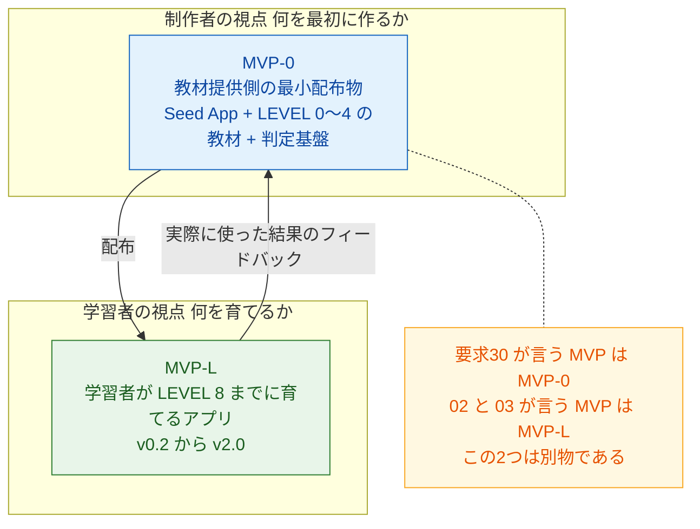
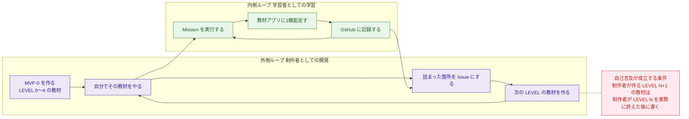
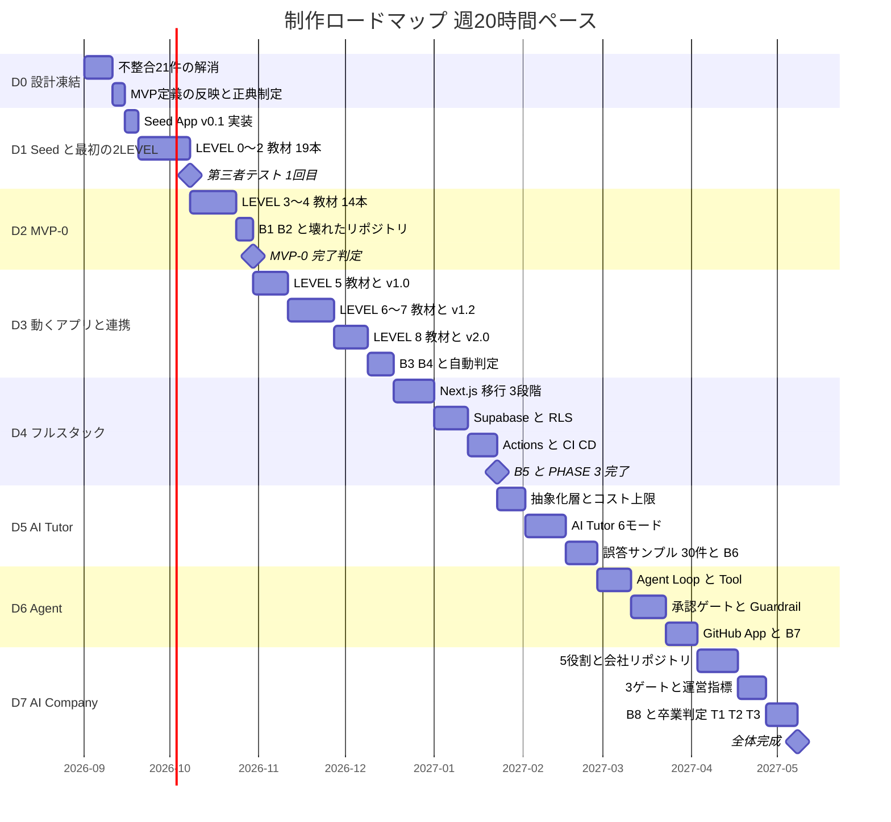
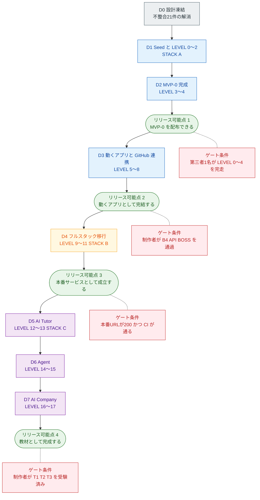
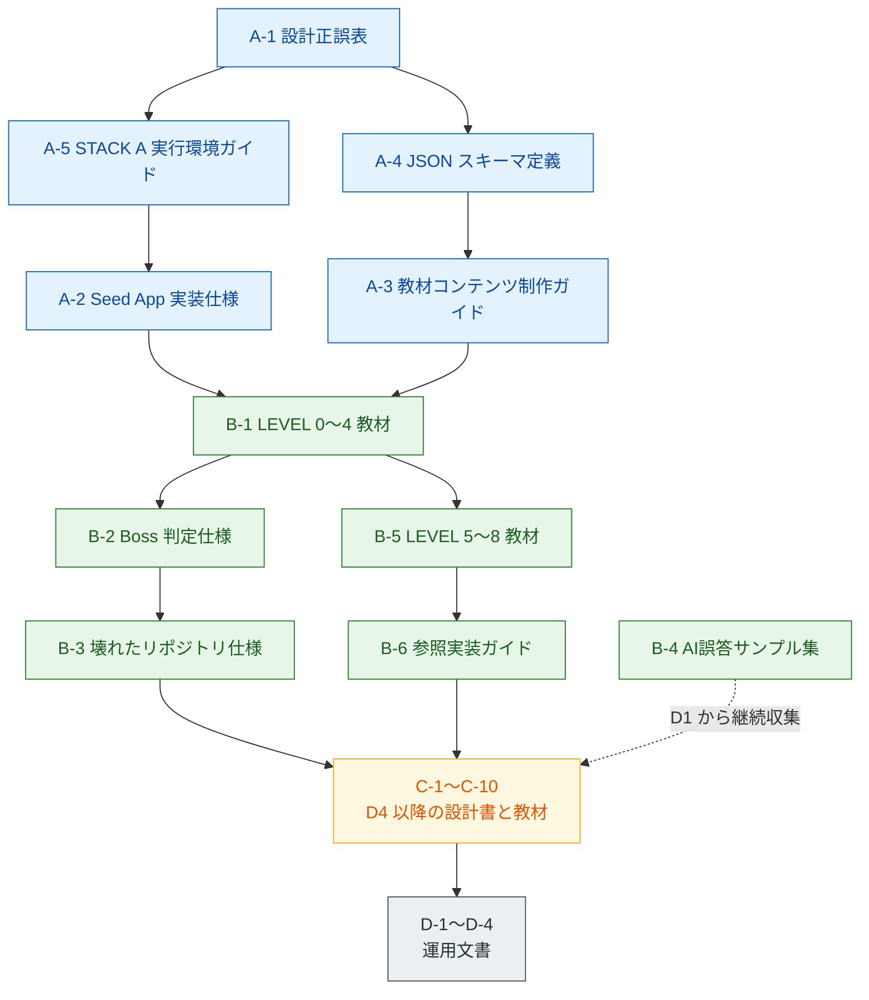

# 06. 開発計画書・総合レビュー
### GitHub・API・AI開発 自走型学習アプリ ／ MVP範囲・開発フェーズ・最終到達判定・整合性監査

| 項目 | 内容 |
|---|---|
| 本書の担当範囲 | 要求仕様 33 の出力順序 **21〜27**（MVPの範囲 / 開発フェーズ / つまずきポイント / 過剰設計の指摘 / 改善案 / 最終到達判定 / 次に作成すべき設計書一覧）＋ 本書独自の **整合性監査** |
| 対応する要求 | 29-I（開発ロードマップ）、30（MVP）、31（指摘）、32（最重要質問） |
| 前提文書 | `00_教育設計書.md` / `01_カリキュラム設計書.md` / `02_アプリ機能・UIUX設計書.md` / `03_技術スタック・アーキテクチャ設計書.md` / `04_GitHub連携・AI設計書.md` / `05_セキュリティ設計書.md` |
| 立場 | **シニアAIエンジニア兼批判的レビュアー。** 既存6冊の主要決定は前提として尊重するが、問題があれば遠慮なく指摘する |
| 作成時点 | 2026年8月 |

---

## 本書の位置づけと読み方

本書は「設計書の7冊目」であると同時に、**先行6冊に対する外部レビュー**である。したがって2つの読み方がある。

| 読者 | 読むべき章 |
|---|---|
| これから制作に着手する人 | 第1章（何を作るか）→ 第2章（どの順で作るか）→ 第7章（次に何を書くか） |
| 設計の妥当性を検証したい人 | 第8章（整合性監査）→ 第4章（過剰設計）→ 第6章（最終到達判定） |
| 教材コンテンツを書く人 | 第3章（つまずき）→ 第2章 D2 以降（制作フェーズ） |

**本書は先行6冊の未決事項の一部を「確定」させる。** 確定した事項は第8章 8.4 に一覧する。矛盾が生じた場合、本書の記述が優先する（ただし本書が明示的に「04 を正とする」等と判定した箇所を除く）。

---

## 改訂履歴

| 日付 | 内容 |
|---|---|
| **2026-08-14** | `change_orders.md`（改訂指示書 CO-01〜CO-32）に基づき、`00`〜`05` の6冊を改訂。**本書（06）は改訂の直接対象ではないが、指摘・改善案の反映状況が読み取れるよう、第8章の不整合21件・第5章の改善案 P0/P1/P2 に反映ステータスを付記し、参照数値を確定値に更新した。** |

**変更の要点**

- 第8章の**不整合21件（CRITICAL 3 / MAJOR 8 / MINOR 10）はすべて CO-01〜CO-11 で解消済み。** 各項目に「✅ 解消済み（CO-xx で対応）」を付記した（8.2）。
- 第5章の**改善案 P0 4件・P1 12件はすべて適用済み**（CO-01〜CO-04、CO-08〜CO-10、CO-18〜CO-31）。**P2 6件は今回は見送り**（D7完了後に再検討）。ただし P2-5（T1 の変更）は CO-19 で内容的に前倒し実施済み（5.1〜5.3）。
- Mission 総数は 128 → **133**（Mission 5本を新設：5-8 切り分けの型／9-9 AI が提示するコマンドを読む／10-6 SQL の JOIN を読む／15-8 未知のリポジトリを Agent に読ませる／16-7 Planner を使わず自分で Issue を書く）。Mission XP は 13,280 → **13,740**、総XP は 22,680 → **23,140**。標準学習時間は 72h → **74h**、実測想定学習時間は 100h → **103h**（期間の目安 約4〜6.5か月）。詳細は `revision/totals.md` を正典とする。
- 卒業判定は T1〜T3 → **T1〜T4**。T1 を「未知コードベース参入テスト」に変更し、T4「統治実績確認」を新設（6.5、CO-19）。
- 能力軸レーダーの正典を 03 5.6 に一本化し、Boss と軸を1対1対応させた（P0-4、CO-04）。この対応表に **B軸 Lv3（B6 通過）が抜けていた誤りを本改訂で修正**した（後述）。

**まだ残っている事項**

- P2 6件（画面削減・BLACKOUT削減・AI解説モード段階開示・`ai-company` 保護パス化・Advanced トラック）は D0〜D7 完了後に個別 CO を起票して再検討する（5.3）。
- 実装時に決定すればよい運用上の未決事項6件（教材コンテンツの独自ブロック記法の構文／Markdown レンダラの選定／LEVEL 6 で使う公開 API の選定／B4・T1 用の外部 API・リポジトリのプール／AI プロバイダの既定値／制作工数試算の較正係数）は付録A.2 のまま未確定（実装フェーズで決定）。

---

# 第0章 エグゼクティブサマリ

## 0.1 3つの結論

### 結論1：最終到達判定 — **条件付きで YES**

> **「この教材を最後まで終えたとき、ユーザーは本当にAIを使って自走開発できるようになるか？」**

**Stage 1〜8 は高い確度で到達する。Stage 9〜10 は「設計上は到達可能だが、到達の可否は教材の完成度ではなく完走率で決まる」。** そして自走開発能力については、**「GitHub を中心とした、自分が育てた1本のコードベースでは自走できる。他人のコードベース・未知のドメインでは、あと1段の補完が要る」** というのが正直な判定である。詳細は第6章。

### 結論2：本設計の最大のリスクは技術ではなく **教材コンテンツの制作量** である

6冊の設計書は、アプリの機能・アーキテクチャ・セキュリティを極めて綿密に設計している。しかし **128 Mission × 7STEP の本文、384問の Quiz、128×3段階のヒント、「なぜ？」3層、AI誤答サンプル、悪意ある Issue サンプル、壊れたリポジトリ4種** という教材コンテンツの制作工数は、**6冊のどこにも見積もられていない。**

本書の試算では、この制作量は **256〜512時間**（学習者の学習時間100時間の 2.5〜5倍）である。**これが本プロジェクト最大の未管理リスクであり、第2章の開発フェーズはこの事実を中心に組み立てられている。**

### 結論3：設計書間に **21件の不整合** がある（CRITICAL 3 / MAJOR 8 / MINOR 10）

うち3件は「そのまま実装すると動かない」水準である。第8章に全件を列挙し、どちらを正とすべきかを判定した。

## 0.2 最重要の指摘3件（詳細は第8章）

| # | 指摘 | 影響 |
|---|---|---|
| **1** | **LEVEL 6 の Lesson Viewer（02 F-02）は `file://` では動作しない。** Seed App の起動方法は「ダブルクリック」（00 P-1 / 03 4.1）だが、`fetch("content/*.json")` はブラウザのスキーム制限でブロックされる | 教材アプリが LEVEL 6 で**確実に動かない**。学習者は原因不明のエラーで停止する |
| **2** | **能力軸レーダーの昇格条件が 01 第4章 と 03 5.6 で全5軸ずれている。** 例：D軸 Lv4 が 01 では「B6 通過」、03 では「T3 通過」 | 卒業判定に直結する指標が二重定義。実装者はどちらかを選ばざるを得ず、片方の設計意図が失われる |
| **3** | **LEVEL 7〜8 の PAT 保管場所が STACK A で技術的に成立しない。** 05 6.1 は「ローカル＝`.env.local`」とするが、この時点で Node.js もビルドも存在せず、ブラウザは `.env.local` を読めない | セキュリティ設計の中核（秘密情報の置き場所の変遷）が、最初の2段階で破綻する |

## 0.3 最優先の改善案3件（詳細は第5章）

| # | 改善案 | 効果 |
|---|---|---|
| **P0-1** | **STACK A の実行モデルを「GitHub Pages の URL を正とし、ローカルは VS Code Live Server（拡張1つ・npm不要）」に確定する** | 指摘1・3を同時に解消し、CORS 教材（LEVEL 6）と「公開URL＝成果物」（LEVEL 2）の一貫性も強化される |
| **P0-2** | **MVP を「MVP-0（制作者が最初に作る配布物）」と「MVP-L（学習者が LEVEL 8 までに育てるアプリ）」に分離定義する** | 要求30 の MVP と 02/03 の MVP が別物であることが明確になり、4通りに散っていた MVP 定義が一本化される |
| **P0-3** | **教材コンテンツ制作を独立フェーズ（D2〜D5）として計上し、「7STEP フル形式は高リスク Mission のみ、他は圧縮形式」という制作ルールを設ける** | 制作量を 256〜512時間 から **140〜220時間** に圧縮でき、プロジェクトが完走可能になる |

---

# 第1章 MVPの範囲（要求21 / 要求30）

## 1.1 まず用語を整理する：本設計には「MVP」が4通り存在している

先行文書を横断すると、「MVP」という語が**互いに異なる範囲**で使われている。

| 出典 | MVP の指す範囲 |
|---|---|
| 要求仕様30 | Dashboard / LEVEL / Lesson / Mission / Progress / GitHub基礎教材 —— **制作者が最初に作るもの** |
| 02 3.3.1（画面遷移図） | LEVEL 1〜8 / v0.2〜v2.0 —— **学習者のアプリの到達点** |
| 02 1.3（機能マスタ表 MVP 欄） | F-01/02/03/04/05/07/11/24 に ✅、F-12（LEVEL 8）は「—」—— **上と矛盾している** |
| 03 4.1 | STACK A ＝ LEVEL 1〜8 を「MVP 時点」と呼ぶ |
| 03 5.2 / 5.5 | 「MVP のデータモデル（**LEVEL 5〜9**）」 |

**02 1.3 は「MVP の範囲は 03 および開発フェーズ設計書で確定」と明記して判断を本書に委ねている。** したがって本書で確定する。

### 本書の確定：MVP を2層に分離する

| 用語 | 定義 | 誰が作るか | いつ完成するか |
|---|---|---|---|
| **MVP-0** | 学習者が LEVEL 0 を開始できる最小の配布物 | 📦 教材提供側（＝本プロジェクトの制作者） | 開発フェーズ D2 の終了時 |
| **MVP-L** | 学習者が LEVEL 8 終了時点で手にしているアプリ（v2.0） | 🧩 学習者自身 | 学習開始から約 31 時間後（PHASE 1＋2 完了時） |

**以降、無印の「MVP」は MVP-0 を指す。** これが要求30 が求めているものである。

## 1.2 「この教材を作ること自体が教材」構造の具体化

要求30 の核心は「自分がこのアプリを使って GitHub を学びながら、その後の機能を開発する」という自己言及構造である。これを**2重ループ**として定義する。

### この構造を成立させるための3つの必須ルール

| # | ルール | これがないとどうなるか |
|---|---|---|
| 1 | **LEVEL N+1 の教材本文は、制作者自身が LEVEL N を実際に完走した後に書く** | 机上で書いた手順書になり、01 が予測した「つまずきポイント」が実測値で更新されない |
| 2 | **制作者が詰まった箇所は、必ず教材アプリの Issue として記録する**（`docs/` へのメモではなく Issue） | LEVEL 15 で「11 LEVEL 前に自分が書いた Issue を Agent に処理させる」という 01 1.6 最大の仕掛けの弾が尽きる |
| 3 | **MVP-0 の時点で「教材コンテンツを Git 管理する」構造を確定する**（02 A-02） | 後から CMS を作りたくなる。02 O-6 が禁じた膨張が起きる |

**ルール2 は本書で新たに追加する要件である。** 01 1.6 は「LEVEL 15 で Agent が処理する Issue は、LEVEL 4 で自分が Projects に積んだ学習バックログの残り」としているが、**LEVEL 4 の学習者が11 LEVEL 先まで持つ量の Issue を書けるとは考えにくい。** 制作者が制作中に貯めた Issue を、学習バックログの初期値としてテンプレートリポジトリに同梱すべきである（第5章 P1-4）。

## 1.3 MVP-0 の機能リスト

要求30 が挙げる「Dashboard / LEVEL / Lesson / Mission / Progress / GitHub基礎教材」を、02 の機能ID・画面IDに写像する。

### 1.3.1 配布物の構成

| # | 構成物 | 実体 | 出典 |
|---|---|---|---|
| A | **Seed App v0.1** | `index.html` 45行 / `style.css` 30行 / `progress.json` 20行 / `README.md` / 空の `.gitignore`（計95行） | 04 5.3.2 |
| B | **教材コンテンツ（LEVEL 0〜4 分）** | `content/levels.json` / `missions.json` / `skills.json` / `boss.json` / `glossary.json` ＋ LEVEL 0〜4 の Mission 本文 33件 ＋ B1・B2 の Boss 定義 | 03 5.2 / 02 A-02 |
| C | **配布チャネル2系統** | ① 教材サイトからの **ZIP**（LEVEL 1 用）② GitHub の **テンプレートリポジトリ**（LEVEL 2 用） | 02 A-05 |
| D | **`broken-repo-samples`** | B1 RECOVERY 用の壊れたリポジトリ1種のみ（B3/B5/T2 用は後続フェーズ） | 04 5.5 |
| E | **成長ログ・エラー記録テンプレート** | `notes/log/TEMPLATE.md` / `errors/TEMPLATE.md` | 00 5.5 / 5.6 |
| F | **AI 質問テンプレート** | 8項目テンプレート（LEVEL 0 で登録させる） | 01 LEVEL 0 |

### 1.3.2 MVP-0 に含める機能（学習者が LEVEL 0〜4 で触れるもの）

| 機能ID | 機能 | MVP-0 での状態 | 根拠 |
|---|---|---|---|
| F-01 | Dashboard | **静的HTML。** 動かない進捗表。LEVEL 1 で学習者が14行書き足す | 02 1.4 / 04 5.3.3 |
| F-07 | 「なぜ？」ボタン | **静的。** `
` タグで L1 のみ開示（L2・L3 は本文内に折りたたみ） | 02 F-07 |
| F-11 | 成長ログ | **手書き Markdown。** アプリ機能ではない | 02 1.3 |
| F-24 | ヒント3段階 | **静的。** Markdown の `:::hint` ブロックを `
` で表現 | 02 F-24 |
| — | LEVEL マップ / LEVEL 詳細（SC-02 / SC-03） | **静的HTML。** `progress.json` の内容を手書きで転記した一覧 | 02 3.2 |

> ⚠ **02 3.2 は SC-01・SC-02・SC-03 の初出を LEVEL 1 としているが、LEVEL 1 の作業量は「30分」（02 第4章）である。** 30分で3画面は書けない。本書では **MVP-0 の時点で SC-02・SC-03 を Seed App に同梱済みとし、LEVEL 1 で学習者が書き足すのは SC-01 の進捗表14行のみ**と確定する（第8章 C-9 関連）。

### 1.3.3 MVP-0 に**含めない**機能（明示的な非スコープ）

| 含めないもの | 理由 | いつ作るか |
|---|---|---|
| F-02 Lesson Viewer | LEVEL 0〜4 の教材本文は **エディタと GitHub 上で直接読む**。アプリで読む必要がない | D3（LEVEL 6 教材と同時） |
| F-03〜F-06, F-10, F-14, F-21 | すべて JavaScript が前提。LEVEL 5 まで JS は登場しない | D3 |
| F-12 GitHub連携 | LEVEL 8 の機能 | D3 |
| F-08/09/16/15/17/22/23/25（AI・Agent系） | STACK C。MVP から3スタック離れている | D5〜D6 |
| Boss Mission の**自動判定**（04 1.5） | B1・B2 の判定は **AI レビュー＋自己申告のみ**で開始する。GitHub API 判定は F-12 が必要 | D3 |
| 教材コンテンツ管理画面 | 02 O-6 で禁止済み | 作らない |

**この「作らないもの」リストが MVP 定義の本体である。** 02 1.1 が「機能一覧を書く前に、アプリが持たないものを先に決める」としたのと同じ思想を、MVP にも適用する。

## 1.4 MVP-0 の非機能リスト

| 分類 | 要件 | 検証方法 | 由来 |
|---|---|---|---|
| **可搬性** | ビルド不要・依存ゼロ。ZIP を展開して開くだけで動く | 新品の Mac で ZIP から起動 | 00 R-14 |
| **可搬性** | Node.js / npm / Docker / Python を**一切要求しない** | `package.json` が存在しないこと | 03 2.1 |
| **起動性** | LEVEL 0 でインストールさせるのは **VS Code のみ**（＋ Live Server 拡張1つ。第5章 P0-1） | セットアップ手順が10行以内 | 00 5.9 #1 |
| **コスト** | **完全無料。** 課金要素ゼロ | GitHub Free + Pages のみ | 03 6.1 |
| **性能** | 初期表示 2秒以内（実質は静的HTMLなので自明） | 目視 | 03 6.2 |
| **可読性** | 学習者が読むコードは **95行以内**。1ファイル50行以内 | 行数カウント | 04 5.3.1 |
| **アクセシビリティ** | PC ブラウザのみ対応。モバイルは閲覧のみ | 02 O-8 | 02 3.7 |
| **保守性** | 教材コンテンツは `content/` に JSON/Markdown で分離。コードに文字列を埋め込まない | grep で日本語文字列がコードに無いこと | 02 A-02 |
| **更新配布** | `content/VERSION` を持ち、`upstream` からの取り込み手順が LEVEL 3 に用意されている | 手順書の存在 | 04 5.3.4 |
| **🛡 安全性** | Seed App に秘密情報を扱うコードを**一切含めない** | コードレビュー | 05 6.1 |
| **🛡 安全性** | `.gitignore` は**空で配布**（LEVEL 2 で学習者が書く） | ファイル内容 | 04 5.3.2 |
| **教育的制約** | 意図的に「貧弱」であること。装飾なし・押しても動かないチェックボックス | 04 5.3.3 | 04 5.3.3 |

> ⚠ **「意図的に貧弱」は非機能要件として明文化しておく必要がある。** 制作者は必ず「もう少し綺麗にしたい」誘惑に負ける。**Seed App を綺麗にすると、LEVEL 1〜5 の Mission から目的が消える。**

## 1.5 MVP-0 の完了定義（Definition of Done）

MVP-0 は「作った」では完了しない。**第三者が LEVEL 0〜4 を完走できて初めて完了である。**

| # | 完了条件 | 検証者 | 合格ライン |
|---|---|---|---|
| 1 | 新品の Mac で ZIP を展開し、10分以内に `index.html` がブラウザに表示される | 制作者以外の1名 | 10分 |
| 2 | LEVEL 0〜4 の 33 Mission がすべて 7STEP または圧縮形式で存在する | 制作者 | 33/33 |
| 3 | 各 Mission の Quiz が3問、ヒントが3段階、揃っている | 制作者 | 33×3問 = 99問 |
| 4 | **第三者1名が LEVEL 0〜4 を完走し、B2 GITHUB BOSS を通過する** | 被験者 | 1名 |
| 5 | 上記の**実測所要時間**が記録され、01 1.5 の設計値（16h）との乖離が測定されている | 制作者 | 乖離率を記録 |
| 6 | 被験者が詰まった箇所がすべて Issue 化されている | 制作者 | — |
| 7 | 🛡 テンプレートリポジトリから作成したリポジトリで、`.gitignore` が空であることが確認できる | 自動 | — |
| 8 | 🛡 Seed App のコードに秘密情報・トークン・個人情報が含まれない | Secret scanning | 0件 |
| 9 | LEVEL 2 の GitHub Pages 公開手順が、実際に公開URLを生む | 被験者 | URL が 200 |
| 10 | 教材コンテンツの更新（`upstream` 取り込み）が LEVEL 3 の手順通りに動作する | 制作者 | — |

**条件4・5 が本質である。** 設計書6冊は「設計上正しいこと」しか担保していない。**教材の品質は、実際に人が詰まった箇所でしか測れない。** 先行6冊にはユーザーテスト計画が一切なく、これは本書が指摘する重大な欠落である（第4章 OD-1）。

## 1.6 MVP-L（学習者側）の到達点

参考として、学習者が MVP フェーズ（LEVEL 1〜8）で手にするものを再掲する。

| 版 | LEVEL | 到達物 | 検証 |
|---|---|---|---|
| v0.2 | 1 | 手書きの静的進捗表 | ブラウザで表示される |
| v0.3 | 2 | **公開URL**（GitHub Pages） | URL が 200 |
| v0.4 | 3 | CHANGELOG とブランチ運用 | Merge 済み PR |
| v0.5 | 4 | Issue Template と学習バックログ | Projects にカード |
| **v1.0** | 5 | **アプリが初めて動く**（進捗計算＋localStorage） | チェックで%が変わる |
| v1.1 | 6 | 外部 API の結果を表示 | fetch が成功する |
| v1.2 | 7 | 🛡 Secret チェッカー | 危険パターンを検出 |
| **v2.0** | 8 | GitHub API による成長ログ自動集計 | Commit 数が表示される |

**MVP-L の完了定義＝B4 API BOSS の通過。** ここで Stage 4 に到達し、「API を使ったアプリを AI と作れる人」になる。

---

# 第2章 開発フェーズ（要求22 / 要求29-I）

## 2.1 ロードマップの前提：2つの時間軸を混同しない

要求29-I は「MVP→GitHub Learning→GitHub Integration→API Learning→AI Tutor→Agent→AI Company」というフェーズを求めている。しかし**この7フェーズは「学習者の進行」であって「制作者の開発順序」ではない。**

| 時間軸 | 単位 | 総量 | 出典 |
|---|---|---|---|
| **学習者の時間** | LEVEL / Mission | 約103時間（4〜6.5か月）※改訂後確定値 | 01 1.5 |
| **制作者の時間** | 開発フェーズ D0〜D7 | **本書で試算：約 340〜520時間** | 本章 2.3 |

**制作者の時間が学習者の時間の3〜5倍になる**ことが、本プロジェクトの最大の特徴である。これは異常値ではなく、教材開発では標準的な比率だが、**6冊のどこにも書かれていなかった。**

### 制作者の時間の内訳（試算）

| 作業 | 単位工数 | 数量 | 小計 |
|---|---|---|---|
| 教材本文（7STEP フル形式） | 3.0 h / Mission | 40 Mission（高リスク地点） | 120 h |
| 教材本文（圧縮形式） | 1.2 h / Mission | 88 Mission | 106 h |
| Quiz（3問 × なぜ型） | 0.4 h / Mission | 128 | 51 h |
| ヒント3段階 | 0.2 h / Mission | 128 | 26 h |
| 「なぜ？」3層 | 含む（本文に統合） | — | — |
| Boss Mission 8件 | 4 h / 件 | 8 | 32 h |
| AI誤答サンプル / 悪意ある Issue サンプル | 0.5 h / 件 | 60件 | 30 h |
| 壊れたリポジトリ 4種 | 3 h / 件 | 4 | 12 h |
| **教材コンテンツ小計** | | | **377 h** |
| Seed App 実装 | | | 8 h |
| 学習者が作る機能の「答え合わせ実装」（制作者が先に作る） | | | 60 h |
| 判定ロジック・自動検証 | | | 30 h |
| 第三者テストと修正 | | | 40 h |
| **総計（削減前）** | | | **515 h** |

**この 515 時間が、第5章 P0-3 の圧縮ルールを適用すると 340 時間程度になる。** 週10時間の個人開発なら **34週（約8か月）**、週20時間なら **17週（約4か月）** である。

> ⚠ **この試算は本書の推定であり、実測値ではない。** D1 フェーズの終了時に LEVEL 0〜2 の実測工数で係数を較正すること。

> 📌 **改訂後の数量（CO-32）**：上表の数量は**改訂前の 128 Mission を前提とした試算**である。確定値の **133 Mission**（`revision/totals.md`）で再計算すると、圧縮形式は **93 Mission（112 h）**、Quiz は **133（53 h）**、ヒント3段階は **133（27 h）** となり、**教材コンテンツ小計は約 386 h、総計（削減前）は約 524 h**（いずれも +約2%）。本節冒頭の試算レンジ「約 340〜520 時間」は上限を **約 530 時間**と読み替えること。**制作者の時間が学習者の時間の3〜5倍になるという本章の結論は変わらない。**

## 2.2 開発フェーズ D0〜D7 の定義

要求29-I の7フェーズを、既存設計の STACK A/B/C・LEVEL 構成・v0.1〜v7.0 の成長表と整合する形に具体化する。

| フェーズ | 名称 | 要求29-I との対応 | 対象 LEVEL | STACK | 教材アプリ版 | 目安期間（週20h） |
|---|---|---|---|---|---|---|
| **D0** | 設計凍結と不整合修正 | （前段。要求にない） | — | — | — | **2週** |
| **D1** | Seed App と最初の2 LEVEL | MVP の前半 | 0〜2 | A | v0.1〜v0.3 | **4週** |
| **D2** | **MVP-0 完成** | **MVP** | 0〜4 | A | 〜v0.5 | **4週** |
| **D3** | 動くアプリと GitHub 連携 | GitHub Learning ＋ GitHub Integration ＋ API Learning | 5〜8 | A | v1.0〜v2.0 | **7週** |
| **D4** | フルスタック移行 | （要求にない。既存設計の PHASE 3） | 9〜11 | B | v3.0〜v3.2 | **6週** |
| **D5** | AI Tutor | AI Tutor | 12〜13 | C | v4.0〜v4.1 | **5週** |
| **D6** | Agent | Agent | 14〜15 | C | v5.0〜v5.1 | **5週** |
| **D7** | AI Company | AI Company | 16〜17 | C | v6.0〜v7.0 | **5週** |
| | | | | | **合計** | **38週（約9か月）** |

### 要求29-I との差分と、その理由

| 差分 | 理由 |
|---|---|
| **D0（設計凍結）を新設** | 第8章の不整合21件を抱えたまま実装に入ると、実装中に設計判断のやり直しが発生する。**2週の投資で数週間の手戻りを防ぐ** |
| **「GitHub Learning」と「GitHub Integration」と「API Learning」を D3 に統合** | 既存設計では LEVEL 5（JS）→6（API）→7（Secret）→8（GitHub API）が**単一の連続した依存鎖**であり、途中で切ると「動く状態」を維持できない（LEVEL 7 の Secret チェッカーは LEVEL 5 の JS が前提） |
| **D4（フルスタック移行）を新設** | 要求29-I には無いが、既存設計の PHASE 3（LEVEL 9〜11）は STACK A→B の**最大の断層**であり、独立フェーズとして扱わないと制作者自身が詰まる |
| **D1 と D2 を分離** | MVP-0 を一度に作ると、第三者テスト（1.5 条件4）が最後まで行われない。**LEVEL 0〜2 の段階で1回テストを挟む** |

## 2.3 各フェーズの詳細

### D0：設計凍結と不整合修正（2週 / 40h）

| 項目 | 内容 |
|---|---|
| **目的** | 実装開始前に、設計書間の矛盾をゼロにする |
| **成果物** | ① 第8章の不整合21件の解消（6冊への反映）② 本書 1.1 の MVP 定義を 02・03 に反映 ③ 正典（Single Source of Truth）ルールの制定（8.3）④ `docs/tech-constraints.md` の初版（03 3.1） |
| **完了条件** | CRITICAL 3件・MAJOR 8件が解消されている。MINOR 10件は「起票済み」であればよい |
| **「動く状態」** | 該当なし（実装前） |
| **⚠ リスク** | ここを飛ばしたくなる。**飛ばすと D3 で LEVEL 6 が動かず、原因究明に1週間を失う** |

### D1：Seed App と最初の2 LEVEL（4週 / 80h）

| 項目 | 内容 |
|---|---|
| **目的** | 「配布 → 学習 → GitHub に記録」の1周を最短で成立させる |
| **成果物** | ① Seed App v0.1（95行）② ZIP 配布ページ ③ テンプレートリポジトリ ④ LEVEL 0〜2 の教材 19 Mission ⑤ 成長ログ・エラー記録テンプレート ⑥ 教材コンテンツの JSON スキーマ確定 |
| **完了条件** | **制作者自身が LEVEL 0〜2 を完走し、公開URLを持つ。** ＋ 第三者1名が LEVEL 0〜2 を完走 |
| **「動く状態」** | ZIP を展開 → ブラウザで開く → 表が見える → テンプレートから作ったリポジトリに Push → **GitHub Pages で公開される** |
| **実測すべき値** | LEVEL 0〜2 の実測所要時間（設計値：110＋135＋180＝425分） |
| **⚠ リスク** | 教材本文の分量が想定を超える。**ここで単位工数を較正する**（2.1 の試算の較正点） |

### D2：MVP-0 完成（4週 / 80h）

| 項目 | 内容 |
|---|---|
| **目的** | 要求30 の MVP を完成させ、以降を「自分がこの教材で学びながら開発する」体制に移行する |
| **成果物** | ① LEVEL 3〜4 の教材 14 Mission ② B1 RECOVERY / B2 GITHUB の Boss 定義 ③ `broken-repo-samples`（B1 用1種）④ Branch protection 設定手順（05 5.1）⑤ Issue Template / PR Template ⑥ **学習バックログの初期 Issue 群**（本書 1.2 ルール2） |
| **完了条件** | 1.5 の完了定義10項目すべて |
| **「動く状態」** | LEVEL 0〜4 を通しで完走でき、B2 GITHUB BOSS まで到達できる。**この時点で「Issue → Branch → PR → Merge」が学習者の手で1周する** |
| **⚠ リスク** | B1/B2 の判定が自動化できない（F-12 が無い）。**AI レビュー＋自己申告のみで開始し、D3 で自動判定を後付けする**ことを許容する |

### D3：動くアプリと GitHub 連携（7週 / 140h）

| 項目 | 内容 |
|---|---|
| **目的** | 教材アプリを「静的な表」から「自分の GitHub 実績を映す鏡」に変える |
| **成果物** | ① LEVEL 5〜8 の教材 30 Mission ② F-02〜F-06, F-10, F-12, F-13, F-14, F-19, F-21 の参照実装 ③ B3 SECURITY / B4 API の Boss 定義と `broken-repo-samples` 追加 ④ **Boss 自動判定の実装**（04 1.5）⑤ 権限エスカレーション表の機械的強制（05 4.4）⑥ localStorage スキーマ `adt.v1.state`（03 5.2） |
| **完了条件** | 制作者が LEVEL 5〜8 を完走し、v2.0 のダッシュボードに自分の Commit 数が表示される |
| **「動く状態」** | チェックを付けると進捗率が変わり、GitHub API から取得した実績が同じ画面に並ぶ |
| **⚠ 最大のリスク** | **本書 8.2 C-2（`file://` で fetch できない問題）がここで顕在化する。** D0 で解決していなければ、この週で必ず止まる |
| **⚠ リスク2** | LEVEL 7〜8 の PAT の扱い（C-3）。**公開された Pages 上で PAT を入力させてはならない**。第5章 P0-1 の実行モデル確定が前提 |

### D4：フルスタック移行（6週 / 120h）

| 項目 | 内容 |
|---|---|
| **目的** | STACK A → B。**教材の中で最大の断層**を、制作者が先に通過する |
| **成果物** | ① LEVEL 9〜11 の教材 24 Mission ② Next.js 16 への移行（3チェックポイント分割：01 LEVEL 9）③ Vercel Hobby へのデプロイ ④ Supabase の5テーブル（03 5.5）＋ RLS ⑤ GitHub Actions（`ci.yml` / `daily-learning.yml`）⑥ B5 FULL-STACK の Boss 定義 ⑦ `docs/tech-constraints.md` の確定版 |
| **完了条件** | 本番URLが 200 を返し、CI が通り、Preview 環境が PR ごとに生成される |
| **「動く状態」** | **移行の各チェックポイントで、常に「同じものが表示される」ことを確認しながら進む。** 9-6a（静的）→ 9-6b（JS）→ 9-6c（API Route）の3段階で、どの時点でもアプリは動く |
| **⚠ リスク** | Supabase 無料枠の1週間自動停止（03 3.2）。**制作が数日空くと停止する。** 再開手順を `docs/runbook.md` に書き、D4 の最初に作る |
| **⚠ リスク2** | Next.js 16 の仕様変動（03 U-01）。**着手時に公式ドキュメントで再確認する**こと自体を D4 の最初のタスクにする |

### D5：AI Tutor（5週 / 100h）

| 項目 | 内容 |
|---|---|
| **目的** | 教材が自分自身を説明できるようになる |
| **成果物** | ① LEVEL 12〜13 の教材 15 Mission ② `callLLM()` 抽象化層（04 2.7）③ 6モードのシステムプロンプト（04 2.2）④ Structured Output による出力固定 ⑤ F-17 コスト管理・F-22 誤答検出訓練・F-23 BLACKOUT ⑥ **AI誤答サンプル 30件・攻撃入力サンプル 20件**（02 A-10：AI生成せず固定管理）⑦ B6 AI の Boss 定義 ⑧ 🛡 Prompt Injection 対策 |
| **完了条件** | AI Tutor が段階開示（自分で考える→ヒント→解説）で動作し、コスト上限が実際に発火する |
| **「動く状態」** | AI 機能が落ちても、D4 までの学習機能は全て動く（02 1.5 の5層構造の実証） |
| **⚠ リスク** | **誤答サンプル 30件の作成が想像以上に重い。** 「巧妙に間違っている」サンプルは自動生成できない。**制作者が実際に AI に相談していて遭遇した誤答を収集する運用**を D1 から開始しておくこと（本書 P1-5） |
| **💰 コスト** | この時点で初めて実費が発生する。月 1〜30 米ドル（03 3.4）。**上限設定を D5 の最初のタスクにする** |

### D6：Agent（5週 / 100h）

| 項目 | 内容 |
|---|---|
| **目的** | Human-in-the-loop 付きで、AI に GitHub 上の作業を委任する |
| **成果物** | ① LEVEL 14〜15 の教材 16 Mission ② Agent Loop（1リクエスト＝1ステップ：03 4.3）③ Tool カタログ（04 3.3.1）④ 3ゲートの承認 UI（05 4.3）⑤ Guardrail（04 3.5）⑥ GitHub App の作成と Installation Token フロー ⑦ B7 AGENT の Boss 定義 ⑧ 悪意ある Issue サンプル ⑨ `docs/agent-recovery.md` |
| **完了条件** | Agent が Issue を読み、diff を提示し、**承認後にのみ** PR を作る。承認しなければ何も書き込まれない |
| **「動く状態」** | Agent が壊れても、Merge されていない限り main は無傷（05 7.6） |
| **⚠ 最大のリスク** | **Agent の非決定性。** 同じ Issue で動いたり動かなかったりする。01 LEVEL 14〜15 のつまずき対策「非決定性は仕様である」を、制作者自身が最初に受け入れる必要がある |
| **⚠ リスク2** | 本書 8.2 C-8：LEVEL 14 の `create_issue` が権限段階5のゲートを迂回している。D0 で解決していること |

### D7：AI Company（5週 / 100h）

| 項目 | 内容 |
|---|---|
| **目的** | 5役割 + Orchestrator を GitHub 経由で連携させ、3ゲートで統治する |
| **成果物** | ① LEVEL 16〜17 の教材 15 Mission ② `ai-company` リポジトリ（04 4.4 の構造）③ 6つの `ROLE.md` ④ `workflows/` 3種 ⑤ 運営指標（リードタイム / 手戻り率 / コスト）⑥ B8 FINAL BOSS ⑦ **卒業判定 T1〜T4**（F-25。T4 は CO-19 で新設）⑧ T2 用の壊れたリポジトリ ⑨ T1 用の未知 OSS リポジトリ・Issue のプール（B-2 で選定） |
| **完了条件** | 制作者自身が B8 を通過し、T1〜T4 を受験して結果を記録する |
| **「動く状態」** | Orchestrator を使わなくても、D6 までの Agent 単体で作業できる（04 4.8 C-8「AI 会社を使わない判断」） |
| **⚠ リスク** | **5役割の連携は Context の受け渡しで必ず劣化する。** 01 Mission 16-1 が「1体に複雑な仕事をさせて失敗させる」から始めているのは正しい設計だが、**5役割版が1体版より良い結果を出すとは限らない**。この事実自体を教材化すること（第4章 OD-8） |

## 2.4 ガントチャート

## 2.5 フェーズ間の依存関係

## 2.6 「各フェーズで実際に動く状態を維持する」ためのルール

要求29-I の「各フェーズで実際に動く状態を維持する」を、検証可能なルールに変換する。

| # | ルール | 実装方法 |
|---|---|---|
| 1 | **どのフェーズの終了時点でも、学習者はその時点までの LEVEL を完走できる** | 各フェーズ終了時に「その LEVEL までの通し完走」を制作者自身が実施 |
| 2 | **上位層が壊れても下位層は動く**（02 1.5 の5層構造） | AI 層・Agent 層は例外時に「機能が使えません」と表示するだけで、学習コアは動作継続 |
| 3 | **STACK 移行は必ず3分割**（D4 の 9-6a/b/c） | 各分割点で「同じものが表示される」ことを目視確認 |
| 4 | **DB 接続失敗時は localStorage にフォールバックする**（03 3.2 対策4） | Supabase 自動停止でも学習が止まらない |
| 5 | **教材コンテンツとコードを分離する**（02 A-02） | コンテンツだけの修正でデプロイが不要 |
| 6 | **各フェーズの成果物を `CHANGELOG.md` に版として記録する** | v0.1〜v7.0 が実際にタグとして残る |
| 7 | **フェーズをまたぐ「大きなリファクタ」を禁止する** | 動く状態を壊す最大の原因。必要なら次フェーズの最初のタスクにする |

## 2.7 リスクと緩衝

| # | リスク | 影響度 | 発現しやすい時期 | 緩衝策 |
|---|---|---|---|---|
| 1 | **教材コンテンツ制作の遅延** | 🔴 最大 | D1 で判明、D3・D5 で深刻化 | D1 で単位工数を実測し、係数を較正。超過したら圧縮形式の比率を上げる |
| 2 | 制作者自身のモチベーション低下（9か月の単独制作） | 🔴 大 | D4〜D5 | **リリース可能点を4つ置く**（2.5）。D2 終了時点で人に配れる |
| 3 | 外部サービス仕様の変動（Next.js / Supabase / AI API） | 🟠 中 | D4・D5 | 各フェーズの最初に公式ドキュメント確認タスクを置く（03 第8章 U-01〜U-12） |
| 4 | AI API のコスト超過 | 🟠 中 | D5〜D7 | D5 の最初に上限設定。役割別予算（04 4.7） |
| 5 | Agent の非決定性による検証コスト増 | 🟠 中 | D6〜D7 | 「成功率を測る」設計（00 5.9 #9）。100%を目指さない |
| 6 | Supabase 無料枠の1週間停止 | 🟡 小 | D4 以降で制作が空いたとき | `docs/runbook.md` の再開手順 |
| 7 | 第三者テスト被験者の確保 | 🟡 小 | D1・D2 | 1名でよい。**0名は不可** |

---

# 第3章 初心者がつまずきやすいポイント（要求23）

## 3.1 つまずきの4類型

先行文書（00 5.9 / 01 各 LEVEL の「つまずきポイント」）は個別対策を持っているが、**類型化されていない。** 対策の設計指針を得るために分類する。

| 類型 | 特徴 | 学習者の内心 | 有効な対策 |
|---|---|---|---|
| **T型 恐怖** | 操作そのものが怖くて手が止まる | 「壊したらどうしよう」 | **可逆性の保証を先に示す。** 「これは元に戻せます」 |
| **M型 メンタルモデル欠落** | 何が起きているか像が結べない | 「意味が分からない」 | **notional machine 図。** 内部の箱と矢印を見せる |
| **E型 エラー遭遇** | エラーメッセージで停止する | 「自分には向いていない」 | **予告。** 「ここでは必ずエラーが出ます」 |
| **V型 分量圧倒** | 情報量に押しつぶされる | 「覚えきれない」 | **「今は覚えなくてよい」の明示。** グレーブロック |

**最も危険なのは E型である。** 予告のないエラーは、学習者に「自分には向いていない」という一般化された結論を与える。予告されたエラーは、単なる「予定されたイベント」になる。

## 3.2 LEVEL 別つまずき予測と対処

### PHASE 1（LEVEL 0〜4）— 離脱が最も多い区間

| LEVEL | つまずき | 型 | 具体的な症状 | 対処 | 既存設計での扱い |
|---|---|---|---|---|---|
| **0** | **Terminal 恐怖** | T | 黒い画面が出た瞬間に手が止まる。「間違ったコマンドで PC が壊れる」と本気で思う | ① 最初の4コマンド（`pwd`/`ls`/`cd`/`mkdir`）は**全部「見る・移動する・作る」だけで、消すコマンドを一切教えない** ② 「`rm` は当分教えません。**消す道具を持たなければ壊せません**」と明言する ③ プロンプトの各部（ユーザー名・現在地・`$`）を図解する | 01 LEVEL 0 に4コマンド指定あり。**「消すコマンドを教えない」の明文化は本書で追加** |
| **0** | パスの絶対/相対が分からない | M | `cd docs` が動かず `cd /docs` を試して失敗 | 「住所」の比喩を固定。`pwd` を毎回打つ習慣を Mission 化 | 01 LEVEL 0 用語表にあり |
| **0** | VS Code のインストールで詰まる | E | 権限ダイアログ、Rosetta、Gatekeeper | **インストールするのは VS Code のみ**と宣言（00 5.9 #1）。スクリーンショット付き手順 | 00 5.9 #1 |
| **1** | HTML タグを閉じ忘れて表示が崩れる | E | レイアウトが全部おかしくなる | ⚠ 意図的エラー注入（01 1.9）。**閉じ忘れを先に見せる** | 01 1.9 に L1 の注入あり |
| **1** | ブラウザで開いても更新が反映されない | E | 保存し忘れ／キャッシュ | 「保存 → リロード」を型として固定。Live Server なら自動更新（本書 P0-1） | ⚠ **既存設計に記述なし。本書で追加** |
| **2** | **ローカルとリモートの区別がつかない** | M | 「Commit したのに GitHub に無い」 | **2つの箱の図を毎 Mission 再掲**（00 5.9 #2）。GitHub Desktop の画面上でどちらを見ているか常に指差す | 00 5.9 #2 |
| **2** | Commit と Push を1操作だと思う | M | 同上 | 「箱に入れる（Commit）」「箱を送る（Push）」の分離を STEP 3 で図解 | 01 第3章-補 の Mission 2-4 に実例あり |
| **2** | GitHub Pages が 404 のまま | E | 反映に数分かかる／ブランチ設定ミス | **「数分待ちます」を予告**。待つこと自体を Mission の一部にする | ⚠ **既存設計に記述なし。本書で追加** |
| **3** | **Conflict でパニック** | T + E | `<<<<<<< HEAD` を見て何が起きたか分からず、リポジトリを作り直そうとする | ① **Conflict を「事故」ではなく「予定された演習」として先に宣言**（00 5.9 #3）② `<<<<<<<` / `=======` / `>>>>>>>` の3記号の意味を図解 ③ **「Conflict は必ず解決できる。解決できない Conflict は存在しない」と明言** | 00 5.9 #3 |
| **3** | revert と reset を混同する | M | 履歴が消えて青ざめる | **本教材では `reset` を教えない。** `revert` のみ（履歴を残す方が初学者に安全） | ⚠ 01 は Rebase 削除を明記するが **`reset` の扱いは未定義。本書で「教えない」と確定を提案** |
| **4** | Branch protection で自分が push できなくなる | E | 「自分のリポジトリなのに拒否された」 | **これは成功である**と予告。「あなたは今、未来の自分から守られました」 | 05 5.1 に設定あり。⚠ **予告の明文化は本書で追加** |
| **4** | 自分の PR を自分でレビューする違和感 | M | 「意味がない」と感じて形骸化 | **「diff を画面で見る手順を強制することに意味がある」**と明示（05 5.1） | 05 5.1 |

### PHASE 2（LEVEL 5〜8）— 概念の密度が最も高い区間

| LEVEL | つまずき | 型 | 具体的な症状 | 対処 | 既存設計での扱い |
|---|---|---|---|---|---|
| **5** | JavaScript の文法量に圧倒される | V | 変数・関数・分岐・反復・配列を同時に浴びる | 「5部品だけ」と宣言（03 2.2）。**それ以外は全部グレーブロック** | 00 5.9 #4 |
| **5** | `document.querySelector` が `null` を返す | E | 「Cannot read properties of null」 | **最頻エラー。** `<script>` の位置（`</body>` 直前）を型として固定し、理由を図解 | ⚠ **既存設計に記述なし。本書で追加（頻度が非常に高い）** |
| **5** | localStorage に入れた数値が文字列で返る | E | `"3" + 1 === "31"` | ⚠ 意図的エラー注入。JSON.parse/stringify を型にする | ⚠ **既存設計に記述なし。本書で追加** |
| **6** | **CORS で完全停止** | E | 「Access to fetch ... has been blocked by CORS policy」 | ① **「これは必ず起きます」を事前予告**（00 5.9 #5）② 「あなたのコードは正しい。**ブラウザが止めている**」と最初に言う ③ 誰が止めているか（ブラウザ）・誰が許可するか（相手のサーバ）を図解 ④ **「自分では直せない場合がある」という事実を教える**（初学者は「全ての問題は自分で直せる」と思い込んでいる） | 00 5.9 #5 / 01 LEVEL 6 |
| **6** | **`file://` で自分のファイルが fetch できない** | E | 「Cross origin requests are only supported for protocol schemes: http, https...」 | **これは本書 8.2 C-2 の設計不備。** P0-1 の実行モデル確定で構造的に回避する | ❌ **既存設計が未解決。最重要** |
| **6** | **非同期（await 忘れ）** | M | `Promise { <pending> }` が表示される／`undefined` が出る | ① 「注文して席で待つ」の比喩を固定 ② **`await` を付け忘れた結果を実際に見せる**（POE 法）③ 「`Promise { <pending> }` を見たら 99% は `await` 忘れ」という**診断ルール**を渡す | 00 5.9 #5 / 01 LEVEL 6 |
| **7** | **`.env` を作ったのに読み込まれない** | M | 「環境変数を設定したのに `undefined`」 | **これも 8.2 C-3 の設計不備。** STACK A に `.env` を読む仕組みはない。P0-1 で解決 | ❌ **既存設計が未解決** |
| **7** | classic PAT を作ってしまう | — | 画面上の導線が classic に寄っている | fine-grained のみを手順書に載せる。classic は「使ってはいけないもの」として画像で示す | 01 LEVEL 7 |
| **7** | 権限を全部付けてしまう | — | 「足りないと動かないから」 | **「後から足せる」を明示。足りなくて困る方が、多すぎて漏れるより安全」** | 01 LEVEL 7 |
| **7** | Push Protection に止められてパニック | T | 「GitHub に拒否された。アカウントが凍結された？」 | **これは成功である**と予告（実践課題5 は意図的に発生させる設計）。⚠ 「バイパスできます」というリンクを**押させない**指導を明記すること | 01 LEVEL 7 実践課題5。⚠ **バイパス禁止の明文化は本書で追加** |
| **8** | **Rate Limit（429）** | E | 突然全リクエストが失敗する | ① 意図的に当てる Mission（04 1.4.3）② `GET /rate_limit` で残量を見せる ③ **リセット時刻まで待つしかない**という事実を教える（「待つ」という解決策は初学者の発想にない） | 04 1.4.3 |
| **8** | 401 と 403 の区別がつかない | M | どちらも「認証エラー」に見える | **401＝あなたが誰か分からない／403＝あなたは分かるが権限がない。** この1行を暗唱させる | 01 LEVEL 6 / 8 |
| **8** | レスポンス JSON が巨大で迷子 | V | どの項目を使えばいいか分からない | 必要な項目だけを抜き出す練習を先に置く。`console.log` + JSON ビューア | 01 LEVEL 8 |

### PHASE 3（LEVEL 9〜11）— 最大の断層

| LEVEL | つまずき | 型 | 具体的な症状 | 対処 | 既存設計での扱い |
|---|---|---|---|---|---|
| **9** | **Next.js 移行の概念爆発** | V | Node / npm / package.json / node_modules / App Router / Server と Client の区別が同時に来る | 移行を3チェックポイントに分割（01 LEVEL 9）。**各段階で「同じものが表示される」ことを確認** | 00 5.9 #6 / 01 LEVEL 9 |
| **9** | `npm install` が失敗する（Node バージョン） | E | エンジン不一致 | `.nvmrc` でバージョン固定（03 2.2）。**Docker の代わりがこれである**と説明 | 03 2.2 |
| **9** | `node_modules` を Commit してしまう | E | Push が終わらない／リポジトリが肥大 | `.gitignore` に `node_modules/` を **LEVEL 9 で追記**（05 6.3。「まだ存在しないものを先に書かせない」） | 05 6.3 |
| **9** | **Server Component で `useState` を使ってエラー** | E | 「You're importing a component that needs useState...」 | 「`"use client"` を付ける」で終わらせず、**なぜ2種類あるか**を図解。境界を見せることが LEVEL 9 の目的（03 2.3） | ⚠ **既存設計に記述なし。本書で追加（Next.js 初学者の最頻エラー）** |
| **9** | **環境変数の設定漏れ（本番だけ動かない）** | E | ローカルで動くのに Vercel で 500 | ⚠ 意図的に起こす Mission（03 4.5）。**3環境（ローカル/Preview/本番）の図を毎回再掲** | 03 4.5 |
| **10** | RLS を有効にしたら自分のデータも見えない | E | 「全部空になった」 | **これは成功である**と予告。ポリシーを書いて初めて見えるようになる流れを体験させる | ⚠ **既存設計に記述なし。本書で追加** |
| **10** | **`NEXT_PUBLIC_` を付けて service_role key を公開** | 🛡 | AI が「`NEXT_PUBLIC_` を付けてみて」と言い、動いてしまう | **05 6.2 の T-15。AI誤答検出訓練のサンプルとして固定提供**（02 F-22） | 05 6.2 |
| **10** | Supabase プロジェクトが停止している | E | 突然接続できない | `docs/runbook.md` の再開手順。**「1週間放置で止まる」を LEVEL 10 の最初に予告** | 03 3.2 |
| **11** | **YAML のインデントエラー無限ループ** | E | 「did not find expected key」 | ① エディタの YAML 拡張を**先に**入れる ② **わざと壊した YAML を先に見せる** ③ タブ禁止・スペース2の型を固定 | 00 5.9 #7 |
| **11** | Actions が動かない（トリガー条件） | M | Push したのに走らない | `on:` の条件とブランチ名を図解。`workflow_dispatch` で手動実行できることを教える | ⚠ **既存設計に記述なし。本書で追加** |
| **11** | テストが何をしているか分からない | M | 「assert って何」 | 「テストとは、**未来の自分への申し送り**」と定義（00 P-17） | 01 LEVEL 11 |

### PHASE 4〜5（LEVEL 12〜17）— AI 固有のつまずき

| LEVEL | つまずき | 型 | 具体的な症状 | 対処 | 既存設計での扱い |
|---|---|---|---|---|---|
| **12** | **課金への不安で手が止まる** | T | 「いくらかかるか分からないから触れない」 | **上限設定を LEVEL 12 の第1 Mission にする**（00 5.9 #8 / 05 T-13）。安心してから使わせる | 00 5.9 #8 |
| **12** | モデル名が教材と違う | E | 「そのモデルは存在しません」 | **教材にモデル名を固定表記しない**（03 U-09）。環境変数で切り替える設計を最初から教える | 03 U-09 |
| **12** | **AI の幻覚（存在しないAPI）** | 🛡 | AI が `array.sortBy()` のような存在しないメソッドを提示し、動かない | ① **AI誤答検出訓練（F-22）を LEVEL 12 から開始** ② 「**存在確認は1分でできる**」という手順を型にする（公式ドキュメントを検索する）③ 「AIは自信満々に間違える。**自信の強さは正しさの証拠にならない**」と明言 | 01 1.9 / 02 F-22 |
| **12** | AI の古い仕様（バージョン差） | 🛡 | `X-GitHub-Api-Version` を付けないコードを書いてくる | バージョン明示の習慣（04 1.3.1）。**「AIの知識には日付がある」**と教える | 04 1.3.1 |
| **13** | Structured Output が壊れて JSON パースに失敗 | E | 前後に説明文が付く | `strict` 指定（findings 4-1）＋ パース失敗時のフォールバックを型にする | 04 2.3.4 |
| **13** | Prompt Injection の脅威が実感できない | M | 「自分しか使わないのに誰が攻撃するのか」 | **攻撃者は人間ではなく、自分が読み込んだテキスト**（Issue・Web ページ・依存パッケージの README）であることを実演 | 04 2.9 / 05 T-08〜10 |
| **14** | **Agent が動いたり動かなかったりする** | T + M | 同じ入力で結果が違い、自信を失う | ① **「非決定性は仕様である」と明言**（00 5.9 #9）② **成功率を測る Mission に変える**（10回中何回成功したか）③ 「決定的でないものを扱う技術」自体が学習内容だと位置づける | 00 5.9 #9 |
| **14** | 無限ループでコストが溶ける | 💰 | 反復が止まらない | 反復上限8回（04 3.2.3）を**実装より先に**設定させる | 04 3.2.3 |
| **15** | 承認が形骸化する（全部承認してしまう） | — | diff を見ずに「承認」を連打 | ① **diff を最後まで見ないと承認ボタンが有効にならない**（02 A-06）② **差し戻し率 0% を警告表示**（02 A-09）③ 「全部承認している人は統治していない」と明示 | 02 A-06 / A-09 |
| **15** | 悪意ある Issue を見抜けない | 🛡 | Issue 本文の「これまでの指示を無視して…」に従ってしまう | 攻撃サンプル4種を教材提供（05 T-07）。**Issue 本文は「データ」であって「命令」ではない**という原則 | 05 T-07 |
| **16** | 5役割にしたら1体より遅く・悪くなる | M | 「分けた意味がない」 | ⚠ **これは実際に起きる。** 04 4.8 C-8「AI 会社を使わない判断」を教材として正面から扱う（本書 OD-8） | 04 4.8 C-8 |
| **17** | Orchestrator が自分で作業してしまう | — | 役割分離が崩れる | **ツール制約で強制**（Contents: Write を渡さない。01 Mission 17-1） | 01 17-1 |
| **17** | `decisions/` を書くのが面倒で続かない | V | 記録が3件で止まる | **1件3行でよい**（04 4.7.3）。形式より継続 | 04 4.7.3 |

## 3.3 全期間に共通する3つのつまずき

| # | つまずき | 症状 | 対処 |
|---|---|---|---|
| 1 | **中断からの復帰** | 3日空くと「どこまでやったか分からない」 | STEP 0（前回の想起）＋ 成長ログの申し送り（項目8）＋ ブランク検知（F-18）＋ **Dashboard 最上部が常に「次にやること」**（02 F-01） |
| 2 | **AI に丸投げして理解ゼロ** | 動いたが説明できない | 仮説入力の必須化（R-02）＋ BLACKOUT MISSION（各 PHASE 末尾）＋ 「まだ分かっていないこと」欄の空欄保存不可（R-07） |
| 3 | **AI を疑いすぎて進まない** | 全部を検証しようとして時間が溶ける | ⚠ **既存設計に対策がない。** 「疑うべき箇所」の優先順位（① 権限・秘密情報 ② 削除・上書き ③ 存在しないAPI ④ それ以外は動かして確かめる）を教材化すべき（本書 P1-6） |

## 3.4 対処設計の共通原則

| 原則 | 内容 |
|---|---|
| **予告する** | 高リスク地点の直前に必ず「ここでは必ずエラーが出ます」を置く |
| **成功だと言う** | Push Protection・Branch protection・RLS の「拒否」は、すべて**成功体験として提示する** |
| **診断ルールを渡す** | 「`Promise { <pending> }` を見たら `await` 忘れ」のような**1行の診断ルール**は、長い説明より効く |
| **戻れると先に言う** | T型（恐怖）には知識ではなく**可逆性の保証**が効く |
| **「自分では直せない」を教える** | CORS のように、自分の側では解決できない問題があることを知らないと、無限に自分を責める |

---

# 第4章 現構想の過剰設計部分（要求24 / 要求31）

要求31 は「要求をそのまま肯定しない」ことを求めている。先行6冊は既に多数の過剰設計を指摘・除去している（00 P-1〜P-18、02 O-1〜O-12、03 S-1〜S-10、04 C-1〜C-8、05 P-1〜P-12）。**本章では重複を避け、「6冊がまだ指摘していない過剰設計」に絞る。** 対象には**既存設計書6冊そのもの**を含む。

## 4.1 既存設計書6冊に対する新規の過剰設計指摘

### 🔴 OD-1【欠落かつ過剰】設計密度に対して、検証計画が存在しない

| 項目 | 内容 |
|---|---|
| **問題** | 6冊は 11,284 行の設計を持つが、**「この設計が正しいか」を検証する計画が1行もない。** ユーザーテスト、パイロット実施、実測所要時間の較正、いずれも記述がない |
| **再現条件** | D2 完了時点で第三者テストを行わずに D3 に進んだ場合 |
| **影響** | 01 1.5 の「つまずき係数 ×1.4」は**根拠のない推定値**である。実測が 2.5倍だった場合、全体は100時間ではなく180時間になり、完走率の前提が崩れる。設計が精緻であるほど、誤った前提の上に精緻な構造が積み上がる |
| **代替案** | ① 本書 1.5 の完了定義に「第三者1名の完走」を必須条件として組み込み済み ② D1・D2 の2回、実測所要時間を記録し係数を較正 ③ **設計値と実測値の乖離が1.8倍を超えたら、Mission を分割するのではなく削る**という判断基準を先に決めておく |

### 🔴 OD-2【過剰】128 Mission × 7STEP フル形式は、制作不能な分量である

| 項目 | 内容 |
|---|---|
| **問題** | 00 5.2 と 01 第3章-補は 7STEP をすべての Mission に適用する設計になっている。1 Mission の 7STEP フル形式は、01 第3章-補の実例（Mission 2-4）で **約230行**である。128 Mission × 230行 = **約29,000行の教材本文** |
| **再現条件** | 全 Mission を 01 第3章-補と同じ密度で書いた場合 |
| **影響** | 第2章 2.1 の試算で 377時間。**制作者が単独で書くと、教材本文だけで9か月かかる。** 実際には D3 あたりで力尽き、以降の LEVEL の教材が薄くなる（＝AI・Agent という最も価値の高い部分が最も薄くなる） |
| **代替案** | ① **7STEP フル形式は「高リスク地点」の40 Mission に限定**（3.2 の表で E型・T型に分類した Mission）② 残り88 Mission は 01 6.2 の「圧縮形式」（01 第3章-補に既に例がある）③ **STEP 1 の用語表は `content/glossary.json` に一元化し、Mission 本文からは参照するだけ**（現状は Mission ごとに書き下ろす設計になっており、同じ用語を何度も書くことになる）④ STEP 3 の notional machine 図は **LEVEL ごとに1枚を再掲**する（Mission ごとに描かない） |

### 🟠 OD-3【過剰】機能25個・画面20個は、単一ユーザーの学習アプリとして多い

| 項目 | 内容 |
|---|---|
| **問題** | 02 A-01 は「機能25・画面20。これ以上増やさない」と上限を宣言しているが、**そもそも20画面が多い。** 利用者は1人であり、学習の主戦場は VS Code・ブラウザ・GitHub である |
| **再現条件** | 全画面を実装した場合 |
| **影響** | 学習者が実装する量が増え、「学習アプリを作ること」が「学習すること」を圧迫する。特に SC-09（Skill Tree）・SC-14（Projects）・SC-19（復習）・SC-18／SC-20 相当は、**Dashboard のセクションで足りる** |
| **代替案** | ① **画面を14に削減**：SC-09 Skill Tree → SC-01 のタブ、SC-14 Projects → SC-01 のセクション、SC-19 復習 → SC-01 の最上部（既に F-18 がそう設計している）、SC-18 Secret チェック → SC-17 設定内、SC-20 卒業判定 → SC-16 内 ② 削減分の実装時間を**教材コンテンツに回す**（OD-2 の緩和にもなる） |

### 🟠 OD-4【過剰】能力軸レーダー（A〜E × Lv1〜4）は、算出の複雑さに見合わない

| 項目 | 内容 |
|---|---|
| **問題** | 03 5.6 の算出は、5軸 × 4段階 × 複数証拠源（`quiz_attempts` / `ai_messages.user_prediction` / `agent_proposals` / `wrong_answer_attempts` / `approvals` / `decisions`）に依存する。**6テーブルを跨ぐ集計を、単一学習者のために実装する** |
| **再現条件** | LEVEL 10（DB 化）以降 |
| **影響** | ① 実装コストが高い ② **学習者が「なぜ Lv2 のままなのか」を理解できない**（条件が複合的すぎる）③ 8.2 C-1 の通り 01 と 03 で条件が食い違っており、**二重定義のまま実装されるリスクが最も高い機能** |
| **代替案** | ① **証拠源を Boss Mission の結果のみに限定する。** 「B1 通過 → C軸 Lv2」のように **1対1対応**にする ② レーダーの更新は Boss 通過時のみ（03 5.6 が既にそう規定している）③ 副次的な証拠（予測的中率・Issue 8項目充足率）は**表示するが、判定には使わない** ④ これにより 01 と 03 の不整合も自動的に解消する |
| **状態** | ✅ 適用済み（CO-04、第5章 P0-4 参照）。**適用時に対応表の誤りを1件発見・修正した**：当初案は B軸の到達条件が B2（Lv2）→B8（Lv4）のみで、**B軸 Lv3 が欠落しており累積判定上 Lv4 に到達不能だった。** 「B6 AI BOSS 通過＝B軸 Lv3」と裁定し解消した（詳細は 5.1 P0-4） |

### 🟠 OD-5【過剰】卒業判定 T1〜T3 のうち T1 は、判定装置として重すぎる

| 項目 | 内容 |
|---|---|
| **問題** | T1（未知課題テスト）は「教材に出てこない外部APIで機能を作る・4時間以内」（00 2.5）。**4時間の実技試験を、単独学習者が自分に課して自分で採点する** |
| **再現条件** | LEVEL 17 完了後 |
| **影響** | ① 自己採点なので合否が曖昧 ② 4時間という単位は、01 1.5 の「1日30〜90分」の学習リズムと整合しない ③ **T1 は実質「B4 API BOSS の再演」**であり、Stage 4 を再測定しているだけで、Stage 10 の判定に寄与しない |
| **代替案** | ① T1 を **「未知の API を使う」から「未知のコードベースを読む」に変更する**（本書 6.4 の不足知識1 への対応も兼ねる）。具体的には「OSS リポジトリを1つ指定し、指定の Issue に対する修正方針を PR の下書きとして提出する」。**2時間・成果物はテキストでよい** ② これなら Stage 10 に必要な「他人の文脈を読む力」を測れる |

### 🟠 OD-6【過剰】BLACKOUT MISSION 5回は、多い

| 項目 | 内容 |
|---|---|
| **問題** | 各 PHASE 末尾に1回、計5回（01 4.3）。合計 2.9 時間 |
| **再現条件** | PHASE 1 の BLACKOUT（LEVEL 0〜4 の範囲で AI を使わずに作業） |
| **影響** | **PHASE 1・2 の BLACKOUT は学習効果が低い。** この段階の作業（Commit する・PR を出す）は AI がいなくてもできるため、「AI 依存の検出」という目的を果たさない。逆に PHASE 4・5 では効果が高い |
| **代替案** | **BLACKOUT を3回に削減**（PHASE 3・4・5 の末尾）。PHASE 1・2 では代わりに「AI の回答を採用する前に、自分の予測を書く」（既に R-02 で全 Mission に実装済み）で足りる |

### 🟡 OD-7【過剰】`ai-company` を別リポジトリにする判断は、教育効果に対してコストが高い

| 項目 | 内容 |
|---|---|
| **問題** | 04 5.1.1 は「Agent が自分の役割定義を書き換えられない」という性質を構造で実現するため、リポジトリを2本に分ける |
| **再現条件** | LEVEL 17 |
| **影響** | ① リポジトリが増えると、権限設定・Clone・同期の手間が2倍になる ② **同じ性質は「保護パス」（05 T-18）で既に実現されている。** `ROLE.md` を Agent の変更禁止パスに入れれば、1本でも成立する ③ 04 自身が「LEVEL 16 では1本、LEVEL 17 で切り出す」としており、**切り出す作業自体が Mission 17-2 として1つ消費されている** |
| **代替案** | ① **1本のまま `company/` ディレクトリで運用し、保護パスで守る**（実装コストが低い）② 「関心の分離を体験する」という教育目的は、**「切り出すべきか否かを判断して `decisions/` に記録する」Mission に変える**（判断の訓練になり、Stage 10 の統治力に直結する）③ どちらを選んでも、**選んだ理由を記録させることが本質** |

### 🟡 OD-8【設計の空白】5役割が1体より優れる保証がなく、その事実が教材化されていない

| 項目 | 内容 |
|---|---|
| **問題** | 01 Mission 16-1 は「1体に複雑な仕事をさせて失敗させる」から始まるが、**その後「5役割にしたら成功した」という保証はどこにもない。** 現行 LLM の性能では、役割分割による Context 分離が**品質を下げる**ケースが実在する |
| **再現条件** | LEVEL 16〜17。特に変更規模が小さい（1ファイル10行）タスク |
| **影響** | 学習者が「5役割にしたのに遅くて悪い」という結果に直面したとき、**教材が用意した説明がない。** 「自分の実装が悪い」と誤帰属する |
| **代替案** | ① 04 4.8 C-8（AI 会社を使わない判断）を**LEVEL 16 の Mission に前倒しする** ② **1体版と5役割版で同じタスクを実行し、リードタイム・手戻り率・コストを比較する Mission** を追加する（LEVEL 17 の運営指標 Mission 17-6 と統合できる）③ 「分割の利点は品質ではなく**監査可能性と責任の所在**である」と明言する。これが正しい教育内容である |

### 🟡 OD-9【過剰】Boss Mission の自動判定条件が細かすぎる

| 項目 | 内容 |
|---|---|
| **問題** | 04 1.5 は8 Boss × 3〜4条件の自動判定を GitHub API で行う設計。例：B4 は「`X-GitHub-Api-Version` が指定されているか」をコードから検出する |
| **再現条件** | Boss 判定の実装時 |
| **影響** | **コードの静的解析を自作することになる。** 文字列一致で実装すると、コメント内の記述や別の書き方で誤判定する。誤判定は学習者の信頼を最も損なう |
| **代替案** | ① 自動判定を **「ファイル/リポジトリの存在」と「GitHub 上の事実」のみ**に限定する（PR が Merge された・CI が成功した・revert Commit がある）② コード内容の判定は **AI レビューに委ねる**（既に3系統併用が設計されている：02 F-14）③ **「判定できないものは判定しない」を原則にする** |
| **状態** | ✅ 適用済み（CO-29、第5章 P1-9 参照）。適用の結果、**自動判定条件は Boss ごとに1〜4件**となった（コード内容の静的解析に依存していた条件を AI レビューへ移した結果、**B4・B6 は「存在確認」1件のみ**に減った）。「8 Boss × 3〜4条件」という当初の記述は実態と合わなくなっている |

### 🟡 OD-10【将来負債】教材コンテンツと学習者の成果物が同一リポジトリにある

| 項目 | 内容 |
|---|---|
| **問題** | 04 5.2.1 の通り、`ai-developer-training` には `content/`（教材）と `notes/`・`errors/`・`app/`（学習者の成果物）が同居する。教材更新は `upstream` からの取り込みで対応する（04 5.3.4） |
| **再現条件** | 教材本文を修正して既存学習者に配布するとき |
| **影響** | ① 学習者が `content/` を触っていなければ Conflict は起きないが、**学習者は「なぜ？」の追記など `content/` を触りたくなる** ② 教材が更新されるたびに Conflict 解決が発生し、**教材制作者側の修正が学習者の学習を止める** ③ 04 自身が「これは Merge と Conflict の実践教材になる」としているが、**LEVEL 12 の学習中に LEVEL 3 の教材が更新されて Conflict が起きるのは、学習の妨げでしかない** |
| **代替案** | ① `content/` を**別リポジトリ**にし、Git Submodule ではなく**「ダウンロードして置き換える」スクリプト1本**で更新する（Conflict が構造的に起きない）② または `content/` を学習者の変更禁止パスとし、追記は `notes/` に書かせる ③ **①を推奨。** 教材更新が学習を止めない構造が最優先 |

### 🟡 OD-11【過剰】要求仕様の「AI解説モード」出力7項目は、一度に見せる量として多い

| 項目 | 内容 |
|---|---|
| **問題** | 要求12 は【目的】【1行ずつ説明】【入力】【出力】【なぜ必要か】【消したらどうなるか】【覚えるべき点】【今は覚えなくてよい点】の8ブロックを求め、02 F-08 がこれを踏襲している |
| **再現条件** | LEVEL 12 以降、コードを選択して解説させたとき |
| **影響** | 8ブロックを毎回出すと、**元のコードより解説の方が長くなる。** V型（分量圧倒）のつまずきを教材自身が作り出す |
| **代替案** | ① **既定は3ブロック**（目的 / 覚えるべき点 / 今は覚えなくてよい点）② 残り5ブロックは「もっと詳しく」で追加取得（段階開示。既に AI Tutor で採用している思想：04 2.4）③ 💰 コストも下がる |

### 🟡 OD-12【過剰】seed の「100行未満」制約が、SC-02・SC-03 の要件と両立しない

| 項目 | 内容 |
|---|---|
| **問題** | 04 5.3.2 は Seed を95行（`index.html` 45行）と定義する。一方 02 3.2 は SC-01・SC-02・SC-03 の初出を LEVEL 1 としており、**18 LEVEL の一覧（SC-02）＋各 LEVEL の詳細（SC-03）を45行では書けない** |
| **再現条件** | Seed App の実装時 |
| **影響** | 制作者が「100行未満」を守ると画面が足りず、画面を作ると制約を破る。**どちらかが必ず破綻する** |
| **代替案** | ① **制約を「学習者が読むコードは100行未満」から「学習者が LEVEL 1 で編集する範囲は50行以内」に変更する** ② SC-02 は `progress.json` からの一覧表示（LEVEL 5 で動的化）。**LEVEL 1 時点では SC-01 のみとし、SC-02・SC-03 の初出を LEVEL 5 に後置する**（本書 8.2 C-9 の解決と同じ） |

## 4.2 逆に「過小設計」な箇所（要求31 の裏面）

要求31 は過剰設計の指摘を求めているが、**過小な箇所を放置すると同じく破綻する。** 3件を挙げる。

| # | 過小な箇所 | なぜ問題か | 追加すべきもの |
|---|---|---|---|
| **UD-1** | **デバッグの体系的教材がない** | 「エラー学習」（F-10）はエラー**発生後**の教材だが、「どこが悪いか分からない」状態の切り分け手順（二分探索・`console.log` の置き方・ブラウザ DevTools の Network/Console の読み方）は、各 LEVEL のつまずき対策に断片的に散っているだけ | **LEVEL 5 に「切り分けの型」Mission を1本追加**（20分）。① 症状を1文で書く ② 直前の変更を特定する ③ 動いていた状態に戻す ④ 半分に切って試す。これは AI への質問品質にも直結する |
| **UD-2** | **要件定義・受け入れ条件を「人間が書く」訓練がない** | 04 4.6.2 の Issue フォーマット8項目は **Planner AI が出力する**設計になっている。学習者は Issue を「読んで承認する」だけで、**自分でゼロから書く訓練が LEVEL 4 の学習バックログ以降ほぼない** | Stage 10 の行動指標①「ワークフローを設計できる」を満たすには、**人間が受け入れ条件を書く Mission が必要。** LEVEL 16 に「Planner の出力を使わず、自分で Issue を書いて Developer に渡す」Mission を1本追加 |
| **UD-3** | **「AIが正しく、自分が間違っている」ケースの扱いがない** | 懐疑力（D軸）を徹底的に鍛える設計だが、**過剰懐疑への対処がない。** 3.3 #3 の通り、疑いすぎて進まない学習者が生まれる | 「疑うべき箇所の優先順位」（① 権限・秘密情報 ② 削除・上書き ③ 存在確認が1分でできるもの ④ それ以外は動かして確かめる）を LEVEL 12 の教材に明記（本書 P1-6） |

---

# 第5章 改善案（優先度付き）

優先度は **P0（D0 で必ず実施）／P1（該当フェーズ開始前）／P2（余力があれば）** の3段階。

## 5.1 P0：実装開始前に必須

### P0-1 STACK A の実行モデルを確定する 🔴

| 項目 | 内容 |
|---|---|
| **解決する問題** | 8.2 C-2（`file://` で fetch できない）、8.2 C-3（`.env` を読めない）、3.2 の LEVEL 6・7 のつまずき |
| **内容** | ① **正典の実行環境を「GitHub Pages の公開URL」とする**（LEVEL 2 以降）② **ローカル開発は VS Code の Live Server 拡張**（npm 不要・拡張1つ・ワンクリック）を LEVEL 1 の最後に導入する ③ したがって STACK A の起動方法は「ダブルクリック」ではなく **「Live Server で開く」または「公開URLを開く」** に変更する |
| **副次効果** | ① `http://127.0.0.1:5500` という **localhost と Port を LEVEL 1 で自然に見せられる**（01 が LEVEL 9 に後置した概念の予告になる）② LEVEL 6 の CORS 教材が「同一オリジンなら通る／別オリジンだと止まる」の対比で説明できるようになり、**教育効果が上がる** ③ 保存すると自動リロードされるため、3.2 の LEVEL 1「更新が反映されない」つまずきが消える |
| **代償** | 00 P-1 の「ダブルクリックで開くだけ」という宣伝文句が失われる。**ただしこれは宣伝文句であって設計要件ではない**。R-14「ビルド不要・依存ゼロ」は維持される（Live Server はビルドでも依存でもない） |
| **PAT の扱い（C-3 の解決）** | 🛡 LEVEL 7〜8 の PAT は **`.env` ではなく、アプリの設定画面から入力し `sessionStorage` に保持する**（タブを閉じると消える）。① **公開URL上では入力欄を無効化し、`localhost` 判定時のみ有効にする** ② 「なぜ localhost でしか使えないのか」がそのまま LEVEL 9 の動機になる ③ `.env` / `.env.example` は **「LEVEL 9 で使う仕組みを、LEVEL 7 で先に作っておく」**という位置づけに変更し、01 LEVEL 7 の実践課題3 の文言を修正する |
| **状態** | ✅ 適用済み（CO-01） |

### P0-2 MVP を2層に分離定義する 🔴

| 項目 | 内容 |
|---|---|
| **解決する問題** | 8.2 C-5（MVP が4通り） |
| **内容** | 本書 1.1 の MVP-0 / MVP-L を正典とし、02 1.3 の MVP 欄・02 3.3.1 の見出し・03 4.1 の見出し・03 5.2/5.5 の見出しを修正する |
| **修正内容** | ① 02 1.3 の MVP 欄を「**MVP-0**」欄に変更し、F-01/F-07/F-11/F-24 のみ ✅ ② 02 3.3.1 の見出しを「**MVP-L 完成時点（LEVEL 8 / v2.0）**」に ③ 03 4.1 の見出しを「**STACK A（LEVEL 1〜8 / v0.2〜v2.0）**」に（MVP の語を外す）④ 03 5.2/5.5 の見出しを「**localStorage 期（LEVEL 5〜9）**」に |
| **状態** | ✅ 適用済み（CO-02） |

### P0-3 教材コンテンツ制作を独立フェーズとして計上し、圧縮ルールを設ける 🔴

| 項目 | 内容 |
|---|---|
| **解決する問題** | OD-2（制作不能な分量）、第2章 2.1 の未管理リスク |
| **内容** | ① 7STEP フル形式を **40 Mission に限定**（3.2 で E型・T型に分類した地点）② 残り 88 Mission は圧縮形式（01 6.2 のテンプレート）③ **用語表を `content/glossary.json` に一元化**し、Mission からは用語IDで参照する ④ notional machine 図は LEVEL ごとに1枚を再掲 ⑤ Quiz は「なぜ型」3問を維持するが、**LEVEL ごとに共通の問題バンクから出題**してもよいとする |
| **効果** | 教材本文の制作工数を **377h → 約210h** に圧縮（44%削減） |
| **重要な注意** | ⚠ **圧縮しても「7STEP を守る」ことは変えない。** 圧縮するのは分量であって構造ではない。STEP 0（前回の想起）と STEP 5（仮説入力）は圧縮形式でも省略しない（R-02 / R-04） |
| **状態** | ✅ 適用済み（CO-03） |

### P0-4 能力軸の正典を一本化する 🔴

| 項目 | 内容 |
|---|---|
| **解決する問題** | 8.2 C-1（01 と 03 で全5軸ずれ）、OD-4（算出が複雑） |
| **内容** | ① **03 5.6 を正典とする**（証拠源が明示されており、Lv4 に T2/T3 を置く設計が卒業判定と整合している）② 01 第4章の各 Boss の「評価する能力軸」を 03 5.6 に合わせて書き換える ③ **OD-4 の代替案（Boss と軸の1対1対応）を採用し、副次証拠は表示のみ**とする |
| **修正後の対応表（提案）** | B1→C Lv2 ／ B2→B Lv2 ／ B3→C Lv3・SEC S2 ／ B4→D Lv2・A Lv2 ／ B5→E Lv2・A Lv3 ／ **B6→D Lv3・B Lv3** ／ B7→E Lv3・A Lv4 ／ B8→E Lv4・B Lv4 ／ T2→C Lv4 ／ T3→D Lv4 |
| **状態** | ✅ 適用済み（CO-04）。**適用時に本表の誤りを1件修正した：** 当初案は B軸が B2（Lv2）→B8（Lv4）のみで、**B軸 Lv3 の到達条件が欠落しており、累積判定のため B軸が Lv2 で頭打ちになり Lv4 に到達不能だった。** 改訂では「B6 AI BOSS 通過＝B軸 Lv3」と裁定した（LEVEL 13 のプロンプト設計課題が B Lv3 のルーブリックと一致するため）。これに伴い B6 の完了条件に「プロンプトの4要素明示」（条件6）を追加している。詳細は 03 5.6・01 第4章（改訂後）を参照 |

## 5.2 P1：該当フェーズの開始前に必須

| # | 改善案 | 対象フェーズ | 解決する問題 | 状態 |
|---|---|---|---|---|
| **P1-1** | **`content/` を別リポジトリに分離し、更新はスクリプトによる置き換えにする** | D1 | OD-10（教材更新が学習を止める） | ✅ 適用済み（CO-10） |
| **P1-2** | **SC-02・SC-03 の初出を LEVEL 5 に後置し、LEVEL 1 は SC-01 のみとする** | D1 | OD-12・8.2 C-9（Seed 95行制約との衝突） | ✅ 適用済み（CO-09） |
| **P1-3** | **B1・B2 の提供形態を「Markdown 教材 ＋ GitHub 上での実施」と明記する**（アプリ画面 SC-08 は LEVEL 5 から） | D2 | 8.2 C-9 | ✅ 適用済み（CO-09） |
| **P1-4** | **制作者が制作中に貯めた Issue を、学習バックログの初期値としてテンプレートリポジトリに同梱する** | D2 | 本書 1.2 ルール2（LEVEL 15 の Issue の弾切れ） | ✅ 適用済み（CO-30） |
| **P1-5** | **AI 誤答サンプルの収集を D1 から開始する**（制作者が実際に遭遇した誤答をその場で記録する運用） | D1〜D5 | D5 のリスク（30件を後からまとめて作れない） | ✅ 適用済み（CO-31） |
| **P1-6** | **「疑うべき箇所の優先順位」を LEVEL 12 の教材に追加する** | D5 | UD-3・3.3 #3（過剰懐疑） | ✅ 適用済み（CO-25） |
| **P1-7** | **LEVEL 5 に「切り分けの型」Mission を1本追加する**（20分 / 80 XP） | D3 | UD-1（デバッグの体系がない） | ✅ 適用済み（CO-21、Mission 5-8） |
| **P1-8** | **LEVEL 14 の `create_issue` を LEVEL 15 に後置する**（または権限段階 4.5 を新設する） | D6 | 8.2 C-8（権限ゲートの迂回） | ✅ 適用済み（CO-08） |
| **P1-9** | **Boss 自動判定を「存在と GitHub 上の事実」に限定する** | D3 | OD-9（静的解析の自作） | ✅ 適用済み（CO-29） |
| **P1-10** | **Boss XP のスキル配分表を作成し、スキルバーの満点を再計算する** | D3 | 8.2 C-7（満点17,700 と総XP 22,680 の不整合） | ✅ 適用済み（CO-07。配分表は作成せず、スキルバー分母を Mission XP のみとする暫定方針を正式採用） |
| **P1-11** | **1体版と5役割版の比較 Mission を LEVEL 16〜17 に追加する** | D7 | OD-8（5役割の優位性が保証されない） | ✅ 適用済み（CO-22。既存 Mission 17-6 への統合） |
| **P1-12** | **`reset` を「教えない」と明文化する**（`revert` のみ） | D2 | 3.2 LEVEL 3（revert と reset の混同） | ✅ 適用済み（CO-18） |

## 5.3 P2：余力があれば

| # | 改善案 | 効果 | 状態 |
|---|---|---|---|
| **P2-1** | 画面を20→14に削減する（OD-3） | 実装工数を教材コンテンツに回せる | ⏸ 見送り（D7完了後に再検討） |
| **P2-2** | BLACKOUT を5回→3回に削減する（OD-6） | PHASE 1・2 の学習密度が上がる | ⏸ 見送り（D7完了後に再検討） |
| **P2-3** | AI 解説モードの既定出力を8ブロック→3ブロックにする（OD-11） | 認知負荷と 💰 コストの同時削減 | ⏸ 見送り（D7完了後に再検討） |
| **P2-4** | `ai-company` を別リポジトリにせず保護パスで代替する（OD-7） | LEVEL 17 の作業量削減 | ⏸ 見送り（D7完了後に再検討） |
| **P2-5** | T1 を「未知の API」から「未知のコードベース」に変更する（OD-5） | 卒業判定が Stage 10 を測るようになる | ✅ 適用済み（CO-19、6.5 の卒業判定強化提案として前倒し実施。単なる P2 見送りではなく確定事項に格上げされた） |
| **P2-6** | Advanced トラック（Docker 判断ガイド / Webhook / MCP 自作 / RAG / Rebase / SQL最適化）は **D7 完了後**に着手する | 本編完成を優先。00 U-08 への回答 | ⏸ 見送り（D7完了後に再検討） |

---

# 第6章 最終到達判定（要求26 / 要求32）

## 6.1 最重要質問への正面からの回答

> **「この教材を最後まで終えたとき、ユーザーは本当にAIを使って自走開発できるようになるか？」**

**回答：条件付きで YES。ただし「自走できる」の範囲には明確な境界がある。**

正確に言い直すと、本教材の卒業生は次の状態になる。

| できるようになること | 確度 |
|---|---|
| **自分が育てた1本のコードベースに対して、AI と協働して機能を追加・修正・復旧できる** | 🟢 高い |
| **AI の出力を、権限・秘密情報・破壊操作の観点から検証して差し戻せる** | 🟢 高い |
| **GitHub を中心とした開発フロー（Issue → Branch → PR → Review → Merge）を自分で設計できる** | 🟢 高い |
| **AI Agent に GitHub 上の作業を委任し、承認ゲートで統治できる** | 🟡 中〜高（完走が前提） |
| **未知のドメイン・他人のコードベースで、同じことができる** | 🟠 中（補完が必要） |
| **要件を自分で定義し、スコープを切り、期限内に着地させられる** | 🟠 中（補完が必要） |

**「AIを使って自走開発できる」を「自分の文脈内で自走できる」と読むなら YES。「どんな現場でも自走できる」と読むなら、あと1段の補完が要る。** 補完内容は 6.4 に示す。

### なぜ YES と言えるのか（3つの根拠）

| # | 根拠 | 該当設計 |
|---|---|---|
| 1 | **「戻せる力」が最初に確立されている。** LEVEL 3 の revert と B1 RECOVERY BOSS が、Agent に書き込み権限を与える LEVEL 15 より12 LEVEL 先行している。AI 駆動開発の実際のリスクは「AI が間違えること」ではなく「戻れないこと」であり、そこを最初に潰している | 01 1.1 原則5 / B1 |
| 2 | **懐疑力（D軸）が独立した訓練項目になっている。** AI 誤答の意図的注入、誤答検出訓練（F-22）、BLACKOUT、B6 の「誤答5件中4件検出」、T3。**ここまで系統的に「AIを疑う訓練」を組んでいる教材は稀である** | 00 5.7 / 02 F-22 |
| 3 | **成果物が GitHub 上の実物として残る。** 「できたつもり」が起きにくい。公開URL・Merge 済み PR・Contribution グラフ・`errors/`・`decisions/` はすべて外形的に検証可能 | 00 5.3.2 / 02 F-13 |

### なぜ「条件付き」なのか（3つの条件）

| # | 条件 | 満たされない場合 |
|---|---|---|
| 1 | **教材が完成すること。** 第2章の試算で制作に 340〜520時間かかる。D5〜D7（AI・Agent・AI会社）は最後に作られるため、**最も価値の高い部分が最も未完成になりやすい** | Stage 7 以降に到達できない |
| 2 | **学習者が完走すること。** 約103時間・4〜6.5か月（改訂後確定値）。一般に、この規模の自習教材の完走率は高くない | Stage 6 で止まる（それでも「動くサービスを公開した人」ではある。01 1.3 が PHASE 3 で一度完結する設計にしているのは正しい） |
| 3 | **6.4 の不足知識が補完されること** | 自分の文脈の外に出た瞬間に止まる |

## 6.2 Stage 1〜10 の到達可能性判定

| Stage | 到達 LEVEL | 判定 | 根拠と懸念 |
|---|---|---|---|
| **1** 指示に従って GitHub を操作 | 0〜2 | 🟢 **到達する** | Seed App と 7STEP により手順の粒度が十分。「別の日に手順を見ずに再現」という判定基準も適切 |
| **2** GitHub の概念を説明できる | 2〜3 | 🟢 **到達する** | `notes/glossary.md` に自分の言葉で書かせる設計（自己説明効果）。判定が AI ルーブリック＋自己評価なのは妥当 |
| **3** AI が作ったアプリを GitHub 管理 | 3〜4 | 🟢 **到達する** | B1・B2 で実技判定。revert が先行している構成が効いている |
| **4** API を使ったアプリを AI と作れる | 6〜8 | 🟢 **到達する** | ⚠ ただし 8.2 C-2・C-3 が未解決だと **LEVEL 6 で全員が止まる。** P0-1 が前提条件 |
| **5** エラーを AI と一緒に解決 | 全期間 | 🟢 **到達する** | `errors/` 5件以上＋「なぜ直ったかを説明できる」という基準が良い。⚠ UD-1（切り分けの型）を追加すればさらに堅くなる |
| **6** GitHub 開発フローを設計できる | 9〜11 | 🟡 **条件付きで到達** | B5 で判定。⚠ **「設計できる」の証拠が `docs/workflow.md` という文書1本**である。他人の設定をコピーしただけでも通ってしまう。**「なぜその選択をしなかったか」（却下案）の記述を必須にすべき** |
| **7** Agent にツールを持たせる | 12〜14 | 🟡 **条件付きで到達** | ⚠ 8.2 C-6：00 は「AI BOSS クリア」を成果物とするが、**B6（LEVEL 13後）の時点で承認ゲートは未実装**（Mission 14-6）。判定 Boss を B7 に修正する必要がある |
| **8** Issue を Agent に処理させる | 15 | 🟡 **条件付きで到達** | B7 で正常系＋攻撃系の2ケースを判定する設計は堅い。⚠ 懸念は Agent の非決定性で、**「10回中何回成功したか」を判定基準に入れるべき**（成功率を測る設計：00 5.9 #9 と整合） |
| **9** 複数 Agent を役割分担 | 16 | 🟠 **到達するが、意味が保証されない** | 🔴 **OD-8 の問題。** 「3体以上を GitHub 経由で連携させられる」は技術的に到達可能だが、**「なぜその粒度で分けたか説明できる」**という追加要件を満たすには、1体版との比較データが要る。P1-11 が必要 |
| **10** AI 会社を設計・運営できる | 17 | 🟠 **設計上は到達可能。ただし判定が甘い** | ① B8 の合格条件「注入された誤った提案を検出し差し戻した」は優れている ② ⚠ しかし **Stage 10 の行動指標⑤「リードタイム・手戻り率・コストを把握し改善案を出せる」は、1件の機能追加（B8）では統計にならない。** 最低3件の実績が要る ③ ⚠ **「運営」の定義に運用（障害対応・監視）が含まれていない**（意図的に非ゴール：00 2.4）。この境界を卒業時に明示すべき |

### 判定サマリ

| 判定 | Stage | 件数 |
|---|---|---|
| 🟢 到達する | 1, 2, 3, 4, 5 | 5 |
| 🟡 条件付きで到達（本書の改善案が前提） | 6, 7, 8 | 3 |
| 🟠 到達するが、判定または意味に課題 | 9, 10 | 2 |

**Stage 1〜8 までは、本書の P0 改善案を実施すれば高い確度で到達する。Stage 9〜10 は「到達判定の設計」自体を強化する必要がある。**

## 6.3 到達を阻む5つの構造的リスク

| # | リスク | 影響する Stage | 緩和策 |
|---|---|---|---|
| 1 | **教材の未完成**（D5〜D7 が薄くなる） | 7〜10 | 第2章のフェーズ分割とリリース可能点4つ。P0-3 の圧縮ルール |
| 2 | **完走率**（103時間・4〜6.5か月、改訂後確定値） | 6〜10 | PHASE 3 で一度完結する設計（01 1.3）は正しい。⚠ **「PHASE 3 で終わってもよい」を教材内で明言すべき**（現状は設計書内にしか書かれていない） |
| 3 | **単一コードベース依存**（自作アプリ1本しか触らない） | 9〜10 | 6.4 の不足知識1。T1 の変更（OD-5） |
| 4 | **Agent の非決定性**（実力と運の区別がつかない） | 7〜9 | 成功率を測る判定基準に変更 |
| 5 | **自己採点の限界**（判定者が本人しかいない） | 全 Stage | AI レビューを併用する設計は妥当。⚠ **T1〜T3 だけは第三者（または別モデル・別セッションの AI）に採点させる**ことを推奨 |

## 6.4 不足している知識・経験と、その補完策

要求32 は「不足している知識や経験があれば追加」を求めている。**6冊を通読した結果、以下9件が不足している。** 重要度順に示す。

### 🔴 不足1：他人のコードベースへの参入経験

| 項目 | 内容 |
|---|---|
| **何が不足か** | 学習者が触るのは `ai-developer-training` の1本のみ。**自分が書いた（＝自分が理解している）コードしか読まない** |
| **なぜ致命的か** | Stage 10「AI 会社を運営できる」の実務的な意味は「**自分が全部を理解していないコードベースに対して、AI に作業させて統治する**」ことである。自作アプリでは「自分が理解している」という前提が常に成立してしまい、統治の本質が体験できない |
| **補完策** | ① **T1 を「未知の OSS リポジトリの Issue に対する修正方針を PR 下書きとして提出する」に変更**（OD-5 / P2-5）② LEVEL 15 に「**他人のリポジトリ（教材提供側が用意した中規模サンプル）を Agent に読ませ、変更方針を提案させる**」Mission を1本追加 ③ 所要：2時間 |

### 🔴 不足2：デバッグの体系（切り分けの型）

| 項目 | 内容 |
|---|---|
| **何が不足か** | UD-1 の通り。エラー**発生後**の教材（F-10）はあるが、「どこが悪いか分からない」状態の切り分け手順がない |
| **なぜ重要か** | AI への質問品質（能力軸B）は、**切り分けの精度に比例する。** 「動きません」から脱却する（要求7-3）には、切り分けの型が要る |
| **補完策** | P1-7。LEVEL 5 に20分 Mission を1本。① 症状を1文で ② 直前の変更を特定 ③ 動いていた状態に戻す ④ 半分に切って試す ⑤ 最小再現コードを作る |

### 🟠 不足3：要件定義とスコープ交渉

| 項目 | 内容 |
|---|---|
| **何が不足か** | UD-2 の通り。受け入れ条件は Planner AI が書く設計になっており、**人間が書く訓練がほぼない** |
| **補完策** | P1-11 の比較 Mission と統合し、LEVEL 16 に「Planner を使わず自分で Issue を書く」Mission を1本 |

### 🟠 不足4：見積もりと打ち切りの判断

| 項目 | 内容 |
|---|---|
| **何が不足か** | 「この作業にどれくらいかかるか」「どこで諦めるか」の訓練がない。1 Mission に時間の目安はあるが、**自分で見積もる訓練ではない** |
| **なぜ重要か** | AI と働く際の最大の失敗は「AI が延々と間違った方向に進むのを止められない」ことである。**打ち切りの判断は統治力（E軸）の中核** |
| **補完策** | ① Boss Mission の開始時に「**何分かかると思うか**」を入力させ、終了時に実績と比較する（実装コストが極めて低い）② Agent の反復上限（8回）を「なぜ8回にしたか」を書かせる Mission に変える（LEVEL 14） |

### 🟠 不足5：AI の出力を「読む」以外の検証手段

| 項目 | 内容 |
|---|---|
| **何が不足か** | 懐疑力の訓練は「読んで気づく」に依存している。**実行して確かめる（テストを書く・小さく試す）という検証手段が LEVEL 11 のテストまで登場しない** |
| **補完策** | LEVEL 12 の教材に「**存在確認は1分でできる**」という節を追加（P1-6 と統合）。① 公式ドキュメントを検索する ② ブラウザのコンソールで1行実行する ③ 型エラーを見る。**「疑う」を「確かめる」に翻訳する手順** |

### 🟡 不足6：Shell / CLI の最低限

| 項目 | 内容 |
|---|---|
| **何が不足か** | LEVEL 0 で `pwd`/`ls`/`cd`/`mkdir` の4つのみ。しかし AI は日常的に `grep`・`cat`・パイプ・`npm run`・`git` サブコマンドを提示する |
| **補完策** | ① LEVEL 9（Node.js 導入時）に「AI が提示するコマンドを読む」Mission を1本追加。**打てるようになる必要はなく、読めればよい** ② `rm` と `git reset --hard` は「実行前に必ず確認するコマンド」として明示的に教える（**危険なコマンドを知らないことは安全ではない**） |

### 🟡 不足7：SQL の読解幅

| 項目 | 内容 |
|---|---|
| **何が不足か** | 03 は ORM を不採用とし Supabase クライアント＋SQL エディタを採用しているが、01 LEVEL 10 では JOIN・正規化・インデックスを縮小している。**AI が生成する SQL には JOIN が普通に出る** |
| **補完策** | LEVEL 10 に「**JOIN を書けるようにはならなくてよいが、読めるようにはなる**」15分の読解 Mission を1本 |

### 🟡 不足8：非同期の落とし穴（await 以外）

| 項目 | 内容 |
|---|---|
| **何が不足か** | LEVEL 6 で `await` は扱うが、`Promise.all`・競合状態・エラーの握り潰し（`try/catch` の欠落）は扱わない。**Agent Loop（LEVEL 14）は非同期処理の塊である** |
| **補完策** | LEVEL 14 の Agent Loop 実装時に「非同期の3つの落とし穴」を STEP 1 の用語として追加（新規 Mission は不要） |

### 🟡 不足9：「AI が正しく、自分が間違っている」ケース

| 項目 | 内容 |
|---|---|
| **何が不足か** | UD-3。過剰懐疑への対処 |
| **補完策** | P1-6。疑う優先順位の明示 |

### 補完策のまとめ（追加所要時間）

| 補完 | 形式 | 追加時間 |
|---|---|---|
| 不足1 | T1 の変更＋LEVEL 15 に1 Mission | +30分（学習者） |
| 不足2 | LEVEL 5 に1 Mission | +20分 |
| 不足3 | LEVEL 16 に1 Mission | +30分 |
| 不足4 | 既存 Mission への追記 | +0分 |
| 不足5 | LEVEL 12 の教材に1節 | +10分 |
| 不足6 | LEVEL 9 に1 Mission | +20分 |
| 不足7 | LEVEL 10 に1 Mission | +15分 |
| 不足8 | LEVEL 14 の用語追加 | +5分 |
| 不足9 | 不足5 と統合 | +0分 |
| **合計** | **Mission +5本** | **+約2.2時間（当初試算）** |

> ✅ **本補完策は CO-19〜CO-31 で適用済み。128 Mission → 133 Mission（Mission +5本：5-8／9-9／10-6／15-8／16-7）。**
>
> ⚠ **当初試算「+約2.2時間」との差**：本表は新設 Mission 分（不足1・2・3・6・7＝115分）に加え、既存 Mission への追記分（不足4・5・8・9＝15分、Mission 数・XP には計上されない）を合算していた。**01 の Mission 表から実測集計した結果、Mission 時間として確定するのは +1.92 h（115分）のみ**であり、これに基づくと **標準学習時間 73.65 h（約74 h）× つまずき係数 1.4 ＝ 実測想定 103.1 h（約103 h）** となる。**128 Mission → 133 Mission、約100時間 → 約103時間**（当初の「約102時間」という試算は、この実測集計により約103時間に確定した）。教材全体への影響は 3% 程度であり、**費用対効果は極めて高い。**（数値の正典は `revision/totals.md`）

## 6.5 卒業判定の強化提案

現行の T1〜T3（00 2.5 / 02 F-25）に対する修正案。

| 検査 | 現行 | 提案 | 理由 |
|---|---|---|---|
| **T1** | 未知の外部 API で機能を作る（4時間） | **未知のコードベースの Issue に対する修正方針を PR 下書きで提出（2時間）** | Stage 4 の再測定になっている（OD-5）。他人の文脈を読む力を測るべき |
| **T2** | 壊れたリポジトリの復旧 | **維持。** ⚠ 採点者を第三者または別セッションの AI にする | 自己採点だと「原因3件」を都合よく解釈できる |
| **T3** | AI 誤答3件中2件検出 | **維持。** ⚠ ただし**難度の異なる3件**（明白／微妙／正しいもの1件を混ぜる）にする | **「正しい回答を誤りと判定しないか」を測らないと、過剰懐疑を検出できない**（UD-3） |
| **T4（新設）** | — | **統治実績の確認：** B8 を含め、AI に処理させた Issue が3件以上あり、そのうち1件以上で差し戻しを行い、その判断が `decisions/` に記録されている | Stage 10 の指標⑤（リードタイム・手戻り率）が1件では統計にならない（6.2） |

> ✅ **本提案は CO-19 で適用済み。00 2.5・02 F-25 は T1〜T4 の4本立てに改訂された。**
>
> ⚠ **T1・T4 は能力軸レーダーの昇格には使わない。** 軸昇格を与える卒業判定は **T2→C軸 Lv4、T3→D軸 Lv4 の2つのみ**（P0-4・03 5.6）であり、T1（未知コードベース参入テスト）・T4（統治実績確認）はどの軸にも昇格を与えない。これは非対称だが意図的なものである：T1・T4 は特定の1軸の熟達度ではなく「複数の能力を組み合わせて未知の状況に対処できるか」という**総合的な到達確認**として、軸判定とは独立に合否判定する。

## 6.6 結論

**本教材は、完成すれば「AI と協働して開発を自走できる人材」を育てる教材として成立する。** 特に「戻せる力」「疑う力」「統治する力」という、既存のプログラミング教育がほぼ扱ってこなかった3つの能力を系統的に訓練する設計は、2026年時点の教材として先進的である。

一方で、**成否を分けるのは設計の質ではなく、次の2点である。**

1. **教材コンテンツを完成させられるか**（制作 340〜520時間）
2. **学習者が完走するか**（学習 約103時間、改訂後確定値）

**設計は既に十分に良い。ここから先の敵は、設計上の課題ではなく、量である。** 第2章のフェーズ計画と第5章 P0-3 の圧縮ルールは、この一点のために設計されている。

---

# 第7章 次に作成すべき設計書一覧

第2フェーズ（実装フェーズ）で作成すべき文書を、**優先順位付き**で示す。優先度は「これがないと着手できない」順である。

## 7.1 優先度 A：D0〜D1 の着手前に必須

| # | 文書 | 目的 | 分量目安 | 主な入力 |
|---|---|---|---|---|
| **A-1** | **設計正誤表・変更管理台帳** | 第8章の不整合21件の解消状況を管理し、6冊への反映を追跡する。以降の設計変更もここに集約 | 中 | 本書 第8章 |
| **A-2** | **Seed App 実装仕様書** | `index.html` 45行 / `style.css` 30行 / `progress.json` 20行 の**実コード**と、各行が「学習者が触る／触らない」のどちらかの注釈 | 小 | 04 5.3 / 本書 1.3 / 02 V-06 |
| **A-3** | **教材コンテンツ制作ガイド** | 7STEP フル形式と圧縮形式のテンプレート、用語表の書き方、Quiz の作り方、`:::why` `:::hint` `:::warn` の記法定義、**AIに下書きさせて人間がレビューするパイプライン** | 大 | 00 5.2 / 01 6.2 / 02 V-01 / 本書 P0-3 |
| **A-4** | **教材コンテンツ JSON スキーマ定義** | `levels.json` / `missions.json` / `skills.json` / `boss.json` / `glossary.json` / `capability.json` / `VERSION` の正確なスキーマ | 中 | 03 5.2 / 02 A-02 |
| **A-5** | **STACK A 実行環境ガイド** | P0-1 の実行モデル（Live Server / 公開URL / sessionStorage の PAT）を確定した手順書。**LEVEL 0 のセットアップ手順もここに含む** | 小 | 本書 P0-1 |

## 7.2 優先度 B：D2〜D3 の着手前に必須

| # | 文書 | 目的 | 分量目安 |
|---|---|---|---|
| **B-1** | **LEVEL 0〜4 教材コンテンツ（33 Mission）** | MVP-0 の本体。**これが最大の成果物である** | 特大 |
| **B-2** | **Boss Mission 判定仕様書** | 8 Boss × （自動判定条件 / AI レビュー用ルーブリック / 自己申告項目）。P1-9 の「存在と事実に限定」を反映 | 中 |
| **B-3** | **`broken-repo-samples` 仕様書** | B1 / B3 / B5 / T2 用の4種の「壊し方」と、正解の復旧手順 | 中 |
| **B-4** | **AI 誤答・悪意ある Issue サンプル集** | F-22 / B6 / B7 / T3 用。**AI 生成せず固定管理**（02 A-10）。難度3段階＋「正しい回答」を混ぜる（本書 6.5） | 大 |
| **B-5** | **LEVEL 5〜8 教材コンテンツ（30 Mission）** | MVP-L の本体 | 特大 |
| **B-6** | **参照実装ガイド（学習者が作る機能の「模範解答」）** | 各 LEVEL の 🧩 Mission に対する模範実装。**学習者には見せず、AI レビューの採点基準として使う** | 大 |

## 7.3 優先度 C：D4 以降

| # | 文書 | 目的 |
|---|---|---|
| **C-1** | **STACK A → B 移行ガイド** | 01 LEVEL 9 の3チェックポイント（9-6a/b/c）の具体的な手順と、各段階の検証方法（01 C-12 への回答） |
| **C-2** | **Supabase スキーマ・マイグレーション仕様書** | LEVEL 10 の5テーブル → LEVEL 17 の全テーブルまでの段階的マイグレーション。RLS ポリシーの実文 |
| **C-3** | **LEVEL 9〜11 教材コンテンツ（24 Mission）** | — |
| **C-4** | **AI Tutor プロンプト仕様書** | 04 2.3 の4層構造の実プロンプト全文（6モード分）＋ Structured Output のスキーマ |
| **C-5** | **LEVEL 12〜13 教材コンテンツ（15 Mission）** | — |
| **C-6** | **Agent Tool 実装仕様書** | 04 3.3.1 の16 Tool の入出力スキーマと Guardrail 実装 |
| **C-7** | **LEVEL 14〜15 教材コンテンツ（16 Mission）** | — |
| **C-8** | **`ROLE.md` 6役割分の実文** | 04 4.2.2 のテンプレートに沿った Orchestrator / Planner / Developer / Reviewer / QA / Docs |
| **C-9** | **LEVEL 16〜17 教材コンテンツ（15 Mission）** | — |
| **C-10** | **卒業判定 T1〜T4 実施要領** | 本書 6.5 の修正を反映。**採点者の指定を含む** |

## 7.4 優先度 D：運用・保守（本編完成後）

| # | 文書 | 目的 |
|---|---|---|
| **D-1** | **教材更新・配布運用手順書** | OD-10 / P1-1 の `content/` 分離を前提とした更新フロー |
| **D-2** | **外部サービス仕様変動の追跡台帳** | 03 第8章 U-01〜U-12 / 05 第11章 X-01〜X-12 の定期確認（四半期ごと） |
| **D-3** | **Advanced トラック教材** | Docker 判断ガイド / Webhook 実装 / MCP サーバ自作 / RAG / Rebase / SQL 最適化（00 U-08 / 01 C-11 への回答） |
| **D-4** | **学習実績の分析レポート様式** | 完走率・LEVEL 別離脱率・実測所要時間。**教材の改善は、この計測がないと不可能である** |

## 7.5 作成順序

---

# 第8章 整合性監査

> **✅ 2026-08-14 改訂で全件解消済み。** 本章が指摘した不整合21件（CRITICAL 3 / MAJOR 8 / MINOR 10）は、`change_orders.md`（CO-01〜CO-11）の適用によりすべて解消された。**以下は「なぜこう設計したか」を後から辿れるようにするための記録として残す。** 各項目の末尾に対応 CO 番号を付記した。

## 8.1 監査の方法と範囲

先行6冊（11,284行）を横断し、**同一の対象について異なる記述がある箇所**を機械的・目視的に抽出した。監査軸は次の8つ。

| 軸 | 内容 |
|---|---|
| 1 | LEVEL 番号と内容の対応 |
| 2 | 教材アプリのバージョン（v0.1〜v7.0）と機能の対応 |
| 3 | Boss Mission の配置・判定対象・能力軸 |
| 4 | 技術の導入タイミング（STACK / 認証段階 / 秘密情報の置き場所） |
| 5 | 数値（Mission 数・XP・時間・テーブル数・画面数） |
| 6 | 機能ID・画面IDの初出 LEVEL |
| 7 | 用語の定義（MVP / Seed / content 等） |
| 8 | 技術的実現可能性（設計通りに実装したとき動くか） |

**なお、XP の総計（Mission 13,280 ＋ Boss 8,400 ＋ Blackout 1,000 ＝ 22,680）、Mission 数（128）、PHASE 別の内訳、LEVEL 別の主スキル配分の合計（13,280）は、すべて再計算して一致することを確認した。** この点は先行設計の精度が高い。

> 📌 **上記は監査時点（改訂前）の検証結果である。** CO-32 適用後の確定値は **Mission 133 ／ Mission XP 13,740 ／ 総 XP 23,140**（`revision/totals.md`）であり、改訂後の値でも同様に再計算して一致することを確認済み。

## 8.2 不整合一覧（21件）

重大度：🔴 CRITICAL（実装すると動かない／判定不能）／🟠 MAJOR（実装者が判断を迫られる）／🟡 MINOR（表記ゆれ・軽微な齟齬）

---

### 🔴 C-1【CRITICAL】能力軸レーダーの昇格条件が 01 と 03 で全5軸ずれている

| 項目 | 内容 |
|---|---|
| **箇所** | `01_カリキュラム設計書.md` 第4章 各 Boss の「評価する能力軸」 ／ `03_技術スタック・アーキテクチャ設計書.md` 5.6「軸ごとの証拠源」 |
| **食い違い** | **全5軸で Boss が1段ずれている。** ・C軸 Lv3：01=B1 通過で Lv2→Lv3 ／ 03=B3 通過が Lv3 の条件 ・B軸 Lv3：01=B2 で Lv2→Lv3 ／ 03=B4 が Lv3 の条件 ・D軸 Lv2：01=B2 で Lv1→Lv2 ／ 03=B4 が Lv2 の条件 ・D軸 **Lv4**：01=**B6** ／ 03=**T3 通過** ・E軸 Lv2：01=B3 ／ 03=B5 ・E軸 Lv4：01=B7 ／ 03=B8 |
| **さらに** | B6 の完了条件は「誤答5件中**4件以上**（80%）」（01 B6）だが、03 5.6 の D軸 Lv3 条件は「誤答検出率**60%以上**」。閾値も食い違う |
| **再現条件** | LEVEL 10 で能力軸レーダーを実装するとき、どちらの表を実装するか選択を迫られる |
| **影響** | 🔴 能力軸レーダーは 00 R-08 で「スキルバーと同等以上の面積を与える主要指標」と定義され、卒業判定に直結する。**二重定義のまま実装すると、片方の設計意図（特に「Lv4 は卒業判定でしか到達しない」という 03 の思想）が失われる** |
| **どちらを正とするか** | **03 5.6 を正とする。** 理由：① 証拠源（テーブル名）が具体的で実装可能 ② Lv4 に T2・T3 を置く設計が卒業判定（00 2.5）と整合している ③ 01 の記述は各 Boss 節に散在しており、全体整合が取られていない |
| **修正** | 01 第4章の8か所を 03 5.6 に合わせて書き換える。さらに本書 P0-4 の「Boss と軸の1対1対応」を適用して簡素化する |
| **状態** | ✅ 解消済み（CO-04 で対応） |

---

### 🔴 C-2【CRITICAL】LEVEL 6 の Lesson Viewer が `file://` で動作しない

| 項目 | 内容 |
|---|---|
| **箇所** | `02` F-02「LEVEL 6 では `content/*.json` にステップ単位で構造化された教材を `fetch` して表示する」 ／ `00` P-1「起動方法：ファイルをダブルクリックしてブラウザで開くだけ（LEVEL 0〜8 の間はサーバ不要）」 ／ `03` 4.1「ビルドが存在しない。`index.html` をダブルクリックすれば動く」 |
| **食い違い** | **技術的に両立しない。** `file://` スキームから相対パスの `fetch()` を行うと、ブラウザは CORS 以前のスキーム制限でブロックする（`Cross origin requests are only supported for protocol schemes: http, https, ...`）。**Chrome / Safari / Firefox すべてで発生する** |
| **再現条件** | LEVEL 6 の Mission で、ダブルクリックで開いた `index.html` から `fetch("content/level06/mission-6-1.json")` を実行したとき。**100% 再現する** |
| **影響** | 🔴 **LEVEL 6 で学習者全員が停止する。** しかもエラーメッセージが「CORS」を含むため、**LEVEL 6 の学習内容である CORS と混同され、「教材通りにやったのに CORS エラーが出る」という最悪の体験になる**。原因究明は初学者には不可能 |
| **補足** | LEVEL 6 の**外部 API 呼び出しは動く**（多くの公開 API が `Access-Control-Allow-Origin: *` を返すため）。動くものと動かないものが混在するため、切り分けがさらに困難になる |
| **どちらを正とするか** | **どちらでもない。新たな判断が必要。** 本書 P0-1 で「GitHub Pages の公開URLを正典とし、ローカルは VS Code Live Server」と確定する |
| **修正** | ① 00 P-1 の「起動方法」を「Live Server で開く／公開URLを開く」に変更 ② 03 4.1 の「ダブルクリックすれば動く」を修正 ③ 01 LEVEL 1 の最終 Mission に Live Server 導入を追加 ④ **LEVEL 6 の CORS 教材に「同一オリジンなら通る」の対比を追加**（教育効果はむしろ上がる） |
| **状態** | ✅ 解消済み（CO-01 で対応） |

---

### 🔴 C-3【CRITICAL】LEVEL 7〜8 の秘密情報の置き場所が STACK A で成立しない

| 項目 | 内容 |
|---|---|
| **箇所** | `05` 6.1「GitHub PAT（LEVEL 7〜8）：ローカル＝`.env.local`」 ／ `03` 4.4「LEVEL 7：🛡 `.env.local` ローカルのみ」 ／ `01` LEVEL 7 実践課題3「`.env` に格納し、`.gitignore` に追加し、`.env.example` を作る」 |
| **食い違い** | **STACK A（LEVEL 1〜8）には `.env` を読み込む仕組みが存在しない。** Node.js もビルドツールも存在せず、ブラウザの JavaScript は `.env` ファイルを読めない。**したがって LEVEL 7 で作った `.env` は、LEVEL 9 まで一切使われない「置物」になる** |
| **さらに** | LEVEL 8 では PAT を使って GitHub API を呼ぶが、**「トークンをどうやってブラウザの JS に渡すか」が6冊のどこにも書かれていない。** 選択肢は ① コードに直書き（LEVEL 8 クリア条件5「トークンがコードに直書きされていないこと」に違反）② UI から入力して localStorage / sessionStorage に保持（記述なし）の2つしかない |
| **さらに** | LEVEL 2 でアプリは GitHub Pages に**公開されている**。公開URL上で PAT を入力させると、**公開サイトに個人のトークンを入力する習慣を教えることになる**（01 LEVEL 8 のつまずき対策は「ローカルでのみ動かす」としているが、v0.3 以降の正が公開URLである以上、矛盾する） |
| **再現条件** | LEVEL 7 の実践課題3、および LEVEL 8 の全 Mission |
| **影響** | 🔴 セキュリティ設計の中核（03 4.4「秘密情報の置き場所の変遷」図）が、6段階のうち**最初の2段階で破綻する。** 教材の最重要テーマが最初につまずく |
| **どちらを正とするか** | **どちらでもない。本書 P0-1 で新規に確定する。** ① PAT はアプリの設定画面から入力し `sessionStorage` に保持（タブを閉じると消える）② `location.hostname` が `localhost` / `127.0.0.1` のときのみ入力欄を有効化。**公開URL上では「この機能はローカルでのみ使えます」と表示する** ③ `.env` / `.env.example` は「LEVEL 9 で使う仕組みの予習」として位置づけを変更する |
| **修正** | 01 LEVEL 7 実践課題3 の文言、03 4.4 の LEVEL 7・8 のラベル、05 6.1 の表を修正 |
| **状態** | ✅ 解消済み（CO-01 で対応） |

---

### 🟠 C-4【MAJOR】AI 会社リポジトリの構造が 01 と 04 で異なる

| 項目 | 内容 |
|---|---|
| **箇所** | `01` LEVEL 17「会社リポジトリ構造」＋ Mission 17-2 ／ `04` 4.4「AI会社 Repository の構造」 |
| **食い違い** | ① **`tasks/`**：01 は「進行中の仕事（GitHub Issue と対応）」として**含む**。04 は「GitHub Issues が唯一の正。ファイルで二重管理すると必ず不整合が起きる」として**削除している** ② **役割定義ファイル数**：01 は `departments/orchestrator/ ROLE.md RULES.md TOOLS.md`（**3ファイル**）。04 4.2.1 は「7ファイル → **1ファイル**（`ROLE.md`）に統合」 ③ 04 にあり 01 にないもの：`README.md` / `company/BUDGET.md` / `workflows/escalation.md` / `knowledge/` の中身 / `metrics/` ④ Mission 16-2 の名称も「ROLE / RESPONSIBILITIES / RULES / INPUT / OUTPUT / TOOLS / MEMORY」と**7ファイル方式を示唆している** |
| **再現条件** | LEVEL 16〜17 の教材作成時、および学習者が Mission 17-2 を実行するとき |
| **影響** | 🟠 学習者が 01 の構造を作ると、04 が「必ず不整合が起きる」と警告した `tasks/` の二重管理を実際に実装してしまう。**設計書が明示的に否定した設計を、教材が教えることになる** |
| **どちらを正とするか** | **04 4.4 を正とする。** 理由：① 04 は 01 を受けて書かれた後続文書であり、`tasks/` 削除の理由が明記されている ② 02 A-04（AI Company Simulator は独自のタスク状態を持たない）と整合する |
| **修正** | 01 LEVEL 17「会社リポジトリ構造」を 04 4.4 の構造に差し替え。Mission 16-2 の説明を「`ROLE.md` 1ファイル・7セクション」に修正。Mission 17-2 の記述から `/tasks` を削除 |
| **状態** | ✅ 解消済み（CO-05 で対応） |

---

### 🟠 C-5【MAJOR】「MVP」の範囲が4通りに散っている

| 項目 | 内容 |
|---|---|
| **箇所** | 要求30 ／ `02` 1.3（機能マスタ表 MVP 欄）／ `02` 3.3.1（LEVEL 1〜8）／ `03` 4.1（LEVEL 1〜8）／ `03` 5.2・5.5（LEVEL 5〜9） |
| **食い違い** | ① 要求30 の MVP＝制作者が最初に作るもの ② 02 3.3.1・03 4.1 の MVP＝LEVEL 1〜8 ③ 03 5.2・5.5 の MVP＝LEVEL 5〜9 ④ 02 1.3 の MVP 欄は F-12（LEVEL 8）を「—」としており、②と矛盾する |
| **再現条件** | 「MVP を作れ」という指示を受けた実装者が、何を作るべきか判断するとき |
| **影響** | 🟠 スコープの認識がずれる。**02 1.3 自身が「MVP の範囲は 03 および開発フェーズ設計書で確定」と判断を留保している** |
| **どちらを正とするか** | **本書 第1章（MVP-0 / MVP-L の2層定義）を正とする** |
| **修正** | 本書 P0-2 の通り |
| **状態** | ✅ 解消済み（CO-02 で対応） |

---

### 🟠 C-6【MAJOR】Stage 7 の判定 Boss が 00 と 01 で食い違い、かつ時系列的に成立しない

| 項目 | 内容 |
|---|---|
| **箇所** | `00` 2.3 Stage 7「成果物：承認ゲート付きの Agent が動作するコード。**AI BOSS クリア**」「対応 LEVEL：12〜14」「必須条件：書き込み系ツールの前に必ず人間承認が入る実装であること」 ／ `01` 4.2「B6 AI BOSS：Stage 7 **前半**」「B7 AGENT BOSS：Stage **7〜8**」 |
| **食い違い** | ① 00 は Stage 7 の判定を「AI BOSS（B6）」とする ② しかし **B6 は LEVEL 13 後**に配置されており、承認ゲートの実装は **Mission 14-6**（LEVEL 14）である。**B6 の時点で「承認ゲート付きの Agent」は存在しない** ③ 実際 01 B6 の完了条件5項目に Agent も承認ゲートも一切含まれていない |
| **再現条件** | Stage 7 の到達判定を実装するとき |
| **影響** | 🟠 Stage 7 の判定が実行不能。到達判定の信頼性が損なわれる |
| **どちらを正とするか** | **01 を正とし、00 を修正する。** Stage 7 の成果物を「**AGENT BOSS（B7）クリア**」に変更し、対応 LEVEL を「12〜15」にする |
| **修正** | 00 2.3 Stage 7 の「成果物」「対応 LEVEL」欄 |
| **状態** | ✅ 解消済み（CO-06 で対応） |

---

### 🟠 C-7【MAJOR】スキルバーの満点（17,700）が総 XP（22,680）とも Mission XP（13,280）とも一致しない

| 項目 | 内容 |
|---|---|
| **箇所** | `01` 第3章「スキル別 XP 配分（要求仕様8 のスキルバーの**満点**）」：GitHub 約3,400 ／ Web 約2,700 ／ API 約2,200 ／ DevOps 約2,600 ／ AI 約2,900 ／ Agent 約3,900 ＝ **17,700** ／ `01` 6.3・`02` F-05「総 XP の満点：22,680」 |
| **食い違い** | ① LEVEL 別の「主スキル」配分を全18 LEVEL 分合計すると **GH 2,880 ／ WEB 2,060 ／ DEV 2,160 ／ AI 1,840 ／ API 1,520 ／ AG 2,820 ＝ 13,280**（Mission XP と完全一致。ここは正しい）② しかし「満点」として掲げられた 17,700 は、13,280 とも 22,680 とも一致しない ③ 差の 4,420 は Boss XP（8,400）＋ Blackout（1,000）＝ 9,400 とも一致しない |
| **再現条件** | F-05 のスキルバーを「カテゴリ別獲得 XP ÷ カテゴリ別総 XP」で実装するとき |
| **影響** | 🟠 **Boss XP・Blackout XP をどのスキルに配分するかが未定義。** 配分すればバーが 100% を超え、配分しなければ満点 17,700 の根拠が消える |
| **どちらを正とするか** | **どちらでもない。P1-10 で Boss XP のスキル配分表を新規作成し、満点を再計算する。** 暫定的には「スキルバーの分母は Mission XP のみ（13,280 の内訳）とし、Boss・Blackout XP は総 XP にのみ加算する」とすれば整合する |
| **状態** | ✅ 解消済み（CO-07 で対応。17,700 の表は削除し「スキルバーの満点＝Mission XP の合計（改訂後 13,740）」の1行に置き換え） |

---

### 🟠 C-8【MAJOR】LEVEL 14 の `create_issue` が権限エスカレーションのゲートを迂回する

| 項目 | 内容 |
|---|---|
| **箇所** | `04` 3.3.1「`create_issue` ✍ Write ／ issues: write ／ 🤝 必要 ／ 導入 **14**」 ／ `05` 4.4.1「段階5（Contents/PR: Write を Agent に）：**LEVEL 15 到達** ／ branch protection が有効 ／ LEVEL 3 通過 ／ LEVEL 14 通過 ／ 変更規模上限の設定済み」 |
| **食い違い** | LEVEL 14 の Agent は `create_issue`（書き込み操作）を持つ。しかし 05 の権限段階表で **Agent への書き込み権限は段階5（LEVEL 15）** であり、その前提条件（branch protection・LEVEL 14 通過）を LEVEL 14 の時点では満たせない（LEVEL 14 通過が LEVEL 14 の前提条件になる循環） |
| **再現条件** | LEVEL 14 で学習プラン提案 Agent に `create_issue` を持たせるとき、権限チェック `canGrant(user, 5)` が false を返す |
| **影響** | 🟠 実装すると Agent が Issue を作れず Mission が完了しない。または権限チェックを迂回する実装を書くことになり、**05 4.4.2 の「検証は毎回行う」原則が最初の適用時点で破られる** |
| **どちらを正とするか** | **05 の原則を守り、04 を修正する。** 選択肢は2つ：① **`create_issue` を LEVEL 15 に後置する**（LEVEL 14 の Agent は `propose_learning_plan` のみ＝提案止まり。教育的にもこの方が「読む→提案→承認→書く」の順序に忠実）② 権限段階「4.5」を新設し、Issues: Write のみを LEVEL 14 で解放する |
| **推奨** | **①を推奨**（P1-8）。LEVEL 14 の Mission 14-6 は「承認ゲートそのものを実装する」であり、**書き込み能力を持たない状態で承認ゲートを作る方が、順序として正しい** |
| **状態** | ✅ 解消済み（CO-08 で対応。①の案を採用） |

---

### 🟠 C-9【MAJOR】Boss 画面（SC-08）の初出が LEVEL 5 だが、B1・B2 は LEVEL 3・4 の後にある

| 項目 | 内容 |
|---|---|
| **箇所** | `02` 3.2「SC-08 Boss Mission：初出 LEVEL **5**」 ／ `02` 1.3「F-14 Boss Mission：初期実装 LEVEL **5**」 ／ `01` 4.2「B1：LEVEL **3** 後 ／ B2：LEVEL **4** 後」 |
| **食い違い** | B1・B2 を実施する時点で、教材アプリに Boss を表示する機能も画面も存在しない |
| **同種の問題** | ・SC-04 Lesson（初出 6）だが LEVEL 0〜5 の教材はどこで読むのか ・SC-01/02/03 の初出が LEVEL 1 だが、LEVEL 1 の作業量は「30分」（02 第4章）で、Seed は 95行（04 5.3.2）— **3画面は物理的に書けない**（OD-12） |
| **再現条件** | MVP-0 の実装時 |
| **影響** | 🟠 実装者が「LEVEL 3 の学習者に Boss をどう提示するか」の答えを持たない |
| **どちらを正とするか** | **02 の初出 LEVEL を正とし、提供形態を明記する。** ① **B1・B2 は Markdown 教材＋GitHub 上での実施**とし、アプリ画面は使わない（判定は AI レビュー＋自己申告）② LEVEL 0〜5 の教材本文は**エディタと GitHub 上で直接読む**（02 1.2 が既にそう述べているが、Boss については言及がない）③ SC-02・SC-03 の初出を LEVEL 5 に後置（P1-2） |
| **修正** | 02 3.2 の表に「提供形態」列を追加し、LEVEL 5 未満は「📦 Markdown」と明記 |
| **状態** | ✅ 解消済み（CO-09 で対応） |

---

### 🟠 C-10【MAJOR】教材本文の配布経路が 02 と 04 で食い違う

| 項目 | 内容 |
|---|---|
| **箇所** | `02` 1.2「教材本文は**最初から全 LEVEL 分がリポジトリに入っている**（読める）」 ／ `04` 5.3.2 Seed App の構成＝`index.html` / `style.css` / `progress.json` / `README.md` / `.gitignore` の**5ファイルのみ**（`content/` を含まない） ／ `04` 5.2.1 のリポジトリ樹形図では `content/` が **LEVEL 8 時点**に初めて登場 |
| **食い違い** | Seed App に `content/` が入らないなら、LEVEL 0〜7 の学習者は教材本文をどこで読むのか。逆に入るなら「95行未満」の制約との関係が不明 |
| **再現条件** | Seed App の実装時 |
| **影響** | 🟠 MVP-0 の配布物の中身が確定しない（本書 1.3.1 の B が該当） |
| **どちらを正とするか** | **02 1.2 を正とする（教材本文は最初から入っている）。** そのうえで **04 5.3.1 の「100行未満」制約を「学習者が読む・編集するコードが100行未満」と再定義する**（教材コンテンツは行数に含めない）。さらに本書 P1-1 により `content/` を別リポジトリに分離する場合は、Seed App に「取得スクリプト」を1本入れる |
| **状態** | ✅ 解消済み（CO-10 で対応） |

---

### 🟠 C-11【MAJOR】Seed App の配布形態が 00 と 02 で異なる

| 項目 | 内容 |
|---|---|
| **箇所** | `00` P-1「配布形態：GitHub 上のテンプレートリポジトリ。学習者は **LEVEL 2 で** Fork（正確には Use this template）する」 ／ `02` 1.2 / A-05「LEVEL **1** で ZIP ダウンロード → LEVEL **2** でテンプレートリポジトリ」 |
| **食い違い** | 00 は LEVEL 2 のみ。02 は LEVEL 1 の ZIP を追加している |
| **再現条件** | LEVEL 1 の教材作成時 |
| **影響** | 🟠 LEVEL 1 で `progress.html` を作る（01 1.6）ためには、LEVEL 1 の時点で Seed が手元に必要。00 の記述のままでは LEVEL 1 が成立しない |
| **どちらを正とするか** | **02 A-05 を正とする。** 02 は 00 の記述を明示的に認識したうえで「両立させるため」と述べて調整しており、判断として妥当 |
| **修正** | 00 P-1 の表の「配布形態」行を 02 A-05 に合わせる。**00 が更新されていないことが問題の本質**（8.3 参照） |
| **状態** | ✅ 解消済み（CO-11 で対応） |

---

### 🟡 C-12【MINOR】v0.2 の内容が 00 と 01・02 で異なる

| 項目 | 内容 |
|---|---|
| **箇所** | `00` 3.2 成長マップ「v0.2 **自己紹介ページ** CSSで装飾」 ／ `01` 1.6「v0.2 `progress.html`：LEVEL一覧と手書きチェック欄の静的ページ」 ／ `02` 1.4「v0.2 F-01（静的）」 |
| **影響** | 🟡 LEVEL 1 の Mission の成果物が「自己紹介ページ」なのか「進捗表」なのか不明。**進捗表であるべき**（Seed App の `index.html` を書き換える作業＝02 1.2） |
| **正とするもの** | **01・02**（進捗表）。00 3.2 の S1 ノードを修正 |
| **状態** | ✅ 解消済み（CO-12 で対応） |

---

### 🟡 C-13【MINOR】Push Protection の導入 LEVEL が 05 と 01 で異なる

| 項目 | 内容 |
|---|---|
| **箇所** | `05` 5.2「Push protection：有効 ／ 導入 **2**」＋ 付録「最も効く単一の対策：Push Protection の有効化（**LEVEL 2**）」 ／ `01` 1.7「第3層 体系的学習：LEVEL **7** ／ …Push Protection」＋ LEVEL 7 実践課題5 |
| **影響** | 🟡 矛盾ではなく**役割の違い**（L2 で有効化、L7 で理由を学ぶ）だが、明記されていないため実装者が混乱する |
| **正とするもの** | **両立させる。** 05 に「LEVEL 2 で有効化（理由は L7 で回収）」と1行追記。**public リポジトリでは既定で有効**である点も明記する |
| **状態** | ✅ 解消済み（CO-13 で対応） |

---

### 🟡 C-14【MINOR】`.env` と `.env.local` の表記ゆれ

| 項目 | 内容 |
|---|---|
| **箇所** | `01` LEVEL 7「**`.env`** に格納し、`.gitignore` に追加し、`.env.example` を作る」 ／ `05` 6.1「ローカル＝**`.env.local`**」 ／ `04` 5.2.1「**`.env.local.example`**」 |
| **影響** | 🟡 Next.js の慣習は `.env.local`。3種類の表記が混在すると、学習者が「どれが正しいか」で迷う |
| **正とするもの** | **`.env.local` と `.env.local.example` に統一。** 05 6.3 の `.gitignore` は既に両方をカバーしている |
| **状態** | ✅ 解消済み（CO-01 で対応） |

---

### 🟡 C-15【MINOR】02 F-02 の節内で入力形式が矛盾している

| 項目 | 内容 |
|---|---|
| **箇所** | `02` F-02「入力：`content/level{NN}/mission-{NN}-{N}.**md**`」 ／ 同じ節の「簡素化の指針」：「LEVEL 6 では `content/*.**json**` にステップ単位で構造化された教材を fetch して表示する」 |
| **影響** | 🟡 同一節内の矛盾。実装時にどちらを読むか不明 |
| **正とするもの** | **LEVEL 6 は JSON、LEVEL 9 以降は Markdown。** 「入力」行を「LEVEL 6：JSON ／ LEVEL 9：Markdown」と2段に分ける |
| **状態** | ✅ 解消済み（CO-14 で対応） |

---

### 🟡 C-16【MINOR】03 5.2 の見出しの LEVEL 範囲が 03 4.1 と異なる

| 項目 | 内容 |
|---|---|
| **箇所** | `03` 4.1「STACK A：MVP 時点（LEVEL **1〜8**）」 ／ `03` 5.2「MVP のデータモデル（LEVEL **5〜9**）」 |
| **影響** | 🟡 同一文書内での範囲のずれ。実際には「localStorage を使う期間＝LEVEL 5〜9」で正しいが、「MVP」の語が付いているため混乱する |
| **正とするもの** | **見出しから MVP の語を外す**（P0-2） |
| **状態** | ✅ 解消済み（CO-02 で対応） |

---

### 🟡 C-17【MINOR】QA 役割の変更が PR に到達する経路が未定義

| 項目 | 内容 |
|---|---|
| **箇所** | `05` 4.2 権限マトリクス：QA は「`tests/` を変更する：🤝」だが「**PR を作る：❌**」 ／ `04` 4.1：QA の GitHub 権限は「Contents: Write（`tests/` のみ）」 |
| **影響** | 🟡 QA がテストを追加しても、それを PR に載せる手段がない。Developer のブランチに直接 Commit する想定なのか、別 PR を作る想定なのか不明 |
| **正とするもの** | **04 4.1 を補強する。** 「QA は Developer が作成した Branch に対して `tests/` 配下のみ Commit する（PR は作らない）」と明記する |
| **状態** | ✅ 解消済み（CO-15 で対応） |

---

### 🟡 C-18【MINOR】Mission 16-2 の記述が 04 の1ファイル方式と食い違う

| 項目 | 内容 |
|---|---|
| **箇所** | `01` Mission 16-2「役割定義ファイルを書く：ROLE / RESPONSIBILITIES / RULES / INPUT / OUTPUT / TOOLS / MEMORY」 ／ `04` 4.2.1「7ファイル → 1ファイル（`ROLE.md`）に統合。ただしセクション構成は7つを維持」 |
| **影響** | 🟡 C-4 の一部。学習者が7ファイルを作ってしまう |
| **正とするもの** | **04。** Mission 16-2 の説明を「`ROLE.md` 1ファイルに7セクションを書く」に修正 |
| **状態** | ✅ 解消済み（CO-05 で対応） |

---

### 🟡 C-19【MINOR】B6 の誤答検出閾値が 01 と 03 で異なる

| 項目 | 内容 |
|---|---|
| **箇所** | `01` B6 完了条件4「誤った回答5件のうち**4件以上**（80%）」 ／ `03` 5.6 D軸 Lv3 条件「B6 通過 かつ **誤答検出率60%以上**」 |
| **影響** | 🟡 C-1 の一部。B6 を通過した時点で必ず 80% を達成しているため、60% という条件が意味を持たない（冗長） |
| **正とするもの** | **01 の 80% を正とし、03 5.6 の「60%以上」を削除する**（B6 通過が既に 80% を保証するため条件が重複） |
| **状態** | ✅ 解消済み（CO-04 で対応） |

---

### 🟡 C-20【MINOR】LEVEL 2 の `.gitignore` に、まだ存在しない `.env` を書かせている

| 項目 | 内容 |
|---|---|
| **箇所** | `05` 6.3「LEVEL 2 の時点では**上4行だけ**でよい」＋ その上4行は `.env` / `.env.local` / `.env.*.local` / `*.pem` ／ 同節「`node_modules/` は LEVEL 9 で追記する（**まだ存在しないものを先に書かせない**）」 |
| **影響** | 🟡 原則の適用が一貫していない。`.env` も LEVEL 7 まで存在しない |
| **正とするもの** | **意図的な例外として明記する。** 「予防の習慣（L2）が体系的学習（L7）より先に来る」（01 1.7）という設計判断の帰結であり、正しい。ただし **05 6.3 に「`.env` は L7 まで存在しないが、先に書く。理由は 01 1.7」と1行追記すべき** |
| **状態** | ✅ 解消済み（CO-16 で対応） |

---

### 🟡 C-21【MINOR】00 3.4 と 01 1.5 の「Boss」列の意味が異なる

| 項目 | 内容 |
|---|---|
| **箇所** | `00` 3.4 の PHASE 別表の「Boss」列＝**件数**（2, 2, 1, 2, 1） ／ `01` 1.5 の同種の表の「Boss時間」列＝**時間**（2.5h, 2.5h, 2.0h, 3.5h, 3.0h） |
| **影響** | 🟡 表面上は同じ表に見えるため、数値を取り違える |
| **正とするもの** | **00 3.4 の列名を「Boss 件数」に変更する**（00 3.4 は既に「内訳の確定値は 01 1.5 を参照」と注記しており、意図は正しい） |
| **状態** | ✅ 解消済み（CO-17 で対応） |

---

## 8.3 監査から導かれる構造的な指摘：正典（Single Source of Truth）が定義されていない

**21件のうち少なくとも 8件（C-1, C-4, C-6, C-11, C-12, C-13, C-18, C-21）は、「先行文書が後続文書の判断を反映して更新されていない」ことが原因である。**

具体的には：

- **00 は 02 の A-05（Seed の ZIP 配布）を反映していない**（C-11）
- **00 は 01 の Boss 配置を反映していない**（C-6）
- **01 は 04 の会社リポジトリ再設計を反映していない**（C-4, C-18）
- **01 は 03 の能力軸算出を反映していない**（C-1）

6冊はすべて「後続設計書への引き継ぎ事項」と「未決事項」の節を持っており、**前から後ろへの伝達は設計されているが、後ろから前へのフィードバックが設計されていない。**

### 提案：正典ルールの制定（D0 で実施）

| 対象 | 正典 | 理由 |
|---|---|---|
| LEVEL 構成・Mission・Boss の配置・XP | **01** | 一次定義 |
| 教育原則・Stage 定義・能力軸の**定義** | **00** | 一次定義 |
| 能力軸の**算出条件** | **03 5.6** | 実装可能な形で定義されている |
| 機能ID・画面ID・UI 制約 | **02** | 一次定義 |
| 技術選定・データモデル・アーキテクチャ | **03** | 一次定義 |
| GitHub 連携・AI・Agent・AI会社・Repository 構成 | **04** | 一次定義 |
| 権限モデル・Secrets・脅威 | **05** | 一次定義 |
| **MVP の定義・開発フェーズ・制作工数** | **06（本書）** | 一次定義 |

**加えて、次のルールを制定する。**

1. **後続文書が先行文書の決定を変更した場合、変更点を「設計正誤表（A-1）」に必ず記録する**
2. **設計正誤表は、6冊のどこよりも優先する**
3. **数値（Mission 数・XP・時間・テーブル数）は 01 と 03 にのみ書き、他の文書は参照する**（重複記載を禁止する）

## 8.4 本書で確定した事項

| # | 確定事項 | 影響する文書 |
|---|---|---|
| **F-01** | MVP を MVP-0（制作者の配布物）と MVP-L（学習者のアプリ v2.0）に分離する | 02, 03 |
| **F-02** | STACK A の実行モデルは「GitHub Pages の公開URL＋ローカルは VS Code Live Server」 | 00, 01, 02, 03 |
| **F-03** | 🛡 LEVEL 7〜8 の PAT は設定画面から入力し `sessionStorage` に保持。**公開URL上では入力欄を無効化する** | 01, 03, 05 |
| **F-04** | 能力軸の算出条件は 03 5.6 を正典とし、Boss と軸を1対1対応に簡素化する | 01, 03 |
| **F-05** | 会社リポジトリ構造は 04 4.4 を正典とする（`tasks/` なし・`ROLE.md` 1ファイル） | 01 |
| **F-06** | Stage 7 の判定 Boss は B7 AGENT BOSS とする | 00 |
| **F-07** | B1・B2 は Markdown 教材＋GitHub 上で実施する（アプリ画面 SC-08 は LEVEL 5 から） | 02 |
| **F-08** | SC-02・SC-03 の初出を LEVEL 5 に後置し、LEVEL 1 は SC-01 のみとする | 02 |
| **F-09** | Seed App の「100行未満」制約は「学習者が読む・編集するコード」に対する制約と再定義する | 04 |
| **F-10** | `create_issue` は LEVEL 15 に後置する | 04, 05 |
| **F-11** | スキルバーの分母は Mission XP のみ（13,280 の内訳）。Boss・Blackout XP は総 XP にのみ加算する 📌 **改訂後の確定値は 13,740**（CO-32。総 XP は 23,140） | 01, 02 |
| **F-12** | 7STEP フル形式は 40 Mission に限定し、残り88は圧縮形式とする 📌 **改訂後は残り 93**（133 − 40。確定リストは 01 6.2.2） | 01 |
| **F-13** | 教材コンテンツ（`content/`）は別リポジトリに分離し、更新はスクリプトによる置き換えとする | 04 |
| **F-14** | `reset` は教えない（`revert` のみ） | 01 |
| **F-15** | Mission 数を 128 → 133 に増やす（6.4 の補完5本） | 00, 01, 02, 03 |

---

# 付録A：本書で参照した未決事項の統合一覧

先行6冊の未決事項（00 U-01〜U-08 ／ 01 C-01〜C-12・Q-01〜Q-06 ／ 02 V-01〜V-06 ／ 03 U-01〜U-12 ／ 05 X-01〜X-12）のうち、**本書で回答したもの**と**なお未決のもの**を整理する。

## A.1 本書で回答したもの

| 元の未決事項 | 本書での回答 |
|---|---|
| 00 U-02 / 01 C-01 / 02 V-06：Seed App の具体的なファイル構成 | 第1章 1.3.1（04 5.3.2 を採用し、100行制約を再定義） |
| 00 U-08 / 01 C-11：Advanced トラックの作成優先度 | 第7章 D-3（本編完成後） |
| 01 C-08 / 02 V-02：能力軸レーダーの算出 | 第5章 P0-4（03 5.6 を正典とし1対1対応に簡素化） |
| 01 C-12：LEVEL 9 の3チェックポイント移行ガイド | 第7章 C-1（独立文書として作成） |
| 01 Q-05：学習者のコスト負担額 | 03 3.4 を採用（月 1〜30 米ドル）。第2章 D5 のリスク欄 |
| 01 Q-06 / 02 A-05：Seed App の保守方針 | 第8章 C-10・C-11、第5章 P1-1（`content/` の別リポジトリ分離） |
| 02 V-04：誤答サンプルの必要件数と作成体制 | 第2章 D5（30件）、第5章 P1-5（D1 から継続収集） |

## A.2 なお未決（実装時に決定）

| # | 未決事項 | 決定時期 |
|---|---|---|
| 1 | 教材コンテンツの独自ブロック記法（`:::why` 等）の正確な構文（02 V-01） | A-3 の作成時 |
| 2 | Markdown レンダラの選定（02 V-05 / 03 U-11） | D4 |
| 3 | LEVEL 6 で使用する公開 API の具体的な選定（01 Q-02） | B-5 の作成時 |
| 4 | B4 / T1 で使う「学習者が使ったことのない外部 API・リポジトリ」のプール（01 Q-03） | B-2 の作成時 |
| 5 | AI プロバイダの既定値（01 Q-04 / 03 3.4） | D5 |
| 6 | 第三者テストの被験者確保 | D1 |
| 7 | 本書 2.1 の制作工数試算の較正係数 | D1 終了時 |

# 付録B：本書における未確認事項

⚠ 本書は先行6冊と `research/findings.md` を一次入力としており、**外部サービスの仕様を独自に再確認していない。** 以下は本書の記述のうち、実装時に確認すべきもの。

| # | 事項 | 確認先 |
|---|---|---|
| 1 | VS Code の Live Server 拡張の現在の名称・挙動・既定ポート（P0-1 の前提） | VS Code Marketplace |
| 2 | 主要ブラウザにおける `file://` からの `fetch` の挙動（C-2 の根拠）。**本書は「全ブラウザでブロックされる」と記述したが、実装前に実機で確認すること** | 実機検証 |
| 3 | `sessionStorage` に PAT を保持する方式のリスク評価（XSS 耐性）。**本書は「LEVEL 7〜8 の限定用途・localhost のみ」という制約下で許容としたが、05 の脅威モデルへの追加が必要** | 05 第2章の更新 |
| 4 | GitHub Pages の公開反映までの実所要時間（3.2 の LEVEL 2 つまずき） | 実機検証 |
| 5 | 本書 2.1 の制作工数（単位工数 3.0h / 1.2h 等）は**本書の推定であり実測値ではない** | D1 で較正 |
| 6 | 先行6冊が挙げた未確認事項（03 第8章 U-01〜U-12 / 05 第11章 X-01〜X-12）は、**本書では再確認していない。すべて有効なまま引き継ぐ** | 各文書の指定先 |

---

**本書はここまで。**

本書により、要求仕様セクション33 の項目 **21〜27** および セクション **29-I / 30 / 31 / 32** への回答が完了する。
第1フェーズ（設計）の成果物は 00〜06 の7冊。第2フェーズ（実装）は、本書 第7章 A-1「設計正誤表・変更管理台帳」の作成と、第2章 D0「設計凍結と不整合修正」から着手すること。
