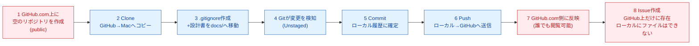
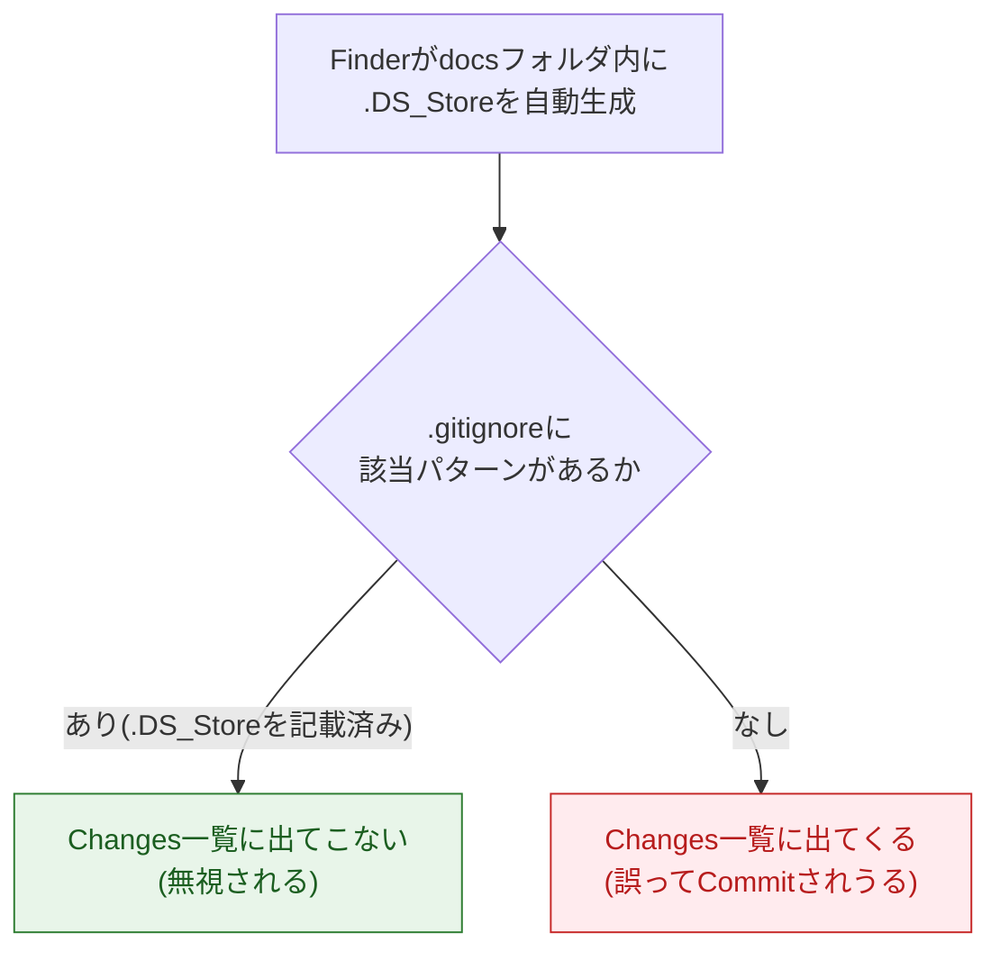

# レッスン：設計書一式をGitHubリポジトリとして公開する

> 📌 **これは `00_教育設計書.md` 5.2「7STEP 学習方式」のドライランであり、教材制作フォーマットの実証第1号である。** 実際に手を動かして詰まった箇所は、この文書の ⚠ マークと突き合わせて精度を検証する。

## メタ情報

| 項目 | 内容 |
|---|---|
| レッスンID | LESSON-00-SETUP（LEVEL 2 相当・実タスク版） |
| タイトル | 設計書一式を GitHub リポジトリとして公開する |
| 対象LEVEL相当 | LEVEL 2「GitとGitHubの第一歩」（Mission 2-2〜2-8 相当を1本の実タスクに統合） |
| 想定所要時間 | 60〜75分（7 STEP合計。内訳は各STEP見出しに記載） |
| 形式 | フル形式（7STEPをすべて展開） |

**このレッスンで扱う用語**：Repository / Local Repository・Remote Repository / Clone / Commit / Commit message / Push / `.gitignore` / public・private / Issue（計9語）

> ⚠ **形式上の注記**：00 5.2 は「1 Mission・新出用語は最大3語」を基準としている。本レッスンは Mission 2-2〜2-8 相当（本来なら7 Mission に分かれる分量）を「実際に使う最初のリポジトリを1回で作る」という実タスクの都合で1本に統合しているため、用語数が基準を超えている。この超過は意図的なものであり、後述の完了報告でフォーマット側への課題として報告する。

**前提条件（学習者が既に持っているもの）**

- Mac を使用している
- GitHub アカウントを作成済み
- GitHub Desktop をインストール済み
- GitHub 上で簡単なテスト操作をした経験がある（Repository を触ったことがある程度）
- Git / GitHub の概念は体系立てて理解していない
- AI にコードを書かせることに抵抗はない
- 設計書10ファイル（`README.md`、`00`〜`07`、`revision/change_orders.md`、`revision/totals.md`）を Mac の「ダウンロード」フォルダに保存済み

**完了条件（チェックリスト）**

- [ ] GitHub 上に `ai-developer-training` リポジトリが **public** で存在する
- [ ] GitHub Desktop でローカルに Clone 済みである
- [ ] `.gitignore` が存在し、秘密情報のパターンが書かれている
- [ ] `docs/` フォルダに設計書8冊、`docs/revision/` に2ファイルが入っている
- [ ] リポジトリ直下に調整済みの `README.md` がある
- [ ] 意味のある Commit message で Commit している（2件以上）
- [ ] Push 済みで、GitHub.com 上でファイルと Commit 履歴を確認できる
- [ ] Issue が最低1件作成されている

---

## STEP 0：前回の想起（3分）

> 「前回」はまだ存在しません。ただし、あなたはすでに準備を済ませています。**教材を見ずに答えてください。**
>
> Q1. GitHub Desktop は、GitHub.com 上の何を、あなたの Mac の何に対して操作するツールでしたか？
> Q2. あなたが作ろうとしているリポジトリの中身は、今どこにありますか（GitHub上？あなたのPCの中？）？

<details><summary>答えを見る</summary>

A1. GitHub.com 上の Repository（リモート）と、あなたの Mac の中のフォルダ（ローカル）の間を、Clone・Commit・Push で橋渡しするツールです。
A2. **今はまだどこにもありません。** 設計書10ファイルは Mac の「ダウンロード」フォルダに、ただのファイルとして置かれているだけです。これから STEP 2 で、この2つの箱（ローカルとリモート）を両方作り、ファイルをその中に移していきます。
</details>

---

## STEP 1：今日覚えること（8分）

新しい言葉は本来3語までが基準ですが、今日は実際に手を動かす都合上9語を扱います。**すべて覚える必要はありません。作業中に該当箇所へ戻って読み返してください。**

#### ① Repository（リポジトリ）

| 観点 | 説明 |
|---|---|
| 正式な意味 | プロジェクトのファイル一式と、その変更履歴をまとめて管理する単位 |
| 初学者向け説明 | 1つのプロジェクト専用の「箱」 |
| 現実世界での例え | 案件ごとのファイルキャビネット |
| 実際の開発で何に使うか | 1プロジェクト1リポジトリが基本。今日は `ai-developer-training` という箱を新しく作る |

#### ② Local Repository / Remote Repository（ローカル・リモート）

| 観点 | Local（ローカル） | Remote（リモート） |
|---|---|---|
| 正式な意味 | あなたのMac上に存在するRepositoryの実体 | GitHub.com上に存在するRepositoryの実体 |
| 初学者向け説明 | 手元にある箱 | インターネット上にある箱 |
| 現実世界での例え | 手元のノート | 提出済みの報告書 |
| 実際の開発で何に使うか | ここで編集・Commitする | ここに Push して初めて他人に見える |

> ⚠ **最頻の混乱**：ローカルとリモートは**別々の箱**です。片方を変えても、もう片方は自動では変わりません。この区別を見失うと、以降ずっと「なぜ反映されないのか」で詰まります。

#### ③ Clone（クローン）

| 観点 | 説明 |
|---|---|
| 正式な意味 | Remote Repository の中身と変更履歴の全部を、Local Repository としてコピーする操作 |
| 初学者向け説明 | GitHub上の箱を、丸ごと自分のPCにコピーすること |
| 現実世界での例え | 会社のキャビネットの中身を、まるごと自分のノートに複写する |
| 実際の開発で何に使うか | 今日、GitHub上に作った空のリポジトリを Mac に持ってくるために使う |

#### ④ Commit（コミット）

| 観点 | 説明 |
|---|---|
| 正式な意味 | 変更内容のスナップショットに、作成者・日時・メッセージを付けて、Local Repository の履歴に追加する操作 |
| 初学者向け説明 | 「ここまでの変更を1つの記録として確定する」操作 |
| 現実世界での例え | 作業日誌に1行書いて印を押すこと |
| 実際の開発で何に使うか | 戻れる地点を作る。AIにファイルを触らせる前に必ずCommitしておけば、何が起きても戻せる |

#### ⑤ Commit message（コミットメッセージ）

| 観点 | 説明 |
|---|---|
| 正式な意味 | Commitに付随する、変更内容を要約したメタデータ |
| 初学者向け説明 | その Commit で「何をしたか」を書く短い説明文 |
| 現実世界での例え | 日誌の1行。「8/14 設計書一式を追加」のような記録 |
| 実際の開発で何に使うか | 半年後の自分と、AIが読む。「更新」だけでは何が起きたか誰にも分からない |

#### ⑥ Push（プッシュ）

| 観点 | 説明 |
|---|---|
| 正式な意味 | Local Repository に確定した Commit 履歴を、Remote Repository に送信する操作 |
| 初学者向け説明 | ローカルの記録をGitHubに送る操作 |
| 現実世界での例え | 手元のノートをコピーして共有サーバに置く |
| 実際の開発で何に使うか | Pushしない限りGitHub側には何も反映されない |

#### ⑦ `.gitignore`

| 観点 | 説明 |
|---|---|
| 正式な意味 | Git に対して「このパターンに一致するファイルは追跡しない」と指定する設定ファイル |
| 初学者向け説明 | 「これは記録しないで」とGitに伝えるファイル |
| 現実世界での例え | シュレッダー行きの箱に貼る「持ち出し禁止」の札 |
| 実際の開発で何に使うか | 秘密情報や自動生成ファイルの流出・混入を防ぐ最初の防壁 |

#### ⑧ public / private

| 観点 | public | private |
|---|---|---|
| 正式な意味 | インターネット上の誰でも閲覧できる可視性設定 | 招待されたアカウントのみ閲覧できる可視性設定 |
| 初学者向け説明 | 世界に公開する箱 | 自分（と招待した人）だけの箱 |
| 現実世界での例え | 店頭に並べた書類棚 | 鍵付きの個人ロッカー |
| 実際の開発で何に使うか | 成果物として見せたいものは public。個人の学習ログや秘密情報を含むものは private |

#### ⑨ Issue（イシュー）

| 観点 | 説明 |
|---|---|
| 正式な意味 | Repository に紐づく「やるべきこと」を1件ずつ記録するGitHub上のオブジェクト |
| 初学者向け説明 | やることリストの1項目を、GitHub上で管理できるようにしたもの |
| 現実世界での例え | 付箋にタスクを1つ書いて、みんなが見えるボードに貼る |
| 実際の開発で何に使うか | 「次にやること」を言葉にして残す。将来AIに作業を依頼するときも同じ形式を使う |

💡 **今は覚えなくてよいこと**：`git add` や `git commit` の内部動作、SHA-1ハッシュ、Issue Template や Labels の細かい設定。これらはLEVEL 3・4以降で扱います。

---

## STEP 2：実際にやる（30〜35分）

### 2-1. GitHub.com でリポジトリを作成する（5分）

1. ブラウザで `github.com` を開き、右上の **「+」アイコン → 「New repository」** をクリックしてください。
2. 「Repository name」欄に `ai-developer-training` と入力してください。
3. 「Public」「Private」のラジオボタンから **「Public」** を選んでください。
4. 「Add a README file」のチェックボックスは **チェックしないまま**にしてください（空のリポジトリにします）。
5. 緑色の **「Create repository」** ボタンを押してください。

> ⚠ **つまずきポイント**：「Add a README file」にチェックを入れて作成すると、Clone後にローカルとリモートの履歴がずれ、後で「rejected（non-fast-forward）」というエラーに遭遇しやすくなります。今回はチェックを外したまま進めてください。

### 2-2. GitHub Desktop でローカルに Clone する（5分）

1. GitHub Desktop を開いてください。サインインを求められたら、GitHub アカウントでサインインしてください。
2. メニューバーの **「File」→「Clone repository...」**（またはショートカット `Cmd+Shift+O`）を選んでください。
3. 開いたウィンドウの「GitHub.com」タブに `ai-developer-training` が表示されるので、選択してください。
4. 「Local Path」欄は初期値のままで構いません。変更したい場合のみ「Choose...」ボタンで保存先フォルダを選んでください。
5. 青色の **「Clone」** ボタンを押してください。

> ⚠ **つまずきポイント：Clone先フォルダが分からなくなる。** 初期値は `~/Documents/GitHub/ai-developer-training` です。後で場所を確認したいときは、GitHub Desktop の **「Repository」メニュー → 「Show in Finder」** を使うと迷いません。この手順自体を覚えておくと以降ずっと役立ちます。

### 2-3. `.gitignore` を作る（5分）

**Finder では作りません。** Mac の Finder は `.` から始まる名前のファイルを作ろうとすると「システム用の名前です」という警告が出て混乱しやすく、たとえ作れても標準設定では画面から見えなくなります（隠しファイル扱い）。**VS Code で作ります。**

1. GitHub Desktop で、右上あたりにある **「Open in Visual Studio Code」**（Repositoryメニューからも同じ操作ができます）を押してください。VS Code が `ai-developer-training` フォルダを開いた状態で起動します。
2. VS Code 左側の「エクスプローラー」パネルの空白部分で右クリックし、**「New File...」** を選んでください。
3. ファイル名として `.gitignore` と入力し、Enter を押してください（先頭の `.` はそのまま入力できます）。
4. 開いたファイルに、次の内容を貼り付けてください。

```gitignore
# 秘密情報（存在する前から書く。05 セキュリティ設計書 6.3）
.env
.env.local
.env.*.local
*.pem
*.key

# OS が作るもの（Macで自動生成される）
.DS_Store
Thumbs.db

# エディタ
.vscode/
.idea/
```

5. `Cmd+S` で保存してください。

> ⚠ **つまずきポイント：保存したのにFinderで見当たらない。** これは正常です。Macの標準設定ではFinderは `.` から始まるファイルを表示しません。ファイルが本当に存在するかは **VS Codeのエクスプローラーで見える** ことで確認してください（Finderの表示設定は変えなくて構いません。`Cmd+Shift+.` で一時的に表示を切り替えられますが、必須ではありません）。

> ⚠ **つまずきポイント：`node_modules/` や `dist/` を今すぐ書きたくなる。** まだ npm を使っていないので不要です。必要になった段階（LEVEL 9相当）で追記します。「存在しないものを先に書かない」が原則ですが、秘密情報の3行だけは例外で最初に書きます。1回でもCommitしてしまうと漏洩が確定してしまうためです。

### 2-4. 設計書10ファイルを配置する（10分）

**ここは「書く」作業ではなく「移動させる」作業です。** ファイルはすでにダウンロード済みなので、新しく文章を作る必要はありません。

1. Finderで `ai-developer-training` フォルダを開いてください（GitHub Desktopの **「Repository」→「Show in Finder」** から開けます）。
2. フォルダの中で右クリックし、**「新規フォルダ」** を選び、名前を `docs`（すべて小文字）にしてください。
3. `docs` フォルダの中でさらに新規フォルダを作り、名前を `revision` にしてください。
4. 別のFinderウィンドウで「ダウンロード」フォルダを開いてください。
5. `00_教育設計書.md` から `07_調査資料_外部サービス仕様2026-08.md` までの8ファイルを選択し、`docs` フォルダへドラッグ＆ドロップしてください。
6. `change_orders.md` と `totals.md` の2ファイルを、`docs/revision` フォルダへドラッグ＆ドロップしてください。
7. 残った `README.md` は、`docs` に**入れず**、`ai-developer-training` フォルダの直下（`.gitignore` と同じ階層）に置いてください。

> ⚠ **つまずきポイント：フォルダ名の大文字小文字。** Macのファイルシステムは既定では大文字小文字を区別しませんが、GitHub（Linuxサーバ上）は区別します。ローカルで `Docs` と `docs` を両方作ってしまっても Mac 上では見分けが付かず、Push後にGitHub側で意図しない名前になって混乱します。**フォルダ名は今回すべて小文字**で統一してください。

> ⚠ **つまずきポイント：README.mdの置き場所を間違える。** `docs/README.md` にしてしまうと、GitHubのリポジトリのトップページに何も表示されなくなります。GitHubはリポジトリ直下の `README.md` をトップページとして自動表示する仕様のため、**直下に置くこと自体が「実際にやる」の一部**です。

### 2-5. README.md を調整する（5分）

1. VS Codeで `README.md` を開いてください。
2. 中身は「ダウンロード」フォルダにあったものと同じ索引形式（00〜07・revisionの説明）をそのまま使って構いません。
3. ただし、ファイルへのリンクをすべて `docs/00_教育設計書.md` のように **`docs/` を先頭に付けた相対パス**へ書き換えてください（実体を `docs/` に移したため）。
4. 保存してください（`Cmd+S`）。

### 2-6. Commit する（4分）

1. GitHub Desktopに戻ってください。左側の「Changes」に、追加した全ファイルが一覧表示されているはずです。
2. 左下の「Summary」欄に次を入力してください。

```
設計書一式をdocsに追加し、READMEをトップページ用に調整
```

3. その下の「Description」欄に次を入力してください。

```
00〜07の設計書8冊とrevision（change_orders / totals）をdocs/に配置。
リポジトリ直下のREADMEはトップページとして機能するよう、
docs/へのリンクを相対パスに調整した。
```

4. 青色の **「Commit to main」** ボタンを押してください。

> ⚠ **つまずきポイント：Changesに `.DS_Store` が混じっている。** Finderでフォルダを開くと自動的に `.DS_Store` が作られます。`.gitignore` に書いた通りなら一覧には出てこないはずです。もし出てきた場合は、`.gitignore` の保存場所（リポジトリ直下か）を確認してください。

### 2-7. Push する（2分）

1. 画面上部の **「Push origin」** ボタン（上向き矢印のアイコン）を押してください。
2. サインイン用のポップアップが出た場合は、GitHubアカウントで許可してください。

> ⚠ **つまずきポイント：Pushボタンが「Fetch origin」のままに見える。** Commitが完了していないとPushボタンは現れません。「Commit to main」を押し終えたか、左側のChangesが空になっているかを確認してください。

### 2-8. GitHub上で確認する（2分）

1. ブラウザで `ai-developer-training` のページを開き、再読み込みしてください。
2. `README.md` の内容がトップページに表示されていること、`docs/` フォルダが存在することを確認してください。
3. 画面上部の **「commits」** のリンク（またはCommitメッセージへのリンク）から、Commit履歴と差分を1件確認してください。

### 2-9. 最初のIssueを作る（3分）

1. リポジトリページ上部の **「Issues」タブ**を開いてください。
2. 緑色の **「New issue」** ボタンを押してください。
3. タイトルに次を入力してください。

```
MVP-0: Seed App v0.1 を作る
```

4. 本文に、STEP 5で扱う8項目テンプレートの簡易版として次を書いてください。

```
【目的】学習者が最初のMissionから触れる、依存ゼロ・ビルド不要の配布アプリの土台を作る
【現状】設計書一式（00〜07・revision）はGitHubに公開済み。アプリの実体はまだない
【期待する結果】docs/の設計に沿った、100行未満のindex.htmlを含むSeed Appの雛形
【制約】npmやビルドツールに依存しない（LEVEL 0〜1の実行環境を壊さない）
【完了条件】Seed Appをclone後、Finderでダブルクリックせずローカルサーバ経由で開ける状態
```

5. 緑色の **「Submit new issue」**（環境によっては「Create」）ボタンを押してください。

> ⚠ **つまずきポイント：GitHub Pagesの設定をここでやりたくなる。** 今回は行いません。理由はSTEP 3のあとの「なぜ？」ブロックで説明します。

---

## STEP 3：何が起きたか確認（5分）

**今、ローカルとリモートの間で何が起きたのか。**



**確認しておくべきことが2つあります。**

1. **STEP 2-6でCommitした時点では、GitHub上にはまだ何も届いていません。** STEP 2-7のPushで初めて届きます。GitHubのページをCommit直後に開いても、変更は見えないはずです。
2. **Issueは、他の8つのステップと違ってローカルには一切ファイルを作りません。** `docs/` の中にも見当たりません。Issueは最初からGitHub（リモート）だけに存在するデータです。

`.gitignore` がどう働いているかも図で確認します。



---

> ### 🔍 なぜ？：このリポジトリは public にするのか
>
> **ひとことで**：この設計書一式は「見せるための成果物」だからです。
>
> **もう少し詳しく**：本来のLEVEL 2カリキュラム（01設計書）では、学習リポジトリは既定で **private** にすると定めています。個人の学習ログや、まだ整理されていない試行錯誤を最初から世界に晒す必要はないからです。しかし今回のリポジトリは学習ログではなく、「設計書一式を格納・公開する」という実タスクの成果物そのものです。誰かに見せられる状態であることが目的なので public にします。
>
> **設計思想まで**：public/privateの選択は「デフォルト」で決めるものではなく、**そのリポジトリの目的に応じて毎回判断するもの**です。学習ログ・秘密情報を含む可能性のあるものはprivateが既定、成果物として公開する意図があるものはpublicが妥当、という判断軸を持つことが、この用語カードの「実際の開発で何に使うか」の実践です。
>
> **では、いつpublicにしてはいけないか？** `.env` のような秘密情報や、他人の個人情報を含むファイルが1つでも入っている可能性があるときです。今回`.gitignore`をSTEP 2-3で最初に作ったのは、このpublicという判断を安全に成立させるための前提条件でした。

> ### 🔍 なぜ：`.gitignore` を一番最初（ファイルを1つも置く前）に作るのか
>
> Commitは「削除」ではなく「追記」であり、Gitの履歴に一度記録された内容は、Push後は取り消しても痕跡が残ります。つまり **1回でもCommit→Pushしてしまった秘密情報は、`.gitignore`を後から書いても遅い**のです。だから今回は、設計書ファイルを1つも置く前に`.gitignore`を用意しました。この順番自体が05セキュリティ設計書6.3の「予防の習慣が体系的学習より先に来る」という設計判断の実践です。

> ### 🔍 なぜ：Commit messageを「更新」ではなく具体的に書くのか
>
> 半年後の自分と、将来AIに作業を依頼したときのAIが、この記録を読みます。「更新」とだけ書かれたCommitが何十件も並ぶと、どれがどの変更かをもう一度中身を開いて確認するしかなくなります。**Commit messageは、差分を開かずに内容が分かるための索引**です。今日は2件のCommitで練習しましたが、この習慣は最終LEVELまでずっと続きます。

> ### 🔍 なぜ：GitHub Pagesの設定を今回は行わないのか
>
> GitHub Pagesは「リポジトリの中身をそのままWebサイトとして公開する機能」です。しかし今このリポジトリの中身は設計書という**文書**であり、公開して見せるべき**動くアプリ**がまだ存在しません。空のアプリをPages化しても成功体験にはなりません。アプリが実在するタイミング（本来のLEVEL 2 Mission 2-8相当）まで、この機能は取っておきます。**機能は、それが意味を持つ場面と同時に導入する**という00教育設計書の設計判断（4.2のlocalhost/Portの扱いと同じ考え方）です。

---

## STEP 4：ミッション（8分）

**あなた自身でやってください。ヒントは最初に見ないでください。**

> 🎯 **今回のミッション**
>
> `docs/glossary.md` という新しいファイルを作り、今日学んだ用語のうち **2つだけ**（例：`.gitignore` と `Issue`）を、**教材の説明を丸写しせず、自分の言葉で**1〜2文ずつ書いてください。書けたら、**それだけを**1つのCommitにしてください。
>
> 条件：
> - Commit messageは「何をしたか」が1文で分かるものにすること
> - このCommitに `README.md` や `docs/` 内の他ファイルの変更を含めないこと

<details><summary>💡 ヒント1：方向（どこを見るか）</summary>

VS Codeで `docs` フォルダを右クリックし、新しいファイルを作る操作を思い出してください。STEP 2-3で `.gitignore` を作ったのと同じ操作です。
</details>

<details><summary>💡 ヒント2：手順（何をするか）</summary>

1. `docs/glossary.md` を作成し、`.gitignore` と `Issue` について自分の言葉で書いて保存する
2. GitHub Desktopで、左側に `docs/glossary.md` **だけ**が表示されていることを確認する
3. Summaryに「用語を自分の言葉でまとめたglossaryを追加」のような文を入力する
4. 「Commit to main」を押し、続けて「Push origin」まで行う
</details>

<details><summary>💡 ヒント3：答え（完全な手順）</summary>

```markdown
# 用語メモ（自分の言葉で）

## .gitignore
Gitに「これは記録に入れないで」と教えるためのリストファイル。
うっかりパスワードや自動生成ファイルをアップロードしないための、最初の防波堤。

## Issue
「次にやること」をGitHub上に1件ずつ書いておく仕組み。
自分用のメモというより、他人（将来のAIも含む）に渡せる形の依頼書。
```

Commit message例：`用語を自分の言葉でまとめたglossaryを追加`
</details>

---

## STEP 5：AIサポート（5分）

**まず、あなた自身の考えを書いてください。**（この欄が空だと送信できません）

> **Q. `.gitignore` に `.DS_Store` を書いたのに、GitHub DesktopのChangesに `.DS_Store` が出てきました。あなたの予想を1文で書いてください。**
>
> [　　　　　　　　　　　　　　　　　　　　　　　　　　]

書けたら、AIに聞いてみましょう。

#### ❌ 悪い質問

> .gitignoreが効きません。助けてください。

状況も再現手順もエラーの中身も分かりません。AIは一般論しか返せません。

#### ✅ 良い質問（8項目テンプレート適用）

```
【目的】.DS_Storeがリポジトリに混入しないようにしたい
【現在の状態】.gitignoreに .DS_Store と書いてCommit済み。しかしGitHub DesktopのChanges
　　　　　　　一覧に docs/.DS_Store が Untracked として表示されている
【環境】macOS / GitHub Desktop / VS Codeで.gitignoreを作成
【再現手順】.gitignore作成→Commit→その後Finderでdocsフォルダを開いた→Changesを確認
【エラー全文】エラーメッセージは出ていない。Changes一覧に予期しないファイルが出ている
【自分の仮説】.gitignoreを作った時点でdocs内にはまだ.DS_Storeが無く、後から作られた
　　　　　　　ファイルには効いていないのではないかと思う
【制約】.gitignoreの中身は増やしてよいが、すでにCommitした設計書ファイルは変更しない
【完了条件】docs/.DS_Storeがtrackedにならず、Changesに出てこなくなること
```

> 💡 **なぜ仮説を書かせるのか？**
> 仮説を立ててから答え合わせをすると、「合っていた／違っていた」という差分が記憶に残ります。仮説なしに正解だけ読むと分かった気になりますが翌日には残りません。この手順は本カリキュラム全体を通じて必須です。

---

## STEP 6：理解チェック（5分）

暗記ではなく「なぜそうするのか」を確認します。

**Q1.** `.gitignore` を、設計書ファイルを1つも置く前に作りました。もしこれを最後に作っていたら、何が問題になる可能性がありましたか？

<details><summary>解答</summary>
その間にうっかり秘密情報や `.DS_Store` を含む状態でCommit・Pushしてしまう可能性があります。一度Push（リモートに反映）した記録は、後から`.gitignore`を直しても、すでに公開された履歴自体は簡単には消えません。「予防は後からでは間に合わない」ため、順番として最初に置きます。
</details>

**Q2.** このリポジトリは public にしました。もし `.env` の中身をうっかり `docs/` に入れてCommit・Pushしていたら、private の場合と比べて何が違いましたか？

<details><summary>解答</summary>
privateなら閲覧できるのは自分（と招待した人）だけですが、publicでは世界中の誰でも閲覧・検索でき、漏洩の被害が即座に確定します。public/privateの選択は「見せたいかどうか」だけでなく「事故が起きたときの被害範囲」も左右する判断です。だからこそ`.gitignore`を先に用意してから public にしています。
</details>

**Q3.** Commitした直後にGitHub.comのページを開いても、ファイルは増えていませんでした。これは不具合ですか？

<details><summary>解答</summary>
不具合ではありません。Commitはローカルリポジトリの履歴に記録する操作であり、GitHub（リモート）へ送る操作はPushという別の操作だからです。この2つが分かれているおかげで、インターネットに繋がっていなくても作業を記録できます。
</details>

**Q4.** 最初のIssueを、まだアプリが1行も無い今の段階で作りました。「思いついたときに作ればいい」ではなく、今作った意味は何ですか？

<details><summary>解答</summary>
制作の過程で気づいたやるべきことを、その場でIssueとして記録しておくと、それがそのまま将来の「学習バックログ」の初期値になります（01設計書 CO-30）。後回しにすると、思いついたこと自体を忘れます。また、Issueに書いた5要素（目的・現状・期待する結果・制約・完了条件）は、STEP 5のAIへの質問テンプレートと同じ構造であり、今のうちに「要求を言葉にする」練習をしておくことが、後でAIやAgentに仕事を渡す力に直結します。
</details>

---

## STEP 7：GitHubへ記録（4分）

今日の成果を成長ログに記録します。`docs/log/` のようなフォルダをまだ作っていない場合は新規に作成し、次のファイルを追加してください：`docs/log/2026-08-14.md`

```markdown
## 2026-08-14  LESSON-00-SETUP（LEVEL 2相当）

### 1. やったこと（事実）
GitHub上にai-developer-trainingをpublicで作成し、GitHub DesktopでClone。
.gitignoreを作成後、設計書10ファイルをdocs/へ配置し、READMEを直下に調整。
Commit→Pushを2回実施し、GitHub上で確認。最初のIssueを1件作成した。

### 2. 理解したこと（自分の言葉で）
CommitはPCの中だけの記録で、Pushして初めてGitHubに届く。
.gitignoreは、記録に入れる前に「入れないもの」を先に決めておく仕組み。
Issueはローカルには存在せず、GitHub上だけのデータである。

### 3. まだ分かっていないこと ★最重要
Commitをどのくらいの単位で分けるのが適切か、感覚としてまだ掴めていない。

### 4. 詰まった箇所と、詰まっていた時間
.gitignoreを作った直後、Finderで見つからず一瞬「消えた」と思った（2分）。

### 5. 発生したエラー
なし。

### 6. AIに何と質問したか
「.gitignoreが効いていないように見える」（8項目テンプレート使用）

### 7. AIの回答は正しかったか
○ 妥当だった。.gitignoreはCommit済みのファイルには遡って効かないことを知った。

### 8. 明日の自分への申し送り
次はLEVEL 2の続き（Branch・Merge・Conflictの体験）に進む。
Issueに書いたSeed App v0.1の作成も並行して着手する。
```

この成長ログをCommitしてください（Commit messageの練習も兼ねます）。

```
Commit message例: 2026-08-14の成長ログを追加
```

Push後、GitHub上でリポジトリ・Commit履歴・Issueの3つが揃っていることを確認してレッスンを終えます。

---

### 🎉 レッスン完了

**できるようになったこと**：設計書一式を、GitHub上に public なリポジトリとして公開できた。ローカルとリモートの違いを体で覚え、最初のIssueを立てた。

**次に開くファイル**：`docs/00_教育設計書.md`（次のレッスンで参照する `.gitignore` 拡張・Branch操作の前提として、5.2をもう一度読み返す）
