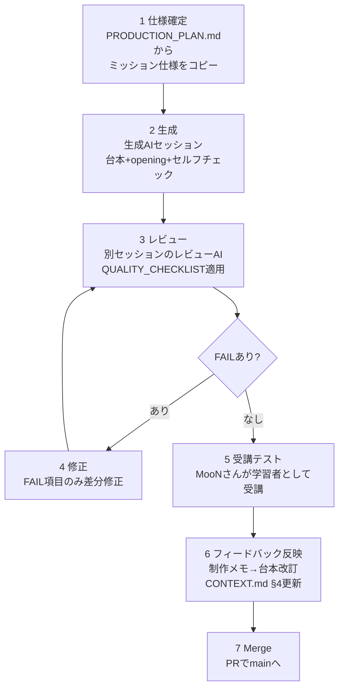

# PRODUCTION_GUIDE.md ― レッスン教材 制作ガイド（パイプライン運用手順書）

> **このファイルは何か**：AI開発者向けトレーニングのレッスン教材を、**AIで量産し、人間が受講テストして直す**ための運用手順書です。設計書 06 第7章の **A-3「教材コンテンツ制作ガイド」** に相当します。
> **誰がいつ使うか**：
> - **MooNさん（開発者兼最初の受講者）**が、新しいレッスンを作るとき／受講セッションを始めるとき。
> - **生成AI**が、ミッション仕様を受け取って台本を書き起こすとき（§1）。
> - **レビューAI**が、生成物を採点するとき（§3、判定基準は `QUALITY_CHECKLIST.md`）。
> **前提**：提供形態 v1 は「Claude（AIが先生）＋ GitHubリポジトリ」方式。Webアプリ化は後回し。教材の実体は Markdown で、進行AIがそれを読んで対話進行する。

---

## 目次

- §0. この設計で確定させた3つの方針（背景と理由）
- §1. 1レッスンを生成するAIへの指示の書き方
- §2. ファイル命名・配置規約
- §3. 生成 → レビュー → 修正 → 受講テスト → フィードバック反映のループ
- §4. 受講セッションの始め方（MooNさんの運用手順）
- §5. 比喩レジストリ（世界観の一貫性を保つ仕組み）
- §6. この設計で決めた運用上の判断と、その理由

---

# §0. この設計で確定させた3つの方針

## 0-1. ファイル配置：`content/` を**同一リポジトリ内**に今から導入する

設計書 04 5.2.1 の正典は `content/level{NN}/mission-{NN}-{N}.md`。一方 CO-10 は `content/` を別リポジトリ（`ai-developer-training-content`）に分離せよと定めている。

**判断：`content/` 構造は今から導入する。ただし v1 では別リポジトリにせず、`ai-developer-training` 内に置く。**

理由：
1. **CO-10 が別リポジトリ化を求めた目的は「教材更新のたびに学習者の作業が Conflict で止まること」の回避**（06 OD-10）だった。v1 では教材の作者と学習者が同一人物（MooNさん）で、同一リポジトリしか存在しない。分離しても防ぐべき Conflict が発生しない。
2. CO-10 の**副次的な帰結**（Mission 3-5 の Conflict 演習を学習者リポジトリ内で完結させる）は、**既に 01 側で反映済み**であり、リポジトリを分けなくても成立する。
3. 分離すると `scripts/sync-content.sh` の実装・運用が今すぐ必要になる。Seed App すら未着手（Issue #1）の段階で、教材配布インフラを先に作るのは順序が逆。
4. **移行コストは低いまま維持できる。** `content/` はサブツリーとして自己完結しているので、2人目の受講者が現れた時点で `git subtree split` 一発で別リポジトリへ切り出せる。ディレクトリ構造とファイル名を設計書どおりにしておくことが、その移行を保証する。

**既存の `docs/lessons/lesson_00_setup.md` は移動も削除もしない。** Day1の実施記録として履歴的価値があるため、そのまま残し、新規レッスンは `content/` 配下にのみ置く。

## 0-2. 独自ブロック記法：v1 は「素直なMarkdown」＋固定文字列

`:::why` `:::hint` `:::warn`（02 F-02）は**構文が未確定のまま**（02 V-01／CO 要判断リスト）。

**判断：v1 では `:::` を使わず、見出し文字列を厳密に固定した blockquote と `<details>` を使う。** 詳細な対応表は `TEMPLATE_lesson.md` §1。

理由：
1. GitHub の Markdown レンダラは `:::` を解釈しない。v1 の読み手は「Claude」と「GitHub の Web 表示」であり、生の `:::` が学習者の画面に露出する。
2. `<details>` は GitHub でそのまま折りたたみとして機能する。3段階ヒントは **v1 の時点で意図どおりに動く**。
3. 見出し文字列（`> ### 🔍 なぜ？：` 等）を1文字も変えない規約にしてあるので、将来アプリを作るときに正規表現1本で `:::` へ一括変換できる。**未確定の構文を今決め打ちして教材を書き溜めるリスクを負わない。**
4. ブロック種別は 02 F-02 の指示どおり **3種類（why / hint / warn）で打ち止め**。Day2で有効だった「📢 予告」は warn のサブタイプとして扱い、種別を増やさない。

## 0-3. opening.md 分離：Day2 の実績どおり標準化する

抽出レポートの指摘どおり、「opening.md」は設計書の正式な語彙ではない。**しかし Day2 の実運用で機能した。**

**判断：台本1本につき opening 1本を必ず作る。** 根拠と禁止事項は `TEMPLATE_opening.md` に記載。

理由：内部台本には模範解答が書いてあるため学習者に渡せない／進行AIが「小出しにする」判断で揺らぐのを構造的に防げる／中断からの復帰点になる。設計書に無い概念だが、設計書 02 F-02 の「1画面 = 1STEP。一望させると圧倒される」という原則の、v1（アプリ無し）における実装形態と位置づけられる。

---

# §1. 1レッスンを生成するAIへの指示の書き方

## 1-1. 入力：ミッション仕様

生成AIに渡すのは、**このYAML様式のミッション仕様1件**と、**読ませるファイルのリスト**だけ。仕様は `PRODUCTION_PLAN.md` にレッスンごとに完成した形で用意してあるので、そこからコピーして使う。

```yaml
# ミッション仕様（生成AIへの入力）
lesson_id: MISSION-03-6
mission_no: "3-6"
mission_name: "⚠ AIに壊させてrevertで戻す"
level: 3
level_name: "変更履歴を操る"
codename: "TIME MACHINE"
format: full            # full | compact | boss
duration_min: 30        # 15 | 20 | 25 | 30
xp: 120                 # duration_min * 4
skills: ["GH", "AI"]
marks: ["⚠"]            # 🛡 🤝 🧩 ⚠ 💰 🔍 から該当するもの

goal: |
  AIに教材アプリを全面的に作り直させて意図的に壊し、revertで元に戻す。
  「AIに大胆な変更をさせても戻せる」という確信を、体験として持たせる。

prerequisites: |
  Mission 3-5 完了（Conflictを自力で解決した）。Branch/Merge/PRの一周ができる。

new_terms: ["revert", "HEAD", "Restore"]   # 最大3語

deliverables:
  - "AIに壊された状態からのrevert Commit（このLEVELで最重要の成果物）"
  - "notes/log/YYYY-MM-DD.md への記録"

forecast_required: |
  「今日は途中でわざと壊します。これは予定された演習で、必ず戻せます」を
  openingと、壊す操作の直前の2箇所で宣言する。

must_include:
  - "AIが `git reset --hard` を提案してきたときの3手順（実行しない／revertでできないか聞き返す／人間に相談）"
  - "revert＝訂正印（履歴が残る）／reset＝消しゴム（履歴が消える）の対比"
  - "revertは『取り消した』という記録を新たに1つ積む操作なので、取り消し自体を取り消せること"

must_not_include:
  - "resetの使い方（CO-18）"
  - "rebase"
  - "file://・ダブルクリックでの起動（CO-01）"

past_stumbles_to_reference: [1, 2]   # docs/CONTEXT.md §4 の番号

metaphors:
  revert: "訂正印を押して差し戻す（元の記録は残る）"
  HEAD: "現在地のピン"

why_deep_dive: |
  なぜこの教材は reset を教えないのか（設計思想まで3〜5段落を書く1箇所はここ）

next_mission: "3-7 同じ操作をCLIで再現する"
```

## 1-2. 生成AIへのプロンプト（この文面をそのまま使う）

````
あなたはAI開発者向けトレーニングスクールの教材制作AIです。
プログラミング初学者1名を対象とした、AI先生（Claude）が対話進行するためのレッスン台本を1本作ります。

## まず読むファイル（この順で全文読む）
1. /path/to/pipeline/TEMPLATE_lesson.md   … 出力の雛形と記入指示。記法規約はここが正典
2. /path/to/pipeline/TEMPLATE_opening.md  … openingの雛形
3. /path/to/pipeline/QUALITY_CHECKLIST.md … 提出前に自分で全項目を通すこと
4. /path/to/pipeline/PRODUCTION_GUIDE.md §5 … 比喩レジストリ。ここに無い比喩を発明しない
5. リポジトリ docs/CONTEXT.md            … 学習者プロフィールと過去のつまずき（全文）
6. リポジトリ docs/01_カリキュラム設計書.md の LEVEL {N} 節と 第3章 の Mission 表
7. reference/day2_lesson_plan.md         … 品質のゴールドスタンダード。粒度・トーン・配慮レベルはこれに合わせる

## ミッション仕様
{ここに §1-1 のYAMLを貼る}

## 出力
2ファイルを出力する。ファイルごとにコードブロックで区切り、先頭にファイルパスを書く。
1. content/level{NN}/mission-{NN}-{N}.md   … 内部台本（TEMPLATE_lesson.md の「テンプレート本体」に従う）
2. content/level{NN}/opening-{NN}-{N}.md   … オープニング（TEMPLATE_opening.md に従う）

## 厳守事項
- 記入指示コメント（<!-- 記入指示: ... -->）を出力に1つも残さない
- プレースホルダ {{...}} を残さない（openingの {{学習者名}} だけは残す）
- 学習者の固有名詞（名前・GitHubユーザー名）を台本に直書きしない。docs/CONTEXT.md を参照させる
- ボタン名：GitHub Desktopは英語表記（初出時に括弧で日本語訳）、github.comは日本語表記＋括弧で英語原名
- 抽象論を書かない。「今から○○を押してください」レベルまで具体的に書く
- 迷ったら reference/day2_lesson_plan.md の実例に寄せる

## 最後に必ずやること
QUALITY_CHECKLIST.md の A・B・C 全ブロックを自分の出力に適用し、
判定レポート（同ファイル末尾の書式）を3つめの出力として付ける。
FAILがある状態で提出しない。直してから提出する。
````

## 1-3. 出力の受け取り方

- 1回の生成で **1レッスン（台本＋opening＋セルフチェックレポート）** まで。まとめて5本書かせない（品質が落ち、Day2水準を割る）。
- 生成AIのセルフチェックレポートは**信用しすぎない**。§3 のレビュー工程で、別セッションのレビューAIに独立して採点させる。

---

# §2. ファイル命名・配置規約

## 2-1. リポジトリ内の配置

```
ai-developer-training/
├── README.md
├── .gitignore
├── content/                              📦 教材コンテンツ（学習者は編集しない）
│   ├── README.md                         進行AIの入口。読む順序を書く
│   ├── metaphors.md                      比喩レジストリ（§5。全LEVEL横断の正典）
│   ├── level03/
│   │   ├── mission-03-1.md               内部台本（AI先生用）
│   │   ├── opening-03-1.md               受講者に送る文面
│   │   ├── mission-03-2.md
│   │   ├── opening-03-2.md
│   │   ├── ...
│   │   ├── glossary-03.md                LEVEL単位の用語集（4欄形式・用語ID付き）
│   │   ├── quizbank-03.md                LEVEL共通の「なぜ型」問題バンク（8〜12問）
│   │   ├── notional-machine-03.md        LEVEL単位のMermaid図（圧縮形式で再掲用）
│   │   └── boss-01.md / opening-boss-01.md
│   ├── level04/ …（同構成）
│   └── sessions/
│       └── day-03.md                     1日分の進行表（今日やるMission IDの並び・時間配分・打ち切り基準）
├── docs/
│   ├── 00〜07 設計書（既存・触らない）
│   ├── CONTEXT.md                        学習者プロフィール・つまずき・教授方針（毎セッション更新）
│   ├── revision/                         既存
│   └── lessons/lesson_00_setup.md        Day1の記録。移動も削除もしない
├── notes/
│   ├── log/YYYY-MM-DD.md                 成長ログ（8項目）★正典をここに置く
│   ├── glossary.md                       学習者が自分の言葉で書く用語メモ
│   ├── level03-cli.md                    GUI↔CLI対応表（Mission 3-7の成果物）
│   └── level04-review.md                 AIと自分のレビュー比較（Mission 4-5の成果物）
├── errors/*.md                           エラー学習の記録
├── CHANGELOG.md                          教材アプリ v0.4 以降の変更履歴
└── .github/ISSUE_TEMPLATE/               Mission 4-2 の成果物
```

## 2-2. 命名規則

| 対象 | 規則 | 例 |
|---|---|---|
| 内部台本 | `content/level{NN}/mission-{NN}-{N}.md` | `content/level03/mission-03-6.md` |
| オープニング | `content/level{NN}/opening-{NN}-{N}.md` | `content/level03/opening-03-6.md` |
| Boss台本 | `content/level{NN}/boss-{NN}.md`（NN=Boss番号2桁） | `content/level03/boss-01.md` |
| LEVEL用語集 | `content/level{NN}/glossary-{NN}.md` | `content/level03/glossary-03.md` |
| 問題バンク | `content/level{NN}/quizbank-{NN}.md` | `content/level03/quizbank-03.md` |
| LEVEL図 | `content/level{NN}/notional-machine-{NN}.md` | `content/level03/notional-machine-03.md` |
| 日次進行表 | `content/sessions/day-{NN}.md` | `content/sessions/day-03.md` |
| 成長ログ | `notes/log/{YYYY-MM-DD}.md` | `notes/log/2026-08-17.md` |
| 用語ID | `{NN}-{N}-{英小文字スラッグ}` | `03-6-revert` |
| レッスンID | `MISSION-{NN}-{N}` / `BOSS-{NN}` | `MISSION-03-6` / `BOSS-01` |
| Branch名 | `feature/` `fix/` `docs/` ＋ 内容（Issue番号があれば `-{番号}`） | `docs/lesson-03-6` |

**LEVEL 0〜9 は必ずゼロ埋め2桁**（`level03`、`mission-03-6`）。ゼロ埋めしないと `level10` と並べたときにソートが崩れる。

## 2-3. 粒度のルール

**1 Mission = 1 台本ファイル。例外を作らない。**

- 設計書 04 5.2.1 の命名（`mission-{NN}-{N}.md`）が1 Mission 1ファイルを前提としているため。
- LESSON-00-SETUP のような「複数Missionを1本に統合」はもう作らない。Day1限りの特例とする。

**opening は「1セッション1本」。1 Mission 1本ではない。**（2026-08-16 明確化）

「セッション」の単位は `PRODUCTION_PLAN.md` §1-3 のレッスン番号（#1〜#10）であり、Day ではない。

- **2 Mission を1セッションで扱うレッスン**（#3＝Mission 3-3＋3-4、#9＝Mission 4-2＋4-3）では、**opening は先頭Missionのもの1本だけ**を作り、1回だけ送る。2本目のMission（3-4・4-3）は opening ファイルを持たず、台本の STEP 0 の質問を対話の中で口頭出題する。
- **それ以外は、同じ Day に2レッスンあっても、それぞれ自分の opening を作り、それぞれ送る。**（Day 3 の #1／#2、Day 9 の #8／#9 がこれにあたる）。同じ日だからという理由で2本目の opening を省略しない——省略すると想起テストが口頭になり、`TEMPLATE_opening.md` が防ごうとしている「進行AIの先出し」が戻ってくる。
- 結果として、序盤コース10レッスンは **台本12本・opening 10本**になる（`PRODUCTION_PLAN.md` §1-3 の数と一致）。
- 1日のセッション構成は `content/sessions/day-NN.md` に書く（どのopeningを送り、どれを送らないかまで明記する）。

## 2-4. 既存の `docs/log/` の扱い（実装ギャップの解消）

現状 `docs/log/2026-08-15.md` にある成長ログを、**設計書正典の `notes/log/` へ移す。**

- 理由：設計書（01・04）は成長ログ・エラー記録・用語メモを `notes/` `errors/` に置く設計であり、教材アプリの成長ログ集計（LEVEL 8）もこのパスを前提にする。移すなら**ファイルが1本しかない今**が最も安い。
- 移動そのものを **Mission 3-1「差分(diff)を読む」の教材素材にする**（ファイル移動が diff 上でどう見えるかを読む練習になる）。
- 移動後、`docs/CONTEXT.md` §3・§8 のパス記述を `notes/log/` に更新する。

---

# §3. 生成 → レビュー → 修正 → 受講テスト → フィードバック反映のループ

## 3-0. 全体像



## 3-1. STEP 1：仕様確定（5分・人間）

`PRODUCTION_PLAN.md` から該当レッスンのミッション仕様YAMLをコピーする。**仕様を書き換えたくなったら、先に `PRODUCTION_PLAN.md` を直す**（仕様の正典を2箇所に持たない）。

## 3-2. STEP 2：生成（AI・1レッスン1セッション）

§1-2 のプロンプトで新規セッションを立てる。**生成セッションとレビューセッションは必ず分ける。** 同じセッションで採点させると、自分の書いたものを甘く見る。

## 3-3. STEP 3：レビュー（AI・別セッション）

```
あなたは教材レビューAIです。
/path/to/pipeline/QUALITY_CHECKLIST.md を全文読み、
添付のレッスン台本（mission-NN-N.md）とopening（opening-NN-N.md）を採点してください。

- A・B・C 全ブロックの全項目に PASS / FAIL / N/A を付ける
- FAILには「どの行が・どう違反しているか」と修正案を書く
- 総合判定を出す（Aに1件でもFAILがあれば不合格）
- 出力形式は QUALITY_CHECKLIST.md 末尾の判定レポート書式に従う
- 台本を書き直さない。指摘だけする
```

## 3-4. STEP 4：修正（AI・生成セッションに戻る）

レビュー結果を生成セッションに貼り、**FAIL項目だけを差分修正させる**。全文を書き直させると、PASSしていた箇所が壊れる。

```
以下のレビュー結果のFAIL項目だけを修正してください。
PASSしている箇所は1文字も変えないでください。
修正した箇所を、修正前後の対比で示してください。

{レビュー結果を貼る}
```

修正後、再度 STEP 3 に戻す。**2周してもFAILが残る場合は、ミッション仕様の側に問題がある**（例：時間に対して内容が多すぎる）。仕様を見直す。

## 3-5. STEP 5：受講テスト（人間・実時間）

MooNさんが**学習者として**受講する。ここが唯一の品質の実証。

**受講テスト中に記録すること**（あとで台本の「制作メモ」に転記する）:

| 記録項目 | どう記録するか |
|---|---|
| 実測所要時間 | STEP単位で。想定と±20%を超えたSTEPを特定する |
| 詰まった箇所 | 「何分止まったか」まで。1分以上止まったら全部記録 |
| 予告が足りなかった箇所 | 「え、なにこれ」と思った瞬間を全部 |
| ヒントを何段階まで開いたか | ヒント3まで開いた課題は、課題文が不親切な可能性 |
| 台本に無い質問をした箇所 | 台本の説明が不足している証拠 |
| 進行AIが台本から外れた箇所 | 台本の指示が曖昧な証拠 |

**重要：受講中に台本を直さない。** 直すのは受講が終わってから。途中で直すと「詰まった事実」が消える。

## 3-6. STEP 6：フィードバック反映（AI＋人間）

3つの反映先がある。**どれか1つだけに書いて終わらせない。**

| 反映先 | 何を書くか |
|---|---|
| 台本の「制作メモ」欄 | 実測時間・詰まった箇所・改訂候補（そのレッスン固有の話） |
| 台本の本文 | 予告の追加、⚠つまずきポイントの追加、手順の分解（**次の受講者のための修正**） |
| `docs/CONTEXT.md` §4 | 新しく観測したつまずき（**以降の全レッスンに効く**）。既存項目は消さずに追加する |

さらに、**同じ種類の不足が2レッスン続いたら `TEMPLATE_lesson.md` か `QUALITY_CHECKLIST.md` を直す。** 個別の台本を直し続けるのは、パイプラインの不良を人力で吸収していることになる。

```
反映の判断基準：
- 1回だけ起きた → 該当レッスンの本文だけ直す
- 2回起きた     → QUALITY_CHECKLIST.md にチェック項目を1つ追加する
- 3回起きた     → TEMPLATE_lesson.md の構造に組み込む（書き忘れが起きない形にする）
```

## 3-7. STEP 7：Merge（人間・LEVEL 4以降は学習内容そのもの）

```
1. Issue を立てる（5要素）：「LEVEL 3 の教材台本を追加する」
2. Branch を切る：docs/lesson-03-6
3. content/level03/ に2ファイルを追加してCommit
4. PR を出す（本文に「何を・なぜ・どう確認したか」）
5. AIにレビューさせる（QUALITY_CHECKLIST の観点で）
6. Merge（Squash Merge）
```

**この工程自体が LEVEL 4 の学習内容（Issue→Branch→PR→Review→Merge）と同一である。** LEVEL 4 に到達したら、教材制作のワークフローがそのまま学習の実践課題になる。この一致は意図的なので、崩さないこと。

---

# §4. 受講セッションの始め方（MooNさんの運用手順）

## 4-1. Claudeプロジェクトの構成

Claude のプロジェクト（`AI開発者向けトレーニング`）に、**進行AI用のプロジェクト指示**として以下を設定しておく。

```
あなたはAI開発者向けトレーニングの学習伴走AI（先生）です。

## セッション開始時に必ずやること（この順で）
1. GitHubリポジトリ Reo8989/ai-developer-training の docs/CONTEXT.md を全文読む
   → 学習者プロフィール・過去のつまずき・教授方針を把握する
2. content/sessions/day-{今日の番号}.md を読む
   → 今日やるMission ID と時間配分、打ち切り基準を確認する
3. 今日の先頭Missionの content/level{NN}/opening-{NN}-{N}.md を読む
   → 「送信本文」ブロックを、{{学習者名}} を実名に置き換えて、そのまま送る
4. 学習者の回答が届くまで、解説を一切先出ししない

## 進行中に守ること
- content/level{NN}/mission-{NN}-{N}.md（内部台本）に沿ってSTEP 0→7を順に進める
- 台本は学習者に見せない。STEPごとに小出しにする
- 各STEPで「あなたはどう思いますか？」と予想を書かせてから解説する
- 間違えていても、どこまで合っていたかを先に認める。部分点で褒める
- 台本に無いことを聞かれたら答えてよいが、先のSTEPの内容は先出ししない
- ボタン名：GitHub Desktopは英語表記、github.comは日本語表記＋括弧で英語原名
- Cmd + S の保存確認を省略しない

## セッション終了時に必ずやること
1. STEP 7（GitHubへ記録）を必ず済ませる。時間切れでも記録だけはやる
2. notes/log/{今日の日付}.md に8項目の成長ログを書かせる（項目3は空欄不可）
3. docs/CONTEXT.md §3（到達点）を更新する。新しいつまずきがあれば §4 に追加する
4. 台本末尾の「制作メモ」に、実測時間・詰まった箇所・予告不足を記録する
5. Commit & Push（郵送の比喩：箱詰め→発送）
```

## 4-2. 1セッションの流れ（MooNさんの操作）

| # | やること | 具体的に |
|---|---|---|
| 1 | 新しいチャットを開く | プロジェクト内で新規会話 |
| 2 | 開始を告げる | 「Day 3 を始めます」とだけ送る。**それ以上の説明はしない**（AIがCONTEXT.mdとday-03.mdを読む） |
| 3 | openingを受け取る | 想起質問2問＋今日の予告が届く |
| 4 | 教材を見ずに答える | うろ覚えで答える。分からなければ「わからない」と送る |
| 5 | STEP 1〜7 を対話で進める | 手を動かす。詰まったら STEP 5 のプロンプト例を使って質問する |
| 6 | 終わりを告げる | 「今日はここまで」と送れば、AIが STEP 7 の記録に誘導する |
| 7 | Commit & Push | 成長ログ・CONTEXT.md・制作メモをまとめて記録 |

## 4-3. セッションが長くなって分岐するとき

会話が長くなったら新しいチャットに分岐する。分岐先では **`docs/CONTEXT.md` を読ませるだけでよい**（それがこの文書の目的）。「これまでの経緯を説明してください」と学習者に聞かせない。

## 4-4. 制作モードと受講モードを混ぜない

**同じチャットで「教材を作る」と「教材で学ぶ」を同時にやらない。**

- 制作モード：`PRODUCTION_GUIDE.md` を読ませる。MooNさんは**開発者**として振る舞う
- 受講モード：`docs/CONTEXT.md` を読ませる。MooNさんは**学習者**として振る舞う

混ぜると、受講中に「この台本のここが良くない」という話が始まり、想起テストも予測もPOEも成立しなくなる。**受講中に気づいた改善点は、その場で直さずメモだけして、受講後に制作モードのチャットで処理する。**

---

# §5. 比喩レジストリ（世界観の一貫性を保つ仕組み）

## 5-1. 運用ルール

1. **STEP 1「現実世界での例え」に書く比喩は、必ずこのレジストリから取る。**
2. **レジストリに無い概念を説明するときは、新しい比喩を作ってよい。ただし台本と同じPRで `content/metaphors.md` に追記する。** 追記しない台本はレビューで FAIL（CHK-C01）。
3. **同じ概念に2つ目の比喩を当てない。** 一度「Push＝発送」と教えたら、以後「アップロード」「同期」と言い換えない（CHK-C02）。
4. **世界観は「オフィスワーク・郵便・日誌管理」。** ゲーム・SF・戦闘・モンスターの比喩は使わない。LEVELのコードネーム（THE RECORD／TIME MACHINE／THE OFFICE）は副題であり、本文の比喩には持ち込まない。
5. **過去のつまずき #1（Dropbox的な自動同期の誤解）が再発したら、必ず「同期ではなく郵送」に戻す。** これは他の比喩に置き換えてはいけない、固定の訂正装置。

## 5-2. レジストリ本体（`content/metaphors.md` の初期値）

| 概念 | 比喩（正典） | 世界観 | 出典 | 初出 |
|---|---|---|---|---|
| GitHub Desktop 全体 | **同期ではなく郵送**（Commit＝箱詰め、Push＝発送） | 郵便 | CONTEXT.md §4-1 | LEVEL 2 |
| Repository | 案件ごとのファイルキャビネット／プロジェクト専用の「箱」 | オフィス | lesson_00, 01 L2 | LEVEL 2 |
| Local / Remote | 手元のノート／提出済みの報告書 | オフィス | 01 L2 | LEVEL 2 |
| Clone | 会社のキャビネットの中身をまるごと自分のノートに複写する | オフィス | lesson_00 | LEVEL 2 |
| Commit | 作業日誌に1行書いて印を押すこと | 日誌 | 01 3章-補 | LEVEL 2 |
| Commit message | 日誌の1行。「8/14 設計書一式を追加」 | 日誌 | 01 3章-補 | LEVEL 2 |
| ステージング | 段ボールに詰める前に、机の上に「今回送るもの」だけを並べる | 郵便 | 01 3章-補 | LEVEL 2 |
| Push | 手元のノートをコピーして共有サーバに置く／発送する | 郵便 | 01 L2 | LEVEL 2 |
| Pull / Fetch | 発送されたものを受け取る | 郵便 | Day2台本 | LEVEL 3 |
| `.gitignore` | シュレッダー行きの箱に貼る「持ち出し禁止」の札 | オフィス | lesson_00 | LEVEL 2 |
| public / private | 店頭に並べた書類棚／鍵付きの個人ロッカー | オフィス | lesson_00 | LEVEL 2 |
| 差分（diff） | 契約書の変更箇所に引いた赤線 | 書類 | 01 L3 | LEVEL 3 |
| HEAD | 「現在地」のピン | 地図 | 01 L3 | LEVEL 3 |
| Branch | 正本はそのまま金庫に置き、下書き用にコピーを1枚取って赤ペンで書き込む | 書類 | 01 L3 / Day2 | LEVEL 3 |
| Merge | 下書きコピーの修正を、確認のうえ正式な原本に転記する | 書類 | 01 L3 / Day2 | LEVEL 3 |
| Conflict | 同じ契約書の同じ条項を、2人が別々に書き換えて送ってきた | 書類 | 01 L3 / Day2 | LEVEL 3 |
| Revert | 訂正印を押して差し戻す（元の記録は残る） | 日誌 | 01 L3 | LEVEL 3 |
| Reset | 記録ごと破り捨てる（**本教材では使わない**） | 日誌 | 01 L3 | — |
| Pull Request | 「この内容を正本に反映していいですか」と提出する回覧書 | オフィス | Day2 | LEVEL 3〜4 |
| Issue | 付箋にタスクを1つ書いて、みんなが見えるボードに貼る／業務依頼票 | オフィス | lesson_00, 01 L4 | LEVEL 2〜4 |
| Review | 上司の検収・品質確認 | オフィス | 01 L4 | LEVEL 4 |
| Labels / Projects | 付箋の色分け／ホワイトボードのカンバン | オフィス | 01 L4 | LEVEL 4 |
| Branch protection | 金庫に鍵をかけて、2人の承認がないと開かない | オフィス | 01 L4 | LEVEL 4 |
| 変数 | 「合計金額」と書いたメモ用紙 | 事務 | 01 L5 | LEVEL 5 |
| 関数 | 自動販売機（お金を入れる→飲み物が出る） | 日常 | 01 L5 | LEVEL 5 |
| 引数 / 戻り値 | 自販機に入れる硬貨／出てくる缶 | 日常 | 01 L5 | LEVEL 5 |
| 条件分岐（if） | 分かれ道の看板 | 日常 | 01 L5 | LEVEL 5 |
| ループ（for） | 名簿を上から順に読み上げる | 事務 | 01 L5 | LEVEL 5 |
| 配列 / オブジェクト | 番号札の列／名刺（氏名・会社・電話） | 事務 | 01 L5 | LEVEL 5 |
| DOM操作 | 舞台の裏方が小道具を差し替える | 舞台 | 01 L5 | LEVEL 5 |
| イベント | 呼び鈴が鳴る | 日常 | 01 L5 | LEVEL 5 |
| localStorage | 机の引き出しにメモを1枚入れておく | 事務 | 01 L5 | LEVEL 5 |
| MVP | いきなりフルコースを完成させず、まず1品だけ出してみる | 飲食店 | Day2 | LEVEL 2 |
| Seed App | 家庭菜園で、いきなり木を植えず種をまく | 園芸 | Day2 | LEVEL 2 |
| ディレクトリ構成 | 本棚の「小説」「参考書」のジャンル分け | 書斎 | Day2 | LEVEL 2 |
| API | レストランの注文カウンター（厨房には入れないが注文はできる） | 飲食店 | 01 L6 | LEVEL 6 |
| Status Code | 「承りました(200)」「その番号ありません(404)」「あなた誰ですか(401)」 | 窓口 | 01 L6 | LEVEL 6 |
| Token / PAT | 社員証・入館カード／期限と入れる部屋が指定された臨時カード | オフィス | 01 L7 | LEVEL 7 |
| 承認ゲート | 稟議・決裁（部長の印がないと発注できない） | オフィス | 01 3章-補 | LEVEL 14 |

## 5-3. 新しい比喩を作るときの4条件

1. **オフィス・郵便・書類・日誌・事務**のいずれかの世界観に収まること
2. 学習者が**実物を見たことがある**もの（専門職の道具を比喩にしない）
3. **比喩が破綻する境界を1文で言えること**（「ただし、この例えは〜までしか当てはまりません」）
4. 既存の比喩と**衝突しないこと**（同じモノを2つの概念に当てない）

---

# §6. この設計で決めた運用上の判断と、その理由

抽出レポートが「未確定」「要ユーザー確認」とした事項に、この設計で決着をつけたもの。

| # | 論点 | 決定 | 理由 |
|---|---|---|---|
| 1 | `content/` を導入するか | **する。同一リポジトリ内に。** | §0-1 |
| 2 | `content/` を別リポジトリにするか | **v1ではしない。** 2人目の受講者が現れた時点で `git subtree split` で切り出す | CO-10 の目的（学習者の作業を止めない）が v1 では発生しない |
| 3 | 1ファイルの粒度 | **1 Mission = 1 台本ファイル** | 設計書 04 5.2.1 の命名が前提としている。将来の移行コストが最小 |
| 4 | opening を分けるか | **分ける。台本1本につき1本** | Day2 で機能した。§0-3 |
| 5 | opening は Mission 単位か日単位か | **Mission 単位で作り、送信は1セッション1回** | ファイルは1:1で単純に保ち、送信ルールで日単位に対応する |
| 6 | ブロック記法 | **`:::` を使わず固定文字列のMarkdown** | §0-2 |
| 7 | 成長ログの置き場所 | **`notes/log/` に統一する**（`docs/log/` から移動） | 設計書正典。ファイル1本の今が最も安い。移動そのものを Mission 3-1 の教材にする |
| 8 | 用語集の置き場所 | 教材側 `content/level{NN}/glossary-{NN}.md`、学習者側 `notes/glossary.md`（自分の言葉） | 教材コンテンツと学習者成果物を混ぜない（04 5.2.1） |
| 9 | ボタン名の英日併記 | **併記する。** GitHub Desktop＝英語表記（初出時に括弧で日本語訳）、github.com＝日本語表記＋括弧で英語原名 | 学習者環境が Desktop 英語UI／github.com 日本語UI で分かれているため。Day2台本が実際にこの形で機能した |
| 10 | リポジトリの public / private | **public 前提で書く** | 実態が public。LEVEL 2 の「private推奨」は既に LESSON-00-SETUP が理由付きで逸脱している。成長ログに実名・秘密情報を書かせない運用（05 5.3）をSTEP 7に組み込む |
| 11 | Day2 で先に体験した Mission（3-3〜3-5）の扱い | **やり直さず、成果物と記録だけを正式化する短縮レッスンを作る** | 同じ操作を2回やらせると「進んでいない」感覚を与える。詳細は `PRODUCTION_PLAN.md` の該当レッスンの注意事項 |
| 12 | BOSS 1 の「壊れたリポジトリ」教材 | **v1では、進行AIがその場で学習者のリポジトリに3件のCommitを作って壊す方式で代替する** | `broken-repo-samples`（06 B-3）が未作成。学習者リポジトリ内で完結し、CO-10 の方針とも整合する |
| 13 | LEVEL 6 の公開API | **未定のまま。序盤コース（Day3〜）の範囲外なので今は決めない** | 01 Q-02。LEVEL 6 のレッスン制作着手時に決める |
