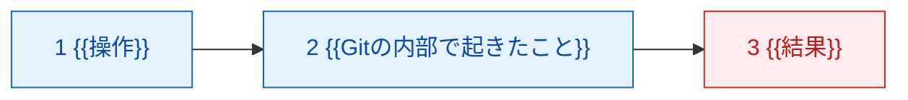

# TEMPLATE_lesson.md ― レッスン台本（AI先生用 内部台本）標準テンプレート

> **このファイルは何か**：1 Mission 分のレッスン台本（進行AI＝Claudeが読む内部台本）を書くための雛形と記入指示です。
> **誰がいつ使うか**：
> - **生成AI**（レッスンを量産するClaude）が、`PRODUCTION_GUIDE.md` のミッション仕様を受け取って新規台本を書き起こすときに、この雛形をコピーして埋めます。
> - **レビューAI**が `QUALITY_CHECKLIST.md` で採点するときの、構造の基準になります。
> - **人間（MooNさん）**は通常このファイルを直接編集しません。台本の実体は `content/level{NN}/mission-{NN}-{N}.md` に置かれます。
> **出力先**：`content/level{NN}/mission-{NN}-{N}.md`（例：`content/level03/mission-03-6.md`）
> **対になるファイル**：`content/level{NN}/opening-{NN}-{N}.md`（`TEMPLATE_opening.md` から生成）

---

## 0. このテンプレートを使う前に必ず読むもの

| # | ファイル | 何のために読むか |
|---|---|---|
| 1 | `PRODUCTION_GUIDE.md` | ミッション仕様の読み方、比喩レジストリ、命名規約 |
| 2 | `QUALITY_CHECKLIST.md` | 書き終わったあとに自分で通す合否基準（禁則事項の全リスト） |
| 3 | `docs/CONTEXT.md`（リポジトリ内） | 学習者プロフィール・過去のつまずき。**台本に固有名詞を直書きしない**ための参照元 |
| 4 | `docs/01_カリキュラム設計書.md` 第2章の該当LEVEL節 | そのMissionの目的・専門用語・つまずき対策の正典 |
| 5 | `/home/user/work/reference/day2_lesson_plan.md`（Day2台本） | **品質のゴールドスタンダード。迷ったらこの粒度・トーンに寄せる** |

---

## 1. v1 ブロック記法規約（この記法以外を発明しないこと）

v1（Claude＋GitHubリポジトリ方式）では、**素直なMarkdownだけを使う**。`:::why` のようなコンテナ記法はGitHubのMarkdownレンダラで素通しされ、生の `:::` が学習者の画面に出てしまうため、v1では使わない。

代わりに、**見出し文字列を厳密に固定した blockquote と `<details>`** を使う。文字列が固定されているので、将来アプリ（02 F-02 Lesson Viewer）を作るときに機械的に `:::` 記法へ一括変換できる。**この対応表を壊す書き方をしてはいけない。**

| # | v1で書く記法（この文字列を1文字も変えない） | 用途 | 将来の変換先（02 F-02） |
|---|---|---|---|
| B1 | `> ### 🔍 なぜ？：{問い}` で始まる blockquote | なぜボタン（3層：ひとことで／もう少し詳しく／設計思想まで） | `:::why` |
| B2 | `<details><summary>💡 ヒント1：方向（どこを見るか）</summary>`<br>`<details><summary>💡 ヒント2：手順（何をするか）</summary>`<br>`<details><summary>💡 ヒント3：答え（完全な手順）</summary>` | 3段階ヒント | `:::hint level=1/2/3` |
| B3 | `> ⚠ **つまずきポイント**：{症状}` | つまずき警告 | `:::warn kind=pitfall` |
| B4 | `> 📢 **予告**：{これから起きること}` | 失敗・表示変化の事前予告（Day2の発明。**⚠付きMissionでは必須**） | `:::warn kind=forecast` |
| B5 | `> 💡 **今は覚えなくてよいこと**：{列挙}` | 認知負荷の切り捨て（00 5.7） | 薄いグレーの独立ブロック（02 F-02 振る舞い） |
| B6 | `<details><summary>答えを見る</summary>` / `<details><summary>解答</summary>` | STEP0の想起解答・STEP6の解説 | 折りたたみ（そのまま） |

**ブロック種別はこの6つで打ち止め。** 02 F-02 が「3つの独自ブロック記法だけは必要。これ以上は増やさない」と定めているため、B4はB3のサブタイプ、B5・B6は独自記法ではない標準Markdownとして扱う。新しい `:::xxx` を発明した台本は QUALITY_CHECKLIST の CHK-N1 で不合格になる。

---

## 2. テンプレート本体（ここから下をコピーして使う）

記入指示は `<!-- 記入指示: ... -->` で書いてある。**完成した台本には記入指示コメントを1つも残さないこと。**

---

````markdown
# {{Mission番号}}：{{Mission名}}（AI先生用 内部台本）

<!-- 記入指示: 見出しは「3-6：⚠ AIに壊させてrevertで戻す（AI先生用 内部台本）」のように、
     01設計書 第3章のMission名を1文字も変えずに転記する。⚠🛡🧩🔍💰🤝 の記号も転記する。 -->

## メタ情報

| 項目 | 内容 |
|---|---|
| レッスンID | {{MISSION-NN-N}} |
| Mission名 | {{Mission名}} |
| 対象LEVEL | LEVEL {{NN}}「{{LEVEL名}}」（コードネーム {{CODENAME}}） |
| 形式 | {{フル形式 / 圧縮形式}}（01 6.2.2 の40Mission一覧で判定） |
| 想定所要時間 | {{15 / 20 / 25 / 30}}分 |
| XP | {{時間×4}} |
| 付与スキル | {{GH / WEB / API / DEV / AI / AG から1〜2}} |
| 前提 | {{直前のMission番号と、その完了で手に入っているもの}} |
| このMissionの成果物 | {{リポジトリに残るファイル・PR・設定。1〜3個}} |
| 対になるopening | `content/level{{NN}}/opening-{{NN}}-{{N}}.md` |

<!-- 記入指示: 想定所要時間は 15/20/25/30 分のいずれかしか許されない（要求仕様17）。
     XPは 4XP/分 固定。時間を勝手に決めず、01 第3章のMission表の値をそのまま使う。 -->

**このレッスンで扱う新出用語（最大3語）**：{{用語1}} / {{用語2}} / {{用語3}}

<!-- 記入指示: 4語以上になったら、Missionの切り方が間違っている。
     どうしても超える場合は「> ⚠ 形式上の注記：」として超過理由を明記する（LESSON-00-SETUPの前例）。 -->

## 参照ディレクティブ（進行AIが台本より先に読むもの）

<!-- 記入指示: 学習者固有情報（名前・GitHubユーザー名・過去のつまずき）は台本に直書きしない。
     必ずこのディレクティブでCONTEXT.mdを参照させる。テンプレートを他の受講者に使い回せなくなるため。 -->

- `docs/CONTEXT.md` §2（学習者プロフィールと環境）… 学習者名・OS・UI言語をここから取る
- `docs/CONTEXT.md` §4（観測されたつまずき）… 本レッスンで再発しうるのは **#{{該当番号}}**{{、#{{番号}}}}
- `docs/CONTEXT.md` §5（教授方針）… 毎回必ず守る
- `content/metaphors.md` … 本レッスンで使う比喩：{{概念}}＝{{比喩}}（レジストリ登録済み）
- `content/level{{NN}}/glossary-{{NN}}.md` … 用語の4欄定義（圧縮形式ではここを参照し、本文に書き下ろさない）
- `content/level{{NN}}/quizbank-{{NN}}.md` … STEP6の問題バンク（圧縮形式で使用可）

## 使い方メモ（進行AI向け・毎回読む）

<!-- 記入指示: 以下の7項目は全レッスン共通の固定文。1文字も削らずコピーする。
     8項目め以降に、このMission固有の進行上の注意を1〜3行だけ追記する。 -->

- 答えを先に全部出さない。各STEPで「あなたはどう思いますか？」と予想を書かせてから解説する。
- 間違えていても、まず「どこまで合っていたか」を認めてから訂正する。**部分点で褒める。**
- ボタン名の表記ルール：**GitHub Desktop（英語UI）は英語表記のまま**（初出時のみ括弧で日本語訳を添える）。**github.com（日本語UI）は日本語表記＋括弧で英語原名**。例：`Commit to main`（メインに記録する）／`プルリクエストをマージする`（Merge pull request）。
- 初回だけ表示が変わる箇所・これから失敗する箇所は、**押す前に必ず 📢 予告する**。
- コードはAIが書き、学習者は「読む・予想する・直す・Gitで管理する」役割に徹する。大量の手入力はさせない。
- 学習者の環境は Mac / GitHub Desktop（英語UI）/ VS Code / github.com（日本語UI）。**`Cmd + S` の保存確認を省略しない。**
- 疲れの兆候（返信が短くなる・「とりあえず」が増える）が出たら、STEP4の途中でも区切ってSTEP7に飛んでよい。
- {{このMission固有の注意。例：「Conflictの記号を見た瞬間にリポジトリを作り直そうとする恐れがある。作り直しは絶対に提案しない」}}

---

## STEP 0：前回の想起（3分）

<!-- 記入指示: フル形式・圧縮形式のどちらでも省略禁止（01 6.2.1）。
     質問は2問（openingで既に出題済み。ここには模範解答と採点方針を書く）。
     「前回」は直前のMissionの要点。存在しない場合は既に済ませた準備事項で代替する。 -->

opening（`opening-{{NN}}-{{N}}.md`）で既に出題済み。回答が届いたら、ここで答え合わせをする。**先に模範解答を送らない。**

**質問と模範解答（学習者には見せていない前提）**

1. Q. {{前回の要点を問う質問1}}
   A. {{模範解答1。必ず比喩レジストリの言葉に触れる}}
2. Q. {{前回の要点を問う質問2}}
   A. {{模範解答2}}

**採点方針**：{{どこまで再現できていればOKかを1〜2文で}}。曖昧でも**部分点で褒める**。「{{学習者が言いそうな不完全な表現}}」レベルの再現でも十分とする。誤答の場合は、正解を出す前に**合っていた部分を先に名指しする**。

---

## STEP 1：今日覚えること（{{3〜5}}分）

<!-- 記入指示:
     - フル形式：ここに4欄形式の用語カードを書き下ろす（下記の表を語数ぶん複製）。
     - 圧縮形式：書き下ろさず content/level{NN}/glossary-{NN}.md の用語IDを参照する形にする。
       ただし「今は覚えなくてよいこと」(B5)だけは必ず本文に書く。
     - 4欄の順序は「正式な意味 / 初学者向け説明 / 現実世界での例え / 実際の開発で何に使うか」で固定。
     - 「現実世界での例え」は必ず content/metaphors.md に登録済みのものを使う。
       新しい比喩を作った場合は、台本を書き終えたあとレジストリに追記する（未登録は不合格）。 -->

今日の新しい言葉は **{{n}}つだけ** です。

### ① {{用語名}}（{{よみ}}）

| 観点 | 説明 |
|---|---|
| 正式な意味 | {{正式な技術的説明}} |
| 初学者向け説明 | {{中学生に説明する言い方}} |
| 現実世界での例え | {{比喩レジストリから。郵送・箱・日誌・業務依頼票の世界観を外さない}} |
| 実際の開発で何に使うか | {{この用語を知っていると何ができるようになるか。将来のLEVELへの伏線があれば1文で}} |

<!-- ②③ も同じ表を複製。最大3語まで。 -->

> 💡 **今は覚えなくてよいこと**：{{今回あえて触れない概念を3つ程度}}。{{これらはLEVEL {{n}} 以降で扱います／知らなくても問題なく開発できます}}。

---

## STEP 2：実際にやる（{{5〜10}}分）

<!-- 記入指示:
     - 「今から○○を押してください」レベルの粒度。ボタン名・メニュー名・ショートカットキーまで書く。
     - 1手順1行。番号付き。手順の中に判断を混ぜない。
     - 表示が初回だけ違う箇所、これから失敗させる箇所には、その手順の直前に 📢 予告(B4)を置く。
     - 手順のうち「なぜそうするのか」がある行には、次の行に「   - なぜ？：」を1行だけ添える
       （深い説明はSTEP3のあとの 🔍 なぜ？ ブロックに回す）。
     - 過去のつまずき(CONTEXT.md §4)に該当する操作には ⚠ つまずきポイント(B3)を必ず挿入する。 -->

> 📢 **予告**：{{今日はじめて操作する画面・初回だけ表示が変わるボタン・これから意図的に起こす失敗}}

1. {{操作1。例：GitHub Desktopで `Current Branch`（現在のブランチ）をクリックしてください}}
   - なぜ？：{{1文}}
2. {{操作2}}
3. **`Cmd + S` で保存してください**（{{保存を忘れやすい理由／過去に詰まった経験があるため必ず声に出して確認する}}）。
4. {{操作4}}

> ⚠ **つまずきポイント**：{{起きる症状}}。{{なぜそう見えるか}}。{{どこを確認すれば解決するか}}。

<!-- 記入指示: ⚠ が付いたMission（意図的失敗）では、失敗させる操作の直前に必ず
     「これは予定された演習です。必ず解決できます」と明言する行を置く（00 5.9 / 01 LEVEL3つまずき対策）。 -->

---

## STEP 3：何が起きたか確認（{{3〜5}}分）

<!-- 記入指示:
     - フル形式：notional machine 図（Mermaid flowchart）を1枚この位置に置く。
       正確さより「次に何が起きるか予測できること」を優先した簡略モデルでよい。
       ローカル＝青系、リモート＝赤系の classDef を使う（lesson_00_setup.md の前例に合わせる）。
     - 圧縮形式：図は描かず content/level{NN}/notional-machine-{NN}.md の図を再掲する旨だけ書く。
     - 図のあとに「重要なポイント」を2〜3個、箇条書きで置く。
     - 過去のつまずき #1（Dropbox的な自動同期の誤解）に触れられる回では、
       必ず「同期ではなく郵送」の比喩に戻す一文を入れる。 -->

**今、{{どこ}}で何が起きたのか。**



**重要なポイントが{{n}}つあります。**

1. {{ポイント1}}
2. {{ポイント2}}
3. {{ポイント3}}

**確認してみましょう：** {{学習者が実際に画面で確かめる1操作。予測と観測を突き合わせる}}

---

> ### 🔍 なぜ？：{{このMissionで最も深く説明すべき問い1つ}}
>
> **ひとことで**：{{1〜2文}}
>
> **もう少し詳しく**：{{1段落。必要なら図や対比表を1つ}}
>
> **設計思想まで**：{{3〜5段落。なぜこの教材がこの方針を採ったのか、設計書のどの判断に基づくのかまで踏み込む}}
>
> **では、いつ{{これ}}をやってはいけないか？** {{適用条件の裏側。この一文は省略禁止（00 5.4）}}

<!-- 記入指示: 🔍 なぜ？ ブロックのうち「設計思想まで」の3〜5段落を書くのは
     1レッスンにつき1つだけ（00 5.4「L3は1つだけ強調表示」）。
     2つめ以降の「なぜ？」は「ひとことで」＋「もう少し詳しく」の2層で止める。 -->

---

## STEP 4：ミッション（{{5〜10}}分）

<!-- 記入指示:
     - 学習者自身にやらせる。答えを最初から見せない。
     - 3段階ヒント(B2)は圧縮形式でも省略しない。
       ヒント1＝どこを見るか（結果は言わない）／ヒント2＝何をするか（結果は言わない）／ヒント3＝完全な手順。
     - ヒントを見てもクリア扱い。減点しない。ただし「どのヒントまで開いたか」は
       STEP7の成長ログに残させる（復習対象の判定に使う）。 -->

**あなた自身でやってください。ヒントは最初に見ないでください。**

> 🎯 **今回のミッション**
>
> {{課題文。1〜3文。何を作る／直す／確かめるかだけを言う}}
>
> 条件：
> - {{条件1。例：Commit messageは「何をしたか」が1文で分かるものにすること}}
> - {{条件2}}

<details><summary>💡 ヒント1：方向（どこを見るか）</summary>

{{どの画面・どのファイルを見ればよいかだけ。手順も結果も言わない}}
</details>

<details><summary>💡 ヒント2：手順（何をするか）</summary>

1. {{手順1}}
2. {{手順2}}
3. {{手順3}}

{{結果がどうなるかはここでも言わない}}
</details>

<details><summary>💡 ヒント3：答え（完全な手順）</summary>

{{完全な手順、または完成コード。Commit message例まで含める}}
</details>

**採点方針**：{{何ができていればクリアかを1〜2文で}}。**ヒントを開いてもクリア扱い（減点なし）。** 部分的にできていれば、できた部分を先に名指しして認めてから、残りを一緒に片付ける。

---

## STEP 5：AIサポート（{{3〜5}}分）

<!-- 記入指示: フル形式・圧縮形式のどちらでも省略禁止（01 6.2.1）。
     ★仮説入力を必須にする。仮説が空／10文字未満／「わからない」の場合は
     選択式候補を4つ提示してから進む（04 2.4.3）。 -->

**まず、あなた自身の考えを書いてください。**（この欄が埋まるまで先に進みません）

> **★Q. {{このMissionで学習者が必ず引っかかる現象について「なぜそうなると思うか」を問う}}**
>
> [　　　　　　　　　　　　　　　　　　　　　　　　　　]

<!-- 記入指示: 仮説が書けない学習者向けの選択肢を必ず4つ用意しておく（進行AIが出す）。 -->

**仮説が書けないときに提示する選択肢（進行AI用）**
- (a) {{もっともらしいが違う仮説}}
- (b) {{正解に近い仮説}}
- (c) {{よくある誤解}}
- (d) {{別の観点}}

書けたら、AIに聞いてみましょう。

#### ❌ 悪い質問

> {{状況説明ゼロの一行質問}}

{{なぜこれではAIが一般論しか返せないのかを1〜2文で}}

#### ✅ 良い質問（8項目テンプレート適用）

```
【目的】{{}}
【現在の状態】{{}}
【環境】Mac / GitHub Desktop（英語UI）/ VS Code / github.com（日本語UI）
【再現手順】{{}}
【エラー全文】{{エラーが出ていない場合は「エラーメッセージは出ていない。〜という症状」と書く}}
【自分の仮説】★必須 {{}}
【制約】{{触ってよいもの・触ってはいけないもの}}
【完了条件】{{}}
```

**このMissionで詰まったときに投げるプロンプト例**（進行AIが提示する）
- 「{{実際に起きうる症状をそのまま質問文にしたもの1}}」
- 「{{2}}」
- 「{{3}}」

> 💡 **なぜ仮説を書かせるのか？**
> 仮説を立ててから答え合わせをすると、「合っていた／違っていた」という差分が記憶に残ります。仮説なしに正解だけ読むと分かった気になりますが、翌日には残りません。この手順は本カリキュラム全体を通じて必須です。

<!-- 記入指示: この8項目は LEVEL 4「Issueの5要素」と同型であり、LEVEL 15 のAgentへの指示に繋がる。
     LEVEL 3以降のレッスンでは、この同型性を1文だけ添えるとよい（伏線の明示）。 -->

---

## STEP 6：理解チェック（3分）

<!-- 記入指示:
     - 3問。「なぜ型」のみ。「〜とは何ですか」の暗記・用語再認問題は禁止。
     - 許可される型：「これを消すとどうなるか」「この状況ではどちらを選ぶか、理由も」
       「これは不具合か、なぜそうなるのか」「〜する直前にやるべきことは何か、なぜか」
     - 圧縮形式では content/level{NN}/quizbank-{NN}.md（LEVEL共通8〜12問）から3問選出してよい。
       その場合は問題文を再掲せず、問題IDだけを書く。 -->

暗記ではなく「なぜそうするのか」を確認します。

**Q1.** {{なぜ型の問い}}

<details><summary>解答</summary>
{{解答と、そう考える理由}}
</details>

**Q2.** {{なぜ型の問い}}

<details><summary>解答</summary>
{{解答}}
</details>

**Q3.** {{なぜ型の問い。可能なら次のLEVELへの伏線を含める}}

<details><summary>解答</summary>
{{解答}}
</details>

**採点方針**：3問中2問の趣旨が言えていれば通過。**言葉が正確でなくても、現象の因果が説明できていれば正解扱いにする。** 誤答は復習対象として STEP7 の成長ログ項目3に書かせる。

---

## STEP 7：GitHubへ記録（3分）

<!-- 記入指示:
     - Commit message の「型」を必ず提示する（丸写しさせるのではなく型を渡す）。
     - 成長ログは 8項目フォーマット。項目3「まだ分かっていないこと」は空欄不可。
     - 成長ログの保存先は notes/log/YYYY-MM-DD.md（PRODUCTION_GUIDE §2 の配置規約に従う）。
     - public リポジトリ前提のため、実名・所属・APIキー・個人情報を書かせない一文を必ず入れる。 -->

**1. Commit message の型**

```
LEVEL {{NN}}: {{何をしたか}}（{{対象ファイル or 機能}}）
```

例：`{{実例1}}` / `{{実例2}}`

**2. 成長ログを追記する**：`notes/log/{{YYYY-MM-DD}}.md`

```markdown
## {{YYYY-MM-DD}}  LEVEL {{NN}} / Mission {{NN}}-{{N}}

### 1. やったこと（事実）
{{}}

### 2. 理解したこと（自分の言葉で）
{{教材の丸写し禁止}}

### 3. まだ分かっていないこと ★空欄保存不可
{{}}

### 4. 詰まった箇所と、詰まっていた時間
{{}}

### 5. 発生したエラー
{{なければ「なし」}}

### 6. AIに何と質問したか（開いたヒントの段階も書く）
{{}}

### 7. AIの回答は正しかったか
{{}}

### 8. 明日の自分への申し送り
{{}}
```

> ⚠ **つまずきポイント**：このリポジトリは **public** です。成長ログに実名・所属・住所・APIキー・トークンを書かないでください。一度Pushした記録は取り消しても痕跡が残ります。

**3. 記録すべき成果物**

- {{成果物1（ファイルパス）}}
- {{成果物2}}

**4. CONTEXT.md の更新**（学習者に確認してから追記する）
- §3「現在の到達点」に `Mission {{NN}}-{{N}} 完了` を追記
- 新しく詰まった点があれば §4 の表に1行追加（**消さずに残す**）

---

### 🎉 Mission 完了

<!-- 記入指示: 表示の優先順位を守る（00 R-01）。
     ①できるようになったこと（1文・最大表示）②成果物へのリンク③次のMissionと次に開くファイル
     ④スキルバーの伸び（小さく）⑤XP数値（最小）。XPを主役にしない。 -->

> **あなたは今、{{できるようになったことを1文で。「〜が分かった」ではなく「〜ができるようになった」}}**
> これは{{前回／昨日}}はできなかったことです。
>
> この技能は、{{将来のLEVEL・Mission}}で{{何の土台になるか}}。
>
> 成果物：{{リンク1}} / {{リンク2}}
> 次：**Mission {{次のID}}「{{次のMission名}}」** — まず{{次に開くファイル・画面}}を開いてください。
>
> {{スキル名}} +{{XP}} XP

---

## 制作メモ（進行AIは学習者に見せない。受講テスト後に埋める）

<!-- 記入指示: 生成時は空欄のまま残す。受講テスト後に人間（またはフィードバック反映AI）が埋める。 -->

| 項目 | 内容 |
|---|---|
| 想定所要時間 vs 実測 | {{分 / 分}} |
| 実際に詰まった箇所 | {{}} |
| 予告が足りなかった箇所 | {{}} |
| 新たに観測したつまずき（CONTEXT.md §4 へ転記したか） | {{}} |
| 比喩レジストリに追加した比喩 | {{}} |
| 次回改訂の候補 | {{}} |
````

---

## 3. 圧縮形式で書くときの差分（フル形式との違いだけ）

01 6.2.1 の圧縮ルール。**圧縮するのは分量であって構造ではない。**

| STEP | 圧縮形式での扱い |
|---|---|
| 0 前回の想起 | **省略しない。** 質問2問・模範解答・採点方針をそのまま書く |
| 1 今日覚えること | 4欄カードを書き下ろさず、`content/level{NN}/glossary-{NN}.md` の用語IDを参照。`> 💡 今は覚えなくてよいこと` は本文に書く |
| 2 実際にやる | 手順のみ。画面上の位置指定は「初めて触る操作」だけに絞る。📢 予告と ⚠ つまずきポイントは削らない |
| 3 何が起きたか | Mermaid図を描かず `content/level{NN}/notional-machine-{NN}.md` の図を再掲する旨を書く。「重要なポイント」2〜3個は残す |
| 4 ミッション | 3段階ヒントは維持。各ヒントの文章量を圧縮 |
| 5 AIサポート | **省略しない。** ★仮説欄・❌/✅の対比・プロンプト例3つを維持 |
| 6 理解チェック | なぜ型3問を維持。問題バンクから選出し、問題IDのみ記載してよい |
| 7 GitHubへ記録 | Commit message の型のみ提示。成長ログ8項目フォーマットは再掲せず参照でよい |

目安の分量：**フル形式 300〜420行 ／ 圧縮形式 230〜390行 ／ Boss形式 260〜360行 ／ opening 40〜70行**（`QUALITY_CHECKLIST.md` CHK-C13。2026-08-16 改訂。旧目安「フル約230行／圧縮約60〜80行」は上表の必須構造と両立しないことが序盤コース12本の実測で確認されたため。改訂理由の全文は同ファイルの「注記：CHK-C13（分量）の改訂について」を参照）。

**圧縮形式がフル形式と大きく変わらない行数になるのは正常。** 圧縮しているのは STEP 1・2・3 の説明文と図であり、STEP 0・4・5・6・7 の必須要素は同量だからである。行数を削りたくなったら、まず削ってよいのは「STEP 2 の既習操作の再説明」と「🔍 なぜ？ の2つめ以降」だけ。

---

## 4. Boss Mission の台本を書くときの差分

Boss は7STEP形式ではない。**チェックポイント形式**で書く（01 第4章）。

- メタ情報の「形式」を `Boss形式` にする
- STEP 0〜7 の代わりに：課題文 → チェックポイント表（各30分以内に分割） → 完了条件 → 判定方法 → 評価する能力軸
- **B1（LEVEL 3後）・B2（LEVEL 4後）はアプリ画面を使わない**（CO-09）。Markdown教材＋GitHub上での実施、判定は「GitHub上の事実の確認」＋AIレビュー＋自己申告のみ
- 自動判定に使ってよいのは「ファイル／リポジトリの存在」「PRがMergeされた」「CIが成功した」「revert Commitがある」等の**事実**だけ（CO-29）。コード内容の静的解析に依存する判定条件を書かない
- 能力軸（A読解力／B指示力／C復旧力／D懐疑力／E統治力）に触れる場合は、01 第4章の1対1対応表に従う（CO-04）
- opening は通常レッスンと同じ `TEMPLATE_opening.md` を使う（Boss用の予告文だけ差し替える）

### 4-1. 「使い方メモ」7項目の Boss形式における唯一の例外（2026-08-16 追認）

§2 の「使い方メモ（進行AI向け・毎回読む）」の共通7項目は **1文字も削らずコピーする**のが原則であり、この原則は Boss形式でも変わらない。ただし**7項目めだけは、Boss形式に限り読み替えを認める。**

| | 文言 |
|---|---|
| 通常レッスン（原文・変更禁止） | 疲れの兆候（返信が短くなる・「とりあえず」が増える）が出たら、STEP4の途中でも区切ってSTEP7に飛んでよい。 |
| **Boss形式での読み替え（許可）** | 疲れの兆候（返信が短くなる・「とりあえず」が増える）が出たら、チェックポイントの区切りで止めてよい（**このBossはCP単位で日をまたいでよい**。分割しても減点しない）。 |

**なぜ例外を認めるか**：Boss形式には定義上 STEP 4 も STEP 7 も存在しない（本§冒頭のとおり、7STEPではなくチェックポイント形式）。原文をそのままコピーすると、進行AIに**存在しない見出しへ飛べという指示**を与えることになり、実行不能な台本になる。7項目めの意図は「疲労時に安全な区切りへ逃がす」ことであり、Boss形式ではその安全な区切りが CP の境界にあたる。**意図を保ったまま参照先だけを差し替える読み替えなので、逸脱ではなく正しい適用**と判断し、テンプレート側の例外として明記する。

**この例外は7項目めに限る。** 1〜6項目め（答えを先に出さない／部分点で褒める／ボタン名の英日規則／📢予告／コードはAIが書く／`Cmd + S` 確認）は Boss形式でも1文字も変えてはならない。7項目め以外を書き換えた台本は、`QUALITY_CHECKLIST.md` CHK-B05 の FAIL として扱う。
